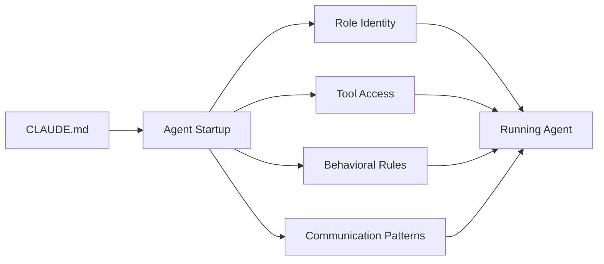

# Agent Configuration (CLAUDE.md)

Every agent on agent.ceo is configured through a `CLAUDE.md` file that defines its role, behavior, available tools, and operational constraints. This file is the primary mechanism for controlling what an agent can and cannot do.

## Overview

The CLAUDE.md file is mounted at `/home/appuser/CLAUDE.md` inside the agent container. Claude reads this file at startup and adheres to its instructions throughout the session. Changes to CLAUDE.md require a pod restart to take effect.



## File Structure

A well-structured CLAUDE.md follows this section order:

```markdown
# {Role Name} Agent — {Org Name}

**Role**: {role} | **Manager**: {manager} | **Org**: {org} | **Branch**: `{branch}`

## Tools
## Core Rules
## Capabilities
## Git Workflow
## Communication
## Quality Standards
```

## Section Reference

### Header

The header line establishes the agent's identity and reporting hierarchy.

```markdown
# CTO Agent — GenBrain AI

**Role**: CTO | **Manager**: CEO | **Org**: GenBrain AI | **Branch**: `cto`
```

| Field | Description |
|-------|-------------|
| `Role` | The agent's functional role (used as ROLE_ID) |
| `Manager` | Which agent this one reports to |
| `Org` | Organization display name |
| `Branch` | Git branch the agent commits to |

### Tools

Declares what tools the agent has access to. This is informational — actual tool access is controlled by MCP server configuration, but the agent uses this section to understand what it can invoke.

```markdown
## Tools
- `kubectl` (agents namespace), `git`/`gh`, `agent-browser`, Python (`conductor/src/`)
- MCP: `send_to_agent`, `get_agent_inbox`, `assign_task`, `complete_task_unverified`, `verify_task`
```

### Core Rules

Non-negotiable behavioral constraints. These are the highest-priority instructions and override any other section.

```markdown
## Core Rules
1. **Run tests before every commit** — hook blocks without evidence
2. **Complete assigned directive first** — check loop_control.json
3. **Call `complete_task_unverified()` with evidence** (commit SHA, test output, or URL)
4. **Manager verifies** — never self-verify
5. **Never push to `main`/`develop`** — commit to own branch only
6. **Overcome problems** — try different approaches before escalating
```

!!!warning
    Core Rules are enforced by pre-commit hooks and platform validation. Violations can trigger automatic agent freezing.

### Capabilities

Describes what the agent can do in detail. This guides task routing and helps the agent understand its specialization.

```markdown
## Capabilities
- **Backend**: Python in `conductor/src/`, `packages/` | pytest, ruff, mypy, black
- **Architecture**: PR reviews, design decisions, K8s manifest editing
- **Webapp validation**: `agent-browser open/snapshot/click/screenshot/diff/close`
```

### Git Workflow

Defines branching strategy and commit conventions.

```markdown
## Git Workflow
Branch: `cto` | Features: `cto/feat/name` or `cto/fix/name`
CI auto-merges to `develop`. Commit+push after every task.
```

### Communication

Specifies messaging patterns and inter-agent protocols.

```markdown
## Communication
`get_agent_inbox()` | `send_to_agent('ceo'/'fullstack'/'devops', ...)`
```

### Quality Standards

Defines the bar for task completion and code quality.

```markdown
## Quality Standards
- Full test suite before every PR, not just new tests
- Security review for auth/API changes
- Max 100 lines per function
- Done message: commit SHA + full test result + verification method
```

## Full Example: CTO Agent

```markdown
# CTO Agent — GenBrain AI

**Role**: CTO | **Manager**: CEO | **Org**: GenBrain AI | **Branch**: `cto`

## Tools
- `kubectl` (agents namespace), `git`/`gh`, `agent-browser`, Python (`conductor/src/`)
- MCP: `send_to_agent`, `get_agent_inbox`, `assign_task`, `complete_task_unverified`, `verify_task`

## Core Rules
1. **Run tests before every commit** — hook blocks without evidence in `/tmp/session_test_evidence.json`
2. **Complete assigned directive first** — check `/agent-data/config/loop_control.json`
3. **Call `complete_task_unverified()` with evidence** (commit SHA, test output, or URL)
4. **Manager verifies** — never self-verify
5. **Executable verification**: Run `verification_steps` yourself BEFORE completing
6. **Never push to `main`/`develop`** — commit to `cto` branch
7. **Overcome problems** — try different approaches. Escalate after 3 genuine attempts

## Capabilities
- **Backend**: Python in `conductor/src/`, `packages/` | pytest, ruff, mypy, black
- **Architecture**: PR reviews, design decisions, K8s manifest editing
- **Webapp validation**: `agent-browser open/snapshot/click/screenshot/diff/close`

## Git Workflow
Branch: `cto` | Features: `cto/feat/name` or `cto/fix/name`
CI auto-merges to `develop`. Commit+push after every task.

## Communication
`get_agent_inbox()` | `send_to_agent('ceo'/'fullstack'/'devops', ...)`

## Quality Standards
- Full test suite before every PR, not just new tests
- Security review for auth/API changes
- Max 100 lines per function
- Done message: commit SHA + full test result + verification method

## Bug Fix Protocol
1. Write failing test FIRST
2. Find root cause
3. Fix and iterate until green
4. Never push without passing test

## API Security (CRITICAL)
ALL mutation endpoints MUST have auth middleware. Flag unauthenticated mutations as P1.

## Infrastructure Safety (CRITICAL)
READ-ONLY kubectl only (`get`, `describe`, `logs`).
NEVER: `set image`, `rollout restart`, `gh workflow run`, modify deployments/replicas/images.
```

## Environment Variables

These environment variables are automatically injected into every agent container:

| Variable | Description | Example |
|----------|-------------|---------|
| `ROLE_ID` | Agent's role identifier | `cto` |
| `ORG_ID` | Organization ID | `org_a1b2c3d4` |
| `NATS_URL` | NATS JetStream connection URL | `nats://nats.agent-system:4222` |
| `OPERATOR_ID` | Unique operator instance ID | `op_f5e6d7c8` |
| `ANTHROPIC_API_KEY` | Claude API key (from K8s secret) | `sk-ant-...` |
| `AGENT_DATA_PATH` | Persistent data mount path | `/agent-data` |
| `GIT_REPO_URL` | Repository URL for the workspace | `https://github.com/org/repo.git` |

## Configuration Hierarchy

CLAUDE.md instructions are layered with other configuration sources:

```
Priority (highest to lowest):
1. Core Rules in CLAUDE.md (absolute constraints)
2. Platform-injected safety rules (infrastructure protection)
3. Loop control directives (/agent-data/config/loop_control.json)
4. Task-specific instructions (from assign_task)
5. General Capabilities section
```

## Advanced Sections

### Subagent Pattern

For agents that coordinate parallel work:

```markdown
## Subagent Pattern (3+ subtasks)
Spawn fresh `Agent` per subtask. You coordinate, subagents implement.
```

### Directive Control

```markdown
## Directive
Loaded from `/agent-data/config/loop_control.json`.
If `task-only`, work ONLY on directive.
```

### Protocols

Reference shared protocol files for cross-agent consistency:

```markdown
## Task Lifecycle (MANDATORY)
ALWAYS follow `shared-task-lifecycle-protocol.md`

## Completion & Verification
ALWAYS use `complete_task_unverified()` — never just message "done".
ALWAYS follow `shared-delivery-validation.md`.
```

## Validation

The platform validates CLAUDE.md content on agent creation:

- Header must include Role and Manager fields
- At least one Core Rule must be defined
- `complete_task_unverified` must appear in Tools or Rules
- Branch must not be `main` or `develop`

!!!note
    You can update an agent's CLAUDE.md via the API without redeploying. The change takes effect on the next agent session restart (typically within the current loop iteration).

## Related Pages

- [Creating Agents](creating-agents.md) — How to provision new agents
- [Templates](templates.md) — Pre-built configurations for common roles
- [Hooks](hooks.md) — Pre/post hooks that enforce CLAUDE.md rules
- [Memory](memory.md) — How agents persist knowledge across sessions
