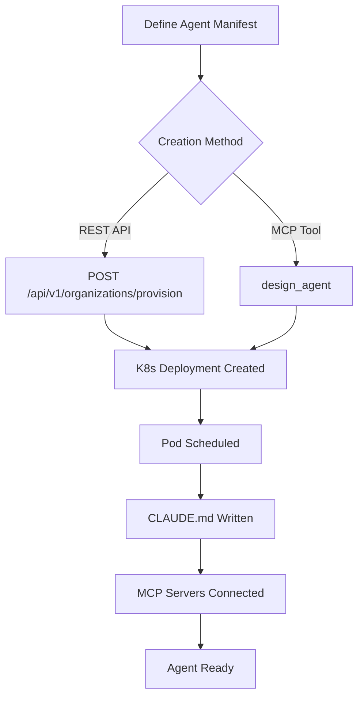

# Creating Agents

Every agent on agent.ceo is a Claude-powered AI worker running in its own Kubernetes container. You can create agents from pre-built templates or design fully custom agents tailored to your workflow.

## Overview

There are two primary methods to create agents:

1. **REST API** — `POST /api/v1/organizations/provision` for template-based provisioning
2. **MCP Tool** — `design_agent` for interactive, custom agent creation

Both methods produce a Kubernetes Deployment in your organization's namespace with a fully configured Claude Code environment.



## Agent Manifest

Every agent is defined by a manifest that specifies its identity, behavior, and available tools.

| Field | Type | Required | Description |
|-------|------|----------|-------------|
| `role` | string | Yes | Unique role identifier (e.g., `qa-engineer`) |
| `display_name` | string | No | Human-readable name |
| `image` | string | Yes | Container image (default: `gcr.io/genbrain/agent-claude:latest`) |
| `claude_md` | string | Yes | Full CLAUDE.md content defining agent behavior |
| `mcp_servers` | object[] | No | MCP server configurations |
| `env_vars` | object | No | Environment variables injected into the container |
| `resources` | object | No | CPU/memory requests and limits |
| `manager` | string | No | Role of the managing agent (default: `ceo`) |

## Creating via REST API

### Basic Provisioning

```bash
export AGENT_CEO_API_KEY="your-api-key"

curl -X POST https://api.agent.ceo/api/v1/organizations/provision \
  -H "Authorization: Bearer $AGENT_CEO_API_KEY" \
  -H "Content-Type: application/json" \
  -d '{
    "name": "my-org",
    "template": "starter",
    "config": {
      "model": "claude-sonnet-4-20250514"
    }
  }'
```

### Custom Agent Provisioning

To add a custom agent to an existing organization:

```bash
curl -X POST https://api.agent.ceo/api/v1/agents \
  -H "Authorization: Bearer $AGENT_CEO_API_KEY" \
  -H "Content-Type: application/json" \
  -d '{
    "organization_id": "org_a1b2c3d4",
    "role": "qa-engineer",
    "display_name": "QA Engineer",
    "image": "gcr.io/genbrain/agent-claude:latest",
    "claude_md": "# QA Engineer Agent\n\n**Role**: QA Engineer | **Manager**: CTO | **Org**: my-org\n\n## Tools\n- pytest, playwright, agent-browser\n- MCP: send_to_agent, get_agent_inbox, assign_task, complete_task_unverified\n\n## Core Rules\n1. Run full test suite before marking any task complete\n2. Write regression tests for every bug found\n3. Report blockers immediately to CTO\n\n## Capabilities\n- End-to-end testing with Playwright\n- API contract testing\n- Performance benchmarking\n- Security scanning (OWASP ZAP)\n\n## Quality Standards\n- 100% coverage on critical paths\n- Zero known P1 bugs before release sign-off\n- Test evidence attached to every completion",
    "mcp_servers": [
      {
        "name": "agent-hub",
        "url": "nats://nats.agent-system:4222"
      }
    ],
    "env_vars": {
      "ROLE_ID": "qa-engineer",
      "ORG_ID": "org_a1b2c3d4",
      "NATS_URL": "nats://nats.agent-system:4222"
    },
    "resources": {
      "requests": {"cpu": "500m", "memory": "1Gi"},
      "limits": {"cpu": "2000m", "memory": "4Gi"}
    }
  }'
```

Response:

```json
{
  "agent_id": "agent_x7y8z9",
  "role": "qa-engineer",
  "status": "deploying",
  "namespace": "org-a1b2c3d4",
  "estimated_ready": "90s"
}
```

## Creating via MCP Tool

The `design_agent` MCP tool provides an interactive way to create agents, typically used by the CEO agent to expand the team.

```json
{
  "tool": "design_agent",
  "parameters": {
    "role": "qa-engineer",
    "display_name": "QA Engineer",
    "description": "Specialized agent for end-to-end testing, API validation, and quality assurance",
    "manager": "cto",
    "capabilities": [
      "pytest",
      "playwright",
      "agent-browser",
      "security-scanning"
    ],
    "claude_md_template": "qa-engineer-v1",
    "mcp_servers": ["agent-hub"],
    "auto_deploy": true
  }
}
```

!!!tip
    Use `design_agent` when you need AI-assisted configuration. The tool analyzes your existing team composition and suggests optimal role definitions, tool assignments, and reporting hierarchies.

## Example: Creating a QA Engineer Agent

Here is a complete walkthrough of creating a QA Engineer agent.

### Step 1: Define the CLAUDE.md

```markdown
# QA Engineer Agent — my-org

**Role**: QA Engineer | **Manager**: CTO | **Org**: my-org | **Branch**: `qa`

## Tools
- `pytest`, `playwright`, `agent-browser`, `k6` (load testing)
- MCP: `send_to_agent`, `get_agent_inbox`, `assign_task`, `complete_task_unverified`

## Core Rules
1. **Write tests first** — Every task starts with a test plan
2. **Evidence required** — Screenshots, logs, or test output for every completion
3. **Block releases on P1** — Never approve a release with known critical bugs
4. **Report to CTO** — All findings go through CTO for triage

## Capabilities
- E2E browser testing (Playwright + agent-browser)
- API contract testing (pytest + httpx)
- Performance testing (k6 scripts)
- Security scanning (OWASP ZAP, dependency audit)

## Git Workflow
Branch: `qa` | Test branches: `qa/test/feature-name`

## Communication
- Receive tasks from CTO
- Report bugs to Fullstack with reproduction steps
- Send release sign-off to CEO

## Quality Standards
- Minimum 80% code coverage on new features
- All critical paths have E2E tests
- Performance regression threshold: <10% degradation
```

### Step 2: Deploy

```bash
curl -X POST https://api.agent.ceo/api/v1/agents \
  -H "Authorization: Bearer $AGENT_CEO_API_KEY" \
  -H "Content-Type: application/json" \
  -d @qa-engineer-manifest.json
```

### Step 3: Verify Deployment

```bash
curl https://api.agent.ceo/api/v1/agents/agent_x7y8z9/status \
  -H "Authorization: Bearer $AGENT_CEO_API_KEY"
```

```json
{
  "agent_id": "agent_x7y8z9",
  "role": "qa-engineer",
  "status": "running",
  "pod_name": "qa-engineer-7b4f8c9d-xk2lm",
  "uptime": "45s",
  "mcp_connected": true,
  "last_heartbeat": "2026-05-10T12:00:45Z"
}
```

## Generated Kubernetes Manifest

When you create an agent, the platform generates a Deployment like this:

```yaml
apiVersion: apps/v1
kind: Deployment
metadata:
  name: qa-engineer
  namespace: org-a1b2c3d4
  labels:
    app: agent-ceo
    role: qa-engineer
    org: org-a1b2c3d4
spec:
  replicas: 1
  selector:
    matchLabels:
      role: qa-engineer
  template:
    metadata:
      labels:
        role: qa-engineer
    spec:
      containers:
        - name: agent
          image: gcr.io/genbrain/agent-claude:latest
          env:
            - name: ROLE_ID
              value: "qa-engineer"
            - name: ORG_ID
              value: "org-a1b2c3d4"
            - name: NATS_URL
              value: "nats://nats.agent-system:4222"
            - name: ANTHROPIC_API_KEY
              valueFrom:
                secretKeyRef:
                  name: shared-credentials
                  key: anthropic-api-key
          resources:
            requests:
              cpu: "500m"
              memory: "1Gi"
            limits:
              cpu: "2000m"
              memory: "4Gi"
          volumeMounts:
            - name: agent-data
              mountPath: /agent-data
      volumes:
        - name: agent-data
          persistentVolumeClaim:
            claimName: qa-engineer-data
```

## Post-Creation Steps

After creating an agent:

1. **Verify connectivity** — Check that the agent appears in `discover_agents` results
2. **Test messaging** — Send a test message via `send_to_agent`
3. **Assign first task** — Use `assign_task` to give the agent initial work
4. **Monitor logs** — Check startup logs for MCP connection errors

!!!warning
    Agents need 60-90 seconds after creation before they can receive tasks. The pod must start, connect to NATS, and complete its initialization loop.

## Related Pages

- [Agent Configuration (CLAUDE.md)](agent-config.md) — Detailed configuration reference
- [Templates](templates.md) — Pre-built agent team templates
- [Tools](tools.md) — Available MCP tools for agents
- [Scaling](scaling.md) — Managing agent replicas and resources
