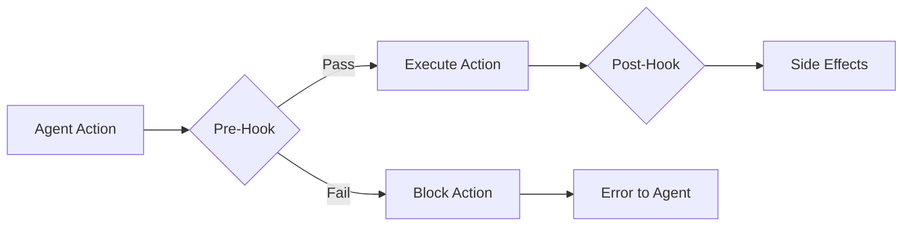

# Agent Hooks

Hooks are configurable actions that run before or after specific agent operations. They enforce quality gates, collect audit data, and trigger notifications without modifying the agent's CLAUDE.md instructions.

## Overview



Hooks are defined in the agent's `settings.json` file and execute as shell commands or scripts within the agent container. A pre-hook that exits with a non-zero code blocks the operation.

## Hook Types

| Hook | Trigger | Can Block? | Use Case |
|------|---------|-----------|----------|
| `PreCommit` | Before `git commit` | Yes | Require test evidence |
| `PostCommit` | After `git commit` | No | Notify other agents |
| `PreCompact` | Before memory compaction | Yes | Backup critical memories |
| `PostCompact` | After memory compaction | No | Verify memory integrity |
| `PreToolUse` | Before any MCP tool call | Yes | Audit dangerous operations |
| `PostToolUse` | After any MCP tool call | No | Log tool usage |
| `PrePush` | Before `git push` | Yes | Run full test suite |
| `SessionStart` | When agent session begins | No | Load context, check tasks |
| `SessionEnd` | When agent session ends | No | Save state, report status |

## Configuration

Hooks are configured in `.claude/settings.json` within the agent container:

```json
{
  "hooks": {
    "PreCommit": [
      {
        "name": "require-test-evidence",
        "command": "python /app/hooks/check_test_evidence.py",
        "timeout_ms": 30000,
        "enabled": true
      }
    ],
    "PostCommit": [
      {
        "name": "notify-team",
        "command": "bash /app/hooks/notify_commit.sh",
        "timeout_ms": 5000,
        "enabled": true
      }
    ],
    "PreToolUse": [
      {
        "name": "audit-dangerous-tools",
        "command": "python /app/hooks/audit_tool.py",
        "timeout_ms": 5000,
        "enabled": true,
        "tool_pattern": "freeze_agent|delete_*|scale_role"
      }
    ]
  }
}
```

## Configuration Reference

| Field | Type | Required | Description |
|-------|------|----------|-------------|
| `name` | string | Yes | Human-readable hook identifier |
| `command` | string | Yes | Shell command to execute |
| `timeout_ms` | integer | No | Max execution time (default: 30000) |
| `enabled` | boolean | No | Whether hook is active (default: true) |
| `tool_pattern` | string | No | Regex pattern for PreToolUse filtering |
| `on_failure` | string | No | Action on failure: `block` (default) or `warn` |
| `env` | object | No | Additional environment variables |

## Pre-Commit Hook: Test Evidence

The most critical hook ensures agents cannot commit code without running tests first.

### How It Works

1. Agent runs tests, output is written to `/tmp/session_test_evidence.json`
2. Agent attempts `git commit`
3. Pre-commit hook checks for evidence file
4. If evidence exists and tests passed, commit proceeds
5. If missing or tests failed, commit is blocked

### Evidence File Format

```json
{
  "timestamp": "2026-05-10T14:30:00Z",
  "test_command": "pytest conductor/src/tests/ -v",
  "exit_code": 0,
  "tests_run": 47,
  "tests_passed": 47,
  "tests_failed": 0,
  "duration_seconds": 12.4,
  "coverage_percent": 89.2
}
```

### Hook Script

```python
#!/usr/bin/env python3
"""Pre-commit hook: require test evidence before allowing commits."""

import json
import sys
from pathlib import Path
from datetime import datetime, timedelta

EVIDENCE_PATH = Path("/tmp/session_test_evidence.json")
MAX_AGE_MINUTES = 30

def check_evidence():
    if not EVIDENCE_PATH.exists():
        print("ERROR: No test evidence found.")
        print("Run tests before committing. Evidence file expected at:")
        print(f"  {EVIDENCE_PATH}")
        return False

    evidence = json.loads(EVIDENCE_PATH.read_text())

    # Check freshness
    timestamp = datetime.fromisoformat(evidence["timestamp"])
    if datetime.now() - timestamp > timedelta(minutes=MAX_AGE_MINUTES):
        print(f"ERROR: Test evidence is stale (>{MAX_AGE_MINUTES} min old).")
        print("Re-run tests before committing.")
        return False

    # Check results
    if evidence["exit_code"] != 0:
        print(f"ERROR: Tests failed (exit code {evidence['exit_code']}).")
        print(f"  {evidence['tests_failed']} test(s) failed.")
        return False

    print(f"OK: {evidence['tests_run']} tests passed ({evidence['duration_seconds']}s)")
    return True

if __name__ == "__main__":
    sys.exit(0 if check_evidence() else 1)
```

## Pre-Compact Hook: Memory Backup

Runs before memory compaction to preserve important entries:

```bash
#!/bin/bash
# Pre-compact hook: backup memory before compaction

MEMORY_FILE="$HOME/.claude/projects/-home-appuser/memory/MEMORY.md"
BACKUP_DIR="/agent-data/memory-backups"

mkdir -p "$BACKUP_DIR"

# Create timestamped backup
cp "$MEMORY_FILE" "$BACKUP_DIR/MEMORY_$(date +%Y%m%d_%H%M%S).md"

# Keep only last 10 backups
ls -t "$BACKUP_DIR"/MEMORY_*.md | tail -n +11 | xargs rm -f 2>/dev/null

echo "Memory backed up before compaction"
exit 0
```

## Post-Commit Hook: Notification

Notify other agents after a commit:

```bash
#!/bin/bash
# Post-commit hook: notify manager of new commit

COMMIT_SHA=$(git rev-parse --short HEAD)
COMMIT_MSG=$(git log -1 --pretty=%s)
ROLE_ID="${ROLE_ID:-unknown}"

# Send notification via NATS wrapper
bash /app/wrappers/nats_send.sh ceo \
  "[$ROLE_ID] Committed $COMMIT_SHA: $COMMIT_MSG"

exit 0
```

## PreToolUse Hook: Audit Logging

Log dangerous tool invocations for compliance:

```python
#!/usr/bin/env python3
"""Audit hook for dangerous tool invocations."""

import json
import os
import sys
from datetime import datetime

AUDIT_LOG = "/agent-data/audit/tool_invocations.jsonl"
DANGEROUS_TOOLS = {"freeze_agent", "delete_credential", "scale_role", "snapshot_running_agent"}

def audit_tool():
    tool_name = os.environ.get("HOOK_TOOL_NAME", "")
    tool_params = os.environ.get("HOOK_TOOL_PARAMS", "{}")

    if tool_name not in DANGEROUS_TOOLS:
        return True

    entry = {
        "timestamp": datetime.now().isoformat(),
        "agent": os.environ.get("ROLE_ID", "unknown"),
        "tool": tool_name,
        "params": json.loads(tool_params),
        "action": "allowed"
    }

    os.makedirs(os.path.dirname(AUDIT_LOG), exist_ok=True)
    with open(AUDIT_LOG, "a") as f:
        f.write(json.dumps(entry) + "\n")

    return True

if __name__ == "__main__":
    sys.exit(0 if audit_tool() else 1)
```

## Session Hooks

### SessionStart / SessionEnd

Session hooks run at loop boundaries. Use SessionStart to load directives and SessionEnd to persist state summaries:

```bash
#!/bin/bash
# Session end: save state summary
echo "{\"last_session_end\": \"$(date -Iseconds)\", \"role\": \"$ROLE_ID\"}" \
  > /agent-data/state/last_session.json
exit 0
```

## Installing Hooks

### Via API

```bash
curl -X PUT https://api.agent.ceo/api/v1/agents/agent_x7y8z9/hooks \
  -H "Authorization: Bearer $AGENT_CEO_API_KEY" \
  -H "Content-Type: application/json" \
  -d '{
    "hooks": {
      "PreCommit": [
        {
          "name": "require-test-evidence",
          "command": "python /app/hooks/check_test_evidence.py",
          "timeout_ms": 30000
        }
      ]
    }
  }'
```

### Via settings.json in Container

Hooks can be baked into the agent image or mounted via ConfigMap:

```yaml
apiVersion: v1
kind: ConfigMap
metadata:
  name: agent-hooks-config
  namespace: org-a1b2c3d4
data:
  settings.json: |
    {
      "hooks": {
        "PreCommit": [
          {
            "name": "require-test-evidence",
            "command": "python /app/hooks/check_test_evidence.py",
            "timeout_ms": 30000
          }
        ]
      }
    }
```

## Hook Execution Environment

Hooks execute with these environment variables available:

| Variable | Description |
|----------|-------------|
| `ROLE_ID` | Agent's role |
| `ORG_ID` | Organization ID |
| `HOOK_TYPE` | Hook type (PreCommit, PostCommit, etc.) |
| `HOOK_TOOL_NAME` | Tool name (PreToolUse/PostToolUse only) |
| `HOOK_TOOL_PARAMS` | JSON tool parameters (PreToolUse/PostToolUse only) |
| `HOOK_COMMIT_SHA` | Commit SHA (PostCommit only) |
| `HOOK_COMMIT_MSG` | Commit message (PostCommit only) |

## Troubleshooting

| Problem | Cause | Solution |
|---------|-------|----------|
| Hook never triggers | `enabled: false` or wrong hook type | Check settings.json, verify hook type matches operation |
| Hook blocks unexpectedly | Script has a bug | Check hook script stdout/stderr in agent logs |
| Hook timeout | Long-running command | Increase `timeout_ms` or optimize script |
| Hook passes but shouldn't | Wrong exit code | Ensure script exits non-zero on failure |

!!!note
    Hook failures are logged in the agent's activity stream. Use the [monitoring](monitoring.md) tools to review hook execution history.

## Related Pages

- [Agent Configuration](agent-config.md) — CLAUDE.md rules that hooks enforce
- [Memory](memory.md) — Pre-compact hooks for memory management
- [Monitoring](monitoring.md) — Viewing hook execution logs
- [Creating Agents](creating-agents.md) — Including hooks in agent manifests
