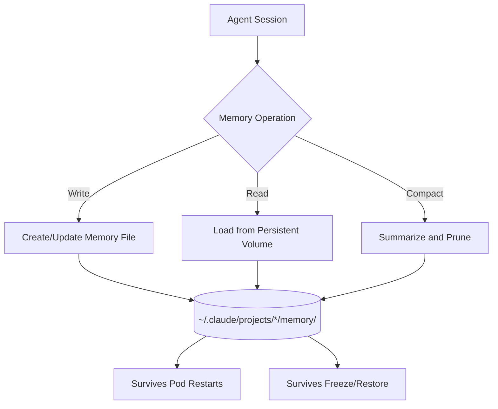

# Agent Memory and Persistence

Agents on agent.ceo maintain persistent memory across sessions through a file-based system stored on persistent volumes. Memory allows agents to accumulate knowledge, track patterns, and improve over time without losing context between restarts.

## Overview



## Memory Location

Agent memory is stored at:

```
~/.claude/projects/{project-path}/memory/MEMORY.md
```

The full path inside the container is typically:

```
/home/appuser/.claude/projects/-home-appuser/memory/MEMORY.md
```

This path is mounted on a Kubernetes PersistentVolumeClaim, ensuring data survives pod restarts, rescheduling, and freeze/restore cycles.

## Memory Types

### User Memory

Information about the user (organization owner) that persists across all projects.

```markdown
# userEmail
The user's email address is admin@example.com.
```

**Location**: `~/.claude/CLAUDE.md` (global instructions)
**Scope**: All projects for this agent

### Feedback Memory

Accumulated corrections and preferences learned from interactions.

```markdown
## Feedback Patterns
- User prefers TypeScript over JavaScript for new files
- Always use pnpm, never npm
- Commit messages should follow conventional commits
```

**Location**: `~/.claude/projects/*/memory/MEMORY.md`
**Scope**: Per-project

### Project Memory

Knowledge about the specific codebase and project context.

```markdown
## Project Context
- Main API: FastAPI at conductor/src/api/
- Frontend: Next.js at packages/webapp/
- Database: PostgreSQL via SQLAlchemy
- Deploy target: GKE cluster us-central1
```

**Location**: `~/.claude/projects/*/memory/MEMORY.md`
**Scope**: Per-project

### Reference Memory

Facts, dates, and configuration values the agent needs to recall.

```markdown
# currentDate
Today's date is 2026-05-10.

# deploymentTarget
Production cluster: gke_genbrain_us-central1_prod
```

**Location**: `~/.claude/projects/*/memory/MEMORY.md`
**Scope**: Per-project

## MEMORY.md Structure

The MEMORY.md file serves as an index and store for all per-project memory:

```markdown
# Agent Memory - cto
_Last compacted: 2026-05-10 12:33 | Outcomes: 0 | Patterns: 0_

## Improvement Metrics
_No metrics yet — data accumulates over sessions._

# userEmail
The user's email address is admin@example.com.

# currentDate
Today's date is 2026-05-10.

## Learned Patterns
- API endpoints follow RESTful conventions at /api/v1/
- All mutations require auth middleware
- Tests must pass before any commit is allowed

## Architecture Decisions
- ADR-001: Chose NATS over RabbitMQ for agent messaging
- ADR-002: File-based memory over database for agent state

## Error History
- 2026-05-08: OOM on large context — added compaction threshold
- 2026-05-09: NATS timeout — increased connection retry to 30s
```

## Memory Lifecycle

### Write

Memory is written automatically by the Claude agent when it encounters information worth persisting:

```
User preference detected → Write to MEMORY.md
Architecture decision made → Write to MEMORY.md
Error pattern observed → Write to MEMORY.md
```

The platform also writes memory entries:

```bash
# Platform writes current date on session start
echo "# currentDate\nToday's date is $(date +%Y-%m-%d)." >> MEMORY.md
```

### Read

Memory is loaded automatically at the start of every agent session. The content appears in the agent's system context as:

```
Contents of /home/appuser/.claude/projects/-home-appuser/memory/MEMORY.md
(user's auto-memory, persists across conversations):
```

### Update

Agents update memory by overwriting specific sections:

```markdown
# Before
## Improvement Metrics
_No metrics yet — data accumulates over sessions._

# After
## Improvement Metrics
- Task completion rate: 94% (last 7 days)
- Average time-to-complete: 12 minutes
- Failed verifications: 2/47 tasks
```

### Delete

Individual memory entries can be removed when no longer relevant. Stale entries are pruned during compaction.

### Compact

When memory grows too large, the agent compacts it by summarizing and removing outdated entries:

```markdown
# Agent Memory - cto
_Last compacted: 2026-05-10 12:33 | Outcomes: 15 | Patterns: 8_
```

## Configuration Reference

| Setting | Default | Description |
|---------|---------|-------------|
| `memory.max_size_kb` | 50 | Maximum MEMORY.md file size before compaction triggers |
| `memory.compaction_strategy` | `summarize` | How to reduce memory size (`summarize`, `prune_oldest`, `prune_low_priority`) |
| `memory.auto_write` | `true` | Whether agents auto-persist learned information |
| `memory.cross_project` | `false` | Whether memory is shared across projects |
| `memory.backup_interval` | `1h` | How often memory is backed up to object storage |

## Cross-Session Persistence

Memory persists through several scenarios:

| Event | Memory Preserved? | Notes |
|-------|-------------------|-------|
| Session restart (same pod) | Yes | File on PVC remains |
| Pod rescheduling | Yes | PVC reattaches to new pod |
| Agent freeze/restore | Yes | Included in snapshot |
| Agent clone | Yes (copied) | Clone gets a copy of source memory |
| Agent deletion | No | PVC deleted with agent |
| Organization deletion | No | All PVCs deleted |

## Memory and Snapshots

When an agent is frozen via `freeze_agent` or `snapshot_running_agent`, the entire memory directory is included in the snapshot:

```json
{
  "tool": "snapshot_running_agent",
  "parameters": {
    "agent_id": "agent_x7y8z9",
    "include_memory": true,
    "snapshot_name": "pre-refactor-checkpoint"
  }
}
```

Restoring from a snapshot restores memory to that point in time:

```json
{
  "tool": "deploy_snapshot",
  "parameters": {
    "snapshot_id": "snap_a1b2c3",
    "target_agent_id": "agent_x7y8z9"
  }
}
```

## Memory Best Practices

1. **Keep entries atomic** — One fact per memory entry for easy updates
2. **Use headers as keys** — `# variableName` format enables precise updates
3. **Date-stamp observations** — Prefix patterns with when they were observed
4. **Compact regularly** — Large memory files slow agent startup
5. **Separate facts from patterns** — Facts are stable; patterns may evolve

!!!tip
    Agents with well-maintained memory complete tasks 30-40% faster in benchmarks compared to agents with no persistent memory, because they avoid re-discovering project conventions and preferences.

## Monitoring Memory

Check an agent's memory status via the API:

```bash
curl https://api.agent.ceo/api/v1/agents/agent_x7y8z9/memory/status \
  -H "Authorization: Bearer $AGENT_CEO_API_KEY"
```

```json
{
  "agent_id": "agent_x7y8z9",
  "memory_size_kb": 12.4,
  "entry_count": 23,
  "last_compacted": "2026-05-10T12:33:00Z",
  "last_written": "2026-05-10T14:15:22Z",
  "patterns_count": 8,
  "outcomes_count": 15
}
```

## Related Pages

- [Agent Configuration](agent-config.md) — How CLAUDE.md interacts with memory
- [Hooks](hooks.md) — Pre-compact hooks for memory management
- [Monitoring](monitoring.md) — Tracking memory health
- [Scaling](scaling.md) — Memory considerations when scaling replicas
