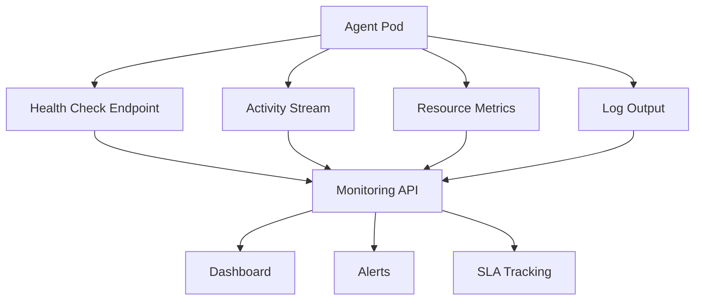
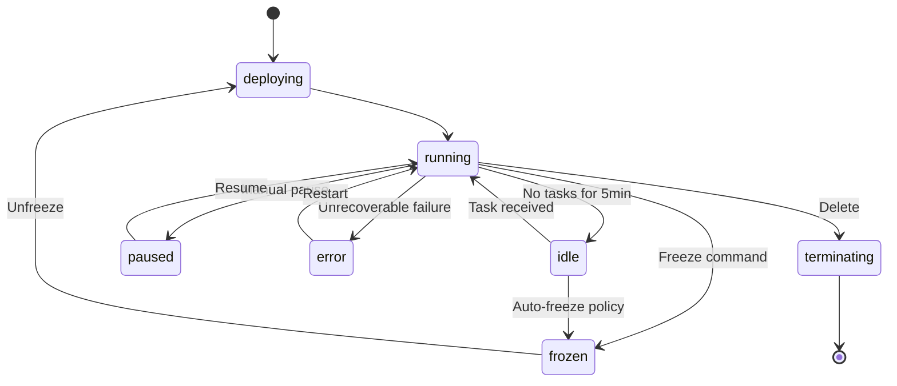

# Agent Monitoring and Observability

agent.ceo provides comprehensive monitoring for every agent in your organization. Track health status, review activity logs, measure costs, and enforce service level agreements across your agent team.

## Overview



## Health Check Endpoint

Every agent exposes a health check that the platform polls every 30 seconds:

```
GET /api/v1/agents/{agent_id}/health
```

```bash
curl https://api.agent.ceo/api/v1/agents/agent_x7y8z9/health \
  -H "Authorization: Bearer $AGENT_CEO_API_KEY"
```

Response:

```json
{
  "agent_id": "agent_x7y8z9",
  "role": "cto",
  "status": "running",
  "uptime_seconds": 3600,
  "last_heartbeat": "2026-05-10T14:30:00Z",
  "mcp_connected": true,
  "nats_connected": true,
  "memory_usage_mb": 1240,
  "cpu_usage_millicores": 450,
  "current_task": "task_abc123",
  "session_active": true,
  "context_usage_percent": 62
}
```

### Health Status Values

| Status | Description | Action |
|--------|-------------|--------|
| `running` | Agent is active and processing | Normal operation |
| `idle` | Agent is waiting for tasks | May be candidate for freeze |
| `paused` | Agent is temporarily suspended | Resume via API |
| `error` | Agent encountered unrecoverable error | Check logs, may need restart |
| `frozen` | Agent state snapshotted, pod stopped | Unfreeze when needed |
| `deploying` | Agent pod is starting up | Wait 60-90 seconds |
| `terminating` | Agent is shutting down | Graceful shutdown in progress |

!!!note
    An agent in `error` state will attempt automatic recovery three times. After three failures, it remains in error until manually restarted or the issue is resolved.

## Agent State Tracking

### List All Agents with Status

```bash
curl https://api.agent.ceo/api/v1/organizations/org_a1b2c3d4/agents \
  -H "Authorization: Bearer $AGENT_CEO_API_KEY"
```

```json
{
  "agents": [
    {"agent_id": "agent_a1", "role": "ceo", "status": "running", "active_tasks": 2},
    {"agent_id": "agent_b2", "role": "cto", "status": "running", "active_tasks": 3},
    {"agent_id": "agent_c3", "role": "fullstack", "status": "running", "replicas": 2},
    {"agent_id": "agent_d4", "role": "security", "status": "frozen", "replicas": 0}
  ]
}
```

### State Transitions



## Logs

### Accessing Agent Logs

Agent logs are accessible via the API or kubectl:

```bash
# Via API
curl https://api.agent.ceo/api/v1/agents/agent_x7y8z9/logs?lines=100 \
  -H "Authorization: Bearer $AGENT_CEO_API_KEY"

# Via kubectl (if you have cluster access)
kubectl logs -n org-a1b2c3d4 deployment/cto --tail=100
```

### Log Levels

| Level | Content |
|-------|---------|
| `info` | Task starts/completions, tool invocations, session events |
| `warn` | Retries, approaching limits, non-critical failures |
| `error` | Failed operations, hook failures, connection drops |
| `debug` | MCP message payloads, detailed execution traces |

### Structured Log Format

```json
{
  "timestamp": "2026-05-10T14:30:15.234Z",
  "level": "info",
  "agent_id": "agent_x7y8z9",
  "role": "cto",
  "org_id": "org_a1b2c3d4",
  "event": "task_completed",
  "task_id": "task_abc123",
  "duration_ms": 45000,
  "tools_used": ["assign_task", "send_to_agent"],
  "commit_sha": "a1b2c3d"
}
```

## Activity Stream

The activity stream provides a real-time feed of agent actions:

```bash
curl https://api.agent.ceo/api/v1/agents/agent_x7y8z9/activity?limit=20 \
  -H "Authorization: Bearer $AGENT_CEO_API_KEY"
```

```json
{
  "activities": [
    {
      "id": "act_001",
      "timestamp": "2026-05-10T14:30:15Z",
      "type": "task_completed",
      "details": {
        "task_id": "task_abc123",
        "title": "Fix authentication middleware",
        "evidence": "commit a1b2c3d, 47 tests passing"
      }
    },
    {
      "id": "act_002",
      "timestamp": "2026-05-10T14:25:00Z",
      "type": "tool_invoked",
      "details": {"tool": "send_to_agent", "target": "fullstack"}
    }
  ]
}
```

### Activity Types

| Type | Description |
|------|-------------|
| `task_accepted` | Agent accepted an assigned task |
| `task_completed` | Agent completed a task with evidence |
| `task_verified` | Manager verified a completed task |
| `tool_invoked` | Agent called an MCP tool |
| `commit_pushed` | Agent pushed a git commit |
| `message_sent` | Agent sent inter-agent message |
| `session_started` | New session loop began |
| `error_occurred` | Agent encountered an error |
| `frozen` / `unfrozen` | Agent freeze state changed |

## Cost Monitoring

### Per-Agent Cost Tracking

```bash
curl https://api.agent.ceo/api/v1/organizations/org_a1b2c3d4/costs \
  -H "Authorization: Bearer $AGENT_CEO_API_KEY" \
  -H "X-Time-Range: 7d"
```

```json
{
  "period": "2026-05-03 to 2026-05-10",
  "total_cost_usd": 287.45,
  "breakdown": [
    {"role": "ceo", "compute_hours": 168, "api_calls": 1240, "cost_usd": 89.20},
    {"role": "cto", "compute_hours": 168, "api_calls": 980, "cost_usd": 72.50},
    {"role": "fullstack", "compute_hours": 336, "api_calls": 1560, "cost_usd": 125.75}
  ],
  "cost_trend": "stable",
  "projected_monthly": 1150.00
}
```

### Cost Alerts

Configure alerts when spending exceeds thresholds:

```bash
curl -X POST https://api.agent.ceo/api/v1/organizations/org_a1b2c3d4/alerts \
  -H "Authorization: Bearer $AGENT_CEO_API_KEY" \
  -H "Content-Type: application/json" \
  -d '{
    "type": "cost",
    "threshold_usd": 500,
    "period": "monthly",
    "action": "notify",
    "notify_email": "admin@example.com"
  }'
```

## SLA Metrics

### get_sla_metrics

Retrieve current SLA performance:

```json
{
  "tool": "get_sla_metrics",
  "parameters": {
    "organization_id": "org_a1b2c3d4",
    "period": "7d"
  }
}
```

Response:

```json
{
  "period": "7d",
  "metrics": {
    "task_completion_rate": 0.94,
    "average_time_to_accept": "45s",
    "average_time_to_complete": "12m",
    "p95_time_to_complete": "45m",
    "verification_pass_rate": 0.89,
    "uptime_percent": 99.2,
    "messages_delivered_rate": 0.999,
    "tasks_completed": 47,
    "tasks_failed": 3,
    "tasks_escalated": 2
  }
}
```

### get_sla_trend

View SLA metrics over time:

```json
{
  "tool": "get_sla_trend",
  "parameters": {
    "organization_id": "org_a1b2c3d4",
    "metric": "task_completion_rate",
    "period": "30d",
    "granularity": "daily"
  }
}
```

Returns daily/weekly data points with `trend` indicator (`improving`, `stable`, `degrading`).

### SLA Alerts

```json
{
  "tool": "get_sla_alerts",
  "parameters": {
    "organization_id": "org_a1b2c3d4",
    "status": "active"
  }
}
```

```json
{
  "alerts": [
    {
      "alert_id": "alert_001",
      "severity": "warning",
      "metric": "p95_time_to_complete",
      "threshold": "30m",
      "current_value": "45m",
      "affected_role": "fullstack",
      "suggested_action": "Scale fullstack to reduce queue depth"
    }
  ]
}
```

## Configuration Reference

| Setting | Default | Description |
|---------|---------|-------------|
| `monitoring.health_check_interval` | 30s | How often health is polled |
| `monitoring.activity_retention_days` | 30 | Days to retain activity history |
| `monitoring.log_level` | info | Minimum log level captured |
| `monitoring.cost_alert_threshold` | none | Monthly cost alert threshold (USD) |
| `monitoring.sla_evaluation_window` | 7d | Rolling window for SLA calculation |
| `monitoring.auto_freeze_idle_minutes` | 60 | Freeze agents idle longer than this (0 = disabled) |

## Dashboard Integration

The web dashboard at `app.agent.ceo` displays:

- Real-time agent status grid
- Activity timeline with filtering
- Cost charts (daily, weekly, monthly)
- SLA compliance indicators
- Scaling event history
- Log viewer with search

Access the dashboard at:
```
https://app.agent.ceo/orgs/{org_id}/monitoring
```

## Related Pages

- [Scaling](scaling.md) — Auto-scaling based on monitoring signals
- [Hooks](hooks.md) — Hook execution monitoring
- [Memory](memory.md) — Memory size and health tracking
- [Tools](tools.md) — SLA and monitoring tool reference
