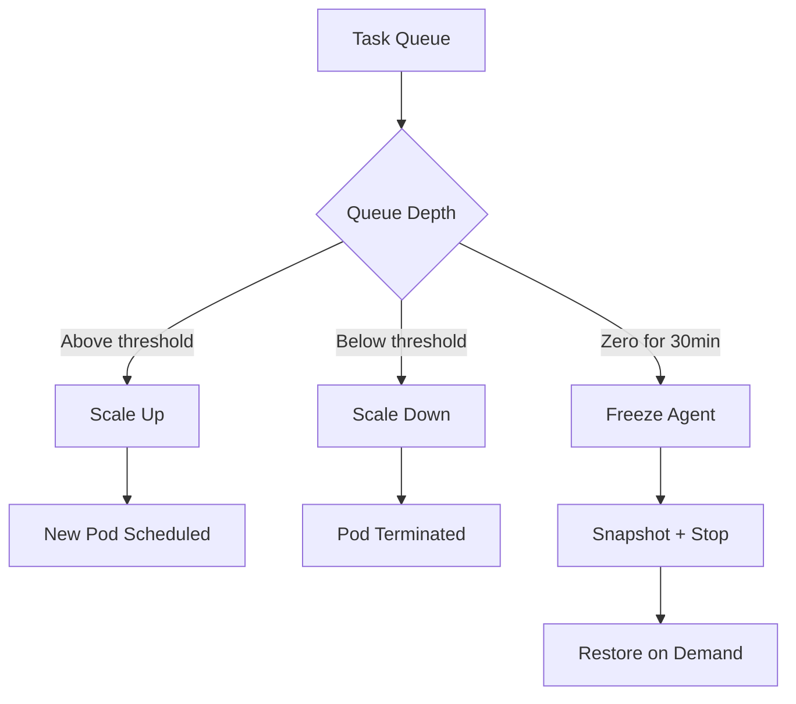

# Auto-Scaling and Resource Management

agent.ceo provides flexible scaling controls for managing agent resources. Scale individual roles up or down based on workload, configure resource limits, and use freeze/unfreeze cycles to optimize costs.

## Overview



## Scaling with scale_role

The `scale_role` MCP tool adjusts the number of replicas for a given agent role:

```json
{
  "tool": "scale_role",
  "parameters": {
    "role": "fullstack",
    "replicas": 3,
    "organization_id": "org_a1b2c3d4"
  }
}
```

### Via REST API

```bash
curl -X POST https://api.agent.ceo/api/v1/agents/scale \
  -H "Authorization: Bearer $AGENT_CEO_API_KEY" \
  -H "Content-Type: application/json" \
  -d '{
    "organization_id": "org_a1b2c3d4",
    "role": "fullstack",
    "replicas": 3
  }'
```

Response:

```json
{
  "role": "fullstack",
  "previous_replicas": 1,
  "target_replicas": 3,
  "status": "scaling",
  "estimated_ready": "120s"
}
```

!!!note
    When scaling up, new replicas share the same CLAUDE.md and MCP configuration but get independent memory volumes. Each replica receives tasks from the shared queue via NATS consumer groups.

## Resource Configuration

### Per-Agent Resource Limits

Every agent deployment specifies CPU and memory requests and limits:

```yaml
resources:
  requests:
    cpu: "500m"      # 0.5 CPU cores guaranteed
    memory: "1Gi"    # 1 GB RAM guaranteed
  limits:
    cpu: "2000m"     # Max 2 CPU cores
    memory: "4Gi"    # Max 4 GB RAM (OOMKilled above this)
```

### Resource Tiers

| Tier | CPU Request | CPU Limit | Memory Request | Memory Limit | Use Case |
|------|-------------|-----------|----------------|--------------|----------|
| Small | 250m | 1000m | 512Mi | 2Gi | Simple tasks, messaging |
| Medium | 500m | 2000m | 1Gi | 4Gi | Code generation, reviews |
| Large | 1000m | 4000m | 2Gi | 8Gi | Large context, multi-file work |
| XLarge | 2000m | 8000m | 4Gi | 16Gi | ML workloads, data processing |

### Updating Resources

```bash
curl -X PATCH https://api.agent.ceo/api/v1/agents/agent_x7y8z9/resources \
  -H "Authorization: Bearer $AGENT_CEO_API_KEY" \
  -H "Content-Type: application/json" \
  -d '{
    "resources": {
      "requests": {"cpu": "1000m", "memory": "2Gi"},
      "limits": {"cpu": "4000m", "memory": "8Gi"}
    }
  }'
```

!!!warning
    Changing resource limits triggers a pod restart. The agent will lose its current session but memory is preserved on the PVC.

## Horizontal Pod Autoscaler (HPA)

For automated scaling based on metrics, configure a Kubernetes HPA:

```yaml
apiVersion: autoscaling/v2
kind: HorizontalPodAutoscaler
metadata:
  name: fullstack-hpa
  namespace: org-a1b2c3d4
spec:
  scaleTargetRef:
    apiVersion: apps/v1
    kind: Deployment
    name: fullstack
  minReplicas: 1
  maxReplicas: 5
  metrics:
    - type: External
      external:
        metric:
          name: agent_task_queue_depth
          selector:
            matchLabels:
              role: fullstack
              org: org-a1b2c3d4
        target:
          type: AverageValue
          averageValue: "3"
  behavior:
    scaleUp:
      stabilizationWindowSeconds: 60
      policies:
        - type: Pods
          value: 1
          periodSeconds: 120
    scaleDown:
      stabilizationWindowSeconds: 300
      policies:
        - type: Pods
          value: 1
          periodSeconds: 300
```

### HPA Metrics

| Metric | Description | Default Target |
|--------|-------------|---------------|
| `agent_task_queue_depth` | Pending tasks for this role | 3 per replica |
| `agent_cpu_utilization` | Average CPU usage | 70% |
| `agent_memory_utilization` | Average memory usage | 80% |
| `agent_session_active` | Whether agent is in active session | 1 (boolean) |

### Enabling HPA via API

```bash
curl -X POST https://api.agent.ceo/api/v1/agents/agent_x7y8z9/autoscale \
  -H "Authorization: Bearer $AGENT_CEO_API_KEY" \
  -H "Content-Type: application/json" \
  -d '{
    "enabled": true,
    "min_replicas": 1,
    "max_replicas": 5,
    "target_queue_depth": 3,
    "scale_up_cooldown_seconds": 120,
    "scale_down_cooldown_seconds": 300
  }'
```

## Freeze/Unfreeze for Cost Control

Freezing an agent snapshots its state and stops the pod, eliminating compute costs while preserving all data.

### Freeze an Agent

```json
{
  "tool": "freeze_agent",
  "parameters": {
    "agent_id": "agent_x7y8z9",
    "reason": "No tasks expected until next sprint"
  }
}
```

What happens during freeze:
1. Current session completes or is gracefully terminated
2. Memory and state are snapshotted to object storage
3. Pod is deleted (compute costs stop)
4. PVC is retained (storage costs continue at reduced rate)
5. Agent status changes to `frozen`

### Restore a Frozen Agent

```json
{
  "tool": "deploy_snapshot",
  "parameters": {
    "snapshot_id": "snap_a1b2c3",
    "target_agent_id": "agent_x7y8z9"
  }
}
```

Or via API:

```bash
curl -X POST https://api.agent.ceo/api/v1/agents/agent_x7y8z9/unfreeze \
  -H "Authorization: Bearer $AGENT_CEO_API_KEY"
```

### Cost Impact

| State | Compute Cost | Storage Cost |
|-------|-------------|-------------|
| Running (Medium tier) | ~$0.08/hr | $0.01/hr |
| Frozen | $0.00/hr | $0.005/hr |
| Deleted | $0.00/hr | $0.00/hr |

!!!tip
    Freeze agents during nights and weekends for up to 70% cost reduction. Use scheduled jobs or the CEO agent's loop strategy to auto-freeze idle agents.

## Checking Team Capacity

The `check_team_capacity` tool provides a snapshot of current team utilization:

```json
{
  "tool": "check_team_capacity",
  "parameters": {
    "organization_id": "org_a1b2c3d4"
  }
}
```

Response:

```json
{
  "organization_id": "org_a1b2c3d4",
  "total_agents": 5,
  "running_agents": 4,
  "frozen_agents": 1,
  "capacity": {
    "cto": {"replicas": 1, "active_tasks": 3, "queued_tasks": 1, "utilization": "high"},
    "fullstack": {"replicas": 2, "active_tasks": 4, "queued_tasks": 3, "utilization": "high"},
    "devops": {"replicas": 1, "active_tasks": 0, "queued_tasks": 0, "utilization": "idle"}
  },
  "recommendations": [
    "Scale fullstack to 3 replicas (queue depth exceeds threshold)",
    "Consider freezing devops (idle for 45 minutes)"
  ]
}
```

## Scaling Strategies

### Task-Queue Scaling

Scale based on pending task count:

```json
{
  "strategy": "task-queue",
  "config": {
    "scale_up_threshold": 3,
    "scale_down_threshold": 0,
    "scale_down_delay_minutes": 15,
    "max_replicas": 5
  }
}
```

### Schedule-Based Scaling

Scale based on time of day:

```json
{
  "strategy": "schedule",
  "config": {
    "schedules": [
      {"cron": "0 9 * * 1-5", "replicas": 3, "comment": "Business hours"},
      {"cron": "0 18 * * 1-5", "replicas": 1, "comment": "Evening"},
      {"cron": "0 0 * * 6-7", "replicas": 0, "comment": "Weekends (freeze)"}
    ]
  }
}
```

### Burst Scaling

For deadline-driven work:

```bash
# Scale up entire team for a sprint
curl -X POST https://api.agent.ceo/api/v1/organizations/org_a1b2c3d4/burst \
  -H "Authorization: Bearer $AGENT_CEO_API_KEY" \
  -H "Content-Type: application/json" \
  -d '{
    "duration_hours": 8,
    "scale_factor": 2,
    "roles": ["fullstack", "cto"]
  }'
```

## Replica Load Balancing

When multiple replicas exist for a role, tasks are distributed via NATS consumer groups:

```
Task arrives → NATS subject: org.{id}.agent.fullstack.inbox
                    ↓
            Consumer Group: fullstack-workers
                    ↓
    ┌───────────────┼───────────────┐
    ↓               ↓               ↓
fullstack-1    fullstack-2    fullstack-3
```

Each replica processes one task at a time. When a replica finishes, it pulls the next task from the queue.

## Related Pages

- [Creating Agents](creating-agents.md) — Setting initial resource limits
- [Monitoring](monitoring.md) — Observing scaling events and resource usage
- [Templates](templates.md) — Default resources per template tier
- [Tools](tools.md) — scale_role and check_team_capacity reference
