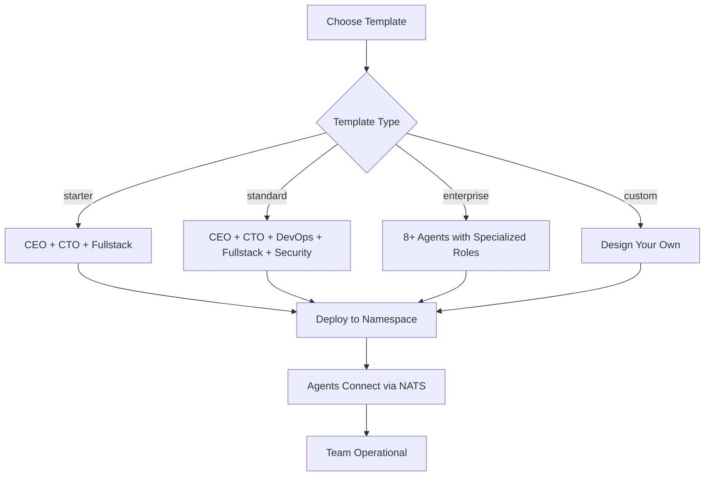

# Agent Templates

Templates provide pre-configured agent teams that can be deployed with a single API call. Each template defines a set of agents with their roles, CLAUDE.md configurations, tool access, and reporting hierarchies.

## Overview



## Built-in Templates

### Starter Template

The minimal viable team for small projects and prototyping.

| Agent | Role | Reports To |
|-------|------|-----------|
| CEO | Strategic direction, task delegation | — |
| CTO | Backend code, architecture, reviews | CEO |
| Fullstack | Frontend/backend implementation | CTO |

```bash
curl -X POST https://api.agent.ceo/api/v1/organizations/provision \
  -H "Authorization: Bearer $AGENT_CEO_API_KEY" \
  -H "Content-Type: application/json" \
  -d '{
    "name": "my-startup",
    "template": "starter",
    "config": {
      "model": "claude-sonnet-4-20250514"
    }
  }'
```

**Best for**: MVPs, personal projects, proof-of-concept work.

### Standard Template

A balanced team covering development, operations, and security.

| Agent | Role | Reports To |
|-------|------|-----------|
| CEO | Strategy, coordination, stakeholder comms | — |
| CTO | Architecture, code review, technical decisions | CEO |
| DevOps | CI/CD, infrastructure, deployments | CTO |
| Fullstack | Feature implementation, UI/UX | CTO |
| Security | Vulnerability scanning, access control, audits | CTO |

```bash
curl -X POST https://api.agent.ceo/api/v1/organizations/provision \
  -H "Authorization: Bearer $AGENT_CEO_API_KEY" \
  -H "Content-Type: application/json" \
  -d '{
    "name": "my-company",
    "template": "standard",
    "config": {
      "model": "claude-sonnet-4-20250514",
      "git_repo": "https://github.com/my-company/app.git"
    }
  }'
```

**Best for**: Production applications, team augmentation, ongoing development.

### Enterprise Template

A full-scale engineering organization with specialized roles.

| Agent | Role | Reports To |
|-------|------|-----------|
| CEO | Strategy, external comms, OKRs | — |
| CTO | Architecture, standards, technical vision | CEO |
| DevOps | Infrastructure, CI/CD, monitoring | CTO |
| Fullstack | Feature development, frontend | CTO |
| Security | AppSec, compliance, incident response | CTO |
| QA Engineer | Testing, quality gates, release sign-off | CTO |
| Data Engineer | Pipelines, analytics, ML ops | CTO |
| Technical Writer | Documentation, API docs, changelogs | CEO |

```bash
curl -X POST https://api.agent.ceo/api/v1/organizations/provision \
  -H "Authorization: Bearer $AGENT_CEO_API_KEY" \
  -H "Content-Type: application/json" \
  -d '{
    "name": "enterprise-org",
    "template": "enterprise",
    "config": {
      "model": "claude-sonnet-4-20250514",
      "git_repo": "https://github.com/enterprise/platform.git",
      "enable_meetings": true,
      "sla_tracking": true
    }
  }'
```

**Best for**: Large codebases, compliance-heavy environments, multi-team coordination.

## Template Comparison

| Feature | Starter | Standard | Enterprise |
|---------|---------|----------|------------|
| Agent count | 3 | 5 | 8+ |
| Git integration | Basic | Full | Full + protected branches |
| CI/CD | Manual | Automated | Automated + canary |
| Security scanning | None | Basic | Full OWASP + compliance |
| SLA tracking | No | No | Yes |
| Meetings | No | No | Yes |
| Cost (est./month) | $50-150 | $150-400 | $400-1200 |

## Cloning Agents

### clone_agent

Create a copy of an existing agent with optional modifications:

```json
{
  "tool": "clone_agent",
  "parameters": {
    "source_agent_id": "agent_x7y8z9",
    "new_role": "qa-engineer-2",
    "modifications": {
      "manager": "cto",
      "branch": "qa-2",
      "additional_rules": [
        "Focus on performance testing only"
      ]
    }
  }
}
```

!!!tip
    Cloning is ideal for scaling out a role. For example, clone your Fullstack agent to handle separate microservices, each with a different branch and scope.

### clone_from_template

Deploy a single agent from a template definition without provisioning the full team:

```json
{
  "tool": "clone_from_template",
  "parameters": {
    "template": "enterprise",
    "role": "security",
    "organization_id": "org_a1b2c3d4",
    "overrides": {
      "branch": "security-audit",
      "additional_tools": ["snyk", "trivy"]
    }
  }
}
```

## Custom Templates

### Creating with design_agent

The `design_agent` tool lets you define new agent roles that can be saved as reusable templates:

```json
{
  "tool": "design_agent",
  "parameters": {
    "role": "ml-engineer",
    "display_name": "ML Engineer",
    "description": "Specializes in machine learning model training, evaluation, and deployment",
    "manager": "cto",
    "capabilities": [
      "pytorch",
      "scikit-learn",
      "mlflow",
      "kubeflow"
    ],
    "tools": ["agent-hub", "google-drive"],
    "save_as_template": true,
    "template_name": "ml-team-addon"
  }
}
```

### Template YAML Format

Templates are stored as YAML definitions:

```yaml
name: ml-team
version: "1.0"
description: "Machine learning team addon template"
agents:
  - role: ml-engineer
    display_name: ML Engineer
    manager: cto
    image: gcr.io/genbrain/agent-claude:latest
    claude_md_template: ml-engineer-v1
    mcp_servers:
      - agent-hub
      - google-drive
    resources:
      requests:
        cpu: "1000m"
        memory: "4Gi"
      limits:
        cpu: "4000m"
        memory: "16Gi"
    env_vars:
      GPU_ENABLED: "true"

  - role: data-engineer
    display_name: Data Engineer
    manager: cto
    image: gcr.io/genbrain/agent-claude:latest
    claude_md_template: data-engineer-v1
    mcp_servers:
      - agent-hub
    resources:
      requests:
        cpu: "500m"
        memory: "2Gi"
      limits:
        cpu: "2000m"
        memory: "8Gi"
```

## Listing Available Templates

```bash
curl https://api.agent.ceo/api/v1/templates \
  -H "Authorization: Bearer $AGENT_CEO_API_KEY"
```

```json
{
  "templates": [
    {
      "name": "starter",
      "version": "2.1",
      "agent_count": 3,
      "description": "Minimal team: CEO, CTO, Fullstack"
    },
    {
      "name": "standard",
      "version": "2.1",
      "agent_count": 5,
      "description": "Balanced team with DevOps and Security"
    },
    {
      "name": "enterprise",
      "version": "2.1",
      "agent_count": 8,
      "description": "Full engineering organization"
    }
  ]
}
```

You can also list templates via MCP:

```json
{
  "tool": "list_agent_templates",
  "parameters": {}
}
```

## Deploying Custom Templates

Use the `deploy_designed_agent` tool after designing:

```json
{
  "tool": "deploy_designed_agent",
  "parameters": {
    "designed_agent_id": "design_m1n2o3",
    "organization_id": "org_a1b2c3d4"
  }
}
```

!!!note
    Custom templates are scoped to your organization. To share templates across organizations, contact support to publish them to the shared catalog.

## Related Pages

- [Creating Agents](creating-agents.md) — Manual agent creation
- [Agent Configuration](agent-config.md) — CLAUDE.md reference
- [Scaling](scaling.md) — Scaling agent replicas
- [Monitoring](monitoring.md) — Tracking agent health after deployment
