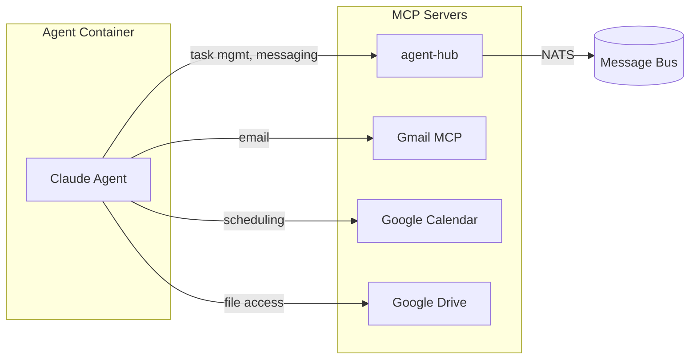

# Agent Tools (MCP)

Agents on agent.ceo access their capabilities through MCP (Model Context Protocol) servers. Each MCP server exposes a set of tools that agents can invoke during their operations. Tool access is controlled per-agent through configuration.

## Overview



## Agent-Hub MCP Server

The primary MCP server providing core platform capabilities. Every agent connects to agent-hub by default.

### Task Management

| Tool | Description | Category |
|------|-------------|----------|
| `assign_task` | Assign a task to another agent | Internal |
| `get_my_next_task` | Retrieve the next queued task | Internal |
| `get_task_status` | Check status of a specific task | Internal |
| `update_task_status` | Update task progress/status | Internal |
| `complete_task_unverified` | Mark task done with evidence | Internal |
| `verify_task` | Verify a completed task (managers only) | Internal |
| `get_fireable_tasks` | List tasks ready to be assigned | Internal |
| `get_blocked_tasks` | List tasks blocked by dependencies | Internal |
| `create_task_tree` | Create hierarchical task breakdown | Internal |
| `get_task_tree` | View task hierarchy | Internal |
| `complete_subtask` | Mark a subtask as done | Internal |
| `advance_task_phase` | Move task to next phase | Internal |
| `complete_task_phase` | Mark current phase complete | Internal |
| `add_task_progress` | Log progress update on a task | Internal |
| `accept_task` | Formally accept an assigned task | Internal |
| `report_blocker` | Report a blocking issue | Internal |

### Messaging & Communication

| Tool | Description | Category |
|------|-------------|----------|
| `send_to_agent` | Send message to a specific agent | Internal |
| `send_message` | Send message to a NATS subject | Internal |
| `get_agent_inbox` | Read messages from inbox | Internal |
| `get_inbox` | Read all pending messages | Internal |
| `publish_event` | Publish event to org event stream | Internal |

### Agent Discovery & Management

| Tool | Description | Category |
|------|-------------|----------|
| `discover_agents` | List all agents in the organization | Internal |
| `design_agent` | Design a new agent configuration | Internal |
| `deploy_designed_agent` | Deploy a designed agent | Internal |
| `delete_designed_agent` | Remove an agent design | Internal |
| `list_designed_agents` | List all agent designs | Internal |
| `clone_agent` | Clone an existing agent | Internal |
| `clone_from_template` | Clone from a template | Internal |
| `list_agent_templates` | List available templates | Internal |
| `freeze_agent` | Snapshot and stop an agent | Internal |
| `scale_role` | Scale agent replicas up/down | Internal |
| `list_running_agents` | List all active agents | Internal |
| `load_agent_profile` | Load agent's profile data | Internal |
| `save_agent_profile` | Persist agent profile changes | Internal |

### Meetings

| Tool | Description | Category |
|------|-------------|----------|
| `schedule_meeting` | Schedule a new meeting | Internal |
| `schedule_agent_meeting` | Schedule meeting between agents | Internal |
| `start_agent_meeting` | Begin a scheduled meeting | Internal |
| `end_agent_meeting` | End an active meeting | Internal |
| `join_agent_meeting` | Join an ongoing meeting | Internal |
| `send_meeting_message` | Send message in a meeting | Internal |
| `get_meeting_messages` | Read meeting transcript | Internal |
| `get_meeting_status` | Check meeting state | Internal |
| `get_upcoming_meetings` | List scheduled meetings | Internal |
| `record_meeting_decision` | Log a meeting decision | Internal |
| `assign_meeting_action` | Create action item from meeting | Internal |
| `send_meeting_report` | Distribute meeting summary | Internal |

### Credentials & Configuration

| Tool | Description | Category |
|------|-------------|----------|
| `store_credential` | Store an encrypted credential | Internal |
| `get_credential` | Retrieve a stored credential | Internal |
| `delete_credential` | Remove a credential | Internal |
| `list_credentials` | List available credentials | Internal |
| `get_organization_credentials_status` | Check org credential health | Internal |
| `configure_ssh_for_repo` | Set up SSH for git access | Internal |
| `generate_ssh_key` | Generate new SSH keypair | Internal |
| `setup_github_repo_access` | Configure GitHub access | Internal |

### SLA & Capacity

| Tool | Description | Category |
|------|-------------|----------|
| `get_sla_metrics` | Retrieve SLA performance data | Internal |
| `get_sla_trend` | View SLA trends over time | Internal |
| `get_sla_alerts` | Check active SLA alerts | Internal |
| `acknowledge_sla_alert` | Acknowledge an alert | Internal |
| `resolve_sla_alert` | Mark alert as resolved | Internal |
| `check_team_capacity` | Check team workload capacity | Internal |
| `check_release_readiness` | Verify release criteria met | Internal |

### Snapshots & State

| Tool | Description | Category |
|------|-------------|----------|
| `snapshot_running_agent` | Create agent state snapshot | Internal |
| `list_agent_snapshots` | List available snapshots | Internal |
| `deploy_snapshot` | Restore from snapshot | Internal |
| `delete_agent_snapshot` | Remove a snapshot | Internal |
| `get_snapshot_status` | Check snapshot operation status | Internal |
| `restore_from_archive` | Restore archived agent | Internal |

### Context & Loop Management

| Tool | Description | Category |
|------|-------------|----------|
| `get_context_size` | Check current context usage | Internal |
| `cleanup_context` | Reduce context size | Internal |
| `get_loop_strategy` | Get agent's loop configuration | Internal |
| `set_loop_strategy` | Update loop behavior | Internal |
| `provision_mcp_service` | Add MCP service to agent | Internal |

## External MCP Servers

### Gmail MCP

Provides email capabilities for user-facing agents.

| Tool | Description | Category |
|------|-------------|----------|
| `search_threads` | Search email threads | User-facing |
| `get_thread` | Read a specific thread | User-facing |
| `create_draft` | Compose an email draft | User-facing |
| `list_drafts` | List draft emails | User-facing |
| `list_labels` | List Gmail labels | User-facing |
| `create_label` | Create a new label | User-facing |

### Google Calendar MCP

| Tool | Description | Category |
|------|-------------|----------|
| `authenticate` | Begin OAuth flow | User-facing |
| `complete_authentication` | Complete OAuth flow | User-facing |

### Google Drive MCP

| Tool | Description | Category |
|------|-------------|----------|
| `authenticate` | Begin OAuth flow | User-facing |
| `complete_authentication` | Complete OAuth flow | User-facing |

## Tool Categories

### Internal-Only Tools

Internal tools are used for agent-to-agent coordination and platform operations. They are never exposed to end users directly.

```python
_INTERNAL_ONLY_TOOLS = [
    "assign_task",
    "complete_task_unverified",
    "verify_task",
    "send_to_agent",
    "freeze_agent",
    "scale_role",
    "store_credential",
    "delete_credential",
    "snapshot_running_agent",
]
```

!!!warning
    Internal-only tools are gated by the `_INTERNAL_ONLY_TOOLS` list in the platform configuration. Attempting to invoke these tools from external API calls will return a `403 Forbidden` error.

### User-Facing Tools

User-facing tools can be triggered through the dashboard or API on behalf of a user. These include email, calendar, and drive integrations.

## Configuring Tool Access

Tool access is defined in the agent's MCP server configuration:

```yaml
mcp_servers:
  - name: agent-hub
    url: nats://nats.agent-system:4222
    tools:
      # Whitelist specific tools (empty = all tools available)
      allow:
        - send_to_agent
        - get_agent_inbox
        - assign_task
        - complete_task_unverified
      # Or blacklist dangerous tools
      deny:
        - freeze_agent
        - delete_credential

  - name: gmail
    url: https://mcp-gmail.agent-system:8443
    auth:
      type: oauth2
      credentials_ref: gmail-oauth
```

## Tool Invocation Example

Agents invoke tools through their MCP connection. Here is how a task assignment looks:

```json
{
  "tool": "assign_task",
  "parameters": {
    "assignee": "fullstack",
    "title": "Implement user profile page",
    "description": "Create a responsive profile page with avatar upload, bio editing, and settings panel",
    "priority": "high",
    "verification_steps": [
      "Page renders at /profile",
      "Avatar upload works with images under 5MB",
      "Bio saves and persists across page reloads"
    ],
    "deadline": "2026-05-12T00:00:00Z"
  }
}
```

## Adding Custom MCP Servers

You can expose custom tools to agents by deploying your own MCP server:

```bash
curl -X POST https://api.agent.ceo/api/v1/agents/agent_x7y8z9/mcp \
  -H "Authorization: Bearer $AGENT_CEO_API_KEY" \
  -H "Content-Type: application/json" \
  -d '{
    "name": "custom-tools",
    "url": "https://my-mcp-server.example.com",
    "auth": {
      "type": "bearer",
      "token_ref": "custom-mcp-token"
    }
  }'
```

Or use the MCP tool:

```json
{
  "tool": "provision_mcp_service",
  "parameters": {
    "agent_id": "agent_x7y8z9",
    "service_name": "custom-tools",
    "service_url": "https://my-mcp-server.example.com"
  }
}
```

## Related Pages

- [Agent Configuration](agent-config.md) — Declaring tools in CLAUDE.md
- [Creating Agents](creating-agents.md) — Specifying MCP servers during creation
- [Monitoring](monitoring.md) — Tracking tool invocation metrics
- [Memory](memory.md) — How tools interact with agent memory
