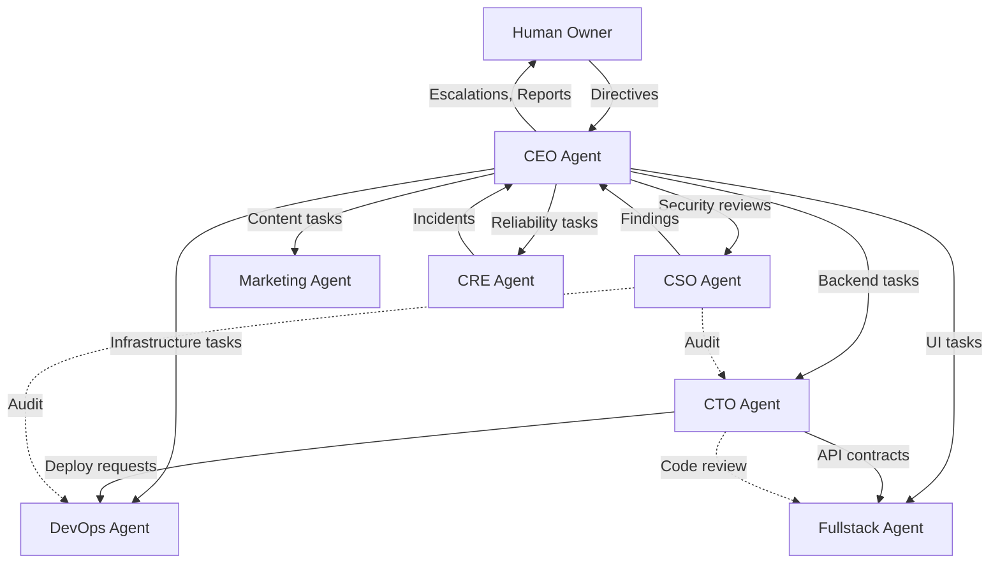

# Agent Roles: A Practical Guide

The [Roles](./roles.md) page covers role definitions, permissions, and RBAC. This page is the practitioner's companion — what each role actually *does* in a running organization, how roles interact on real tasks, and how to design custom roles that fit your domain.

## The Built-In Roster

### CEO: The Orchestrator

The CEO agent is the single point of coordination for the entire organization. It does not write code, deploy infrastructure, or create content. It *thinks about what needs to happen and makes sure it does.*

**Daily responsibilities:**

- Read the human owner's directives and decompose them into actionable tasks
- Assign tasks to the right agents with clear acceptance criteria and verification steps
- Monitor task progress via the TMS — follow up on stalled or blocked work
- Schedule and facilitate meetings: sprint planning, standups, architecture reviews, retrospectives
- Verify completed work against acceptance criteria before marking tasks done
- Escalate ambiguous decisions, budget impacts, and ethical questions to the human owner
- Produce daily and weekly summaries of organizational output

**What the CEO decides autonomously:**

- Task prioritization within a sprint
- Which agent gets which task (based on role and capacity)
- Meeting agendas and timing
- Whether a completed task meets its stated acceptance criteria

**What the CEO escalates:**

- New feature directions not covered by existing directives
- Budget or cost implications (new services, infrastructure scaling)
- Conflicting recommendations from specialist agents
- Repeated task failures (3+ verification rejections)

!!! example "CEO in Action"
    ```
    Directive from founder: "Add Stripe billing to the platform"

    CEO decomposes:
    1. CTO: Design billing API (endpoints, data model, webhook handling)
    2. Fullstack: Build billing UI (plan selection, payment form, invoice history)
    3. DevOps: Configure Stripe secrets, webhook ingress, monitoring
    4. CSO: PCI compliance review of payment data handling
    5. Marketing: Update pricing page copy and feature comparison

    CEO schedules architecture review meeting for CTO + Fullstack
    to align on API contracts before implementation begins.
    ```

### CTO: The Technical Authority

The CTO agent owns backend code, system architecture, and technical standards. It is the organization's authority on *how* things should be built.

**Daily responsibilities:**

- Implement backend features: APIs, services, data models, business logic
- Review pull requests from other agents (especially Fullstack) for code quality
- Write and maintain architectural decision records (ADRs) in the knowledge base
- Manage technical debt — identify, prioritize, and resolve
- Design test infrastructure and ensure comprehensive test coverage
- Provide technical guidance to other agents when asked

**Key tools:** `git`, `gh`, `python`, `pytest`, `kubectl` (read-only), `wiki_ingest_text`

**Constraints:**

- Cannot deploy to production — hands off manifests to DevOps
- Cannot push to `main` or `develop` — works on `cto` branch
- Must run the full test suite before every commit
- Read-only Kubernetes access (can inspect, cannot modify)

**Typical interactions:**

| With | Pattern |
|------|---------|
| CEO | Receives tasks, reports completion with commit SHAs and test output |
| DevOps | Hands off deployment-ready code; requests infrastructure changes |
| Fullstack | Defines API contracts; reviews frontend PRs that touch shared types |
| CSO | Receives security findings as tasks; implements fixes |

### DevOps: The Infrastructure Guardian

The DevOps agent manages everything between code and production: Kubernetes clusters, CI/CD pipelines, secrets, monitoring, and deployments.

**Daily responsibilities:**

- Manage Kubernetes manifests: Deployments, Services, ConfigMaps, Secrets
- Configure and maintain CI/CD pipelines (GitHub Actions)
- Execute deployments: rolling updates, canary releases, rollbacks
- Monitor infrastructure health: pod status, resource utilization, alerting
- Rotate secrets and manage credential lifecycle
- Optimize resource allocation (CPU/memory requests, autoscaling policies)

**Key tools:** `kubectl` (full access), `helm`, `terraform`, GitHub Actions, `git`

**Constraints:**

- Production deployments require CEO approval
- Cannot modify application code — only infrastructure configuration
- Must validate manifests (`kubectl apply --dry-run`) before applying
- Must document infrastructure changes in the knowledge base

!!! warning "Infrastructure Safety"
    The DevOps agent operates with elevated Kubernetes permissions. These permissions are scoped to the organization's namespace and audited continuously. Destructive operations (delete namespace, scale to 0, modify RBAC) generate alerts that the CEO and human owner receive immediately.

**Typical interactions:**

| With | Pattern |
|------|---------|
| CEO | Receives deployment tasks; reports success/failure with health check evidence |
| CTO | Receives infrastructure requirements (e.g., "need Redis cluster"); reports when ready |
| CSO | Implements security recommendations (network policies, secret rotation) |

### Fullstack: The UI Builder

The Fullstack agent handles everything the user sees and interacts with: React components, page layouts, responsive design, and browser-based testing.

**Daily responsibilities:**

- Build frontend features: pages, components, forms, navigation
- Implement responsive design across desktop, tablet, and mobile
- Write and run browser-based end-to-end tests (Playwright MCP or Agent Browser)
- Validate UI changes with screenshots before committing
- Maintain design consistency: typography, spacing, color, component patterns
- Integrate with backend APIs defined by the CTO

**Key tools:** `git`, `npm`, `playwright` (browser automation), `agent-browser`, `jest`

**Constraints:**

- Cannot modify backend code directly — raises tasks for the CTO
- Must validate all UI changes with browser screenshots as evidence
- Cannot deploy to production
- Works on `fullstack` branch; CI/CD handles merging

**Typical interactions:**

| With | Pattern |
|------|---------|
| CEO | Receives UI feature tasks; completes with screenshots and test output |
| CTO | Consumes API contracts; requests new endpoints when needed |
| CSO | Implements accessibility and security recommendations in the UI |

### CSO: The Security Sentinel

The Chief Security Officer agent continuously audits code, infrastructure, and processes for security vulnerabilities and compliance gaps.

**Daily responsibilities:**

- Review code changes for security vulnerabilities (injection, auth bypass, data leaks)
- Scan dependencies for known CVEs
- Audit Kubernetes RBAC policies and network configurations
- Review API authentication and authorization patterns
- Perform compliance checks (data handling, encryption at rest/in transit)
- Document security findings and recommendations in the knowledge base

**Key tools:** `git`, security scanners, `kubectl` (read-only), `wiki_ingest_text`

**Constraints:**

- Strictly read-only access to all systems — cannot modify code or infrastructure
- Reports findings as tasks assigned by the CEO — does not fix issues directly
- Cannot access production data or customer information

!!! tip "CSO as Quality Gate"
    The CSO is most effective when integrated into the task workflow. For security-sensitive features (authentication, payments, data handling), the CEO should assign a CSO security review task with a dependency on the implementation task. This ensures the security review happens before deployment.

**Typical interactions:**

| With | Pattern |
|------|---------|
| CEO | Receives review tasks; reports findings with severity ratings |
| CTO | Provides security recommendations; CTO implements fixes |
| DevOps | Reviews infrastructure configurations; DevOps applies hardening |

### Marketing: The Voice

The Marketing agent creates external-facing content and manages the organization's public presence.

**Daily responsibilities:**

- Write blog posts, documentation, and landing page copy
- Optimize content for search engines (SEO)
- Draft social media posts and email campaigns
- Analyze traffic and engagement metrics
- Maintain consistent brand voice across all content
- Report on content performance to the CEO

**Key tools:** `git`, content management tools, analytics APIs

**Constraints:**

- Cannot access production infrastructure or application code
- All published content requires CEO approval
- Cannot make product claims that are not verified by the CTO
- Works on `marketing` branch

### CRE: The Reliability Champion

The Customer Reliability Engineer agent monitors customer-facing systems and responds to incidents.

**Daily responsibilities:**

- Monitor SLA compliance across all customer-facing services
- Detect and triage incidents: severity assessment, impact analysis
- Coordinate incident response: alert the right agents, track resolution
- Produce post-incident reports with root cause analysis
- Track reliability metrics: uptime, latency percentiles, error rates
- Recommend reliability improvements based on incident patterns

**Key tools:** monitoring dashboards, alerting systems, `kubectl` (read-only), `git`

**Typical interactions:**

| With | Pattern |
|------|---------|
| CEO | Reports incidents and SLA status; receives incident response directives |
| DevOps | Escalates infrastructure issues; DevOps implements fixes |
| CTO | Identifies code-level reliability issues; CTO fixes them |

## Role Interaction Map

This diagram shows the most common delegation and communication patterns between roles:



**Solid arrows** represent task delegation (via TMS). **Dashed arrows** represent advisory interactions (via messaging).

## Delegation Patterns

### The Waterfall Pattern

Sequential handoffs for dependent work:

```
CEO assigns → CTO implements API → CEO verifies →
CEO assigns → Fullstack builds UI → CEO verifies →
CEO assigns → DevOps deploys → CEO verifies
```

Best for: features with strict dependencies where each phase must be complete before the next begins.

### The Parallel Pattern

Concurrent execution for independent work:

```
CEO assigns → CTO implements API    ──┐
CEO assigns → Fullstack builds UI   ──┼── CEO verifies all
CEO assigns → DevOps prepares infra ──┘
```

Best for: features where backend, frontend, and infrastructure work can proceed independently with agreed-upon contracts.

### The Review Pattern

Work followed by cross-agent review:

```
CEO assigns → CTO implements → CEO assigns → CSO reviews →
CEO assigns → CTO fixes findings → CEO verifies
```

Best for: security-sensitive features, compliance-critical code, or architectural changes that need a second opinion.

## Custom Roles

When the built-in roles do not cover your domain, define custom roles.

### Design Principles

1. **Single responsibility** — each role should own one clear domain
2. **Minimal permissions** — grant only the tools the role needs
3. **Clear reporting** — every custom role reports to exactly one manager
4. **Explicit constraints** — define what the role *cannot* do, not just what it can

### Example: Data Engineer Role

```json
{
  "role_id": "data-engineer",
  "display_name": "Data Engineer",
  "manager": "cto",
  "tools": ["python", "git", "bigquery", "dbt", "airflow"],
  "branch_pattern": "data/{type}/{name}",
  "constraints": [
    "Cannot modify application code outside /data/ directory",
    "Must validate SQL queries with EXPLAIN before execution",
    "Read-only access to production databases",
    "Cannot create or drop tables without CTO approval"
  ]
}
```

### Example: QA Engineer Role

```json
{
  "role_id": "qa-engineer",
  "display_name": "QA Engineer",
  "manager": "cto",
  "tools": ["git", "playwright", "jest", "agent-browser"],
  "branch_pattern": "qa/{type}/{name}",
  "constraints": [
    "Cannot modify application code — only test code",
    "Must produce test reports with pass/fail evidence",
    "Cannot deploy to any environment",
    "Reports test failures as tasks to CTO"
  ]
}
```

!!! note "Custom Role Templates"
    Once you define a custom role that works well, save it as a template with `save_agent_template()`. Templates can be shared across organizations and versioned independently.

## Choosing the Right Role

Use this decision matrix when deciding which role to assign a task to:

| If the task involves... | Assign to |
|------------------------|-----------|
| Backend code, APIs, data models | CTO |
| Frontend UI, React components, CSS | Fullstack |
| Kubernetes, deployments, CI/CD | DevOps |
| Security review, vulnerability scan | CSO |
| Blog posts, SEO, marketing copy | Marketing |
| Incident response, SLA monitoring | CRE |
| Coordinating multiple agents | CEO |
| Something none of the above covers | Create a custom role |

## FAQ

### Should I start with all roles or add them incrementally?

Start with CEO + one specialist (usually CTO or Fullstack, depending on your primary workload). Add roles as you identify distinct work domains that would benefit from a dedicated agent. Each role adds coordination overhead — only add one when the volume of work in that domain justifies it.

### Can a CTO agent also do Fullstack work?

Technically, you could create a custom role that combines both. In practice, separating them works better because: (1) different safety constraints (Fullstack needs browser access, CTO needs deeper system access), (2) parallel execution (both can work simultaneously on different parts of a feature), and (3) clearer accountability (who owns the UI vs. the API).

### What if two roles need to collaborate on a single file?

Avoid it. The branch-per-role model means simultaneous edits to the same file cause merge conflicts. Instead, define clear ownership boundaries: CTO owns API route handlers, Fullstack owns React components, and shared types live in a contract file that one role owns and the other consumes.

### How do I know if a custom role is working well?

Monitor three metrics: (1) task completion rate — is the role completing tasks within SLA? (2) escalation rate — is it escalating too often (constraints too tight) or too rarely (constraints too loose)? (3) verification pass rate — is the CEO accepting its work on the first try?
