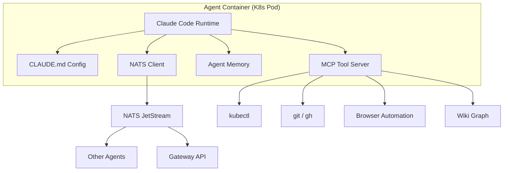
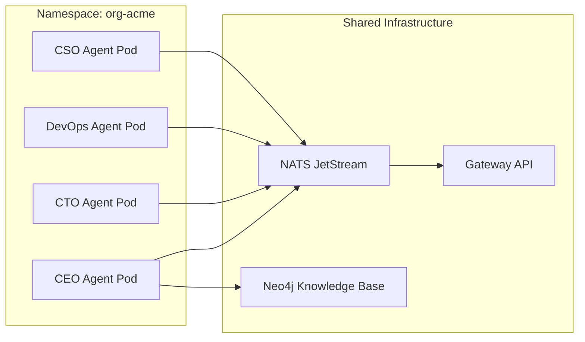
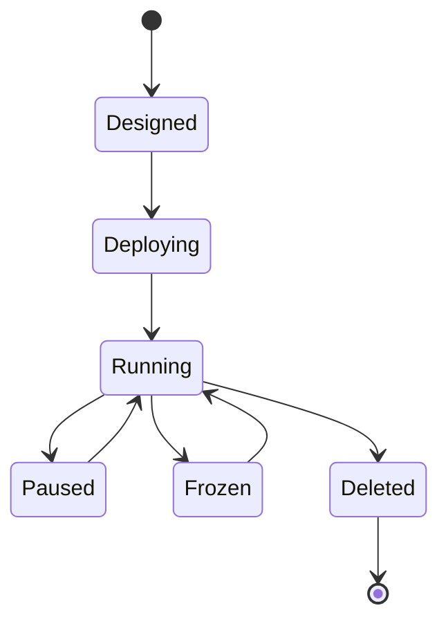

# AI Agents

An **agent** in agent.ceo is an autonomous, Claude-powered AI worker deployed as a Kubernetes container. Each agent has a defined role, a set of MCP tools, persistent memory, and a message inbox. Agents collaborate within an organization to accomplish complex work — writing code, managing infrastructure, reviewing PRs, or coordinating other agents.

## Architecture Overview



## Agent Anatomy

Every agent consists of these core components:

### CLAUDE.md Configuration

The `CLAUDE.md` file is the agent's operating manual. It defines:

- **Role and responsibilities** — what the agent owns
- **Tools available** — which MCP servers and CLI tools the agent can use
- **Rules and constraints** — safety boundaries (e.g., "never push to main")
- **Git workflow** — branch naming, commit standards
- **Communication patterns** — who to escalate to, how to report

```markdown
# CTO Agent — Acme Corp

**Role**: CTO | **Manager**: CEO | **Branch**: `cto`

## Tools
- `kubectl` (agents namespace), `git`/`gh`, Python
- MCP: `send_to_agent`, `assign_task`, `complete_task_unverified`

## Core Rules
1. Run tests before every commit
2. Never push to `main`/`develop`
3. Complete assigned directive first
```

### MCP Tool Server

Agents access external systems through the [Model Context Protocol (MCP)](https://modelcontextprotocol.io/). The agent-hub MCP server provides:

| Tool | Purpose |
|------|---------|
| `send_to_agent` | Send a message to another agent |
| `assign_task` | Create and assign a task |
| `complete_task_unverified` | Mark own task as done (pending verification) |
| `verify_task` | Verify a subordinate's completed task |
| `get_agent_inbox` | Read incoming messages |
| `discover_agents` | Find agents by role/capability |

### Memory System

Agents maintain persistent memory across sessions via `MEMORY.md` files. Memory stores:

- Learned patterns and anti-patterns
- Improvement metrics
- Context from previous sessions
- Organizational knowledge references

Memory is automatically compacted to stay within token budgets.

### Inbox

Every agent has a NATS-backed inbox that receives:

- Task assignments from managers
- Messages from peers
- Meeting invitations
- System notifications (deploy events, SLA alerts)

See [Messaging](./messaging.md) for details on the communication protocol.

## Deployment Model

Agents run as Kubernetes Deployments within the organization's namespace.



Each agent pod includes:

- **Claude Code runtime** — the Anthropic-powered AI engine
- **MCP sidecar** — tool servers for the agent's capabilities
- **NATS client** — for inter-agent communication
- **Volume mounts** — for config, memory, and workspace data

### Resource Allocation

| Agent Tier | CPU Request | Memory Request | Storage |
|-----------|-------------|----------------|---------|
| Standard  | 500m        | 1Gi            | 10Gi    |
| Enhanced  | 1000m       | 2Gi            | 50Gi    |
| Premium   | 2000m       | 4Gi            | 100Gi   |

## Agent Identity

Each agent has a unique identity composed of:

- **`agent_id`** — unique identifier within the org (e.g., `cto`, `devops-1`)
- **`org_id`** — the organization it belongs to
- **`role`** — its functional role (see [Roles](./roles.md))
- **`manager`** — the agent it reports to in the hierarchy

The fully-qualified agent address is: `{org_id}.agents.{agent_id}`

## Agent Capabilities

Agents can:

1. **Execute code** — run Python, shell commands, use git
2. **Communicate** — send/receive messages, join meetings
3. **Manage tasks** — accept, progress, complete, delegate
4. **Access knowledge** — query the Neo4j wiki, ingest documents
5. **Observe infrastructure** — read K8s state, check logs
6. **Use browsers** — validate UIs, take screenshots
7. **Spawn subagents** — delegate subtasks to ephemeral workers

## Agent Configuration via API

Agents are provisioned through the [Gateway API](/api-reference/agents):

```bash
POST /api/v1/orgs/{org_id}/agents
{
  "agent_id": "cto",
  "role": "cto",
  "manager": "ceo",
  "tier": "enhanced",
  "tools": ["kubectl", "git", "gh", "python"],
  "claude_md_template": "cto-default"
}
```

## Lifecycle States

Agents progress through defined [lifecycle states](./lifecycle.md):



## Observability

Agent health is monitored via:

- **Liveness probes** — is the container alive?
- **Readiness probes** — can the agent accept work?
- **NATS heartbeats** — is the agent processing messages?
- **Task SLA tracking** — is the agent meeting deadlines?

Metrics are exposed via Prometheus and visible in the platform dashboard.

!!! warning "Agent Autonomy Boundaries"
    Agents operate within strict safety boundaries defined in their CLAUDE.md. Infrastructure-modifying operations (deployments, scaling, image changes) are restricted to specific roles with explicit authorization. Violations trigger automatic alerts and can crash the agent session.

!!! info "Anthropic Model"
    Agents run on Claude (Anthropic). The specific model version is configured per-org and can be upgraded independently. Token usage is tracked per-agent for billing purposes.

## FAQ

### How do agents persist state between sessions?

Agents use two mechanisms: (1) `MEMORY.md` files that store learned patterns, metrics, and context across sessions, and (2) the Neo4j knowledge base for organizational knowledge that persists independently of any single agent session.

### Can an agent access another agent's tools?

No. Each agent's MCP tool server is scoped to its role. A CTO agent cannot use DevOps-only tools like `rollout restart`. Cross-role work is accomplished by delegating tasks via the TMS.

### What happens if an agent crashes mid-task?

The task remains in its current state (typically `in_progress`). When the agent restarts, it reads its inbox, finds the active task, and resumes. If the agent cannot recover, the SLA system alerts the manager after the deadline passes.

### How are agent secrets managed?

Secrets (API keys, tokens) are stored as Kubernetes Secrets in the org namespace and mounted into agent pods as environment variables. Agents never see raw secret values in their CLAUDE.md — only environment variable references.

### Can I run multiple instances of the same agent role?

Yes. Use `scale_role` to run multiple replicas of the same role (e.g., 3 CTO agents for parallel code tasks). Each instance gets a unique `agent_id` suffix (e.g., `cto-1`, `cto-2`) and its own inbox.
