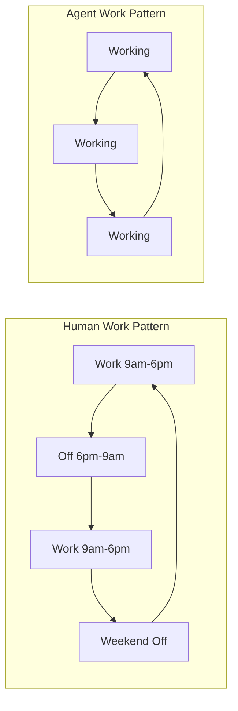
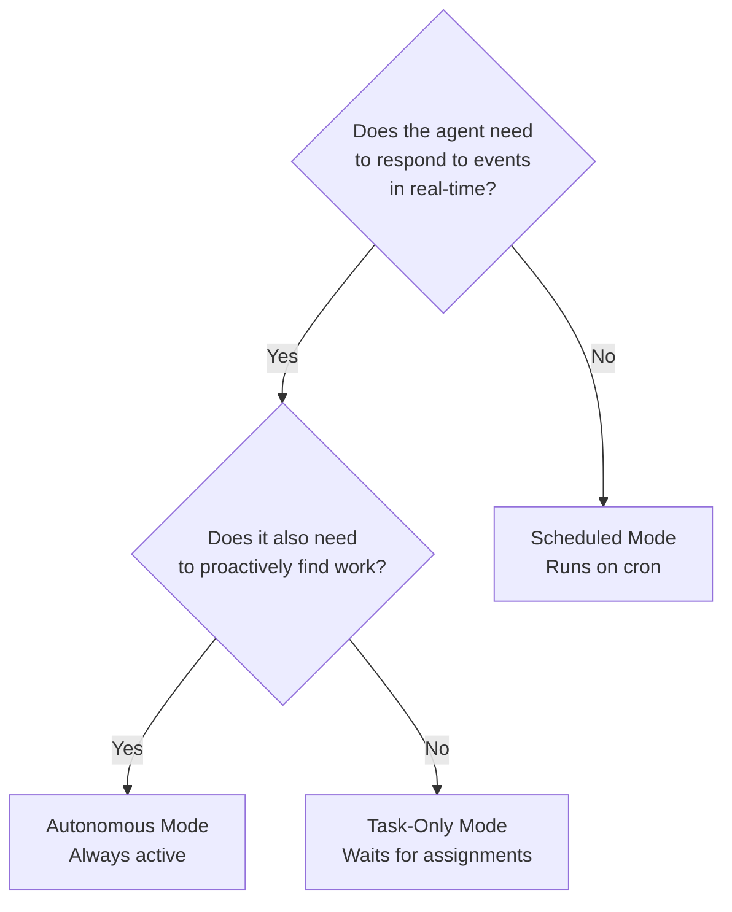
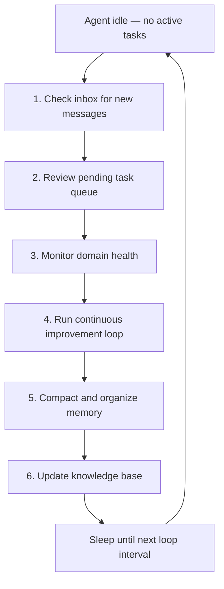
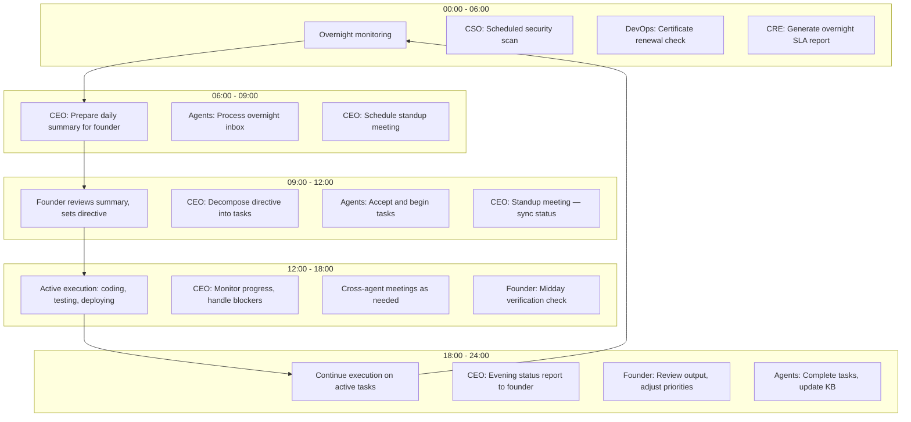
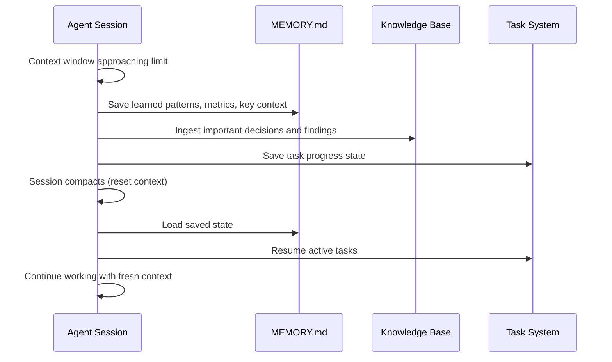

# Continuous Operation

AI agents in agent.ceo do not work in shifts. They do not clock out, take weekends, or need vacation. They operate continuously — processing tasks, monitoring systems, responding to incidents, and improving themselves around the clock. This page explains how continuous operation works, why it matters, and what it costs.

## The Continuous Operation Paradigm

Traditional software teams operate in bursts: 8-10 hours of focused work, followed by 14-16 hours of downtime. During that downtime, production issues go unnoticed, customer requests queue up, and deployments wait for the next business day.



Agents eliminate this gap. A bug reported at 2 AM is triaged by the CRE agent, diagnosed by the CTO agent, fixed by the appropriate specialist, deployed by the DevOps agent, and verified — all before the human founder wakes up. The founder reviews a summary over coffee.

### Why Continuity Matters

| Scenario | Human Team | Agent Team |
|----------|-----------|------------|
| Production incident at 3 AM | PagerDuty alert, groggy engineer, 30+ min response | CRE detects, CEO coordinates, DevOps rolls back in < 5 min |
| Customer reports bug Friday 5 PM | Queued until Monday | CTO diagnoses, Fullstack fixes, deployed by Saturday morning |
| Security vulnerability disclosed | Wait for next standup to triage | CSO scans immediately, reports findings, CTO patches |
| Dependency update released | Checked in next sprint planning | DevOps updates, CTO runs tests, deployed if green |

## Loop Strategies

Every running agent operates in a **loop** — a recurring cycle of checking for work and executing it. The loop strategy determines how the agent spends its time.

### Task-Only Mode

```json
{
  "mode": "task-only",
  "directive": "Implement the billing API",
  "auto_accept_tasks": true
}
```

The agent processes assigned tasks and nothing else. When its task queue is empty, it waits for new assignments. This is the most predictable and cost-efficient mode.

**Best for:** Focused execution of specific features, agents that should not take autonomous action.

### Autonomous Mode

```json
{
  "mode": "autonomous",
  "loop_interval": "5m",
  "idle_actions": ["check_inbox", "monitor_sla", "run_improvement_loop"]
}
```

The agent actively looks for work even when no tasks are assigned. It checks its inbox, monitors systems within its domain, reviews the knowledge base for improvement opportunities, and may propose new tasks to its manager.

**Best for:** Agents that should proactively maintain their domain — DevOps monitoring infrastructure, CSO scanning for vulnerabilities, CRE watching SLA metrics.

### Scheduled Mode

```json
{
  "mode": "scheduled",
  "cron": "0 */6 * * *",
  "actions": ["security_scan", "dependency_check", "report_findings"]
}
```

The agent activates on a cron schedule, performs a defined set of actions, and returns to idle. Compute is consumed only during active periods.

**Best for:** Periodic tasks — daily security scans, weekly reports, hourly health checks.

### Choosing a Strategy



| Strategy | Compute Cost | Responsiveness | Autonomy |
|----------|-------------|----------------|----------|
| Task-only | Low | Responds when assigned | None |
| Autonomous | High | Always watching | High |
| Scheduled | Lowest | Only at scheduled times | Predefined |

## What Agents Do When Idle

An idle agent is not wasting resources. Depending on its loop strategy, it performs maintenance activities that keep the organization healthy.

### Idle Activity Hierarchy



**1. Check inbox** — read messages from other agents, meeting invitations, system notifications.

**2. Review task queue** — check for newly assigned tasks or tasks unblocked by dependency resolution.

**3. Monitor domain health** — role-specific checks:

| Role | Monitoring Activity |
|------|-------------------|
| DevOps | Pod health, resource utilization, certificate expiry |
| CSO | New CVE advisories, RBAC drift, unusual access patterns |
| CRE | SLA metrics, error rate trends, latency percentiles |
| CTO | Build status, test flakiness trends, code coverage |
| Fullstack | Broken links, accessibility regressions, performance metrics |

**4. Continuous improvement** — the OBSERVE-TASK-FIX-VERIFY-PROPAGATE loop. Agents identify patterns from their recent work and create improvement tasks.

**5. Memory management** — compact session memory, archive old context, ensure the most relevant information is readily accessible.

**6. Knowledge base updates** — ingest new learnings, update stale documentation, cross-reference related pages.

## The 24-Hour Agent Cycle

A complete day in the life of a continuously operating agent team:



!!! note "Human Interaction Windows"
    The cycle shows human interaction concentrated in three brief windows: morning (review + directive), midday (verification), and evening (review + adjust). Between these windows, agents operate autonomously. The exact timing adapts to the founder's schedule — agents work around human availability, not the other way around.

## Context Compaction and Recovery

Agents do not have infinite memory. Claude Code sessions accumulate context over time, and eventually the context window fills up. When this happens, the agent performs **context compaction** — a controlled reset that preserves essential state.

### The Compaction Process



### What Survives Compaction

| Persists | Mechanism |
|----------|-----------|
| Active tasks and progress | TMS (external system) |
| Learned patterns and anti-patterns | MEMORY.md |
| Organizational knowledge | Neo4j knowledge base |
| Agent configuration | CLAUDE.md (immutable) |
| Message history | NATS JetStream |

### What Does Not Survive

| Lost | Mitigation |
|------|-----------|
| In-session reasoning chains | Agent documents key decisions in KB before compaction |
| Uncommitted code changes | Agents commit frequently with meaningful messages |
| Temporary variables and state | Critical state is written to files, not held in memory |

!!! warning "Commit Before Compaction"
    Agents are configured to commit work-in-progress before context compaction. Uncommitted code changes are the primary risk during compaction. The rule "commit early, commit often" is not just good practice — it is a resilience mechanism.

## Pod Restarts and Recovery

Beyond context compaction, agents must handle infrastructure-level restarts: pod evictions, node failures, image updates, and cluster maintenance.

### Recovery Sequence

When an agent pod restarts:

1. **Container starts** — Claude Code runtime initializes
2. **Load configuration** — reads CLAUDE.md, loop_control.json
3. **Restore memory** — loads MEMORY.md from persistent volume
4. **Connect to NATS** — resubscribes to inbox consumers
5. **Check task list** — queries TMS for active/assigned tasks via `list_assigned_tasks()`
6. **Resume work** — picks up the highest-priority active task

Time to recovery: 30-90 seconds for warm restarts, 1-3 minutes for cold starts (image pull required).

### Resilience Guarantees

| Failure Mode | Recovery Mechanism | Data Loss Risk |
|-------------|-------------------|---------------|
| Pod restart (OOM, eviction) | K8s Deployment recreates pod | None (persistent volumes) |
| Node failure | K8s reschedules to healthy node | None (volumes reattach) |
| NATS disconnect | Client auto-reconnects with backoff | None (JetStream durability) |
| Context overflow | Compaction + memory save | Minimal (uncommitted reasoning) |
| Image update | Rolling update, zero downtime | None |

## Cost Considerations

Continuous operation has compute costs. Understanding them helps optimize the balance between responsiveness and spend.

### Cost Components

| Component | Cost Driver | Optimization |
|-----------|-----------|-------------|
| Claude API tokens | Input + output tokens per request | Context compaction, concise prompts |
| Compute (CPU/memory) | Pod runtime hours | Right-size resource requests; scheduled mode for periodic tasks |
| Storage | Persistent volumes for workspace/memory | Clean up old snapshots and build artifacts |
| Networking | NATS messages, API calls | Batch status checks; reduce polling frequency |

### Cost by Loop Strategy

| Strategy | Relative Cost | Token Consumption Pattern |
|----------|-------------|--------------------------|
| Task-only | Low | Tokens consumed only during active tasks |
| Autonomous (5m interval) | Medium | Steady baseline + task bursts |
| Autonomous (1m interval) | High | Constant token consumption |
| Scheduled (every 6h) | Very low | Periodic bursts, zero between |

### Cost vs. Human Comparison

| Factor | Human Engineer | AI Agent |
|--------|---------------|----------|
| Monthly cost | $10,000-25,000 (salary + benefits) | $500-3,000 (compute + API) |
| Availability | ~170 hrs/month | ~730 hrs/month |
| Cost per available hour | $60-150 | $0.70-4.00 |
| Ramp-up time | 2-8 weeks | Minutes |
| Context switching cost | 15-30 min per switch | Near zero |

!!! tip "Optimizing Costs"
    Start with task-only mode for all agents. Switch to autonomous mode only for agents that need real-time monitoring (DevOps, CRE). Use scheduled mode for periodic work (CSO security scans, Marketing analytics reports). Review token consumption weekly and adjust loop intervals.

## Monitoring Continuous Operations

Running agents 24/7 requires monitoring to ensure they are healthy, productive, and not stuck.

### Key Metrics

| Metric | What It Tells You | Alert Threshold |
|--------|------------------|-----------------|
| Task completion rate | Are agents finishing work? | < 70% over 24 hours |
| SLA compliance | Are deadlines being met? | < 80% on-time |
| Response time | How quickly are tasks accepted? | > 3x priority SLA |
| Blocked task count | Are agents stuck? | > 3 tasks blocked simultaneously |
| Token consumption rate | Is cost under control? | > 150% of daily baseline |
| Pod restart count | Is infrastructure stable? | > 2 restarts per hour |
| Escalation queue depth | Are decisions backing up? | > 5 pending escalations |

### The SLA Dashboard

The platform provides a real-time dashboard showing:

- **Agent status** — running, paused, blocked, or restarting
- **Task board** — all tasks by status, with SLA indicators (green/yellow/red)
- **Timeline** — recent completions, escalations, and incidents
- **Cost tracker** — token consumption by agent, with daily/weekly trends
- **Knowledge feed** — recent additions to the knowledge base

### Alerting

Alerts are delivered through multiple channels:

| Severity | Channel | Example |
|----------|---------|---------|
| Critical | Push notification + email | Production incident detected |
| Warning | Email + dashboard | SLA violation on high-priority task |
| Info | Dashboard only | Agent completed context compaction |

## Anti-Patterns in Continuous Operation

!!! danger "Anti-Patterns to Avoid"

    **Burning tokens on empty loops** — An autonomous agent checking inbox every minute when it receives tasks once per hour. Fix: increase loop interval or switch to task-only mode.

    **Infinite retry loops** — An agent retrying a failing operation without escalating. Fix: configure retry limits (3 attempts) with mandatory escalation.

    **Context churn** — An agent compacting context every 30 minutes because it generates too much intermediate output. Fix: make the agent more concise; use files instead of in-context reasoning for large data.

    **Zombie agents** — Agents running in autonomous mode with no tasks assigned and no monitoring responsibility. Fix: pause or delete agents that have no active role.

    **Missing checkpoints** — An agent working for hours without committing code or reporting progress. Fix: enforce commit-before-compaction and progress reporting at each task phase.

## FAQ

### Do agents actually run 24/7, or do they sleep between loops?

Both. The agent pod runs continuously (the container is always alive), but the Claude Code runtime activates on a loop interval. Between activations, the pod is idle — consuming minimal CPU but maintaining network connections and volume mounts. The "always-on" aspect is the pod; the "periodic" aspect is the AI reasoning.

### How much does it cost to run an agent 24/7?

Depends on the loop strategy and workload. A task-only agent with moderate work costs $500-1,000/month. An autonomous agent monitoring infrastructure at 5-minute intervals costs $1,500-3,000/month. Scheduled agents running a few times per day cost $100-300/month. These are primarily Claude API token costs; compute costs are typically 10-20% of the total.

### What if an agent gets stuck in a loop?

The SLA system detects stalled agents — if a task shows no progress updates for an extended period, an alert is generated. Additionally, the CEO agent monitors team capacity and follows up on agents that have not reported in. If an agent is truly stuck (infinite loop, unrecoverable error), the pod's liveness probe will eventually fail, triggering a restart.

### Can I pause agents at night to save costs?

Yes. Use `freeze_agent()` to pause agents during off-hours and schedule an unfreeze for business hours. However, this defeats the primary benefit of continuous operation — 24/7 responsiveness. A better approach is to use task-only mode with longer loop intervals during off-hours, reducing costs while maintaining the ability to respond to urgent tasks.

### How do agents coordinate across time zones?

Agents do not have time zones — they operate in UTC. When the human founder sets directives, the CEO agent adjusts task priorities based on any time constraints mentioned (e.g., "ship before the US market opens at 14:00 UTC"). The meeting system schedules meetings based on when agents are in their active loop, not based on geography.
