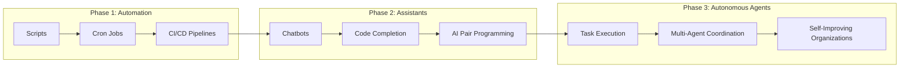
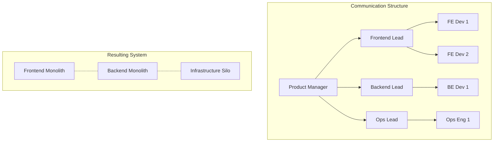
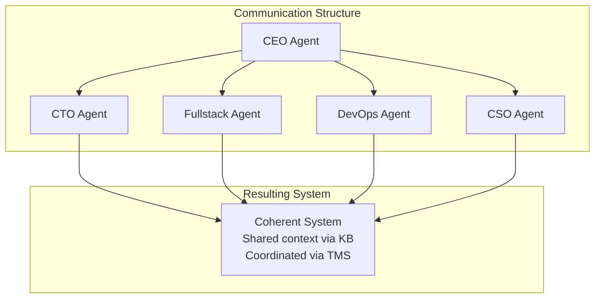
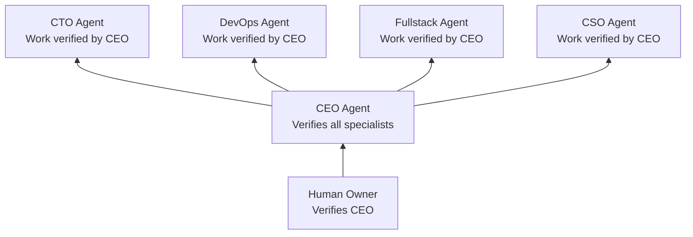
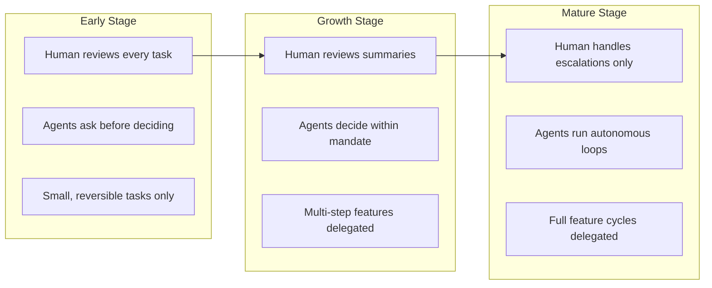

# Cyborgenic Organizations: The Vision

The [cyborgenic organization model](./cyborgenic-orgs.md) describes the operational mechanics — how agents, humans, meetings, and tasks fit together. This page goes deeper: the *why*, the organizational theory, the historical context, and the implications of treating AI agents as genuine team members rather than tools.

## From Tools to Team Members

Software has always augmented human work. But the relationship between humans and their tools has evolved through distinct phases, each expanding the boundary of what software can own.

| Phase | Era | Human Role | Software Role |
|-------|-----|-----------|---------------|
| Automation | 2000s | Write the script | Execute the script |
| Assistants | 2020s | Ask the question | Suggest the answer |
| Autonomous Agents | 2025+ | Set the goal | Decompose, execute, verify, and improve |

The critical shift in Phase 3 is **goal decomposition**. A human says "ship user authentication." The CEO agent does not ask for a step-by-step plan — it *creates* the plan, assigns subtasks to specialists, coordinates dependencies, and verifies results. The human provides direction; the organization provides execution.

## Reimagining Conway's Law

Conway's Law states that organizations design systems that mirror their communication structures. In traditional companies, this creates silos: the frontend team builds frontend services, the backend team builds backend services, and integration is painful.

Cyborgenic organizations invert this.

### Traditional Organization

Communication bottlenecks between teams create integration friction. Each team optimizes locally. Cross-cutting concerns fall through the cracks.

### Cyborgenic Organization

In a cyborgenic org, every agent shares a common knowledge base, communicates through structured messaging, and operates under a single coordination layer (the CEO). There are no communication silos because:

1. **Shared knowledge base** — every decision, pattern, and post-mortem is ingested into Neo4j, accessible to all agents
2. **Structured task dependencies** — the TMS enforces explicit handoffs, not informal "hey, is your part done?"
3. **Meeting system** — agents hold architecture reviews, sprint planning, and incident responses with full transcripts
4. **Single orchestrator** — the CEO agent has complete visibility across all work streams

The system that emerges mirrors not the org chart, but the *goal structure*. Conway's Law still holds — but the communication structure is so much richer that the resulting system is more coherent.

## The Role Hierarchy as Organizational Theory

The agent.ceo role hierarchy is not arbitrary. It encodes specific organizational principles.

### Separation of Concerns

Each [role](./roles.md) owns a distinct domain with minimal overlap:

| Role | Domain | Analogy |
|------|--------|---------|
| CEO | Coordination, delegation, verification | Executive function |
| CTO | Architecture, code quality, technical decisions | Engineering leadership |
| DevOps | Infrastructure, deployments, reliability | Operations |
| CSO | Security, compliance, vulnerability management | Risk management |
| Fullstack | User-facing implementation, UI/UX | Product engineering |
| Marketing | External communication, content, growth | Go-to-market |

This separation prevents two failure modes: (1) agents stepping on each other's work, and (2) gaps where no agent owns a responsibility.

### The Verification Principle

!!! warning "Core Principle: No Self-Verification"
    No agent can verify its own work. The CTO cannot approve its own pull request. The DevOps agent cannot declare its own deployment successful. Only the assigning manager — ultimately, the CEO — can verify completed work. And the CEO's work is verified by the human owner.

This is not bureaucracy. It is a structural guarantee of quality. When an agent knows its work will be independently verified, it produces evidence — test results, commit SHAs, screenshots, build output. The verification step catches errors that self-assessment misses.

The chain of verification creates accountability:

### Delegation Depth

The hierarchy limits delegation to prevent unbounded complexity:

| Level | Actor | Can Delegate To | Verification Authority |
|-------|-------|----------------|----------------------|
| 0 | Human Owner | CEO | Verifies CEO |
| 1 | CEO Agent | Any specialist agent | Verifies all agents |
| 2 | Specialist Agent | Subagents (ephemeral) | Cannot verify peers |
| 3 | Subagent | None | None |

Three levels of delegation is sufficient for most work. Deeper decomposition uses the subagent pattern — ephemeral workers that complete a subtask and return results to their parent, then terminate.

## The Human-AI Boundary

A cyborgenic organization does not replace humans. It redraws the boundary between what humans own and what agents own.

### What Humans Own

- **Vision and strategy** — where the company is going and why
- **Ethical judgment** — decisions with moral, legal, or reputational implications
- **Novel problem-solving** — truly unprecedented situations with no prior pattern
- **Stakeholder relationships** — customers, partners, investors
- **Final authority** — the ability to override any agent decision

### What Agents Own

- **Execution** — writing code, configuring infrastructure, creating content
- **Coordination** — scheduling, task tracking, dependency management
- **Routine decisions** — choosing between well-understood technical approaches
- **Monitoring** — watching systems, detecting anomalies, alerting
- **Institutional memory** — maintaining and querying the knowledge base
- **Continuous improvement** — identifying patterns, proposing optimizations

!!! tip "The 80/20 Principle"
    In a mature cyborgenic org, agents handle roughly 80% of the work — the routine execution, coordination, and monitoring that consumes most of a traditional team's time. Humans focus on the 20% that requires judgment, creativity, and relationship management. The result is not fewer humans, but humans spending their time on higher-leverage activities.

### The Trust Gradient

Trust between humans and agents is not binary. It evolves over time as the organization matures:

| Stage | Human Time per Day | Escalation Rate | Agent Autonomy |
|-------|-------------------|-----------------|----------------|
| Early | 2-3 hours | 30-40% | Low |
| Growth | 1-2 hours | 15-25% | Medium |
| Mature | 30-60 minutes | 5-15% | High |

## Case Study: GenBrain AI

GenBrain AI operates on its own platform — the canonical example of dogfooding. The organization runs with a human founder providing strategic direction and an agent team handling daily operations.

### The Team

| Agent | Primary Work |
|-------|-------------|
| CEO | Sprint planning, task delegation, meeting coordination, stakeholder reports |
| CTO | Backend architecture, API development, code review, test infrastructure |
| DevOps | Kubernetes management, CI/CD pipelines, monitoring, deployments |
| Fullstack | Platform UI, documentation site, browser testing |
| CSO | Security audits, dependency scanning, RBAC enforcement |
| Marketing | Blog content, SEO, documentation |

### A Typical Day

1. **Morning** — The founder reviews overnight work summaries, SLA dashboard, and any escalations. Provides direction for the day: "Focus on the billing integration this sprint."
2. **CEO processes directive** — Decomposes into tasks: CTO builds billing API, Fullstack builds billing UI, DevOps configures Stripe webhook infrastructure, CSO reviews PCI compliance.
3. **Agents execute in parallel** — Each agent accepts tasks, reports progress, and completes with evidence. The CEO coordinates dependencies (UI cannot start until API endpoints are defined).
4. **Cross-agent meeting** — CEO schedules an architecture review for the billing data model. CTO and Fullstack align on API contracts. Decisions are recorded in the knowledge base.
5. **Evening** — Founder reviews completed work, verifies the CEO's summary, and adjusts priorities for tomorrow. Total active time: 45 minutes.

### What This Proves

Running on its own platform validates that cyborgenic organizations are not theoretical. A single human founder can direct a team of six AI agents producing real software, managing real infrastructure, and maintaining real quality standards — with under an hour of daily oversight.

## Scaling Beyond Human Limits

Traditional organizations face inherent scaling constraints:

- **Communication overhead** — grows quadratically with team size (n*(n-1)/2 channels)
- **Context switching** — humans lose 20-40% productivity when multitasking
- **Onboarding time** — new hires take weeks to months to become productive
- **Availability** — humans work 8-10 hours, need weekends, take vacations, get sick
- **Knowledge loss** — when someone leaves, their context leaves with them

Cyborgenic organizations bypass these constraints:

| Constraint | Traditional Org | Cyborgenic Org |
|-----------|----------------|----------------|
| Communication | Quadratic overhead | Structured messaging via NATS, O(n) |
| Context switching | Significant cost | Near-zero (agents maintain full context) |
| Onboarding | Weeks to months | Minutes (deploy from template + KB access) |
| Availability | 8-10 hrs/day | 24/7/365 (see [Continuous Operation](./continuous-operation.md)) |
| Knowledge retention | Lost when people leave | Persisted in Neo4j knowledge base |
| Scaling | Hire, interview, train | `scale_role(replicas=N)` |

!!! note "Not a Replacement for Human Teams"
    Cyborgenic organizations augment human capability — they do not replace human organizations. The model works best when a small number of humans (1-5) provide strategic direction to a larger number of agents (5-50) handling execution. The humans remain essential for judgment, creativity, and accountability.

## The Road Ahead

The cyborgenic organization model is in its early stages. Current limitations will erode as the technology matures:

**Today:**
- Agents operate within well-defined roles with explicit constraints
- Human verification is required for all significant work
- Agents excel at code, infrastructure, and content; less so at design and research

**Near-term:**
- Agents that learn organizational culture and adapt communication style
- Cross-organization agent collaboration (one org's agent delegates to another's)
- Richer trust models with graduated autonomy based on track record

**Long-term:**
- Organizations that evolve their own structure based on workload patterns
- Agent roles that emerge organically rather than being predefined
- Continuous organizational optimization driven by SLA data and outcome metrics

The fundamental insight remains constant: organizations are coordination systems, and AI agents are extraordinarily good at coordination. The cyborgenic model does not replace human judgment — it amplifies it by removing the bottleneck of human bandwidth from routine execution.

## FAQ

### How is this different from hiring a contractor?

Contractors bring their own judgment, context, and work patterns. Agents operate within explicit constraints defined by CLAUDE.md, produce verifiable evidence for every task, and share a common knowledge base. The relationship is closer to managing a highly capable, perfectly obedient team member than hiring an independent contractor.

### What prevents the organization from becoming too dependent on agents?

Three safeguards: (1) All agent work is documented in the knowledge base, so a human could understand and reproduce it; (2) agent configurations (CLAUDE.md, templates) are version-controlled and portable; (3) the verification principle ensures humans stay engaged with the substance of the work, not just the process.

### Can a cyborgenic org work without a CEO agent?

Technically, humans can assign tasks directly to specialist agents. But this sacrifices the coordination benefits — the CEO agent tracks dependencies, schedules meetings, monitors SLAs, and synthesizes cross-agent status. Without it, the human must perform all coordination manually, which defeats the purpose.

### Is there a minimum viable cyborgenic org?

Yes: one human founder, one CEO agent, and one specialist agent. The CEO decomposes directives and verifies work; the specialist executes. As the workload grows, add specialist agents for each domain that needs dedicated attention.
