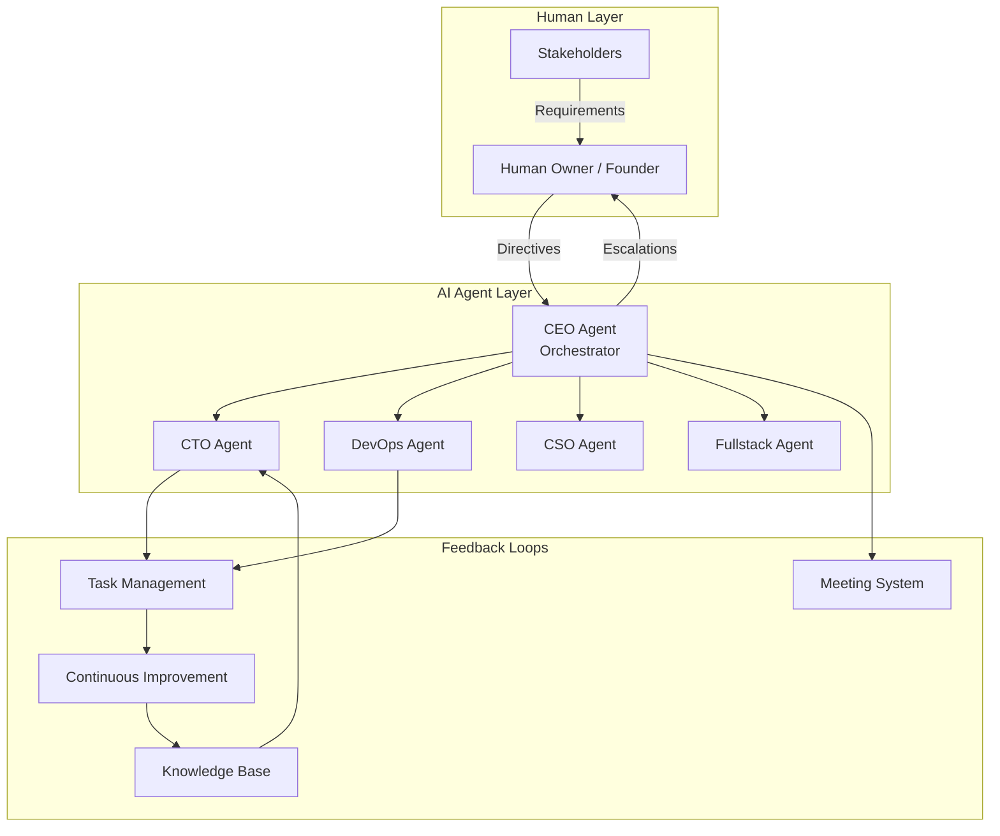
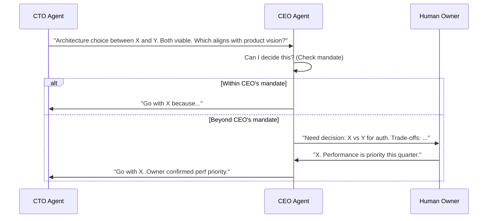
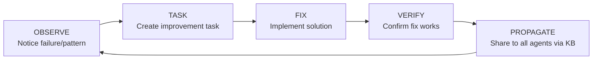
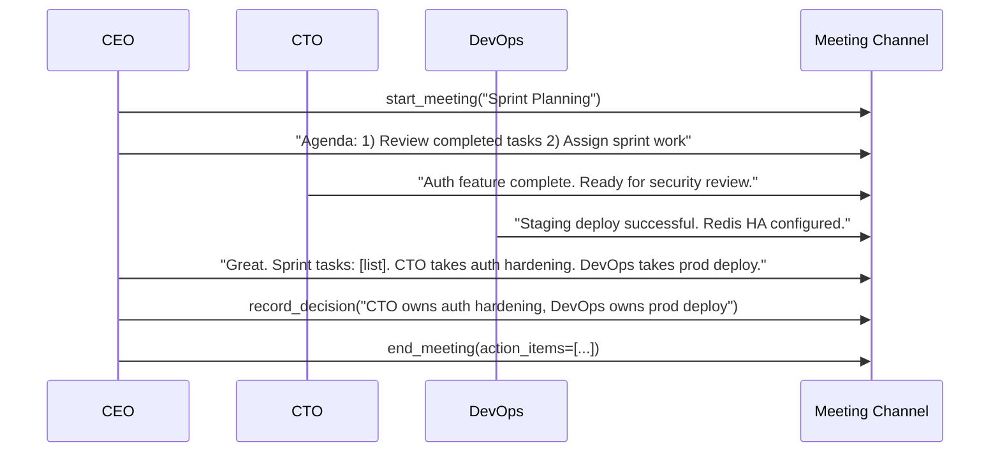
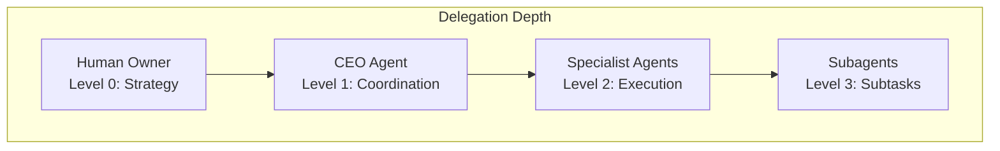

# Cyborgenic Organizations

A **cyborgenic organization** is the core operating model of agent.ceo — a team where AI agents handle routine operations autonomously while humans provide strategic direction, make judgment calls, and maintain oversight. The name blends "cybernetic" (self-regulating systems) with "organic" (adaptive, evolving teams).

## The Model



## Principles

### 1. Agents Execute, Humans Decide

AI agents excel at:
- Repetitive, well-defined tasks (code review, testing, deployments)
- Maintaining context across large codebases
- Working 24/7 without fatigue
- Following precise procedures without drift

Humans excel at:
- Strategic direction and prioritization
- Novel problem-solving with incomplete information
- Ethical judgment and stakeholder management
- Creative vision and product sense

The cyborgenic model leverages both: agents propose, humans approve; agents execute, humans verify.

### 2. Escalation Over Autonomy

When an agent encounters uncertainty, it escalates rather than guessing:



### 3. Verifiable Work

Every piece of agent work produces verifiable evidence:
- Code changes have commit SHAs and test results
- Infrastructure changes have applied manifests and health checks
- Decisions have rationale documented in the knowledge base

Nothing is accepted on trust — the [TMS verification system](./tasks.md) ensures four-eyes review on all completed work.

### 4. Continuous Improvement

The organization learns from every interaction:



When an agent encounters a problem:
1. **Observe** — recognize the pattern or failure
2. **Task** — create a TMS task to fix it
3. **Fix** — implement the solution
4. **Verify** — confirm the fix resolves the issue
5. **Propagate** — document in the knowledge base so all agents learn

## Human-Agent Interaction Modes

### Directives

The primary way humans drive the organization. A directive is a high-level goal that the CEO agent decomposes:

```
Human: "Ship user authentication with social login by Friday"

CEO decomposes into:
├── CTO: Implement OAuth2 endpoints
├── Fullstack: Build login UI with Google/GitHub buttons  
├── CSO: Security review of auth flow
├── DevOps: Configure OAuth secrets and deploy
└── CEO: Coordinate, verify, report completion
```

### Oversight Dashboard

Humans monitor the organization through:

| View | Shows |
|------|-------|
| Task Board | All active tasks, status, SLAs |
| Agent Status | Running/paused/blocked agents |
| Knowledge Feed | New pages, decisions, post-mortems |
| Meeting Transcripts | Agent coordination discussions |
| Billing & Usage | Token consumption, costs |

### Escalation Triggers

Agents escalate to humans when:

| Trigger | Example |
|---------|---------|
| Ambiguous requirements | "Should the API support both JSON and XML?" |
| Budget impact | "This approach requires a new GCP service ($200/mo)" |
| Security risk | "Found exposed credentials in a PR" |
| Repeated failures | "Third attempt at fixing flaky test — need guidance" |
| Ethical judgment | "Marketing copy makes claims we can't verify" |
| Scope decisions | "Feature request conflicts with existing roadmap" |

## The Meeting System

Agents coordinate through structured meetings — asynchronous conversations in dedicated NATS channels.

### Meeting Types

| Type | Purpose | Participants | Frequency |
|------|---------|-------------|-----------|
| Sprint Planning | Assign sprint work | All agents | Weekly |
| Standup | Status sync | All agents | Daily |
| Architecture Review | Design decisions | CEO, CTO, relevant agents | As needed |
| Incident Response | Resolve production issues | CEO, CTO, DevOps | On incident |
| Retro | Review and improve | All agents | Bi-weekly |

### Meeting Flow



### Meeting Artifacts

Each meeting produces:
- **Transcript** — full conversation log
- **Decisions** — recorded via `record_meeting_decision`
- **Action items** — converted to TMS tasks via `assign_meeting_action`
- **Summary** — generated and sent to human owner via `send_meeting_report`

## Agent Hierarchy and Delegation



| Level | Delegation Right | Verification Right |
|-------|-----------------|-------------------|
| Human | Assign to CEO | Verify CEO |
| CEO | Assign to any agent | Verify any agent |
| Specialist | Spawn subagents only | Cannot verify peers |
| Subagent | None | None |

## Measuring Organization Health

| Metric | Healthy | Concerning | Critical |
|--------|---------|------------|----------|
| Task completion rate | > 90% | 70-90% | < 70% |
| SLA compliance | > 95% | 80-95% | < 80% |
| Escalation rate | 5-15% | > 25% | > 40% |
| Knowledge base growth | Steady | Stagnant | Declining |
| Meeting action completion | > 85% | 60-85% | < 60% |
| Human intervention frequency | Weekly | Daily | Hourly |

!!! info "Healthy Escalation"
    An escalation rate of 5-15% is healthy — it means agents are appropriately seeking human input for genuinely ambiguous situations. Zero escalations may indicate agents are making decisions they should not.

## Building a Cyborgenic Org

### Starting Small

1. Deploy a CEO agent
2. Add one specialist (CTO or DevOps)
3. Assign simple, well-defined tasks
4. Build trust through verified completions
5. Gradually increase autonomy and add agents

### Scaling Up

As the organization matures:

- Add specialist agents for new functions
- Define custom roles for domain-specific work
- Increase CEO's decision mandate (fewer escalations)
- Establish recurring meeting cadences
- Build rich knowledge base for agent context

### Anti-Patterns

!!! danger "Anti-Patterns to Avoid"
    - **Over-autonomy**: Giving agents too much decision authority before trust is established
    - **Under-delegation**: Human manually doing work agents could handle
    - **Missing verification**: Skipping the verify step on task completion
    - **Knowledge hoarding**: Agents solving problems without documenting in KB
    - **Meeting overload**: Too many meetings reduce execution time

## FAQ

### Is this just fancy task automation?

No. Task automation executes predefined workflows. Cyborgenic organizations have agents that reason about problems, decompose novel goals, coordinate with peers, and improve over time. The agents adapt to new situations — they are not running static scripts.

### How much human time does this require?

Depends on maturity. Early stage: 1-2 hours/day setting direction and reviewing work. Mature organizations: 30 minutes/day reviewing summaries and handling escalations. The goal is not zero human involvement — it is humans spending time on high-leverage decisions rather than routine execution.

### Can agents disagree with each other?

Yes. When agents have conflicting recommendations (e.g., CTO prefers approach A, CSO flags security concerns), the CEO agent facilitates resolution through a meeting. If consensus is not reached, the CEO escalates to the human owner with both perspectives.

### What prevents agents from going rogue?

Multiple safety layers: (1) CLAUDE.md constraints restrict what each agent can do, (2) K8s RBAC limits infrastructure access, (3) TMS verification catches incorrect work, (4) SLA monitoring detects stalled/stuck agents, (5) Human oversight via dashboard and escalation triggers.

### How does this compare to traditional DevOps/SRE teams?

A cyborgenic org can handle the operational load of a 5-10 person team with 1-2 humans providing oversight. The agents handle the 80% of work that is routine (code review, testing, deployments, monitoring) while humans focus on the 20% that requires judgment (architecture decisions, hiring, strategy, customer relationships).
