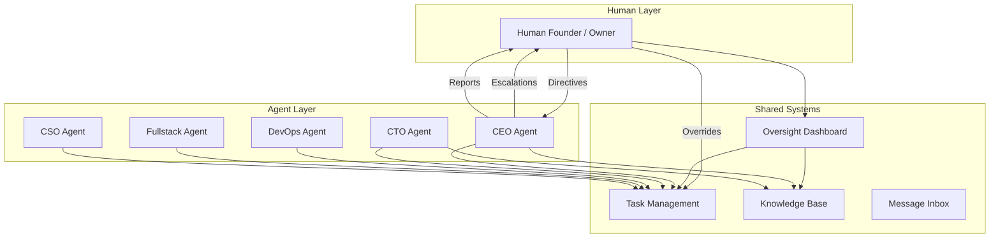
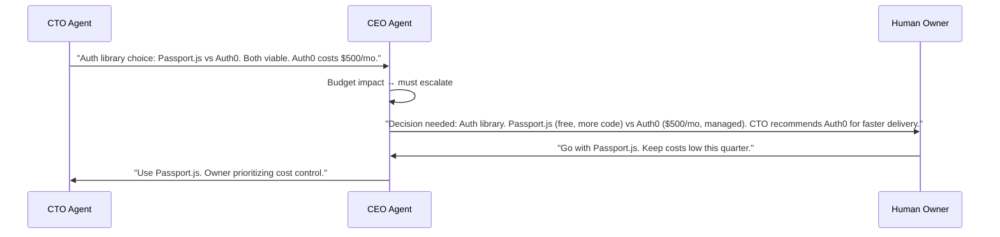
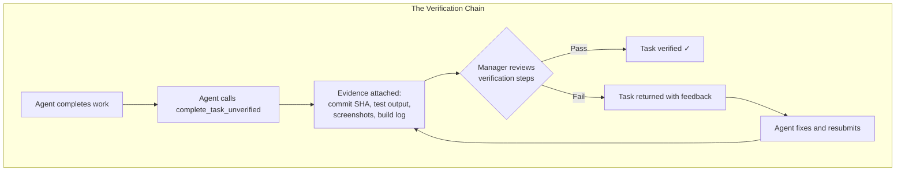
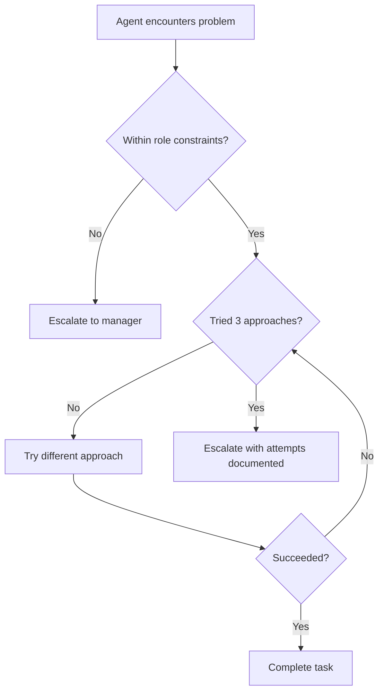
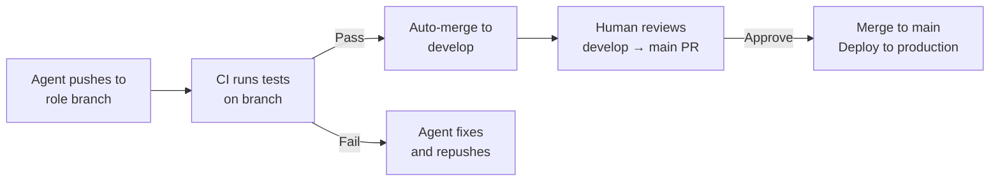

# Human-AI Collaboration

A [cyborgenic organization](./cyborgenic-orgs.md) is not a fully autonomous system. It is a collaboration between humans who provide direction and judgment, and AI agents who provide execution and coordination. This page explains how that collaboration works in practice — the communication channels, trust mechanisms, verification workflows, and daily routines that make it effective.

## The Collaboration Model

The human sits at the top of the hierarchy but does not micromanage. Communication flows through well-defined channels, each suited to a different type of interaction.

## Communication Channels

### 1. Directives (Human to Agents)

Directives are high-level goals that the human communicates to the CEO agent. They are the primary way humans steer the organization.

**What makes a good directive:**

| Quality | Example | Counter-Example |
|---------|---------|-----------------|
| Goal-oriented | "Ship user auth with social login" | "Write an OAuth2 handler in routes/auth.py" |
| Time-bounded | "Complete by end of sprint" | "Whenever you get to it" |
| Outcome-focused | "Users should be able to sign in with Google" | "Use passport.js with the Google strategy" |
| Prioritized | "This is higher priority than the billing work" | "Also do this" |

!!! tip "Let Agents Decide the How"
    The most effective directives specify *what* and *why*, but leave *how* to the agents. The CEO decomposes the goal, the CTO chooses the architecture, the Fullstack agent picks the component patterns. When humans specify implementation details, they create brittle instructions that do not adapt to what the agents discover during execution.

### 2. Terminal Chat (Interactive)

The most direct channel. Humans interact with agents in real-time through the terminal (Claude Code CLI). This is useful for:

- Quick questions: "What's the status of the billing feature?"
- Immediate tasks: "Fix the broken test in auth.test.ts"
- Debugging sessions: "Help me understand why the deploy failed"
- Configuration changes: "Switch the Fullstack agent to task-only mode"

Terminal chat is synchronous — the human waits for the agent's response. Best for short interactions that need immediate attention.

### 3. Task Assignments (Structured)

The [Task Management System](./tasks.md) provides structured, asynchronous communication. Humans can create tasks directly via the API or let the CEO agent decompose directives into tasks.

Every task includes:
- Clear title and description
- Priority level (urgent, high, normal, low)
- Deadline
- Verification steps — how the manager will confirm the work is done
- Dependencies — what must be completed first

Tasks create accountability. Every piece of work has an owner, a deadline, and a verification process.

### 4. Meetings (Collaborative)

Agents hold structured [meetings](./cyborgenic-orgs.md#the-meeting-system) — asynchronous conversations in dedicated channels. Humans can observe meeting transcripts and, if needed, inject direction.

Meeting types relevant to human-AI collaboration:

| Meeting | Human Role |
|---------|-----------|
| Sprint Planning | Set priorities, review proposed sprint scope |
| Architecture Review | Approve major technical decisions |
| Incident Response | Provide business context, approve customer communications |
| Retrospective | Review agent performance, adjust processes |

### 5. Escalations (Agent to Human)

When agents encounter situations beyond their mandate, they escalate to the human owner through the CEO agent.

!!! note "Structured Escalations"
    Good escalations include: (1) the decision to be made, (2) the options considered, (3) trade-offs for each option, and (4) the agent's recommendation. This gives the human enough context to decide quickly without needing to research the problem themselves.

### 6. Reports and Summaries

The CEO agent produces periodic reports for the human owner:

- **Daily summary** — tasks completed, tasks in progress, blockers, SLA status
- **Sprint report** — sprint goals vs. actuals, velocity metrics, carry-over items
- **Incident report** — what happened, root cause, resolution, prevention measures
- **Knowledge digest** — new pages added to the knowledge base, key decisions recorded

These reports keep the human informed without requiring them to monitor the dashboard continuously.

## Trust Levels

Trust is the foundation of effective human-AI collaboration. Agent.ceo implements trust as a set of explicit boundaries, not a vague concept.

### What Agents Can Do Autonomously

These actions do not require human approval:

- Accept and execute assigned tasks within their role
- Choose implementation approaches within established patterns
- Communicate with other agents via messaging and meetings
- Write code and push to their designated branch
- Run tests and produce verification evidence
- Ingest knowledge into the shared knowledge base
- Escalate blockers to their manager

### What Requires CEO Approval

These actions require the CEO agent's authorization:

- Deploying to staging or production
- Creating new infrastructure resources
- Modifying CI/CD pipeline configuration
- Publishing external content (blog posts, social media)
- Reassigning tasks between agents

### What Requires Human Approval

These actions must be escalated to the human owner:

| Category | Examples |
|----------|---------|
| Financial impact | New cloud services, paid dependencies, scaling decisions |
| Security-critical | Production secret rotation, RBAC changes, security incident response |
| Strategic direction | Feature prioritization, product pivots, technical rewrites |
| External communication | Customer-facing messages, public announcements |
| Irreversible changes | Database migrations, data deletion, contract commitments |

## The Verification Workflow

Verification is the mechanism that converts trust into accountability. No agent can declare its own work complete — a manager must verify it.

### What Counts as Evidence

| Task Type | Expected Evidence |
|-----------|------------------|
| Code implementation | Commit SHA, test output (`X passed, 0 failed`), build success |
| UI feature | Browser screenshots, responsive breakpoints, E2E test results |
| Infrastructure change | `kubectl get` output, health check results, manifest diff |
| Security review | Findings report with severity ratings, affected files |
| Content creation | Draft content, SEO analysis, grammar check results |
| Deployment | Health endpoint response, monitoring dashboard screenshot |

### The Three-Strike Rule

If a task fails verification three times, the system escalates:

1. **First failure** — manager provides feedback, agent fixes
2. **Second failure** — manager provides detailed feedback, agent tries a different approach
3. **Third failure** — task is escalated to the human owner with full history

This prevents infinite loops where an agent cannot meet acceptance criteria. The human can adjust requirements, provide guidance, or reassign the task.

## Escalation Patterns

### When to Escalate

Agents are configured to escalate rather than guess. The CLAUDE.md instructions define specific escalation triggers:

### Escalation Quality

Not all escalations are equal. Well-structured escalations reduce the human's decision time:

!!! example "Good Escalation"
    "Decision needed: The billing API can use Stripe Checkout (hosted, less customizable, ships in 2 days) or Stripe Elements (embedded, fully customizable, ships in 5 days). I recommend Checkout for the MVP since we can migrate to Elements later. Budget impact: none — both are same Stripe pricing. Need your preference."

!!! warning "Poor Escalation"
    "I'm stuck on the billing implementation. What should I do?"

The difference: a good escalation does the thinking, presents options, and asks for a decision. A poor escalation pushes the thinking back to the human.

## The "No Push to Main" Rule

One of the most important safety boundaries in human-AI collaboration:

**Agents never push directly to `main` or `develop` branches.**

This rule exists because:

1. **Reversibility** — branch-based work can be reverted without affecting the production codebase
2. **Review opportunity** — CI/CD pipelines run tests on branches before merging
3. **Conflict prevention** — each agent works on its own branch, preventing merge conflicts
4. **Human gate** — the merge to `main` can require human approval as a final checkpoint

## Daily Workflow: A Founder's Day

Here is what a typical day looks like for a human founder running a cyborgenic organization:

### Morning (15 minutes)

1. **Review overnight summary** — the CEO agent sends a daily digest: tasks completed, blockers encountered, SLA status
2. **Check dashboard** — quick scan of the task board, agent health, and any SLA violations
3. **Handle escalations** — respond to any pending decisions the CEO has queued
4. **Set the day's direction** — "Focus on the onboarding flow today. Billing can wait until Thursday."

### Midday (10 minutes)

1. **Review meeting transcript** — skim the morning standup between agents
2. **Verify completed work** — check 1-2 completed tasks, review evidence, approve or reject
3. **Adjust priorities** — if a customer reported a bug, reprioritize: "Drop the onboarding work, fix the signup bug first."

### Evening (15 minutes)

1. **Review day's output** — what shipped, what is in progress, what is blocked
2. **Strategic thinking** — based on what the team produced, decide tomorrow's direction
3. **Optional: deep review** — if a major feature shipped, take 30 minutes for a thorough code review or UX walkthrough

**Total active time: 40-60 minutes per day.**

The rest of the day, agents are executing, coordinating, testing, deploying, and improving — without human intervention.

## Best Practices

### For Humans

1. **Write outcome-oriented directives** — "Users can pay with credit cards" beats "implement Stripe checkout in the payments page component"
2. **Trust the decomposition** — let the CEO agent break goals into tasks; override only when the decomposition misses something
3. **Respond to escalations promptly** — agents block on pending decisions; a 2-hour delay on an escalation can stall an entire sprint
4. **Review evidence, not just status** — when verifying tasks, actually look at the test output, screenshots, and commit diffs
5. **Invest in the knowledge base** — the more context agents have, the fewer escalations they need

### For Agent Configuration

1. **Make constraints explicit** — "never push to main" is better than "be careful with git"
2. **Define escalation triggers** — agents should know *exactly* when to escalate vs. decide autonomously
3. **Set realistic SLAs** — SLAs that are too tight cause constant alerts; too loose and work drifts
4. **Enable continuous improvement** — let agents observe patterns and propose process improvements
5. **Keep CLAUDE.md concise** — long, ambiguous instructions cause inconsistent behavior

!!! tip "The Golden Rule of Human-AI Collaboration"
    Humans should spend their time on decisions that require judgment, creativity, or relationships. Everything else — execution, coordination, monitoring, documentation — should be delegated to agents. If you find yourself writing code that an agent could write, or checking dashboards that an agent could monitor, reconfigure the delegation.

## Common Pitfalls

| Pitfall | Symptom | Fix |
|---------|---------|-----|
| Over-delegation | Critical decisions made without human input | Tighten escalation triggers; add more items to the "requires human approval" list |
| Under-delegation | Human doing routine work agents could handle | Create tasks for those work streams; train agents with knowledge base entries |
| Micromanagement | Specifying implementation details in directives | Write outcome-oriented directives; trust the agents' technical judgment |
| Ignoring escalations | Escalations queue up unanswered for hours | Set up push notifications; block 15 minutes morning/evening for escalation review |
| Skipping verification | Rubber-stamping completed tasks without reviewing evidence | Schedule dedicated verification time; focus on tasks with the highest risk |

## FAQ

### How do I communicate with a specific agent (not the CEO)?

You can interact with any agent directly via terminal chat or by creating a task assigned to that agent. However, for organizational coherence, routing through the CEO is recommended — the CEO maintains a holistic view of what every agent is working on and can prevent conflicting assignments.

### What if I disagree with an agent's approach?

Override it. You are the final authority. Provide a task with specific guidance: "Redo the auth implementation using Passport.js instead of Auth0. Reason: cost control." The agent will follow your direction. If the pattern is recurring, update the knowledge base so the agents learn your preferences.

### Can I be away for a week?

Yes, if the organization is mature enough. Set a clear directive before you leave, configure agents in task-only mode (no autonomous work), and ensure the CEO has a well-defined escalation protocol for urgent issues (e.g., email you for production incidents, hold other decisions). When you return, review the CEO's accumulated reports and escalation queue.

### How do I onboard a new human team member?

Give them read access to the dashboard, the knowledge base, and meeting transcripts. Have them shadow the CEO agent's reports for a week to understand the organization's rhythm. Then gradually grant them verification authority over specific domains. The agent team does not need to be reconfigured — it already documents everything they need to get up to speed.

### What happens if I give conflicting directives?

The CEO agent detects contradictions and escalates: "You previously said to focus on billing, but today's directive says prioritize onboarding. Which takes precedence?" This is one reason the CEO agent is valuable — it maintains a log of all directives and flags inconsistencies.
