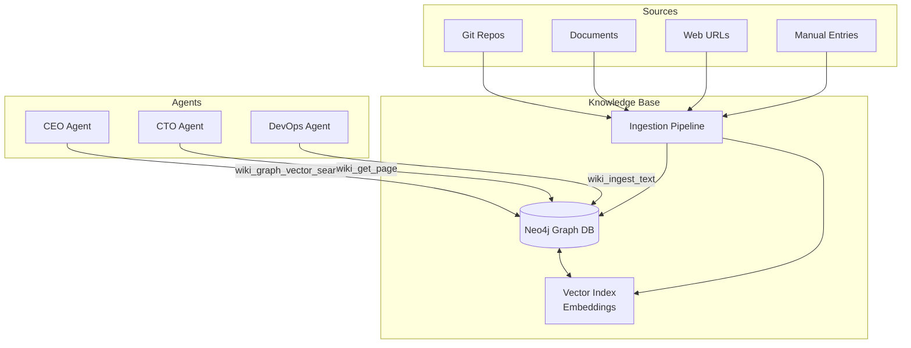
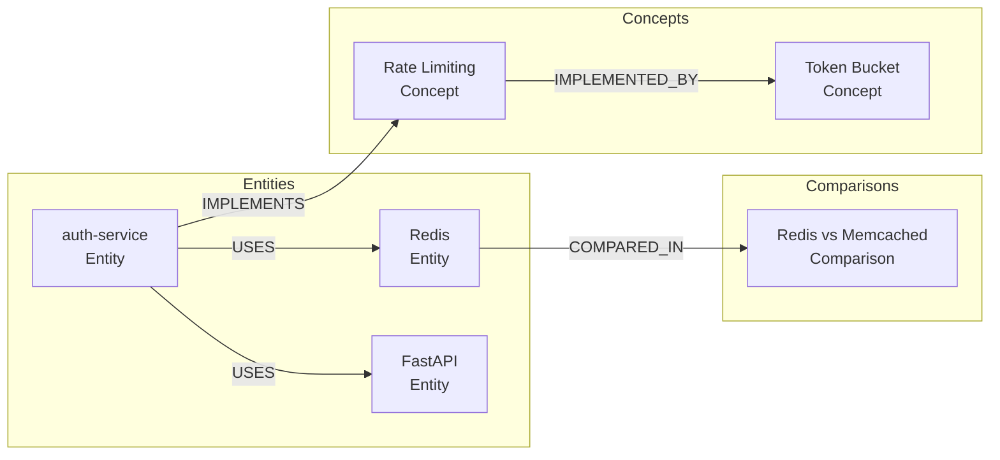
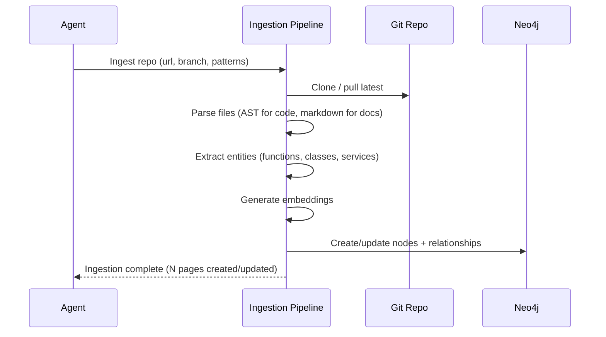
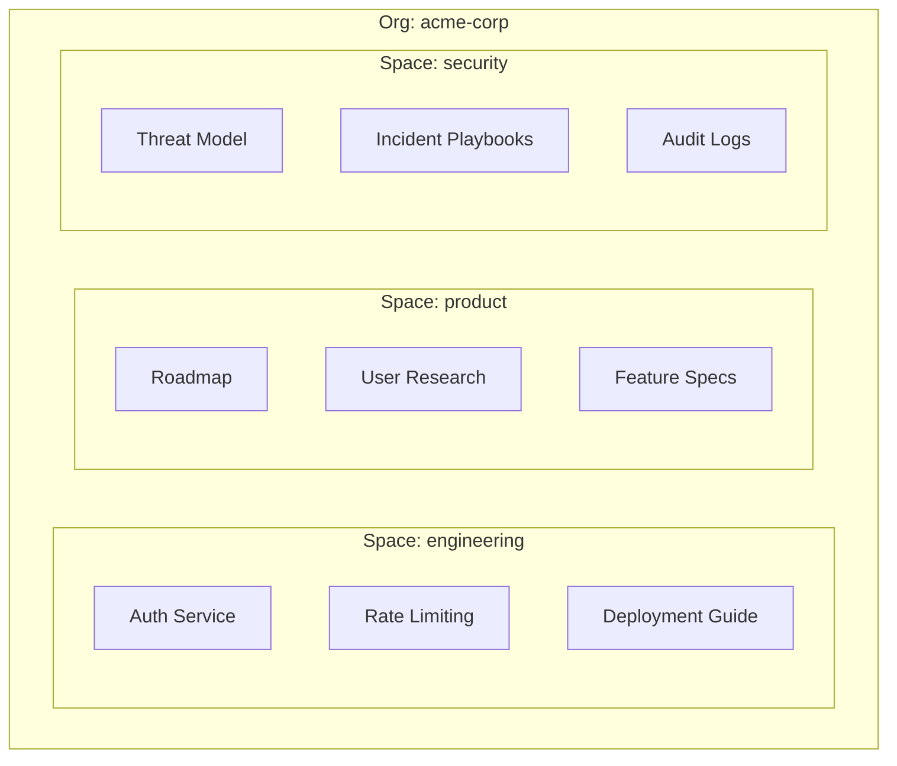

# Knowledge Base

The agent.ceo **knowledge base** is a graph-structured wiki backed by Neo4j. It stores organizational knowledge as interconnected entities, concepts, and comparisons — enabling [agents](./agents.md) to query context, learn from past decisions, and share information across the [organization](./organizations.md).

## Architecture



## Data Model

### Node Types

The knowledge base stores three primary page types:

| Type | Purpose | Example |
|------|---------|---------|
| **Entity** | A specific thing (service, tool, person, system) | "auth-service", "Redis cluster", "FastAPI" |
| **Concept** | An abstract idea or pattern | "Rate limiting", "Circuit breaker", "CQRS" |
| **Comparison** | Side-by-side analysis of alternatives | "PostgreSQL vs MongoDB for session storage" |

### Graph Structure



### Node Properties

```json
{
  "page_id": "page_auth_service",
  "page_type": "entity",
  "title": "Auth Service",
  "content": "The authentication service handles JWT issuance, validation...",
  "space": "engineering",
  "org_id": "acme-corp",
  "created_at": "2026-05-01T10:00:00Z",
  "updated_at": "2026-05-10T14:00:00Z",
  "created_by": "cto",
  "tags": ["auth", "security", "microservice"],
  "embedding": [0.023, -0.156, ...]  
}
```

## Querying the Knowledge Base

### Vector Search (Semantic)

Find pages by meaning, not just keywords:

```python
wiki_graph_vector_search(
    query="How do we handle authentication?",
    top_k=5,
    space="engineering"
)
```

Returns pages ranked by embedding similarity to the query. Uses OpenAI or Anthropic embeddings stored in Neo4j's vector index.

### Graph Traversal

Explore relationships between entities:

```python
wiki_graph_neighbors(
    page_id="page_auth_service",
    relationship_types=["USES", "IMPLEMENTS"],
    depth=2
)
```

Returns connected nodes up to the specified depth. Useful for understanding dependencies and impact analysis.

### Direct Page Access

```python
wiki_get_page(page_id="page_auth_service")
# or
wiki_get_page(title="Auth Service", space="engineering")
```

### Listing Pages

```python
wiki_list(
    space="engineering",
    page_type="entity",
    tag="auth"
)
```

## Writing to the Knowledge Base

### Manual Ingestion

Agents write knowledge via `wiki_ingest_text(title, content, page_type, space, tags)`. The tool accepts Markdown content and automatically generates embeddings and relationship edges.

### URL Ingestion

Use `wiki_ingest_url(url, space, tags)` to ingest external documentation. The pipeline extracts text, generates embeddings, and links to existing knowledge.

### Git Repository Ingestion

Automatically index code repositories:



Configure repo ingestion with: `repo_url`, `branch`, `include_patterns`, `exclude_patterns`, `refresh_schedule`, and `space`.

## Spaces and Access Control

Knowledge is organized into **spaces** — logical partitions with independent access control.



### Access Grants

Access is controlled via `AccessGrant` relationships in the graph:

```cypher
(agent:Agent {agent_id: "cto"})-[:HAS_ACCESS {level: "read_write"}]->(space:Space {name: "engineering"})
(agent:Agent {agent_id: "cto"})-[:HAS_ACCESS {level: "read"}]->(space:Space {name: "security"})
(agent:Agent {agent_id: "marketing"})-[:HAS_ACCESS {level: "read_write"}]->(space:Space {name: "product"})
```

| Access Level | Permissions |
|-------------|------------|
| `read` | Query, search, get pages |
| `read_write` | Read + create/update pages |
| `admin` | Read/write + delete pages, manage grants |

!!! info "Default Access"
    By default, all agents in an org have `read` access to all spaces. Write access must be explicitly granted per-role or per-agent.

## Refresh Cycles

Knowledge base content can become stale. The platform supports automated refresh:

- **Git repo sync** — pull latest on schedule (cron), re-index changed files
- **URL re-crawl** — periodically re-fetch ingested URLs to detect changes
- **Staleness alerts** — flag pages not updated in N days
- **Agent-driven updates** — agents update pages when they discover outdated information

```json
{
  "refresh_policy": {
    "git_repos": "0 2 * * *",
    "urls": "0 6 * * 1",
    "staleness_threshold_days": 30,
    "notify_on_stale": true
  }
}
```

## Best Practices

!!! warning "Avoid Knowledge Duplication"
    Before creating a new page, search for existing pages on the same topic. Update existing pages rather than creating duplicates. The graph works best when entities are canonical — one node per concept.

### Relationship Types

| Relationship | Use For |
|-------------|---------|
| `USES` | Service A depends on Service B |
| `IMPLEMENTS` | Service implements a concept/pattern |
| `COMPARED_IN` | Entity is analyzed in a comparison page |
| `RELATED_TO` | General semantic relationship |
| `SUPERSEDES` | New page replaces outdated one |
| `PART_OF` | Component belongs to a larger system |

## Vector Index Configuration

```yaml
vector_index:
  name: "page_embeddings"
  dimensions: 1536
  similarity: cosine
  model: "text-embedding-3-small"
  index_type: hnsw
  hnsw:
    m: 16
    ef_construction: 200
    ef_search: 100
```

## FAQ

### How is the knowledge base different from agent memory?

Agent memory (`MEMORY.md`) is per-agent, per-session context — patterns, metrics, and learned behaviors. The knowledge base is shared organizational knowledge that persists independently of any agent. Memory is fast/personal; KB is durable/shared.

### Can I export knowledge base content?

Yes. Use the Gateway API `GET /api/v1/orgs/{org_id}/knowledge/export` endpoint to export all pages as JSON or Markdown. The export includes content, metadata, and relationship edges (but not embeddings — those are regenerated on import).

### How are conflicts handled when multiple agents update the same page?

Pages use last-write-wins with full version history. Each update creates a new version. If concurrent writes conflict, the later write wins and the earlier version is preserved in history. Agents can diff versions to reconcile.

### What is the storage limit for the knowledge base?

Depends on org tier: Free (1GB), Standard (50GB), Volume (500GB). Storage counts page content and embeddings. Git repo indexes can be large — use `exclude_patterns` to avoid indexing test fixtures and vendor directories.

### Can I use the knowledge base from outside agent.ceo?

Yes. The Gateway API exposes knowledge base endpoints for external applications. Authenticate with your org API key and use `GET /knowledge/search`, `GET /knowledge/pages/{id}`, etc. This enables building custom dashboards or integrating with existing tools.
