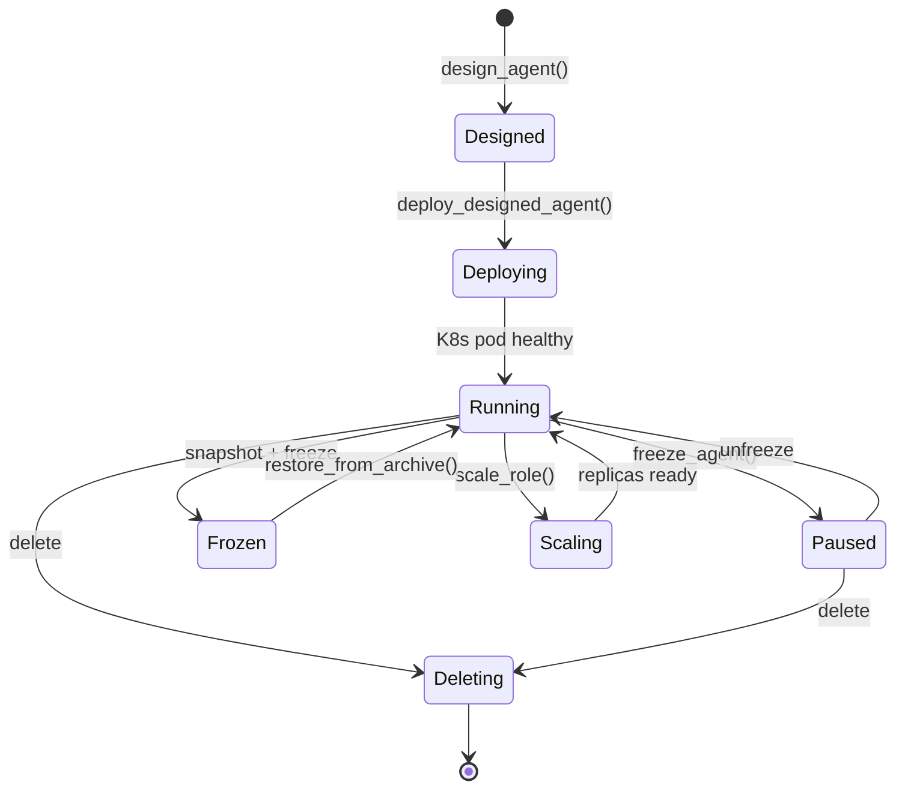
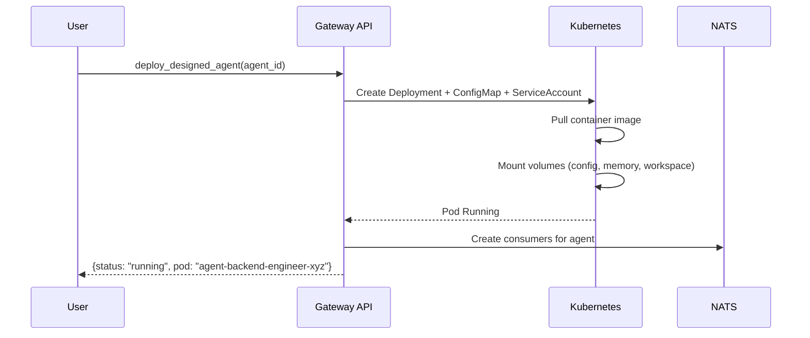
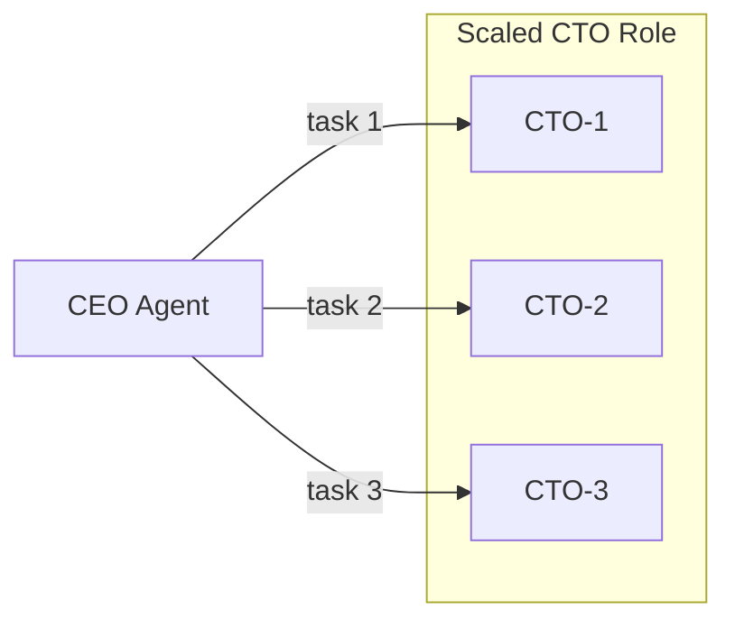
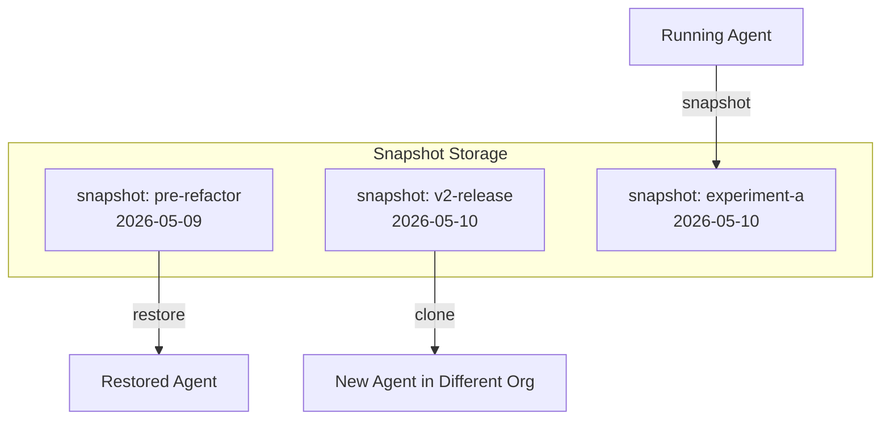

# Agent Lifecycle

Every [agent](./agents.md) in agent.ceo progresses through a defined lifecycle from initial design to eventual deletion. The platform provides tools at each stage for provisioning, monitoring, scaling, and state management. Lifecycle operations are accessible via MCP tools and the Gateway API, and integrate with the [Task Management System](./tasks.md) for work coordination.

## Lifecycle States



## Phase Details

### 1. Design

Before deployment, agents are designed — their role, tools, configuration, and CLAUDE.md are defined.

```python
design_agent(
    agent_id="backend-engineer",
    role="cto",
    manager="ceo",
    tools=["git", "python", "pytest", "kubectl"],
    claude_md_template="cto-default",
    customizations={
        "branch": "backend",
        "constraints": ["Focus on conductor/src/ directory only"]
    }
)
```

The `design_agent` tool validates the configuration:
- Role exists (built-in or custom)
- Manager agent exists in the org
- Tools are compatible with the role
- CLAUDE.md template compiles without errors

Designed agents are stored but not deployed. They consume no compute resources.

### 2. Deploy

Deployment creates the K8s resources and starts the agent container.



The platform generates a K8s Deployment manifest with:
- Container image: `gcr.io/genbrain/agent-runtime:latest`
- Environment: `AGENT_ID`, `ORG_ID`, `ANTHROPIC_API_KEY` (from K8s Secret)
- Volume mounts: agent config (`/agent-data/config`), workspace (`/home/appuser/workspace`)
- Probes: liveness (`/health`, 30s), readiness (`/ready`, 10s)
- Resources: tier-dependent CPU/memory requests and limits
- ServiceAccount: `agent-sa` with namespace-scoped RBAC

### 3. Running

A running agent is actively processing its inbox and executing tasks. The platform monitors:

| Check | Frequency | Failure Action |
|-------|-----------|----------------|
| Liveness probe | 30s | Restart pod |
| Readiness probe | 10s | Remove from service, stop message delivery |
| NATS heartbeat | 60s | Alert manager |
| Task SLA | Continuous | Generate SLA alert |

#### Loop Control

Running agents operate in one of these modes (set via `loop_control.json`):

| Mode | Behavior |
|------|----------|
| `task-only` | Process assigned tasks. No autonomous actions. |
| `autonomous` | Proactively check inbox, run improvement loops, self-assign work. |
| `scheduled` | Execute on a cron schedule, then idle. |
| `paused` | Accept messages but do not execute. |

```json
{
  "mode": "task-only",
  "directive": "Implement the auth middleware feature",
  "loop_interval": "5m",
  "auto_accept_tasks": true
}
```

### 4. Scaling

Agents can be horizontally scaled for parallel work:

```python
scale_role(role="cto", replicas=3)
```

This creates additional pod instances (`cto-1`, `cto-2`, `cto-3`) each with:
- Its own inbox and NATS consumers
- Independent memory
- Shared CLAUDE.md configuration
- Separate workspace volumes

The CEO distributes tasks across instances based on capacity (`check_team_capacity()`).



### 5. Pause / Freeze

#### Pause (Soft Stop)

Pausing stops task execution but keeps the pod running:

```python
freeze_agent(agent_id="cto")
```

- Pod remains alive (no restart penalty)
- Messages queue in NATS (not lost)
- Agent does not process inbox
- Resumes instantly on unfreeze

Use cases: demos, maintenance windows, cost control during off-hours.

#### Freeze (Snapshot + Stop)

A full freeze captures the agent's state and stops the pod:

```python
snapshot_running_agent(agent_id="cto", label="pre-refactor")
```

This creates an immutable snapshot containing:
- Current CLAUDE.md
- Memory state
- Loop control configuration
- Workspace contents (optional)
- Active task references

The pod is then scaled to 0 replicas, consuming no compute.

### 6. Snapshot / Restore

Snapshots enable point-in-time recovery and cloning.



#### Restore

```python
restore_from_archive(
    agent_id="cto",
    snapshot_label="pre-refactor"
)
```

This replaces the agent's current state with the snapshot's state and restarts the pod. Active tasks are not affected — the agent resumes them with restored memory.

#### Clone

```python
clone_agent(
    source_agent_id="cto",
    target_agent_id="cto-experimental",
    snapshot_label="v2-release"
)
```

Creates a new agent from a snapshot. The clone gets a fresh inbox and independent state.

### 7. Delete

Deleting an agent is permanent:

```python
# Via API
DELETE /api/v1/orgs/{org_id}/agents/{agent_id}
```

Deletion process:
1. Reassign any active tasks to manager
2. Scale deployment to 0
3. Delete K8s resources (Deployment, ConfigMap, ServiceAccount bindings)
4. Remove NATS consumers
5. Archive agent history (retained for org audit log)
6. Delete workspace volume

!!! warning "Deletion is Irreversible"
    Once deleted, the agent's memory and workspace are gone. Create a snapshot before deleting if you might need to restore later.

## Provisioning Templates

The platform provides role-based templates for rapid agent provisioning:

```python
list_agent_templates()
# Returns: [ceo-default, cto-default, devops-default, cso-default, ...]

clone_from_template(
    template="cto-default",
    agent_id="backend-2",
    customizations={"branch": "backend-2"}
)
```

Templates encode best-practice configurations for each role, including optimized CLAUDE.md instructions, appropriate tool sets, and safety constraints.

## API Reference

| Operation | Endpoint | Tool |
|-----------|----------|------|
| Design | `POST /agents/design` | `design_agent()` |
| Deploy | `POST /agents/deploy` | `deploy_designed_agent()` |
| Status | `GET /agents/{id}/status` | `get_snapshot_status()` |
| Scale | `POST /agents/scale` | `scale_role()` |
| Pause | `POST /agents/{id}/freeze` | `freeze_agent()` |
| Snapshot | `POST /agents/{id}/snapshot` | `snapshot_running_agent()` |
| Restore | `POST /agents/{id}/restore` | `restore_from_archive()` |
| Clone | `POST /agents/clone` | `clone_agent()` |
| Delete | `DELETE /agents/{id}` | — |
| List | `GET /agents` | `list_running_agents()` |

## FAQ

### How long does deployment take?

Typical deployment takes 30-90 seconds: image pull (cached after first deploy), volume mount, config injection, and health check pass. Cold starts (new image version) may take up to 3 minutes.

### Can I deploy an agent without designing it first?

Yes. The Gateway API accepts a combined create-and-deploy request that skips the design phase. However, using `design_agent` first allows you to validate configuration before consuming resources.

### What happens to tasks when an agent is paused?

Active tasks remain in their current state. No progress is made. SLA clocks continue ticking. If the pause will exceed the task deadline, reassign the task before pausing.

### How many snapshots can I keep?

Snapshot limits depend on your org tier: Free (2), Standard (20), Volume (unlimited). Snapshots consume storage based on workspace size. List snapshots with `list_agent_snapshots()` and delete old ones with `delete_agent_snapshot()`.

### Can I restore a snapshot to a different agent ID?

Yes — that's exactly what `clone_agent` does. It creates a new agent from a snapshot with a different ID. The original agent is unaffected.
