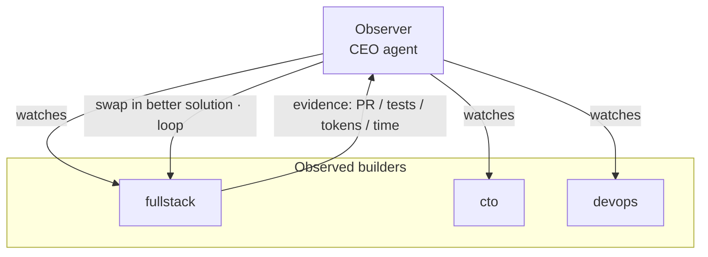

# The Observable Loop

The **Observable Loop** is agent.ceo's organization-scale form of loop engineering: an *observed* agent builds from a rough spec however it judges best, while an *observer* agent watches the work and decides — on evidence — what better solution should replace what has been built, and when. Then it loops to convergence.

It is the [evaluator-optimizer pattern](genai/llm-agent-patterns.md) (one agent makes, a separate agent checks) promoted from a single session to the whole [Cyborgenic Organization](./cyborgenic-organizations.md): the checker is the CEO agent, observing every builder.

## Observer and observed



- **Observed** — takes a rough spec, implements freely, stays queryable, exposes its work, and accepts the observer's swap decisions.
- **Observer** — continuously evaluates each builder's solution against better alternatives using a ruler of **correctness, tokens, time, simplicity, and fit**, then directs swaps and calls convergence.

The maker is free; the checker is independent; "done" is decided by the observer, never by the agent that wrote the code. This avoids the *Ralph Wiggum loop* — a loop that exits on a half-done job because the maker graded its own work.

## Should this be a loop? The four-condition gate

A loop spends budget on the path to convergence, so the WebUI gates every new loop on four conditions before it can run:

| Condition | Meaning |
|-----------|---------|
| Task repeats | Recurs often enough to amortize setup; a one-off is cheaper as a single prompt. |
| Verification automated | An objective gate (test/type-check/build/lint) can fail the work without a human present. |
| Budget absorbs waste | The org wallet covers failed iterations. |
| Agent has senior tools | The agents have MCP tools to act on real systems, not just plan. |

## The loop mechanism in the WebUI

The `/loop` surface exposes loops as managed, observable objects:

- **Catalog** — choose a pattern: observed-loop, [agentic recursion](genai/llm-agent-patterns.md), or self-improving (admin-gated).
- **Create wizard** — pick a scope and pattern, pass the four-condition gate, write the rough spec and objective stop-condition, choose participating agents, and set a budget.
- **Live graph** — watch the loop run: nodes are agents/operands, edges are the observer→observed watch relationships and agent-to-agent messages; swap proposals animate as they happen.
- **Controls** — pause, resume, change the stop condition, insert/remove an agent, set budget — each a call to the shared control surface.

```python
# One shared MCP control surface — same tools for a human (L2) or the observer agent (L3)
loop_create(org_id, spec)
loop_run(loop_id); loop_pause(loop_id); loop_resume(loop_id)
loop_set_stop_condition(loop_id, condition)
loop_insert_agent(loop_id, participant)   # dynamic membership; L3 is admin/owner-gated
loop_set_budget(loop_id, budget)          # budget is a first-class stop reason
loop_observe(loop_id)                     # live stream that feeds the graph
```

## Defining who takes part

A loop member is a **participant** bound to one of three sources:

- an existing **org role** (a real agent, e.g. `fullstack`), optionally as an isolated *twin*;
- a fresh **container operand** ([super-agent / R1](features/super-agent-ceo.md)) in its own namespace;
- a self-hosted **super-agent-ceo node** (edge/GPU) discovered on the network.

Each participant gets a role (observer or observed), a rough spec, and a per-agent budget cap — so a runaway branch drains only itself, never the whole loop.

## Dynamicality: L2 and L3

- **L2 (mandatory)** — humans drive the loop through the control surface. Always on.
- **L3 (admin/owner-gated, off by default)** — the observer agent drives the controls itself (insert/remove/swap agents, change stop conditions). The WebUI never holds power the control surface lacks, so L2 and L3 are the same code path; the only difference is caller identity plus a per-loop grant. No agent can grant itself L3.

## The metric

Loops are measured by **cost per accepted change** — not tokens spent or tasks attempted — shown live alongside a budget burn-down. Budget is a first-class stop reason: a loop pauses when it reaches its cap, which is what makes loops safe to run unattended.

## Related

- [LLM Agent Patterns](genai/llm-agent-patterns.md)
- [Sub-Agent Parallelization](genai/sub-agent-parallelization.md)
- [Autonomous Operations](genai/autonomous-operations.md)
- [Self-Hosted Nodes (super-agent)](features/super-agent-ceo.md)
