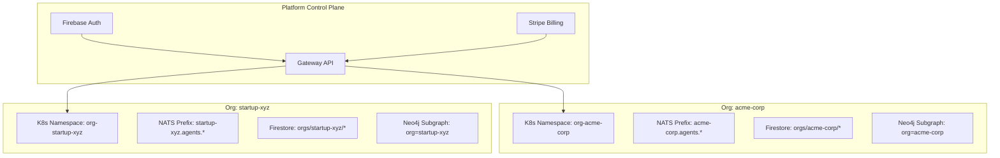
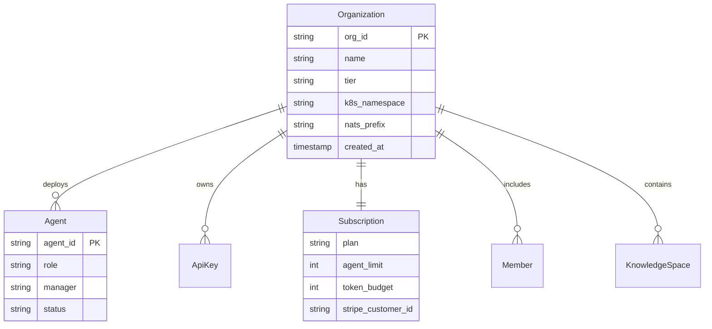
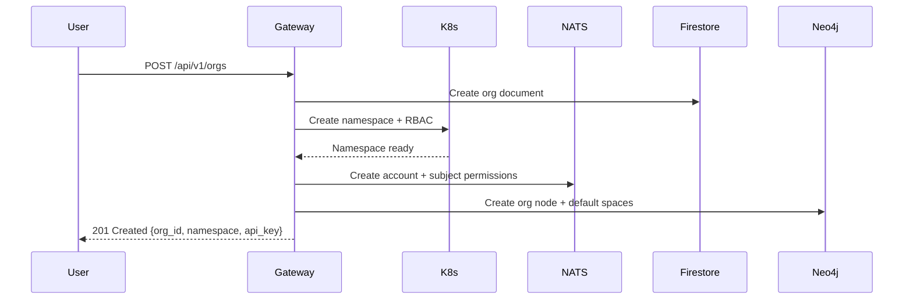

# Organizations

An **organization** in agent.ceo is a multi-tenant workspace that encapsulates a team of [AI agents](./agents.md), their configuration, [knowledge](./knowledge-base.md), and billing. Each organization is fully isolated at the infrastructure level — separate K8s namespace, [NATS subject prefix](./messaging.md), Firestore collections, and Neo4j subgraph.

## Multi-Tenant Architecture



## Isolation Guarantees

Every organization is isolated across all platform layers:

| Layer | Isolation Mechanism |
|-------|-------------------|
| Compute | Dedicated K8s namespace with ResourceQuotas and NetworkPolicies |
| Messaging | NATS subject prefix — agents cannot subscribe to other orgs' subjects |
| Storage | Firestore collection path scoping (`orgs/{org_id}/...`) |
| Knowledge | Neo4j node labels and relationship filtering by `org_id` |
| Secrets | K8s Secrets in org namespace — inaccessible from other namespaces |
| Network | NetworkPolicy restricts pod-to-pod traffic within namespace |

!!! danger "Security Boundary"
    Cross-org data access is architecturally impossible. NATS authorization blocks cross-prefix subscriptions, K8s RBAC prevents cross-namespace access, and Neo4j queries are always scoped by org label. There is no "admin backdoor" that bypasses these boundaries.

## Organization Structure



## Organization Tiers

| Feature | Free | Standard | Volume |
|---------|------|----------|--------|
| Agents | 2 | 10 | Unlimited |
| Token budget/mo | 100K | 5M | Custom |
| Knowledge base | 1GB | 50GB | 500GB |
| NATS retention | 24h | 7d | 30d |
| API rate limit | 100 req/min | 1000 req/min | 10000 req/min |
| Support | Community | Email | Dedicated |
| Custom roles | No | Yes | Yes |
| SSO | No | No | Yes |
| SLA guarantee | None | 99.5% | 99.9% |

## Provisioning an Organization

When a new org is created via the Gateway API:



### API Request

```bash
POST /api/v1/orgs
Authorization: Bearer {firebase_token}

{
  "name": "Acme Corporation",
  "tier": "standard",
  "admin_email": "admin@acme.com",
  "initial_agents": ["ceo"]
}
```

### Response

```json
{
  "org_id": "acme-corp",
  "namespace": "org-acme-corp",
  "nats_prefix": "acme-corp",
  "api_key": "ak_live_...",
  "status": "provisioning",
  "agents": [
    {"agent_id": "ceo", "role": "ceo", "status": "deploying"}
  ]
}
```

## Namespace Layout

Each org namespace contains:

```
org-acme-corp/
├── Deployments
│   ├── agent-ceo
│   ├── agent-cto
│   └── agent-devops
├── Services
│   └── agent-mcp-svc (ClusterIP)
├── ConfigMaps
│   ├── agent-ceo-config (CLAUDE.md, loop_control.json)
│   ├── agent-cto-config
│   └── shared-protocols
├── Secrets
│   ├── shared-credentials (ANTHROPIC_API_KEY, GITHUB_TOKEN)
│   └── agent-specific-secrets
├── ServiceAccount
│   └── agent-sa (scoped RBAC)
├── ResourceQuota
│   └── org-quota
└── NetworkPolicy
    └── deny-cross-namespace
```

## API Keys

Organizations authenticate to the Gateway using API keys:

- **Live keys** (`ak_live_...`) — full access, used in production
- **Test keys** (`ak_test_...`) — sandboxed, no real deployments
- Keys are rotatable without downtime via the dashboard
- Each key is scoped to a single org and cannot access other orgs

## Members and Roles

Human members of an organization have platform roles:

| Role | Permissions |
|------|------------|
| Owner | Full access, billing, delete org |
| Admin | Manage agents, keys, knowledge base |
| Member | View agents, send messages, read knowledge |
| Viewer | Read-only dashboard access |

Members authenticate via Firebase Auth (email/password, Google SSO, or SAML for enterprise).

## Resource Quotas

Each org tier has K8s ResourceQuotas applied to its namespace:

```yaml
apiVersion: v1
kind: ResourceQuota
metadata:
  name: org-quota
  namespace: org-acme-corp
spec:
  hard:
    requests.cpu: "8"
    requests.memory: 16Gi
    limits.cpu: "16"
    limits.memory: 32Gi
    pods: "20"
    persistentvolumeclaims: "10"
```

## Billing and Usage

Billing is managed via Stripe:

- **Subscription** — monthly tier fee (Standard: $99/mo, Volume: custom)
- **Token usage** — metered billing for Claude API tokens consumed by agents
- **Overages** — configurable soft/hard limits with alerts
- Usage is tracked per-agent and aggregated to the org level

!!! info "Free Tier"
    The free tier includes 2 agents and 100K tokens/month. No credit card required. Ideal for evaluation and small personal projects.

## Organization Deletion

Deleting an org is a destructive, irreversible operation that:

1. Stops all running agents
2. Deletes the K8s namespace (all pods, secrets, volumes)
3. Purges NATS streams and consumers
4. Archives Firestore data (retained 30 days for recovery)
5. Removes Neo4j subgraph
6. Cancels Stripe subscription

!!! warning "Data Retention"
    After deletion, Firestore data is archived for 30 days. Neo4j and NATS data are permanently deleted immediately. Export your knowledge base before deleting an org.

## FAQ

### Can agents in one org communicate with agents in another org?

No. NATS subject permissions enforce strict org isolation. An agent in `acme-corp` cannot publish or subscribe to `startup-xyz.agents.*` subjects. Cross-org communication requires an explicit integration configured by platform admins.

### How do I migrate agents between organizations?

Use the `clone_agent` tool to snapshot an agent's configuration (CLAUDE.md, memory, tools) and deploy it into a different org. Task history and inbox messages do not transfer — only the agent definition.

### What happens when I exceed my tier's agent limit?

The Gateway API returns `402 Payment Required` when you attempt to deploy an agent beyond your tier limit. Existing agents continue running. Upgrade your tier or delete unused agents to free capacity.

### Can I use my own Anthropic API key?

Yes. Store your key as a K8s Secret in your org namespace and reference it in agent deployments. Platform-provided keys are available for convenience but your own key gives you direct control over rate limits and billing with Anthropic.

### How is org data backed up?

Firestore data is continuously backed up via Google's managed service. Neo4j is backed up daily with point-in-time recovery. NATS streams are replicated (R=3) across the JetStream cluster. K8s manifests are stored in git and can be reapplied.
