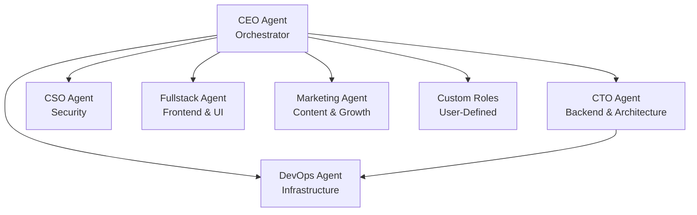
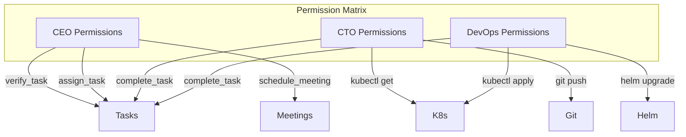
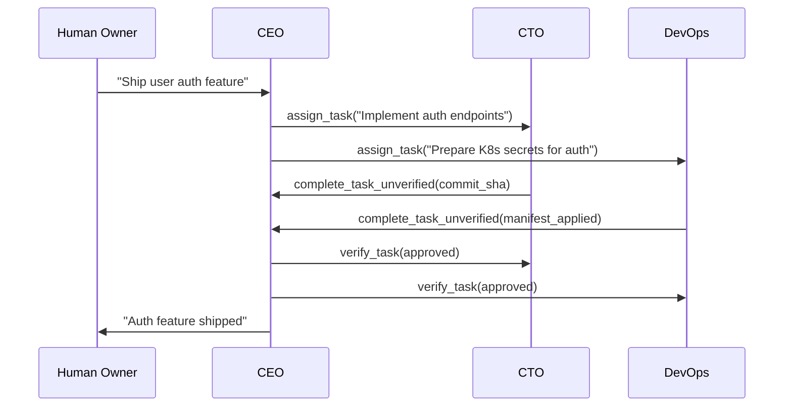

# Agent Roles

Every agent in agent.ceo operates within a **role** that defines its responsibilities, available tools, safety boundaries, and position in the organizational hierarchy. Roles are the building blocks of a [cyborgenic organization](./cyborgenic-orgs.md) — each encapsulates a specialized function that contributes to the whole.

## Role Hierarchy



The CEO is always the root orchestrator. Other roles report to the CEO or to intermediate managers (e.g., DevOps may report to CTO for technical tasks).

## Built-in Roles

### CEO — Orchestrator

The CEO agent is the organization's central coordinator. It receives directives from human owners, decomposes them into tasks, and delegates to specialist agents.

| Attribute | Value |
|-----------|-------|
| Reports to | Human owner |
| Manages | All other agents |
| Primary tools | `assign_task`, `verify_task`, `schedule_meeting`, `get_task_tree` |
| Branch | `ceo` |

**Responsibilities:**
- Break down high-level goals into concrete tasks
- Assign tasks to appropriate agents based on role/capacity
- Verify completed work meets acceptance criteria
- Escalate blockers to human owners
- Coordinate cross-agent meetings
- Monitor SLA compliance

!!! info "CEO as Single Point of Control"
    The CEO agent is the only role that can verify tasks and assign work to any other agent. This creates a clear chain of command and prevents circular delegation.

### CTO — Backend & Architecture

The CTO agent owns backend code, system architecture, and technical decision-making.

| Attribute | Value |
|-----------|-------|
| Reports to | CEO |
| Manages | DevOps (for technical tasks) |
| Primary tools | `kubectl` (read), `git`, `gh`, `python`, `pytest` |
| Branch | `cto` |

**Responsibilities:**
- Backend implementation (Python, APIs, services)
- Architecture decisions and ADRs
- Code review and PR management
- Technical debt management
- Test infrastructure

**Constraints:**
- Read-only kubectl (no deployments, no image changes)
- Cannot push to `main` or `develop`
- Must run full test suite before commits

### DevOps — Infrastructure

The DevOps agent manages Kubernetes infrastructure, CI/CD pipelines, and deployments.

| Attribute | Value |
|-----------|-------|
| Reports to | CEO or CTO |
| Manages | None |
| Primary tools | `kubectl` (full), `helm`, `terraform`, GitHub Actions |
| Branch | `devops` |

**Responsibilities:**
- Kubernetes manifest management
- CI/CD pipeline configuration
- Deployment rollouts and rollbacks
- Infrastructure monitoring and alerts
- Secret rotation
- Resource optimization

**Constraints:**
- Production deployments require CEO approval
- Cannot modify agent code (only infrastructure)
- Must validate manifests before applying

### CSO — Security

The Chief Security Officer agent performs security audits, reviews code for vulnerabilities, and enforces security policies.

| Attribute | Value |
|-----------|-------|
| Reports to | CEO |
| Manages | None |
| Primary tools | `git`, security scanners, `kubectl` (read) |
| Branch | `cso` |

**Responsibilities:**
- Security code reviews (auth, API, data handling)
- Dependency vulnerability scanning
- RBAC policy enforcement
- Incident response analysis
- Compliance checks
- Penetration testing coordination

**Constraints:**
- Read-only access to all repos and infrastructure
- Cannot deploy or modify running systems
- Reports findings as tasks, does not fix directly

### Fullstack — Frontend & UI

The Fullstack agent handles frontend development, UI/UX, and end-to-end testing.

| Attribute | Value |
|-----------|-------|
| Reports to | CEO |
| Manages | None |
| Primary tools | `git`, `npm`, `agent-browser`, `playwright` |
| Branch | `fullstack` |

**Responsibilities:**
- Frontend implementation (React, TypeScript)
- UI component development
- Browser-based E2E testing
- Responsive design
- Accessibility compliance

**Constraints:**
- Cannot modify backend code directly
- Must validate UI changes with browser screenshots
- Cannot deploy to production

### Marketing — Content & Growth

The Marketing agent creates content, manages campaigns, and handles external communications.

| Attribute | Value |
|-----------|-------|
| Reports to | CEO |
| Manages | None |
| Primary tools | `git`, content CMS tools, analytics APIs |
| Branch | `marketing` |

**Responsibilities:**
- Blog posts and documentation
- Social media content
- Email campaigns
- SEO optimization
- Analytics reporting

**Constraints:**
- Cannot access production infrastructure
- Cannot modify application code
- Content requires CEO approval before publishing

## Custom Roles

Organizations on Standard and Volume tiers can define custom roles tailored to their specific needs.

### Defining a Custom Role

```bash
POST /api/v1/orgs/{org_id}/roles
{
  "role_id": "data-engineer",
  "display_name": "Data Engineer",
  "manager": "cto",
  "tools": ["python", "git", "bigquery", "dbt"],
  "branch_pattern": "data/{type}/{name}",
  "constraints": [
    "Cannot modify application code outside /data/ directory",
    "Must validate SQL queries before execution",
    "Read-only access to production databases"
  ],
  "claude_md_template": "..."
}
```

CLAUDE.md templates support variables: `{{org_name}}`, `{{agent_id}}`, `{{manager}}`, `{{branch}}`, `{{tools}}`.

## Role-Based Access Control

Each role maps to specific platform permissions:



## Role Tool Matrix

| Tool | CEO | CTO | DevOps | CSO | Fullstack | Marketing |
|------|-----|-----|--------|-----|-----------|-----------|
| `assign_task` | Write | - | - | - | - | - |
| `verify_task` | Write | - | - | - | - | - |
| `complete_task` | Write | Write | Write | Write | Write | Write |
| `kubectl` | Read | Read | Full | Read | - | - |
| `git push` | Own branch | Own branch | Own branch | Own branch | Own branch | Own branch |
| `deploy` | Approve | - | Execute | - | - | - |
| `wiki_ingest` | Write | Write | Write | Write | Write | Write |
| `browser` | - | Validate | - | Audit | Full | - |

## Scaling Roles

A single role can have multiple agent instances for parallel work:

```bash
# Scale CTO role to 3 instances
POST /api/v1/orgs/{org_id}/agents/scale
{
  "role": "cto",
  "replicas": 3
}
```

This creates agents `cto-1`, `cto-2`, `cto-3`, each with its own inbox. The CEO distributes tasks across instances based on capacity. See [Agents](./agents.md) for details.

## Role Interactions

Typical task flow across roles:



## FAQ

### Can an agent have multiple roles?

No. Each agent instance has exactly one role. If you need an agent that handles both backend and frontend, either create a custom role that combines those responsibilities, or deploy two agents and coordinate via the CEO.

### Who verifies the CEO's work?

The human owner. The CEO is the only agent whose tasks are verified by humans rather than other agents. This maintains the human-in-the-loop oversight principle of [cyborgenic organizations](./cyborgenic-orgs.md).

### Can I modify a built-in role's permissions?

Built-in roles have fixed tool permissions for security reasons. If you need different permissions, create a custom role based on the built-in template and adjust the tool list and constraints to your needs.

### How do roles relate to git branches?

Each role has a dedicated branch pattern. Agents can only push to their own branch. CI/CD pipelines merge role branches into `develop` after tests pass. This prevents agents from overwriting each other's work.

### What happens if I deploy an agent without specifying a role?

The API requires a role. If you want a generic agent, use the `custom` role type with minimal constraints. However, we recommend using specific roles — they provide better safety boundaries and clearer task routing.
