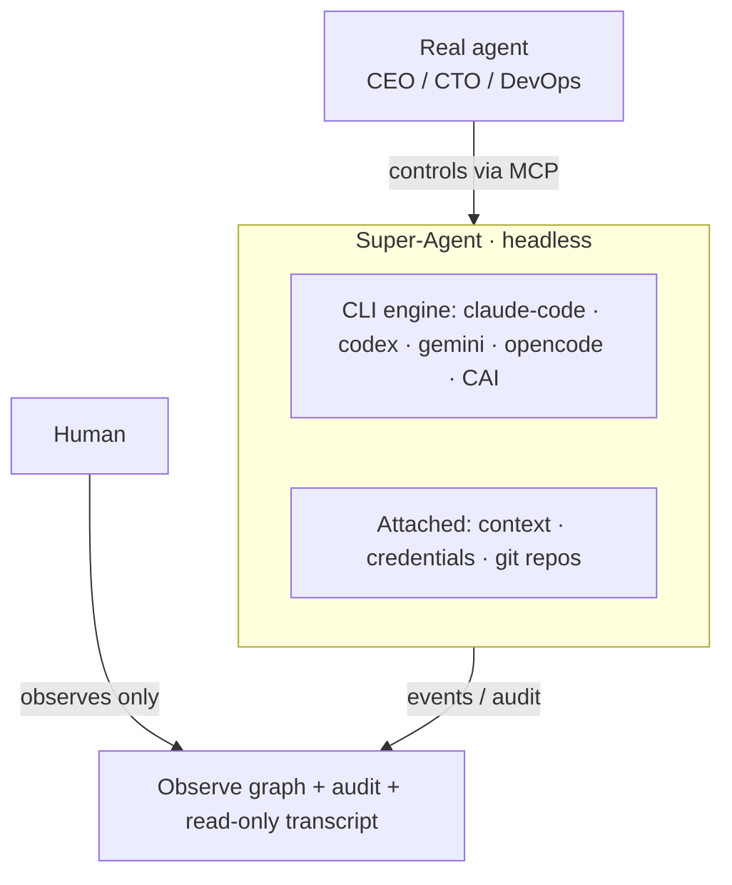

# Super-Agents

A **super-agent** is a lightweight automated worker that wraps an existing **CLI coding agent** — Claude Code, Codex, Gemini, OpenCode (and CAI/others) — and runs **headless** in a sandbox. You attach **context, credentials, and git repositories** to it. The defining difference from a [self-hosted node](features/super-agent-ceo.md): a super-agent **does not expose a console to the end user**. It is **spawned and controlled by the org's real agents** over MCP; humans **observe** it rather than operate it.

## The model



## Attaching context, credentials, and repos

A super-agent is created from one declarative spec:

```jsonc
SuperAgentSpec = {
  "cli_agent": "claude-code" | "codex" | "gemini" | "opencode" | "cai",
  "context":     { "charter": "immutable instructions", "task": "the job", "files": [] },
  "credentials": [ { "ref": "keychain://<org>/<name>", "as_env": "ANTHROPIC_API_KEY" } ],
  "repos":       [ { "url": "git@github.com:org/repo.git", "branch": "main", "mount_path": "/work/repo" } ],
  "resource_class": "small" | "medium" | "large" | "gpu",
  "budget": { "total_usd": 5.0, "stop_on_exhaust": true }
}
```

- **Credentials** are *references* resolved from the keychain at runtime — never inlined, never logged.
- **Repos** are cloned into the super-agent's workspace at `mount_path`.
- **Context.charter** is **immutable** — the super-agent cannot edit its own instructions.

## Control surface (for real agents)

Super-agents have no end-user console. Real agents drive them with MCP tools:

| Tool | Purpose |
|------|---------|
| `spawn_super_agent(spec)` | Materialize a headless super-agent from the AttachSpec |
| `attach(id, …)` | Add/refresh context, credentials, or repos |
| `run(id, task, mode)` | Dispatch a task (one-shot, or hand to a [loop](./observable-loop.md)) |
| `pause` / `resume` / `stop(id)` | Lifecycle |
| `observe(id)` | Subscribe to the live event/audit stream |
| `get_state(id)` · `list_super_agents()` · `delete(id)` | Inspect / enumerate / tear down |

Lifecycle-mutating tools are admin/owner-gated; a super-agent cannot spawn another unless explicitly granted.

## Observability (the window, since there's no console)

Every super-agent emits a structured stream — `task_started · step · tool_call · file_diff · commit · cost_delta · blocked · error · done` plus tokens/cost — surfaced three ways:

1. **`observe(id)` stream** — real agents subscribe and react.
2. **Read-only live transcript** — what a console would show, minus the input.
3. **Observe graph** — super-agents as nodes, edges to their controlling real-agent, live status + budget. The same graph that renders running [loops](./observable-loop.md).

## Adapters (CLI engines)

Each CLI agent is a small adapter behind a common contract: `claude-code`, `codex`, `gemini`, `opencode`, with `cai` and others addable without core changes. The `cli_agent` field on the spec selects the engine.

## Super-agent loops

Because a real agent can spawn and observe super-agents, it can run any [loop pattern](./observable-loop.md) over a fleet of them: an Observable Loop with a real-agent observer over super-agent builders, or an AutoResearch swarm where each experiment is a super-agent in its own sandbox. The super-agent is the worker; the loop is the coordination; the Observe graph is the shared window.

## Related

- [Observable Loop](./observable-loop.md)
- [Self-Hosted Nodes (super-agent-ceo)](features/super-agent-ceo.md)
- [Sub-Agent Parallelization](genai/sub-agent-parallelization.md)
- [AI Agents](./agents.md)
