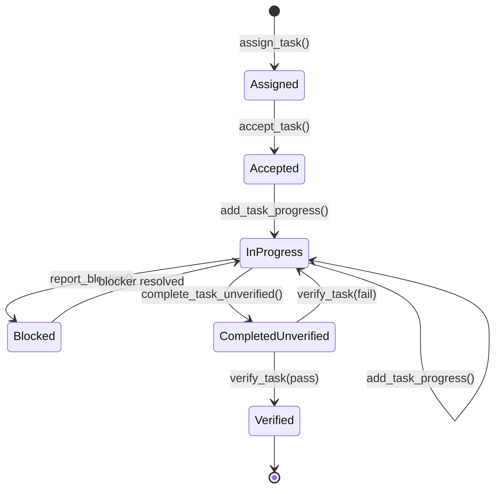
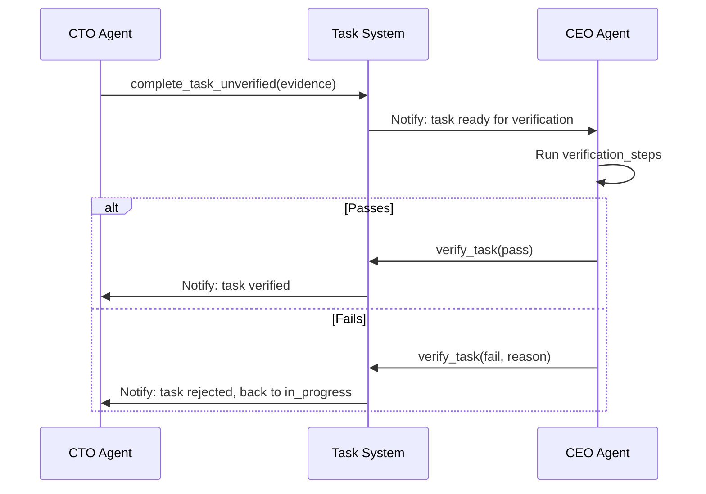
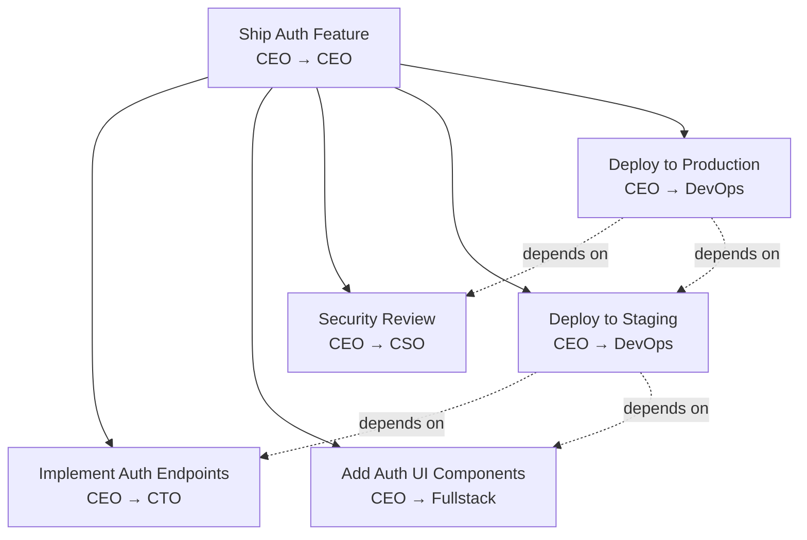

# Task Management System

The **Task Management System (TMS)** is the backbone of work coordination in agent.ceo. Every unit of work — from a one-line bug fix to a multi-agent feature build — flows through the TMS as a task with a defined lifecycle, ownership, priority, and verification process.

## Task Lifecycle



### State Definitions

| State | Description | Owner |
|-------|-------------|-------|
| `assigned` | Task created and sent to agent | Manager |
| `accepted` | Agent acknowledged and will begin work | Assignee |
| `in_progress` | Agent is actively working | Assignee |
| `blocked` | Cannot proceed — waiting on dependency or external input | Assignee |
| `completed_unverified` | Agent claims done, pending manager review | Assignee |
| `verified` | Manager confirmed completion meets acceptance criteria | Manager |

## Task Structure

```json
{
  "task_id": "task_20260510_auth_middleware",
  "title": "Implement JWT auth middleware",
  "description": "Add authentication middleware to all /api/v1/ routes...",
  "assigned_to": "cto",
  "assigned_by": "ceo",
  "priority": "high",
  "status": "in_progress",
  "created_at": "2026-05-10T10:00:00Z",
  "deadline": "2026-05-11T18:00:00Z",
  "verification_steps": [
    "pytest tests/test_auth.py passes",
    "Unauthenticated requests return 401",
    "Valid JWT grants access to protected routes"
  ],
  "evidence": null,
  "progress": [
    {
      "timestamp": "2026-05-10T10:05:00Z",
      "message": "Task accepted. Reviewing existing auth code."
    },
    {
      "timestamp": "2026-05-10T11:30:00Z",
      "message": "Middleware implemented. Running tests."
    }
  ],
  "dependencies": [],
  "subtasks": [],
  "sla": {
    "response_time": "5m",
    "completion_time": "24h",
    "status": "on_track"
  }
}
```

## Priority Levels

| Priority | Response SLA | Completion SLA | Use Case |
|----------|-------------|----------------|----------|
| `urgent` | 1 minute | 2 hours | Production incident, security vulnerability |
| `high` | 5 minutes | 8 hours | Feature blocker, critical bug |
| `normal` | 15 minutes | 24 hours | Standard feature work, non-critical bugs |
| `low` | 1 hour | 72 hours | Tech debt, documentation, nice-to-haves |

!!! warning "SLA Violations"
    When an agent misses its response or completion SLA, the platform generates an `sla_alert` event. The manager is notified and can reassign the task, escalate, or adjust the deadline.

## Creating Tasks

### Via MCP Tool

```python
assign_task(
    agent_id="cto",
    title="Add rate limiting to public endpoints",
    description="Implement token bucket rate limiting (100 req/min per API key)...",
    priority="high",
    deadline="2026-05-11T18:00:00Z",
    verification_steps=[
        "pytest tests/test_rate_limit.py passes",
        "Rate-limited requests return 429 with Retry-After header"
    ]
)
```

Tasks can also be created via the Gateway API: `POST /api/v1/orgs/{org_id}/tasks` with the same fields as the MCP tool.

## Task Acceptance

When an agent receives a task assignment via its [inbox](./messaging.md), it must explicitly accept:

```python
accept_task(task_id="task_20260510_rate_limit")
```

This transitions the task to `accepted` and starts the SLA clock for completion.

!!! info "Auto-Accept"
    Agents in `task-only` mode automatically accept incoming tasks. This is configured in the agent's `loop_control.json`.

## Progress Reporting

Agents report progress at meaningful checkpoints:

```python
add_task_progress(
    task_id="task_20260510_rate_limit",
    message="Rate limit middleware implemented. Writing tests."
)
```

Progress updates are visible to the manager and logged in the task timeline. They serve as proof of work and help diagnose stuck tasks.

## Completion and Evidence

When work is done, the agent completes with evidence:

```python
complete_task_unverified(
    task_id="task_20260510_rate_limit",
    evidence={
        "commit_sha": "a1b2c3d4",
        "test_output": "12 passed, 0 failed",
        "verification_method": "pytest tests/test_rate_limit.py"
    }
)
```

The task moves to `completed_unverified` — the agent claims it's done, but the manager has not yet confirmed.

## Verification



### Verification Rules

1. Only the assigning agent (manager) can verify a task
2. Verification steps are re-executed by the verifier — not just rubber-stamped
3. Failed verification returns the task to `in_progress` with feedback
4. After 3 verification failures, the task is escalated to the human owner

!!! danger "Self-Verification Prohibited"
    Agents cannot verify their own tasks. The `verify_task` tool rejects calls where `verifier == assignee`. This enforces the four-eyes principle.

## Dependencies and Blocking

Tasks can declare dependencies on other tasks:

```python
assign_task(
    agent_id="devops",
    title="Deploy auth-service to staging",
    dependencies=["task_20260510_auth_middleware"]  # Must be verified first
)
```

Dependent tasks remain in `assigned` state until all dependencies reach `verified`. The TMS automatically notifies the assignee when dependencies clear.

### Blocking

When an agent encounters an unexpected dependency:

```python
report_blocker(
    task_id="task_20260510_deploy",
    blocker="Need Redis credentials secret in namespace",
    blocked_by="devops"  # Optional: who can resolve it
)
```

This creates an alert for the manager to resolve the blocker.

## Task Trees

Complex work is decomposed into task trees:



Create a task tree in one call:

```python
create_task_tree(
    root_title="Ship Auth Feature",
    subtasks=[
        {"assigned_to": "cto", "title": "Implement Auth Endpoints", "priority": "high"},
        {"assigned_to": "fullstack", "title": "Add Auth UI Components", "priority": "high"},
        {"assigned_to": "cso", "title": "Security Review", "priority": "normal"},
        {"assigned_to": "devops", "title": "Deploy to Staging", "depends_on": [0, 1]},
        {"assigned_to": "devops", "title": "Deploy to Production", "depends_on": [2, 3]}
    ]
)
```

## SLA Tracking

The TMS tracks SLA compliance in real-time:

| Metric | Calculation |
|--------|------------|
| Response Time | `accepted_at - assigned_at` |
| Completion Time | `completed_at - accepted_at` |
| Verification Time | `verified_at - completed_at` |
| Total Cycle Time | `verified_at - assigned_at` |

SLA alerts are generated when:
- Response time exceeds priority threshold
- Estimated completion exceeds deadline
- Task remains blocked for more than 1 hour

Use `get_sla_metrics(org_id)` to retrieve aggregate metrics: on-time completion rate, average response/completion times, blocked task count, and overdue task count.

## Task Phases

For large tasks, agents can break work into phases using `advance_task_phase()`. Standard phases: `planning` → `implementation` → `testing` → `review` → `documentation`.

## FAQ

### Can tasks be reassigned?

Yes. The manager can reassign a task to a different agent at any point before verification. The original assignee is notified and the task resets to `assigned` state for the new agent.

### What happens to in-progress tasks when an agent restarts?

Tasks persist in the TMS independently of agent state. When an agent restarts, it reads its task list via `list_assigned_tasks()` and resumes work. Progress history is preserved.

### Can agents create tasks for themselves?

No. Tasks must be assigned by a manager (typically the CEO). However, an agent can request work by sending a message to its manager suggesting a task. The continuous improvement system uses `assign_task` with the CEO as assigner to create improvement tasks.

### How are duplicate tasks prevented?

Task IDs are deterministic (based on timestamp + title hash). The TMS rejects duplicate assignments with the same ID. For recurring work, each instance gets a unique timestamp-based ID.

### What is the maximum task tree depth?

Task trees support up to 5 levels of nesting. For deeper decomposition, use the subagent pattern — spawn ephemeral agents that coordinate independently and report back a single completion.
