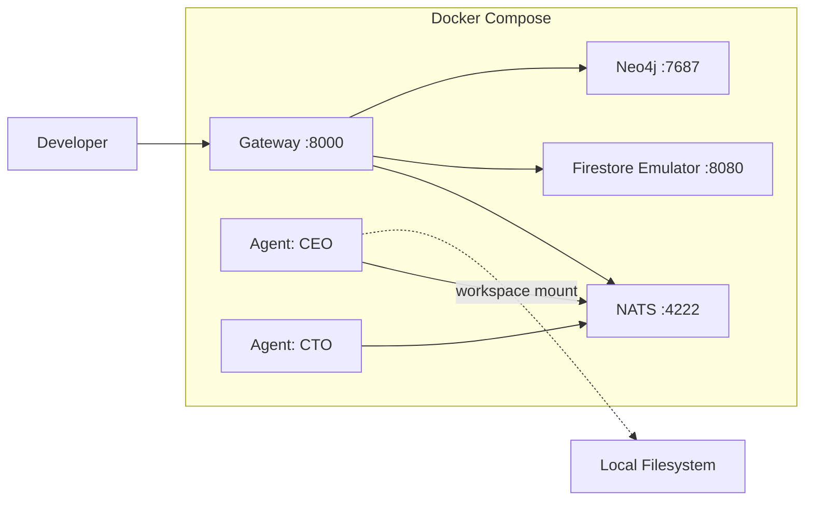

# Docker Deployment (Development)

Run the full agent.ceo stack locally using Docker Compose. This setup is ideal for development, testing, and evaluating the platform before deploying to production GKE.

## Architecture



## Prerequisites

| Tool | Version | Purpose |
|------|---------|---------|
| Docker | 24.0+ | Container runtime |
| Docker Compose | v2.20+ | Multi-container orchestration |
| Anthropic API Key | — | Claude model access |
| 16GB RAM | — | Minimum for 2 agents + services |

## Quick Start

### 1. Clone the Repository

```bash
git clone https://github.com/agent-ceo/platform.git
cd platform
```

### 2. Configure Environment

```bash
cp .env.example .env
```

Edit `.env` with your credentials:

```bash
# .env
ANTHROPIC_API_KEY=sk-ant-xxxxxxxxxxxxx
NATS_URL=nats://nats:4222
NEO4J_URI=bolt://neo4j:7687
NEO4J_USER=neo4j
NEO4J_PASSWORD=development
FIRESTORE_EMULATOR_HOST=firestore:8080
GATEWAY_SECRET_KEY=dev-secret-change-me
ORG_ID=dev-org
```

### 3. Start the Stack

```bash
docker compose up -d
```

## Docker Compose Configuration

```yaml
# docker-compose.yml
version: "3.9"

x-agent-common: &agent-common
  image: gcr.io/agent-ceo/agent-runtime:latest
  restart: unless-stopped
  depends_on:
    nats:
      condition: service_healthy
    gateway:
      condition: service_healthy
  env_file: .env
  networks:
    - agent-net

services:
  # === Platform Services ===

  gateway:
    image: gcr.io/agent-ceo/gateway:latest
    ports:
      - "8000:8000"
    env_file: .env
    environment:
      - ENV=development
      - LOG_LEVEL=debug
    depends_on:
      nats:
        condition: service_healthy
      firestore:
        condition: service_started
      neo4j:
        condition: service_healthy
    healthcheck:
      test: ["CMD", "curl", "-f", "http://localhost:8000/health"]
      interval: 10s
      timeout: 5s
      retries: 3
    networks:
      - agent-net

  nats:
    image: nats:2.10-alpine
    ports:
      - "4222:4222"
      - "8222:8222"  # Monitoring
    command: >
      --jetstream
      --store_dir /data
      --max_mem_store 256MB
      --max_file_store 1GB
    volumes:
      - nats-data:/data
    healthcheck:
      test: ["CMD", "nats-server", "--signal", "ldm"]
      interval: 5s
      timeout: 3s
      retries: 5
    networks:
      - agent-net

  neo4j:
    image: neo4j:5.15-community
    ports:
      - "7474:7474"  # Browser
      - "7687:7687"  # Bolt
    environment:
      - NEO4J_AUTH=neo4j/development
      - NEO4J_PLUGINS=["apoc"]
      - NEO4J_dbms_memory_heap_max__size=512m
    volumes:
      - neo4j-data:/data
    healthcheck:
      test: ["CMD", "neo4j", "status"]
      interval: 10s
      timeout: 5s
      retries: 5
    networks:
      - agent-net

  firestore:
    image: gcr.io/google.com/cloudsdktool/google-cloud-cli:emulators
    command: >
      gcloud emulators firestore start
      --host-port=0.0.0.0:8080
      --project=agent-ceo-dev
    ports:
      - "8080:8080"
    networks:
      - agent-net

  # === Agent Containers ===

  agent-ceo:
    <<: *agent-common
    container_name: agent-ceo
    environment:
      - AGENT_ROLE=ceo
      - AGENT_ORG=dev-org
    volumes:
      - ./agents/ceo/CLAUDE.md:/home/appuser/CLAUDE.md:ro
      - ./agents/ceo/config:/agent-data/config
      - ceo-workspace:/home/appuser/workspace

  agent-cto:
    <<: *agent-common
    container_name: agent-cto
    environment:
      - AGENT_ROLE=cto
      - AGENT_ORG=dev-org
    volumes:
      - ./agents/cto/CLAUDE.md:/home/appuser/CLAUDE.md:ro
      - ./agents/cto/config:/agent-data/config
      - cto-workspace:/home/appuser/workspace
      - ./src:/home/appuser/workspace/src  # Mount source for development

volumes:
  nats-data:
  neo4j-data:
  ceo-workspace:
  cto-workspace:

networks:
  agent-net:
    driver: bridge
```

## Base Agent Image

The agent runtime image includes Claude Code CLI and essential tools:

```dockerfile
# Dockerfile.agent
FROM ubuntu:22.04

# System dependencies
RUN apt-get update && apt-get install -y \
    curl git jq python3 python3-pip nodejs npm \
    kubectl gh && \
    rm -rf /var/lib/apt/lists/*

# Claude Code CLI
RUN npm install -g @anthropic-ai/claude-code

# Python tools
RUN pip3 install nats-py httpx pyyaml

# Create agent user
RUN useradd -m -s /bin/bash appuser
USER appuser
WORKDIR /home/appuser

# Agent entrypoint
COPY entrypoint.sh /entrypoint.sh
ENTRYPOINT ["/entrypoint.sh"]
```

### Agent Entrypoint

```bash
#!/bin/bash
# entrypoint.sh

# Wait for NATS
until nats-server --signal ldm 2>/dev/null || nc -z nats 4222; do
  echo "Waiting for NATS..."
  sleep 2
done

# Start Claude Code in agent mode
exec claude-code agent \
  --role "$AGENT_ROLE" \
  --org "$AGENT_ORG" \
  --nats-url "$NATS_URL"
```

## Development Workflows

### Rebuild a Single Agent

```bash
docker compose up -d --build agent-cto
```

### View Agent Logs

```bash
# Follow logs for a specific agent
docker compose logs -f agent-cto

# All agent logs
docker compose logs -f agent-ceo agent-cto
```

### Access Agent Shell

```bash
docker compose exec agent-cto bash
```

### Reset Agent State

!!!warning "Data Loss"
    This removes all agent memory and workspace data for the specified agent.

```bash
docker compose down agent-cto
docker volume rm platform_cto-workspace
docker compose up -d agent-cto
```

### Monitor NATS Messages

```bash
# Install NATS CLI
brew install nats-io/nats-tools/nats

# Subscribe to all org messages
nats sub "org.dev-org.>" --server localhost:4222
```

## Adding a New Agent

1. Create the agent configuration directory:

```bash
mkdir -p agents/fullstack
```

2. Write the agent's `CLAUDE.md`:

```bash
cat > agents/fullstack/CLAUDE.md << 'EOF'
# Fullstack Agent — Dev Org

**Role**: Fullstack Developer | **Manager**: CTO | **Branch**: `fullstack`

## Tools
- git, gh, npm, python3
- agent-browser for UI testing

## Responsibilities
Frontend (React/Next.js), backend APIs, E2E testing
EOF
```

3. Add to `docker-compose.yml`:

```yaml
  agent-fullstack:
    <<: *agent-common
    container_name: agent-fullstack
    environment:
      - AGENT_ROLE=fullstack
      - AGENT_ORG=dev-org
    volumes:
      - ./agents/fullstack/CLAUDE.md:/home/appuser/CLAUDE.md:ro
      - ./agents/fullstack/config:/agent-data/config
      - fullstack-workspace:/home/appuser/workspace
```

4. Start the new agent:

```bash
docker compose up -d agent-fullstack
```

## Resource Tuning

For machines with limited RAM, reduce service memory:

```yaml
# docker-compose.override.yml
services:
  neo4j:
    environment:
      - NEO4J_dbms_memory_heap_max__size=256m
  nats:
    command: >
      --jetstream
      --store_dir /data
      --max_mem_store 128MB
```

## Troubleshooting

| Issue | Solution |
|-------|----------|
| Agent can't connect to NATS | Check `docker compose ps` — NATS must be healthy |
| Firestore emulator crash | Increase Docker memory limit to 8GB+ |
| Neo4j OOM | Reduce heap size or add swap |
| Agent restart loop | Check logs: `docker compose logs agent-NAME` |
| Port conflict on 8000 | Change gateway port in docker-compose.yml |

## Next Steps

- [Kubernetes Deployment](./kubernetes.md) — Production deployment on GKE
- [Self-Hosted Installation](./self-hosted.md) — Deploy on your own infrastructure
- [Networking](./networking.md) — Network policies and service discovery
