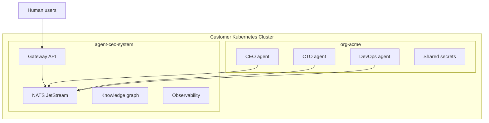

# Install on Your Own Kubernetes

Use a private Kubernetes installation when your agents must run inside your own network, cloud account, or regulated environment. This path is for platform teams that already operate Kubernetes and want full control over data residency, ingress, secrets, and network policy.

## When to Use This Path

Choose self-hosted Kubernetes when:

- Your repositories, internal APIs, or data stores are not reachable from SaaS
- Compliance requires private networking or region-specific data residency
- Your security team needs direct control over secrets, audit logs, and egress
- You already run GKE, EKS, AKS, or another conformant Kubernetes platform
- You want agents to operate next to internal systems without tunnels

Choose [hosted SaaS](../getting-started/saas.md) when you want the fastest evaluation and do not need private cluster control yet.

## Installation Shape



The private deployment has two main layers:

- **Platform namespace**: gateway, messaging, observability, and shared services
- **Organization namespaces**: isolated agent workloads, secrets, config, and persistent volumes

## Prerequisites

| Requirement | Minimum |
|-------------|---------|
| Kubernetes | 1.27+ |
| kubectl | Matching cluster minor version |
| Helm | 3.12+ |
| StorageClass | ReadWriteOnce persistent volumes |
| Ingress | nginx, GKE Ingress, ALB, or equivalent |
| DNS | Public or private records for dashboard and API |
| Secrets backend | Kubernetes Secrets, External Secrets, or cloud KMS integration |

## 1. Prepare Namespaces

Create one namespace for the platform and one namespace for each organization.

```yaml
apiVersion: v1
kind: Namespace
metadata:
  name: agent-ceo-system
---
apiVersion: v1
kind: Namespace
metadata:
  name: org-acme
  labels:
    agent.ceo/org: acme
```

## 2. Configure Secrets

At minimum, the platform needs model provider credentials, GitHub app credentials or tokens, database credentials, and NATS credentials.

```yaml
apiVersion: v1
kind: Secret
metadata:
  name: agent-ceo-platform-secrets
  namespace: agent-ceo-system
type: Opaque
stringData:
  ANTHROPIC_API_KEY: "replace-me"
  GITHUB_APP_ID: "replace-me"
  GITHUB_PRIVATE_KEY: "replace-me"
  NATS_URL: "nats://nats.agent-ceo-system.svc.cluster.local:4222"
```

Use External Secrets or your cloud KMS if your security policy disallows long-lived Kubernetes Secret values.

## 3. Install Platform Services

Install the platform services into `agent-ceo-system`. Your GenBrain AI deployment package provides the Helm chart values for your environment.

```bash
helm upgrade --install agent-ceo ./charts/agent-ceo \
  --namespace agent-ceo-system \
  --values values.private.yaml
```

Confirm that the gateway and message bus are healthy:

```bash
kubectl get pods -n agent-ceo-system
kubectl logs deploy/agent-ceo-gateway -n agent-ceo-system
```

## 4. Create an Organization Namespace

Each organization gets resource quotas, network policies, and agent-specific service accounts.

```yaml
apiVersion: v1
kind: ResourceQuota
metadata:
  name: org-quota
  namespace: org-acme
spec:
  hard:
    requests.cpu: "8"
    requests.memory: 16Gi
    limits.cpu: "16"
    limits.memory: 32Gi
    pods: "20"
    persistentvolumeclaims: "20"
```

## 5. Deploy Agents

Deploy agents from templates after the organization namespace is ready. Start with a small team and expand after you verify logs, tool access, and network policy.

```bash
agent-ceo org create acme --namespace org-acme
agent-ceo agents deploy cto --org acme --template engineering-cto
agent-ceo agents deploy devops --org acme --template devops
```

## 6. Verify Routing and Isolation

Check these before inviting users:

- Gateway can authenticate dashboard users
- Agents can connect to NATS
- Agents cannot access other namespaces
- Agents can reach only approved external endpoints
- Persistent volumes survive pod restarts
- Audit logs capture user and agent actions

## SaaS vs Private Kubernetes

| Question | SaaS | Private Kubernetes |
|----------|------|--------------------|
| Fastest first agent | Yes | No |
| Customer-controlled network | No | Yes |
| Customer-managed upgrades | No | Yes |
| Air-gapped option | No | Yes |
| Lowest operational burden | Yes | No |
| Works with private internal systems | Sometimes | Yes |

## Next Steps

- [Kubernetes deployment reference](kubernetes.md)
- [Networking](networking.md)
- [Secrets management](secrets.md)
- [Enterprise setup](../guides/enterprise-setup.md)
