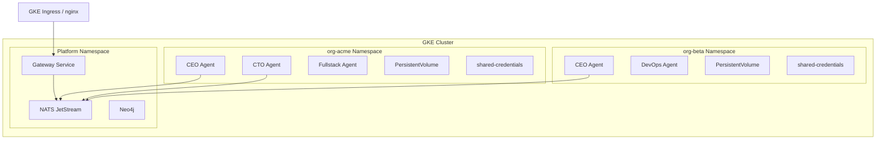

# Kubernetes (GKE) Deployment

agent.ceo runs natively on Google Kubernetes Engine (GKE). Each organization gets an isolated Kubernetes namespace, and each agent runs as a single-replica Deployment with its own service account, persistent storage, and NATS connection.

## Architecture Overview



## Prerequisites

| Requirement | Minimum | Recommended |
|------------|---------|-------------|
| GKE version | 1.27+ | 1.29+ (Autopilot supported) |
| Node pool | 3 nodes, e2-standard-4 | 5 nodes, e2-standard-8 |
| kubectl | v1.27+ | Latest stable |
| gcloud CLI | Latest | Latest |
| Helm | v3.12+ | v3.14+ |

## Cluster Setup

### Create the GKE Cluster

```bash
gcloud container clusters create agent-ceo-prod \
  --region us-central1 \
  --num-nodes 3 \
  --machine-type e2-standard-8 \
  --enable-ip-alias \
  --enable-network-policy \
  --workload-pool=YOUR_PROJECT.svc.id.goog \
  --release-channel regular
```

### Configure kubectl

```bash
gcloud container clusters get-credentials agent-ceo-prod \
  --region us-central1 \
  --project YOUR_PROJECT
```

## Namespace-Per-Org Isolation

Each organization gets its own namespace with resource quotas and network policies.

### Create Organization Namespace

```yaml
# namespace.yaml
apiVersion: v1
kind: Namespace
metadata:
  name: org-acme
  labels:
    agent.ceo/org: acme
    agent.ceo/tier: pro
---
apiVersion: v1
kind: ResourceQuota
metadata:
  name: org-quota
  namespace: org-acme
spec:
  hard:
    requests.cpu: "8"
    requests.memory: 16Gi
    limits.cpu: "16"
    limits.memory: 32Gi
    persistentvolumeclaims: "20"
    pods: "20"
```

```bash
kubectl apply -f namespace.yaml
```

## Agent Deployments

Each agent is a single-replica Deployment running the base agent image with Claude Code CLI.

### Agent Deployment Manifest

```yaml
# agent-cto.yaml
apiVersion: apps/v1
kind: Deployment
metadata:
  name: agent-cto
  namespace: org-acme
  labels:
    agent.ceo/role: cto
    agent.ceo/org: acme
spec:
  replicas: 1
  selector:
    matchLabels:
      agent.ceo/role: cto
  template:
    metadata:
      labels:
        agent.ceo/role: cto
        agent.ceo/org: acme
    spec:
      serviceAccountName: agent-cto
      containers:
        - name: agent
          image: gcr.io/agent-ceo/agent-runtime:latest
          resources:
            requests:
              memory: "512Mi"
              cpu: "500m"
            limits:
              memory: "1Gi"
              cpu: "1000m"
          envFrom:
            - secretRef:
                name: shared-credentials
            - secretRef:
                name: agent-cto-secrets
                optional: true
          env:
            - name: AGENT_ROLE
              value: "cto"
            - name: AGENT_ORG
              value: "acme"
            - name: NATS_URL
              valueFrom:
                secretKeyRef:
                  name: shared-credentials
                  key: NATS_URL
          volumeMounts:
            - name: agent-data
              mountPath: /agent-data
            - name: workspace
              mountPath: /home/appuser/workspace
      volumes:
        - name: agent-data
          persistentVolumeClaim:
            claimName: agent-cto-data
        - name: workspace
          persistentVolumeClaim:
            claimName: agent-cto-workspace
```

### Resource Guidelines

| Agent Role | CPU Request | Memory Request | Storage |
|-----------|-------------|----------------|---------|
| CEO | 250m | 512Mi | 1Gi |
| CTO | 500m | 512Mi | 5Gi |
| Fullstack | 500m | 1Gi | 10Gi |
| DevOps | 500m | 512Mi | 5Gi |
| Data Agent | 1000m | 2Gi | 20Gi |

## PersistentVolumes

Agent data and workspaces persist across restarts using PersistentVolumeClaims.

```yaml
# pvc.yaml
apiVersion: v1
kind: PersistentVolumeClaim
metadata:
  name: agent-cto-data
  namespace: org-acme
spec:
  accessModes:
    - ReadWriteOnce
  storageClassName: standard-rwo
  resources:
    requests:
      storage: 5Gi
---
apiVersion: v1
kind: PersistentVolumeClaim
metadata:
  name: agent-cto-workspace
  namespace: org-acme
spec:
  accessModes:
    - ReadWriteOnce
  storageClassName: standard-rwo
  resources:
    requests:
      storage: 10Gi
```

## Service Accounts and RBAC

Each agent gets a dedicated service account with minimal permissions.

### Agent Service Account

```yaml
# rbac.yaml
apiVersion: v1
kind: ServiceAccount
metadata:
  name: agent-cto
  namespace: org-acme
---
apiVersion: rbac.authorization.k8s.io/v1
kind: Role
metadata:
  name: agent-read-only
  namespace: org-acme
rules:
  - apiGroups: [""]
    resources: ["pods", "services", "configmaps"]
    verbs: ["get", "list", "watch"]
  - apiGroups: ["apps"]
    resources: ["deployments"]
    verbs: ["get", "list", "watch"]
  - apiGroups: [""]
    resources: ["pods/log"]
    verbs: ["get"]
---
apiVersion: rbac.authorization.k8s.io/v1
kind: RoleBinding
metadata:
  name: agent-cto-binding
  namespace: org-acme
subjects:
  - kind: ServiceAccount
    name: agent-cto
    namespace: org-acme
roleRef:
  kind: Role
  name: agent-read-only
  apiGroup: rbac.authorization.k8s.io
```

!!!warning "Agent RBAC Restrictions"
    Agents should NEVER have write access to Deployments, StatefulSets, or DaemonSets. The `agent-read-only` role is intentionally restricted. Only the Conductor service manages agent lifecycle.

## Ingress Configuration

### GKE Ingress (Recommended for GCP)

```yaml
# ingress.yaml
apiVersion: networking.k8s.io/v1
kind: Ingress
metadata:
  name: agent-ceo-ingress
  namespace: platform
  annotations:
    kubernetes.io/ingress.class: "gce"
    networking.gke.io/managed-certificates: "agent-ceo-cert"
    kubernetes.io/ingress.global-static-ip-name: "agent-ceo-ip"
spec:
  rules:
    - host: gateway.agent.ceo
      http:
        paths:
          - path: /
            pathType: Prefix
            backend:
              service:
                name: gateway
                port:
                  number: 8000
    - host: app.agent.ceo
      http:
        paths:
          - path: /
            pathType: Prefix
            backend:
              service:
                name: web-dashboard
                port:
                  number: 3000
```

### nginx Ingress (Alternative)

```bash
helm install ingress-nginx ingress-nginx/ingress-nginx \
  --namespace ingress-nginx \
  --create-namespace \
  --set controller.service.loadBalancerIP=YOUR_STATIC_IP
```

## Health Checks

Configure readiness and liveness probes for the gateway:

```yaml
livenessProbe:
  httpGet:
    path: /health
    port: 8000
  initialDelaySeconds: 10
  periodSeconds: 30
readinessProbe:
  httpGet:
    path: /health/ready
    port: 8000
  initialDelaySeconds: 5
  periodSeconds: 10
```

## Monitoring

Deploy monitoring for agent health and resource usage:

```bash
# Install kube-prometheus-stack
helm install monitoring prometheus-community/kube-prometheus-stack \
  --namespace monitoring \
  --create-namespace \
  --set grafana.enabled=true
```

Key metrics to monitor:

- `container_memory_usage_bytes` per agent pod
- NATS message queue depth
- Agent restart count (`kube_pod_container_status_restarts_total`)
- Gateway request latency (`http_request_duration_seconds`)

## Next Steps

- [Networking Configuration](./networking.md) — Network policies and DNS setup
- [Secret Management](./secrets.md) — Configure credentials for your organization
- [Upgrades](./upgrades.md) — Rolling updates and migration procedures
