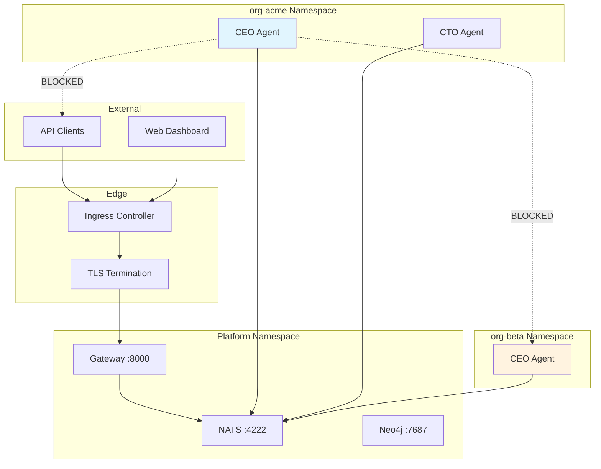

# Networking Configuration

agent.ceo uses a layered networking model: agents communicate exclusively through NATS (never directly), the gateway exposes a REST API externally, and network policies enforce strict isolation between organizations.

## Network Architecture



## Internal Communication (NATS)

All agent-to-agent communication flows through NATS JetStream. Agents never open direct TCP connections to each other.

### Subject Hierarchy

| Subject Pattern | Purpose | Example |
|----------------|---------|---------|
| `org.{org_id}.agent.{role}.inbox` | Agent message inbox | `org.acme.agent.cto.inbox` |
| `org.{org_id}.events` | Organization event stream | `org.acme.events` |
| `org.{org_id}.tasks.{task_id}` | Task lifecycle events | `org.acme.tasks.abc123` |
| `platform.gateway.broadcast` | Platform-wide announcements | System maintenance |

### NATS Service Configuration

```yaml
# nats-service.yaml
apiVersion: v1
kind: Service
metadata:
  name: nats
  namespace: platform
spec:
  selector:
    app.kubernetes.io/name: nats
  ports:
    - name: client
      port: 4222
      targetPort: 4222
    - name: monitor
      port: 8222
      targetPort: 8222
  type: ClusterIP
```

Agents connect using the internal DNS name:

```
nats://nats.platform.svc.cluster.local:4222
```

### NATS Authorization

Each organization gets a dedicated NATS account with publish/subscribe permissions scoped to their subject prefix:

```conf
# nats-auth.conf
accounts {
  ORG_ACME {
    users: [
      { user: "org-acme", password: "$ACME_NATS_PASS" }
    ]
    publish: { allow: ["org.acme.>"] }
    subscribe: { allow: ["org.acme.>", "platform.gateway.broadcast"] }
  }

  ORG_BETA {
    users: [
      { user: "org-beta", password: "$BETA_NATS_PASS" }
    ]
    publish: { allow: ["org.beta.>"] }
    subscribe: { allow: ["org.beta.>", "platform.gateway.broadcast"] }
  }

  PLATFORM {
    users: [
      { user: "gateway", password: "$GATEWAY_NATS_PASS" }
    ]
    publish: { allow: [">"] }
    subscribe: { allow: [">"] }
  }
}
```

## External API Access

The gateway is the only service exposed externally. It handles authentication, rate limiting, and routing.

### Gateway Service

```yaml
# gateway-service.yaml
apiVersion: v1
kind: Service
metadata:
  name: gateway
  namespace: platform
  annotations:
    cloud.google.com/neg: '{"ingress": true}'
spec:
  selector:
    app: gateway
  ports:
    - name: http
      port: 8000
      targetPort: 8000
  type: ClusterIP
```

### Exposed Endpoints

| Endpoint | Method | Purpose |
|----------|--------|---------|
| `/api/v1/orgs/{org}/agents` | GET/POST | Agent management |
| `/api/v1/orgs/{org}/tasks` | GET/POST | Task management |
| `/api/v1/orgs/{org}/messages` | POST | Send message to agent |
| `/api/v1/orgs/{org}/wiki` | GET/POST | Knowledge graph |
| `/health` | GET | Liveness check |
| `/health/ready` | GET | Readiness check |

## DNS Configuration

### Required DNS Records

| Hostname | Type | Target | Purpose |
|----------|------|--------|---------|
| `gateway.agent.ceo` | A | Ingress IP | API endpoint |
| `app.agent.ceo` | A | Ingress IP | Web dashboard |
| `*.agent.ceo` | A | Ingress IP | Org subdomains (optional) |

### GKE Static IP

```bash
# Reserve a static IP
gcloud compute addresses create agent-ceo-ip --global

# Get the IP address
gcloud compute addresses describe agent-ceo-ip --global --format='value(address)'
```

Configure your DNS provider to point records at this IP.

## TLS Configuration

### Managed Certificates (GKE)

```yaml
# managed-cert.yaml
apiVersion: networking.gke.io/v1
kind: ManagedCertificate
metadata:
  name: agent-ceo-cert
  namespace: platform
spec:
  domains:
    - gateway.agent.ceo
    - app.agent.ceo
```

### cert-manager (Any Cluster)

```bash
helm install cert-manager jetstack/cert-manager \
  --namespace cert-manager \
  --create-namespace \
  --set installCRDs=true
```

```yaml
# cluster-issuer.yaml
apiVersion: cert-manager.io/v1
kind: ClusterIssuer
metadata:
  name: letsencrypt-prod
spec:
  acme:
    server: https://acme-v02.api.letsencrypt.org/directory
    email: admin@yourdomain.com
    privateKeySecretRef:
      name: letsencrypt-prod
    solvers:
      - http01:
          ingress:
            class: nginx
---
# tls-ingress.yaml
apiVersion: networking.k8s.io/v1
kind: Ingress
metadata:
  name: gateway-ingress
  namespace: platform
  annotations:
    cert-manager.io/cluster-issuer: "letsencrypt-prod"
spec:
  tls:
    - hosts:
        - gateway.agent.ceo
        - app.agent.ceo
      secretName: agent-ceo-tls
  rules:
    - host: gateway.agent.ceo
      http:
        paths:
          - path: /
            pathType: Prefix
            backend:
              service:
                name: gateway
                port:
                  number: 8000
```

## Network Policies

Network policies enforce that agents cannot communicate directly or access the internet.

### Deny All Default (Per-Org Namespace)

```yaml
# deny-all.yaml
apiVersion: networking.k8s.io/v1
kind: NetworkPolicy
metadata:
  name: deny-all
  namespace: org-acme
spec:
  podSelector: {}
  policyTypes:
    - Ingress
    - Egress
```

### Allow NATS Egress Only

```yaml
# allow-nats.yaml
apiVersion: networking.k8s.io/v1
kind: NetworkPolicy
metadata:
  name: allow-nats-egress
  namespace: org-acme
spec:
  podSelector:
    matchLabels:
      agent.ceo/component: agent
  policyTypes:
    - Egress
  egress:
    # Allow NATS
    - to:
        - namespaceSelector:
            matchLabels:
              kubernetes.io/metadata.name: platform
          podSelector:
            matchLabels:
              app.kubernetes.io/name: nats
      ports:
        - protocol: TCP
          port: 4222
    # Allow DNS resolution
    - to:
        - namespaceSelector:
            matchLabels:
              kubernetes.io/metadata.name: kube-system
      ports:
        - protocol: UDP
          port: 53
```

!!!warning "Internet Access Restriction"
    Agents cannot access the internet directly. External API calls (GitHub, Slack, etc.) are routed through MCP tool servers that run in the platform namespace with appropriate network access. This prevents data exfiltration and ensures auditability.

### Allow MCP Tool Access

```yaml
# allow-mcp-egress.yaml
apiVersion: networking.k8s.io/v1
kind: NetworkPolicy
metadata:
  name: allow-mcp-egress
  namespace: org-acme
spec:
  podSelector:
    matchLabels:
      agent.ceo/component: agent
  policyTypes:
    - Egress
  egress:
    # Allow MCP tool servers in platform namespace
    - to:
        - namespaceSelector:
            matchLabels:
              kubernetes.io/metadata.name: platform
          podSelector:
            matchLabels:
              agent.ceo/component: mcp-server
      ports:
        - protocol: TCP
          port: 9000
```

## Platform Namespace Network Policy

Allow the gateway to receive external traffic and communicate with all services:

```yaml
# platform-netpol.yaml
apiVersion: networking.k8s.io/v1
kind: NetworkPolicy
metadata:
  name: allow-gateway-ingress
  namespace: platform
spec:
  podSelector:
    matchLabels:
      app: gateway
  policyTypes:
    - Ingress
  ingress:
    - from: []  # Allow from ingress controller
      ports:
        - protocol: TCP
          port: 8000
```

## Service Mesh (Optional)

For advanced observability and mTLS between services, deploy Istio:

```bash
istioctl install --set profile=minimal
kubectl label namespace platform istio-injection=enabled
kubectl label namespace org-acme istio-injection=enabled
```

Benefits:
- Mutual TLS between all services automatically
- Distributed tracing (Jaeger/Zipkin)
- Traffic policies and circuit breaking
- Request-level metrics

## Monitoring Network Traffic

### NATS Monitoring Dashboard

Access the NATS monitoring endpoint:

```bash
kubectl -n platform port-forward svc/nats 8222:8222
# Visit http://localhost:8222/connz for connections
# Visit http://localhost:8222/subsz for subscriptions
```

### Key Metrics

| Metric | Alert Threshold | Meaning |
|--------|----------------|---------|
| NATS slow consumers | > 0 | Agent not processing messages fast enough |
| Gateway 5xx rate | > 1% | Service errors |
| Network policy denials | Sudden spike | Possible misconfiguration or attack |
| NATS pending messages | > 100 per subject | Agent may be stuck |

## Next Steps

- [Secrets Management](./secrets.md) — Credential injection and rotation
- [Kubernetes Deployment](./kubernetes.md) — Full GKE deployment guide
- [Upgrades](./upgrades.md) — Zero-downtime upgrade procedures
