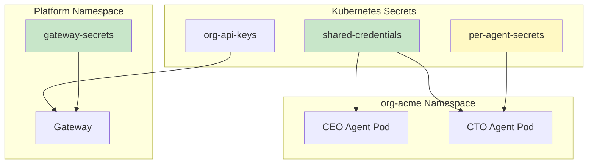
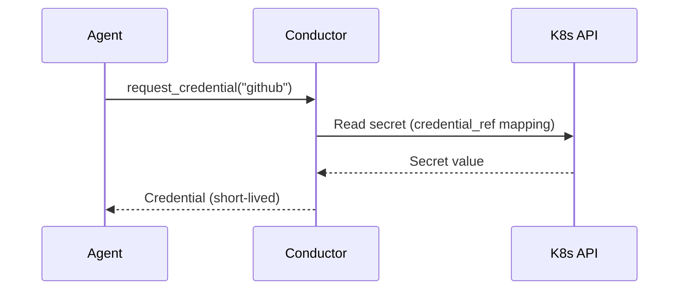

# Secret Management

agent.ceo uses Kubernetes secrets as the primary mechanism for credential storage. Secrets are injected into agent pods as environment variables and are never stored in application databases (Neo4j, Firestore).

## Secret Architecture



## Secret Types

### shared-credentials

Organization-wide secrets shared by all agents in a namespace.

| Key | Description | Example |
|-----|-------------|---------|
| `ANTHROPIC_API_KEY` | Claude model access | `sk-ant-api03-...` |
| `NATS_URL` | NATS connection string | `nats://nats.platform.svc:4222` |
| `NEO4J_URI` | Neo4j bolt endpoint | `bolt://neo4j.platform.svc:7687` |
| `NEO4J_PASSWORD` | Neo4j auth | `(generated)` |
| `GITHUB_TOKEN` | GitHub API access | `ghp_...` |
| `NATS_USER` | NATS account username | `org-acme` |
| `NATS_PASSWORD` | NATS account password | `(generated)` |

### Per-Agent Secrets

Role-specific credentials that only one agent needs.

| Secret Name | Agent | Contains |
|------------|-------|----------|
| `agent-cto-secrets` | CTO | SSH keys, code signing |
| `agent-devops-secrets` | DevOps | Cloud provider credentials |
| `agent-fullstack-secrets` | Fullstack | Deployment tokens, CDN keys |

### Gateway Secrets

Platform-level secrets for the gateway service.

| Key | Description |
|-----|-------------|
| `SECRET_KEY` | JWT signing key |
| `FIREBASE_CREDENTIALS` | Firebase Admin SDK |
| `STRIPE_SECRET_KEY` | Billing integration |
| `ADMIN_API_KEY` | Platform admin access |

## Creating Secrets

### Shared Credentials (Required)

```bash
kubectl -n org-acme create secret generic shared-credentials \
  --from-literal=ANTHROPIC_API_KEY="sk-ant-api03-your-key-here" \
  --from-literal=NATS_URL="nats://nats.platform.svc.cluster.local:4222" \
  --from-literal=NATS_USER="org-acme" \
  --from-literal=NATS_PASSWORD="$(openssl rand -base64 32)" \
  --from-literal=NEO4J_URI="bolt://neo4j.platform.svc.cluster.local:7687" \
  --from-literal=NEO4J_PASSWORD="your-neo4j-password" \
  --from-literal=GITHUB_TOKEN="ghp_your-token"
```

### Per-Agent Secret

```bash
kubectl -n org-acme create secret generic agent-devops-secrets \
  --from-literal=AWS_ACCESS_KEY_ID="AKIA..." \
  --from-literal=AWS_SECRET_ACCESS_KEY="..." \
  --from-literal=GCP_SERVICE_ACCOUNT="$(cat sa-key.json)"
```

### From a YAML File

```yaml
# shared-credentials.yaml
apiVersion: v1
kind: Secret
metadata:
  name: shared-credentials
  namespace: org-acme
  labels:
    agent.ceo/org: acme
    agent.ceo/secret-type: shared
type: Opaque
stringData:
  ANTHROPIC_API_KEY: "sk-ant-api03-your-key-here"
  NATS_URL: "nats://nats.platform.svc.cluster.local:4222"
  NEO4J_URI: "bolt://neo4j.platform.svc.cluster.local:7687"
  NEO4J_PASSWORD: "your-neo4j-password"
  GITHUB_TOKEN: "ghp_your-token"
```

!!!warning "Secret YAML Files"
    Never commit secret YAML files to version control. Use `kubectl create secret` commands or sealed-secrets/external-secrets operators in production.

```bash
kubectl apply -f shared-credentials.yaml
rm shared-credentials.yaml  # Delete after applying
```

## Environment Variable Injection

Secrets are injected into agent pods via `envFrom` and individual `env` entries in the Deployment spec.

### Full Secret Injection

```yaml
# All keys from shared-credentials become env vars
spec:
  containers:
    - name: agent
      envFrom:
        - secretRef:
            name: shared-credentials
        - secretRef:
            name: agent-cto-secrets
            optional: true  # Won't fail if secret doesn't exist
```

### Selective Key Injection

```yaml
# Only inject specific keys
spec:
  containers:
    - name: agent
      env:
        - name: ANTHROPIC_API_KEY
          valueFrom:
            secretKeyRef:
              name: shared-credentials
              key: ANTHROPIC_API_KEY
        - name: DB_PASSWORD
          valueFrom:
            secretKeyRef:
              name: agent-cto-secrets
              key: DB_PASSWORD
              optional: true
```

## credential_ref System

The `credential_ref` system allows agents to dynamically discover credentials at runtime without hardcoding secret names or keys.

### How It Works



### Configuration

Define credential references in the organization config:

```yaml
# org-config.yaml (stored in Firestore)
credential_refs:
  github:
    secret: shared-credentials
    key: GITHUB_TOKEN
    scope: org  # Available to all agents
  aws:
    secret: agent-devops-secrets
    key: AWS_ACCESS_KEY_ID
    scope: role  # Only available to devops role
    roles: ["devops"]
  anthropic:
    secret: shared-credentials
    key: ANTHROPIC_API_KEY
    scope: org
```

### Usage in Agent Code

Agents access credentials through the MCP tool server:

```python
# Agent requests a credential via MCP
credential = await mcp_call("get_credential", {
    "name": "github",
    "purpose": "PR review access"
})
# Returns: {"token": "ghp_...", "expires_in": 3600}
```

## Secret Rotation

### Manual Rotation

```bash
# Update the secret
kubectl -n org-acme create secret generic shared-credentials \
  --from-literal=ANTHROPIC_API_KEY="sk-ant-api03-NEW-KEY" \
  --from-literal=NATS_URL="nats://nats.platform.svc.cluster.local:4222" \
  ... \
  --dry-run=client -o yaml | kubectl apply -f -

# Restart agents to pick up new values
kubectl -n org-acme rollout restart deployment -l agent.ceo/component=agent
```

### Automated Rotation with External Secrets

```yaml
# external-secret.yaml
apiVersion: external-secrets.io/v1beta1
kind: ExternalSecret
metadata:
  name: shared-credentials
  namespace: org-acme
spec:
  refreshInterval: 1h
  secretStoreRef:
    name: gcp-secret-manager
    kind: ClusterSecretStore
  target:
    name: shared-credentials
  data:
    - secretKey: ANTHROPIC_API_KEY
      remoteRef:
        key: projects/YOUR_PROJECT/secrets/anthropic-api-key/versions/latest
    - secretKey: GITHUB_TOKEN
      remoteRef:
        key: projects/YOUR_PROJECT/secrets/github-token/versions/latest
```

## Security Best Practices

### What NOT To Store in Neo4j

!!!warning "Critical Security Rule"
    NEVER store secrets, API keys, tokens, or passwords in Neo4j (the knowledge graph). Neo4j is for organizational knowledge, not credentials. Agents have read access to the wiki — storing secrets there exposes them to all agents in the org.

Prohibited in Neo4j:
- API keys or tokens
- Passwords or connection strings
- Private keys or certificates
- Personal data (PII)

### RBAC for Secrets

Restrict which service accounts can read secrets:

```yaml
# secret-reader-role.yaml
apiVersion: rbac.authorization.k8s.io/v1
kind: Role
metadata:
  name: secret-reader
  namespace: org-acme
rules:
  - apiGroups: [""]
    resources: ["secrets"]
    verbs: ["get"]
    resourceNames: ["shared-credentials"]  # Only specific secrets
---
apiVersion: rbac.authorization.k8s.io/v1
kind: RoleBinding
metadata:
  name: conductor-secret-reader
  namespace: org-acme
subjects:
  - kind: ServiceAccount
    name: conductor
    namespace: platform
roleRef:
  kind: Role
  name: secret-reader
  apiGroup: rbac.authorization.k8s.io
```

### Encryption at Rest

Enable encryption at rest for Kubernetes secrets:

```yaml
# encryption-config.yaml (GKE manages this automatically)
apiVersion: apiserver.config.k8s.io/v1
kind: EncryptionConfiguration
resources:
  - resources:
      - secrets
    providers:
      - aescbc:
          keys:
            - name: key1
              secret: <base64-encoded-key>
      - identity: {}
```

On GKE, secrets are encrypted at rest by default using Google-managed keys. For additional control, use Customer-Managed Encryption Keys (CMEK).

### Audit Logging

Enable audit logging for secret access:

```bash
# GKE audit logs are enabled by default
# Query secret access events
gcloud logging read 'resource.type="k8s_cluster" AND
  protoPayload.methodName="io.k8s.core.v1.secrets.get"' \
  --project YOUR_PROJECT \
  --limit 50
```

## Sealed Secrets (GitOps)

For teams using GitOps, sealed-secrets allows encrypted secrets in git:

```bash
# Install sealed-secrets controller
helm install sealed-secrets sealed-secrets/sealed-secrets \
  --namespace kube-system

# Seal a secret
kubeseal --format yaml < shared-credentials.yaml > sealed-credentials.yaml
```

The sealed secret can be safely committed to git — only the cluster can decrypt it.

## Troubleshooting

| Issue | Diagnosis | Fix |
|-------|-----------|-----|
| Agent missing env var | `kubectl exec <pod> -- env | grep KEY` | Check secret exists and is referenced |
| Secret not found | `kubectl -n org-acme get secrets` | Create the missing secret |
| Permission denied reading secret | Check RBAC bindings | Add RoleBinding for service account |
| Stale credentials after rotation | Pods use cached env vars | Restart pods: `kubectl rollout restart` |
| External-secrets sync failure | `kubectl describe externalsecret` | Check SecretStore connectivity |

## Next Steps

- [Networking](./networking.md) — Network policies that protect secret access
- [Kubernetes Deployment](./kubernetes.md) — Full deployment with secrets configured
- [Upgrades](./upgrades.md) — Rotating secrets during upgrades
