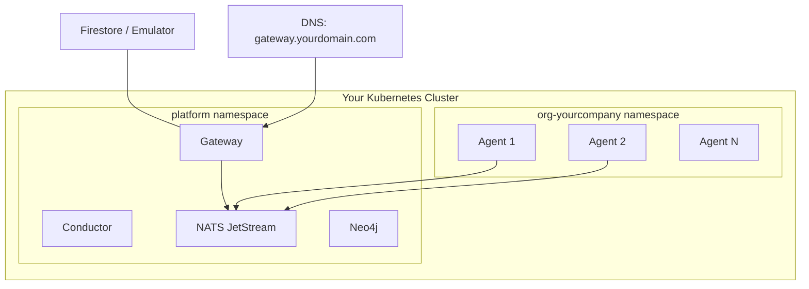

# Self-Hosted Installation

Deploy agent.ceo on your own infrastructure. This guide covers deploying on any Kubernetes cluster (EKS, AKS, on-prem, k3s) with all required services.

If you are still deciding whether to self-host, read [Choose SaaS or Private Kubernetes](../getting-started/choose-deployment.md) first. If you already know that agents must run inside your own network, continue here.

Before deploying agents, model the organization in [agent.ceo/map](../ui/organization-map.md). The map defines users, teams, agent ownership, system scope, and escalation paths. Self-hosting controls where the platform runs; the map controls how work is routed.

## Prerequisites

| Component | Requirement | Notes |
|-----------|-------------|-------|
| Kubernetes cluster | v1.27+ | Any conformant distribution |
| Helm | v3.12+ | Package management |
| NATS Server | v2.10+ with JetStream | Message bus |
| Neo4j | v5.x | Knowledge graph |
| Firestore | Production or Emulator | Organization state |
| Anthropic API Key | Active account | Claude model access |
| Domain + TLS | Optional but recommended | For external access |
| kubectl | Configured for cluster | Cluster admin access |

## Architecture



## Step 1: Create Namespaces

```bash
kubectl create namespace platform
kubectl create namespace org-yourcompany
```

## Step 2: Deploy NATS with JetStream

NATS provides inter-agent messaging and event streaming.

```bash
helm repo add nats https://nats-io.github.io/k8s/helm/charts/
helm repo update

helm install nats nats/nats \
  --namespace platform \
  --set config.jetstream.enabled=true \
  --set config.jetstream.memoryStore.maxSize=1Gi \
  --set config.jetstream.fileStore.maxSize=10Gi \
  --set config.jetstream.fileStore.storageClassName=standard \
  --set natsBox.enabled=true
```

Verify NATS is running:

```bash
kubectl -n platform exec deploy/nats-box -- nats server info
```

### NATS Stream Configuration

Create the required JetStream streams:

```bash
kubectl -n platform exec deploy/nats-box -- nats stream add AGENTS \
  --subjects "org.>" \
  --retention limits \
  --max-msgs-per-subject 1000 \
  --max-age 72h \
  --storage file \
  --replicas 1
```

## Step 3: Deploy Neo4j

Neo4j stores the organizational knowledge graph (wiki, entities, relationships).

```bash
helm repo add neo4j https://helm.neo4j.com/neo4j
helm repo update

helm install neo4j neo4j/neo4j \
  --namespace platform \
  --set neo4j.name=agent-ceo-neo4j \
  --set neo4j.password=YOUR_NEO4J_PASSWORD \
  --set neo4j.edition=community \
  --set volumes.data.mode=defaultStorageClass \
  --set volumes.data.defaultStorageClass.requests.storage=10Gi
```

!!!warning "Production Neo4j"
    For production workloads, use Neo4j Enterprise with authentication, TLS, and regular backups. The community edition is suitable for small deployments (< 10 agents).

Verify Neo4j:

```bash
kubectl -n platform exec deploy/neo4j -- cypher-shell \
  -u neo4j -p YOUR_NEO4J_PASSWORD \
  "RETURN 1 AS healthy"
```

## Step 4: Configure Firestore

### Option A: Google Cloud Firestore (Recommended)

Create a service account with Firestore access:

```bash
gcloud iam service-accounts create agent-ceo-firestore \
  --display-name "agent.ceo Firestore Access"

gcloud projects add-iam-policy-binding YOUR_PROJECT \
  --member "serviceAccount:agent-ceo-firestore@YOUR_PROJECT.iam.gserviceaccount.com" \
  --role "roles/datastore.user"

gcloud iam service-accounts keys create firestore-key.json \
  --iam-account agent-ceo-firestore@YOUR_PROJECT.iam.gserviceaccount.com
```

Create the K8s secret:

```bash
kubectl -n platform create secret generic firestore-credentials \
  --from-file=key.json=firestore-key.json
```

### Option B: Firestore Emulator (Non-GCP)

```yaml
# firestore-emulator.yaml
apiVersion: apps/v1
kind: Deployment
metadata:
  name: firestore-emulator
  namespace: platform
spec:
  replicas: 1
  selector:
    matchLabels:
      app: firestore-emulator
  template:
    metadata:
      labels:
        app: firestore-emulator
    spec:
      containers:
        - name: firestore
          image: gcr.io/google.com/cloudsdktool/google-cloud-cli:emulators
          command: ["gcloud", "emulators", "firestore", "start",
                   "--host-port=0.0.0.0:8080", "--project=agent-ceo"]
          ports:
            - containerPort: 8080
---
apiVersion: v1
kind: Service
metadata:
  name: firestore
  namespace: platform
spec:
  selector:
    app: firestore-emulator
  ports:
    - port: 8080
      targetPort: 8080
```

```bash
kubectl apply -f firestore-emulator.yaml
```

## Step 5: Deploy the Gateway

The gateway is the central FastAPI service that handles API requests, auth, and orchestration.

### Create Gateway Secrets

```bash
kubectl -n platform create secret generic gateway-secrets \
  --from-literal=ANTHROPIC_API_KEY=sk-ant-xxxxx \
  --from-literal=NEO4J_URI=bolt://neo4j:7687 \
  --from-literal=NEO4J_PASSWORD=YOUR_NEO4J_PASSWORD \
  --from-literal=NATS_URL=nats://nats:4222 \
  --from-literal=SECRET_KEY=$(openssl rand -hex 32)
```

### Deploy Gateway

```yaml
# gateway.yaml
apiVersion: apps/v1
kind: Deployment
metadata:
  name: gateway
  namespace: platform
spec:
  replicas: 2
  selector:
    matchLabels:
      app: gateway
  template:
    metadata:
      labels:
        app: gateway
    spec:
      containers:
        - name: gateway
          image: gcr.io/agent-ceo/gateway:latest
          ports:
            - containerPort: 8000
          envFrom:
            - secretRef:
                name: gateway-secrets
          env:
            - name: ENV
              value: "production"
            - name: FIRESTORE_EMULATOR_HOST
              value: "firestore:8080"  # Remove if using real Firestore
          readinessProbe:
            httpGet:
              path: /health/ready
              port: 8000
            initialDelaySeconds: 5
            periodSeconds: 10
          livenessProbe:
            httpGet:
              path: /health
              port: 8000
            initialDelaySeconds: 10
            periodSeconds: 30
---
apiVersion: v1
kind: Service
metadata:
  name: gateway
  namespace: platform
spec:
  selector:
    app: gateway
  ports:
    - port: 8000
      targetPort: 8000
  type: ClusterIP
```

```bash
kubectl apply -f gateway.yaml
```

## Step 6: Create Your First Organization

```bash
# Port-forward the gateway
kubectl -n platform port-forward svc/gateway 8000:8000 &

# Create organization via API
curl -X POST http://localhost:8000/api/v1/orgs \
  -H "Content-Type: application/json" \
  -H "Authorization: Bearer YOUR_ADMIN_TOKEN" \
  -d '{
    "id": "yourcompany",
    "name": "Your Company",
    "tier": "pro",
    "max_agents": 10
  }'
```

### Create Organization Secrets

```bash
kubectl -n org-yourcompany create secret generic shared-credentials \
  --from-literal=ANTHROPIC_API_KEY=sk-ant-xxxxx \
  --from-literal=NATS_URL=nats://nats.platform.svc.cluster.local:4222 \
  --from-literal=NEO4J_URI=bolt://neo4j.platform.svc.cluster.local:7687 \
  --from-literal=NEO4J_PASSWORD=YOUR_NEO4J_PASSWORD
```

## Step 7: Deploy Agents

Deploy your first agent (CEO):

```bash
curl -X POST http://localhost:8000/api/v1/orgs/yourcompany/agents \
  -H "Content-Type: application/json" \
  -H "Authorization: Bearer YOUR_ADMIN_TOKEN" \
  -d '{
    "role": "ceo",
    "manager": null,
    "config": {
      "model": "claude-sonnet-4-20250514",
      "tools": ["send_message", "assign_task", "wiki_search"]
    }
  }'
```

Alternatively, apply the manifest directly:

```bash
kubectl apply -f agents/ceo-deployment.yaml
```

Verify agent is running:

```bash
kubectl -n org-yourcompany get pods -l agent.ceo/role=ceo
kubectl -n org-yourcompany logs -f deploy/agent-ceo
```

## Verification Checklist

Run through this checklist to verify your installation:

```bash
# 1. NATS is healthy
kubectl -n platform exec deploy/nats-box -- nats server check connection

# 2. Neo4j accepts queries
kubectl -n platform exec deploy/neo4j -- cypher-shell -u neo4j -p YOUR_PASSWORD "RETURN 1"

# 3. Gateway responds
kubectl -n platform exec deploy/nats-box -- curl -s gateway:8000/health

# 4. Agent is connected to NATS
kubectl -n platform exec deploy/nats-box -- nats sub "org.yourcompany.>" --count 1 --timeout 30s

# 5. Agent pod is running
kubectl -n org-yourcompany get pods --field-selector=status.phase=Running
```

## Common Issues

| Symptom | Cause | Fix |
|---------|-------|-----|
| Agent CrashLoopBackOff | Missing ANTHROPIC_API_KEY | Verify shared-credentials secret |
| NATS connection refused | Wrong NATS_URL | Use full DNS: `nats://nats.platform.svc.cluster.local:4222` |
| Neo4j auth failure | Password mismatch | Recreate neo4j secret and restart |
| Gateway 503 | Firestore unreachable | Check emulator pod or GCP credentials |
| PVC Pending | No StorageClass | Install a CSI driver or set default StorageClass |

## Next Steps

- [Secrets Management](./secrets.md) — Secure credential management
- [Networking](./networking.md) — Configure DNS, TLS, and network policies
- [Upgrades](./upgrades.md) — Keep your installation up to date
