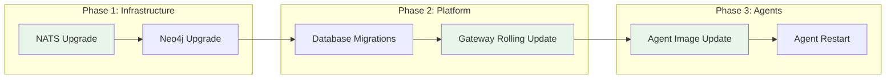

# Upgrades and Migrations

agent.ceo is designed for zero-downtime upgrades. This guide covers upgrading each component safely, handling database migrations, and rolling back if issues arise.

## Upgrade Strategy Overview



## Version Compatibility Matrix

| Gateway | Agent Runtime | NATS | Neo4j | Firestore Schema |
|---------|--------------|------|-------|-----------------|
| v2.4.x | v2.3.x - v2.4.x | 2.9+ | 5.x | v14 |
| v2.3.x | v2.2.x - v2.3.x | 2.9+ | 5.x | v13 |
| v2.2.x | v2.1.x - v2.2.x | 2.9+ | 5.x | v12 |

!!!warning "Version Skipping"
    Do not skip major versions. If upgrading from v2.2.x to v2.4.x, you must first upgrade to v2.3.x, run migrations, then proceed to v2.4.x.

## Pre-Upgrade Checklist

Before any upgrade:

```bash
# 1. Check current versions
kubectl -n platform get deploy -o jsonpath='{range .items[*]}{.metadata.name}={.spec.template.spec.containers[0].image}{"\n"}{end}'

# 2. Verify all agents are healthy
kubectl get pods --all-namespaces -l agent.ceo/component=agent --field-selector=status.phase=Running

# 3. Check NATS consumer lag
kubectl -n platform exec deploy/nats-box -- nats consumer info AGENTS org-delivery

# 4. Backup Neo4j
kubectl -n platform exec deploy/neo4j -- neo4j-admin database dump neo4j --to-path=/backups/
kubectl cp platform/neo4j-0:/backups/neo4j.dump ./neo4j-backup-$(date +%Y%m%d).dump

# 5. Snapshot Firestore (GCP)
gcloud firestore export gs://YOUR_BUCKET/backups/$(date +%Y%m%d)
```

## Gateway Rolling Updates

The gateway supports zero-downtime rolling updates with health check-based readiness.

### Update Gateway Image

```bash
# Update the image tag
kubectl -n platform set image deployment/gateway \
  gateway=gcr.io/agent-ceo/gateway:v2.4.0

# Monitor the rollout
kubectl -n platform rollout status deployment/gateway
```

### Rolling Update Configuration

Ensure the gateway Deployment has proper update strategy:

```yaml
spec:
  replicas: 2  # Minimum 2 for zero-downtime
  strategy:
    type: RollingUpdate
    rollingUpdate:
      maxUnavailable: 0    # Never remove a pod before new one is ready
      maxSurge: 1          # Add one new pod at a time
  template:
    spec:
      terminationGracePeriodSeconds: 30
      containers:
        - name: gateway
          readinessProbe:
            httpGet:
              path: /health/ready
              port: 8000
            initialDelaySeconds: 5
            periodSeconds: 5
            failureThreshold: 3
          lifecycle:
            preStop:
              exec:
                command: ["/bin/sh", "-c", "sleep 10"]  # Drain connections
```

### Verify Gateway Upgrade

```bash
# Check the new version is serving
curl -s https://gateway.agent.ceo/health | jq .version

# Verify no 5xx errors during rollout
kubectl -n platform logs -l app=gateway --since=5m | grep -c "HTTP 5"
```

## Agent Image Updates

Agents are updated by patching their Deployment image. Since each agent is a single replica, updates cause a brief restart.

### Update All Agents in an Org

```bash
# List current agent images
kubectl -n org-acme get deploy -l agent.ceo/component=agent \
  -o custom-columns=NAME:.metadata.name,IMAGE:.spec.template.spec.containers[0].image

# Update all agents to new image
kubectl -n org-acme get deploy -l agent.ceo/component=agent -o name | \
  xargs -I {} kubectl -n org-acme set image {} \
  agent=gcr.io/agent-ceo/agent-runtime:v2.4.0
```

### Update a Single Agent

```bash
kubectl -n org-acme set image deployment/agent-cto \
  agent=gcr.io/agent-ceo/agent-runtime:v2.4.0
```

### Graceful Agent Shutdown

Agents receive SIGTERM and have a grace period to finish current work:

```yaml
spec:
  template:
    spec:
      terminationGracePeriodSeconds: 120  # 2 minutes to finish current task
      containers:
        - name: agent
          lifecycle:
            preStop:
              exec:
                command:
                  - /bin/sh
                  - -c
                  - |
                    # Signal agent to stop accepting new tasks
                    touch /tmp/shutdown-requested
                    # Wait for current task to complete (max 90s)
                    timeout 90 bash -c 'while [ -f /tmp/task-in-progress ]; do sleep 2; done'
```

### Staged Rollout (Recommended)

For large organizations, update agents in stages:

```bash
# Stage 1: Update non-critical agents first
kubectl -n org-acme set image deployment/agent-fullstack \
  agent=gcr.io/agent-ceo/agent-runtime:v2.4.0

# Verify for 10 minutes, then continue
kubectl -n org-acme rollout status deployment/agent-fullstack

# Stage 2: Update remaining agents
kubectl -n org-acme set image deployment/agent-cto \
  agent=gcr.io/agent-ceo/agent-runtime:v2.4.0
kubectl -n org-acme set image deployment/agent-ceo \
  agent=gcr.io/agent-ceo/agent-runtime:v2.4.0
```

## Database Migrations

### Firestore Schema Migrations

Schema changes are applied via migration scripts before gateway deployment.

```bash
# Run migrations
kubectl -n platform run migration-v14 \
  --image=gcr.io/agent-ceo/gateway:v2.4.0 \
  --restart=Never \
  --env="FIRESTORE_EMULATOR_HOST=firestore:8080" \
  --command -- python -m conductor.migrations.run --target v14

# Check migration status
kubectl -n platform logs job/migration-v14
```

Migration script structure:

```python
# conductor/migrations/v014_add_agent_metrics.py
"""Add metrics collection fields to agent documents."""

async def up(db):
    """Forward migration."""
    orgs = db.collection("organizations").stream()
    async for org in orgs:
        agents = org.reference.collection("agents").stream()
        async for agent in agents:
            await agent.reference.update({
                "metrics": {
                    "tasks_completed": 0,
                    "avg_completion_time_ms": 0,
                    "last_active": None
                }
            })

async def down(db):
    """Rollback migration."""
    # Remove metrics field from all agents
    orgs = db.collection("organizations").stream()
    async for org in orgs:
        agents = org.reference.collection("agents").stream()
        async for agent in agents:
            await agent.reference.update({"metrics": firestore.DELETE_FIELD})
```

!!!warning "Irreversible Migrations"
    Some migrations (e.g., data format changes, field renames) cannot be cleanly rolled back. Always backup Firestore before running migrations.

### Neo4j Schema Migrations

```bash
# Apply Neo4j constraints and indexes
kubectl -n platform exec deploy/neo4j -- cypher-shell -u neo4j -p $PASSWORD << 'EOF'
// v2.4.0 schema additions
CREATE INDEX agent_org_role IF NOT EXISTS FOR (a:Agent) ON (a.org, a.role);
CREATE CONSTRAINT unique_task_id IF NOT EXISTS FOR (t:Task) REQUIRE t.id IS UNIQUE;
EOF
```

## NATS Consumer Compatibility

When upgrading NATS or changing message formats, ensure consumer compatibility.

### Check Consumer Health

```bash
kubectl -n platform exec deploy/nats-box -- nats consumer list AGENTS
kubectl -n platform exec deploy/nats-box -- nats consumer info AGENTS org-delivery
```

### Message Format Versioning

Messages include a version field for backward compatibility:

```json
{
  "version": 2,
  "type": "task.assigned",
  "org": "acme",
  "payload": { ... }
}
```

Agents handle both v1 and v2 message formats during the transition period.

### NATS Server Upgrade

```bash
# Update NATS via Helm
helm upgrade nats nats/nats \
  --namespace platform \
  --set config.jetstream.enabled=true \
  --set image.tag=2.10.14

# Verify streams are intact
kubectl -n platform exec deploy/nats-box -- nats stream ls
kubectl -n platform exec deploy/nats-box -- nats server check jetstream
```

## Zero-Downtime Upgrade Procedure

Complete upgrade sequence for a minor version bump:

```bash
#!/bin/bash
# upgrade.sh — Zero-downtime upgrade from v2.3.x to v2.4.0
set -euo pipefail

VERSION="v2.4.0"
NAMESPACE="org-acme"

echo "=== Phase 1: Pre-flight checks ==="
kubectl -n platform rollout status deployment/gateway
kubectl -n $NAMESPACE get pods -l agent.ceo/component=agent --field-selector=status.phase=Running

echo "=== Phase 2: Backup ==="
gcloud firestore export gs://agent-ceo-backups/pre-${VERSION}-$(date +%s)
kubectl -n platform exec deploy/neo4j -- neo4j-admin database dump neo4j --to-path=/tmp/

echo "=== Phase 3: Database migrations ==="
kubectl -n platform run "migration-${VERSION}" \
  --image="gcr.io/agent-ceo/gateway:${VERSION}" \
  --restart=Never \
  --command -- python -m conductor.migrations.run --target v14
kubectl -n platform wait --for=condition=complete job/migration-${VERSION} --timeout=300s

echo "=== Phase 4: Gateway rolling update ==="
kubectl -n platform set image deployment/gateway "gateway=gcr.io/agent-ceo/gateway:${VERSION}"
kubectl -n platform rollout status deployment/gateway --timeout=300s

echo "=== Phase 5: Agent updates (staged) ==="
# Non-critical agents first
kubectl -n $NAMESPACE set image deployment/agent-fullstack "agent=gcr.io/agent-ceo/agent-runtime:${VERSION}"
kubectl -n $NAMESPACE rollout status deployment/agent-fullstack --timeout=120s
sleep 30  # Observe for issues

# Critical agents
kubectl -n $NAMESPACE set image deployment/agent-cto "agent=gcr.io/agent-ceo/agent-runtime:${VERSION}"
kubectl -n $NAMESPACE set image deployment/agent-ceo "agent=gcr.io/agent-ceo/agent-runtime:${VERSION}"
kubectl -n $NAMESPACE rollout status deployment/agent-cto --timeout=120s
kubectl -n $NAMESPACE rollout status deployment/agent-ceo --timeout=120s

echo "=== Phase 6: Verification ==="
curl -sf https://gateway.agent.ceo/health | jq .
kubectl -n $NAMESPACE get pods -l agent.ceo/component=agent

echo "=== Upgrade to ${VERSION} complete ==="
```

## Rollback Procedures

### Rollback Gateway

```bash
# Immediate rollback to previous revision
kubectl -n platform rollout undo deployment/gateway

# Or rollback to a specific revision
kubectl -n platform rollout history deployment/gateway
kubectl -n platform rollout undo deployment/gateway --to-revision=3
```

### Rollback Agent Image

```bash
kubectl -n org-acme rollout undo deployment/agent-cto
```

### Rollback Database Migration

```bash
# Run the down migration
kubectl -n platform run rollback-migration \
  --image=gcr.io/agent-ceo/gateway:v2.4.0 \
  --restart=Never \
  --command -- python -m conductor.migrations.run --rollback v14
```

### Full Rollback Procedure

!!!warning "Full rollback is disruptive"
    A full rollback (gateway + agents + database) will cause brief service interruption. Only perform this if the upgrade has caused critical issues.

```bash
# 1. Rollback gateway
kubectl -n platform rollout undo deployment/gateway

# 2. Rollback database
kubectl -n platform run rollback-migration \
  --image=gcr.io/agent-ceo/gateway:v2.3.5 \
  --restart=Never \
  --command -- python -m conductor.migrations.run --rollback v14

# 3. Rollback agents
kubectl -n org-acme get deploy -l agent.ceo/component=agent -o name | \
  xargs -I {} kubectl -n org-acme rollout undo {}

# 4. Verify
kubectl -n platform rollout status deployment/gateway
kubectl -n org-acme get pods -l agent.ceo/component=agent
```

## Canary Deployments

For major upgrades, use a canary strategy:

```yaml
# canary-gateway.yaml
apiVersion: apps/v1
kind: Deployment
metadata:
  name: gateway-canary
  namespace: platform
spec:
  replicas: 1
  selector:
    matchLabels:
      app: gateway
      track: canary
  template:
    metadata:
      labels:
        app: gateway
        track: canary
    spec:
      containers:
        - name: gateway
          image: gcr.io/agent-ceo/gateway:v2.4.0-rc1
```

Route 10% of traffic to canary:

```yaml
# Using Istio VirtualService
apiVersion: networking.istio.io/v1beta1
kind: VirtualService
metadata:
  name: gateway-canary
  namespace: platform
spec:
  hosts:
    - gateway
  http:
    - route:
        - destination:
            host: gateway
            subset: stable
          weight: 90
        - destination:
            host: gateway
            subset: canary
          weight: 10
```

## Monitoring During Upgrades

Key metrics to watch during and after an upgrade:

| Metric | Normal | Alert |
|--------|--------|-------|
| Gateway error rate | < 0.1% | > 1% |
| Agent restart count | 1 (expected) | > 2 in 5min |
| NATS pending messages | < 10 | > 50 |
| Task completion rate | Stable | Drop > 20% |
| P95 API latency | < 500ms | > 2000ms |

```bash
# Quick health check post-upgrade
watch -n 5 'kubectl -n platform get pods && echo "---" && kubectl -n org-acme get pods'
```

## Next Steps

- [Kubernetes Deployment](./kubernetes.md) — Base deployment configuration
- [Secrets Management](./secrets.md) — Rotate secrets during upgrades
- [Networking](./networking.md) — Ensure connectivity during rollouts
