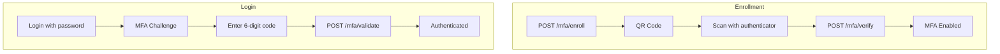
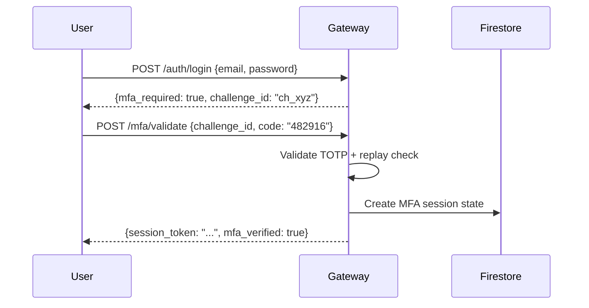
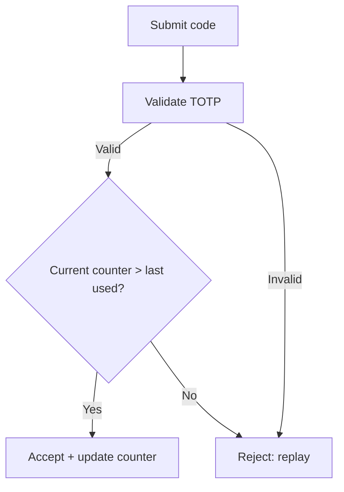

# Two-Factor Authentication (2FA/MFA)

agent.ceo supports Time-based One-Time Password (TOTP) two-factor authentication to secure user accounts. Phase 1 implements TOTP enrollment, login challenges, backup codes, and per-session MFA state with replay prevention.

## Overview



## TOTP Enrollment

### Step 1: Request Enrollment

```bash
POST /api/v1/mfa/enroll
Authorization: Bearer <session_token>
```

Response:

```json
{
  "secret": "JBSWY3DPEHPK3PXP",
  "qr_code_uri": "otpauth://totp/agent.ceo:user@example.com?secret=JBSWY3DPEHPK3PXP&issuer=agent.ceo",
  "qr_code_base64": "data:image/png;base64,iVBORw0KGgo...",
  "enrollment_id": "enroll_abc123",
  "expires_at": "2024-01-15T10:30:00Z"
}
```

### Step 2: Scan QR Code

The user scans the QR code with an authenticator app (Google Authenticator, Authy, 1Password).

### Step 3: Verify Enrollment

```bash
POST /api/v1/mfa/verify
{ "enrollment_id": "enroll_abc123", "code": "482916" }
```

Response:

```json
{
  "mfa_enabled": true,
  "backup_codes": [
    "a1b2c3d4e5", "f6g7h8i9j0", "k1l2m3n4o5", "p6q7r8s9t0", "u1v2w3x4y5",
    "z6a7b8c9d0", "e1f2g3h4i5", "j6k7l8m9n0", "o1p2q3r4s5", "t6u7v8w9x0"
  ]
}
```

!!! warning "Backup codes shown once"
    The 10 backup codes are stored as SHA-256 hashes and cannot be retrieved later.

## Login Challenge Flow



After 5 failed attempts, the challenge is invalidated and re-authentication is required.

## Backup Codes

| Property | Value |
|----------|-------|
| Count | 10 codes per enrollment |
| Format | 10 alphanumeric characters |
| Storage | SHA-256 hashed in Firestore |
| Usage | Single-use (consumed on validation) |

### Using a Backup Code

```bash
POST /api/v1/mfa/validate
{ "challenge_id": "ch_xyz789", "code": "a1b2c3d4e5", "type": "backup_code" }
```

### Storage Implementation

```python
import hashlib

def hash_backup_code(code: str) -> str:
    return hashlib.sha256(code.encode()).hexdigest()

# Firestore: users/{uid}/mfa/backup_codes
# [{"hash": "e3b0c44298fc...", "used": false}, ...]
```

## Per-Session MFA State

MFA state is tracked per-session in Firestore (not embedded in JWT), enabling immediate revocation:

```json
{
  "verified": true,
  "verified_at": "2024-01-15T10:01:30Z",
  "method": "totp",
  "counter": 48723456,
  "ip_address": "203.0.113.42",
  "expires_at": "2024-01-15T22:00:00Z"
}
```

### MFA Middleware

```python
async def require_mfa(request: Request) -> MFAState:
    """Verify active MFA session on protected endpoints."""
    session_id = extract_session_id(request)
    mfa_state = await get_mfa_state(session_id)
    if not mfa_state or not mfa_state.verified:
        raise HTTPException(403, "MFA verification required")
    if mfa_state.expires_at < datetime.utcnow():
        raise HTTPException(403, "MFA session expired")
    return mfa_state
```

## Replay Prevention

TOTP replay attacks are prevented via counter tracking:



```python
def validate_totp(user_id: str, code: str) -> bool:
    """Validate TOTP with replay prevention."""
    secret = get_user_totp_secret(user_id)
    totp = pyotp.TOTP(secret)
    if not totp.verify(code, valid_window=1):
        return False
    
    current_counter = int(datetime.utcnow().timestamp()) // 30
    last_counter = get_last_used_counter(user_id)
    if current_counter <= last_counter:
        log_security_event(user_id, "totp_replay_attempt")
        return False
    
    set_last_used_counter(user_id, current_counter)
    return True
```

## Security Properties

| Property | Implementation |
|----------|---------------|
| Secret storage | AES-256-GCM encrypted in Firestore |
| Code validity | 30s window + 1 period drift tolerance |
| Brute force protection | 5 attempts per challenge |
| Replay prevention | Counter rejects same time-step reuse |
| Backup codes | SHA-256 hashed, single-use |
| Session binding | MFA tied to specific session |
| Transport | All MFA endpoints require HTTPS |

## Account Recovery

If both authenticator and backup codes are lost:

1. User contacts support with identity verification
2. Admin disables MFA: `DELETE /api/v1/admin/users/{user_id}/mfa`
3. User re-enrolls on next login

!!! tip "Prefer authenticator apps"
    TOTP via apps is more secure than SMS-based 2FA, which is vulnerable to SIM-swap attacks.

!!! danger "Never log secrets or codes"
    TOTP secrets and submitted codes must never appear in application logs.

!!! info "Clock sync matters"
    The 1-period drift tolerance handles minor clock skew, but severely desynchronized devices will fail.

## Related Documentation

- [Security Reviews](./security-reviews.md) — MFA implementation auditing
- [System Architecture](../platform/architecture.md) — Firestore session storage
- [Getting Started](../getting-started/index.md) — Platform authentication overview
