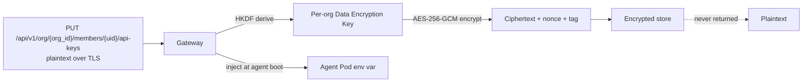
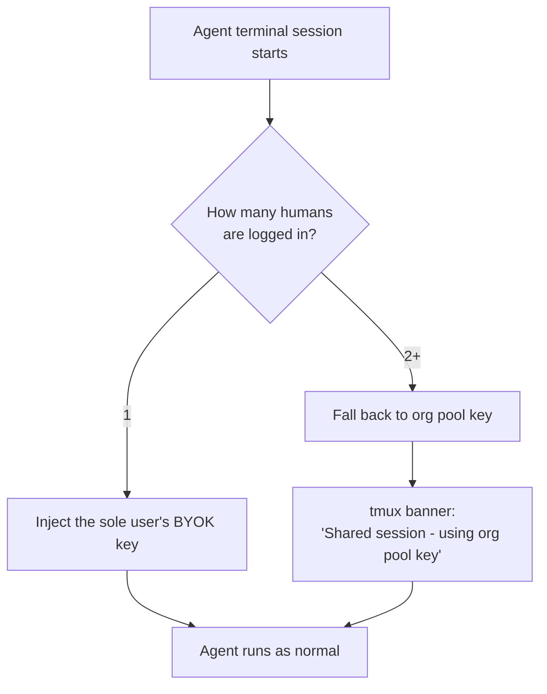

# Bring Your Own Provider Keys (BYOK)

By default, agents in your organization spend through the **org pool** key — one key per provider, billed to the org, observable in aggregate. BYOK lets each [member](./members.md) attach their own provider keys so spend is attributable to them personally, and so they keep direct control of their rate limits and billing relationship with the upstream provider.

## Why BYOK

| Org pool key | BYOK |
|--------------|------|
| One key per provider per org | One key per (member, provider) |
| Spend rolled up at the org | Spend attributable to the individual |
| Rate limits shared across the org | Member's own rate-limit ceiling |
| Provider relationship is GenBrain's | Provider relationship is the member's |
| Always available | Available only when the member is the sole human on the agent terminal — see [Multi-User Constraint](#multi-user-constraint) |

BYOK is the right choice when:

- A member wants their own monthly bill from Anthropic / OpenAI / etc.
- A team needs per-person spend attribution for chargeback
- A power user wants to use their elevated rate-limit tier

The org pool key is the right choice when:

- You want central billing and a single invoice
- Many humans share an agent terminal simultaneously
- A member has not yet configured their own key (automatic fallback)

## Supported Providers

| Provider | `provider` | Default env var injected into agent pod |
|----------|------------|-----------------------------------------|
| Anthropic | `anthropic` | `ANTHROPIC_API_KEY` |
| OpenAI | `openai` | `OPENAI_API_KEY` |
| Google / Gemini | `gemini` | `GOOGLE_API_KEY` |
| Groq | `groq` | `GROQ_API_KEY` |
| DeepSeek | `deepseek` | `DEEPSEEK_API_KEY` |
| Mistral | `mistral` | `MISTRAL_API_KEY` |
| Cohere | `cohere` | `COHERE_API_KEY` |
| HuggingFace | `huggingface` | `HUGGINGFACE_API_KEY` |
| Custom | `custom` | Required `envVar` override |

For `custom`, you must supply your own `envVar` (e.g. `MY_VENDOR_API_KEY`). The platform makes no assumption about its format and does not validate against the provider.

## Storage & Encryption



| Property | Value |
|----------|-------|
| At-rest cipher | AES-256-GCM |
| Per-org Data Encryption Key | HKDF-derived from the platform root KEK + `orgId` |
| Nonce | 96-bit random, fresh per encryption |
| Plaintext lifetime | One request — the `PUT` body. Never echoed back, never logged |
| Reads | Return metadata only (provider, last 4 chars, scope, createdAt) |
| Injection point | Mounted into the agent pod as the provider's env var at session start |

!!! danger "We cannot recover a lost key"
    Plaintext leaves the gateway exactly once, on `PUT`. After that we hold only ciphertext. If you lose your local copy, rotate it with the provider and `PUT` the new value.

## Per-Agent Scoping

You decide which of **your** agents a key applies to. A `developer` member can only scope a key to the agents they have been granted access to (see [Members & Invitations](./members.md#per-agent-access)). Owners and admins can scope to any agent in the org.

| `agentIds` field | Effect |
|------------------|--------|
| Omitted or `[]` | Applies to every agent the member has access to |
| `["cto", "fullstack"]` | Applies only to those agents |
| Any agent the member does **not** have access to | Rejected with `403` |

## Create or Update a Key

The provider is supplied **in the request body**, not in the URL. The endpoint is a single `PUT` against the member's `api-keys` collection — sending the same `provider` again replaces the prior value.

```bash
curl -X PUT https://api.agent.ceo/api/v1/org/$ORG_ID/members/$UID/api-keys \
  -H "Authorization: Bearer $TOKEN" \
  -H "Content-Type: application/json" \
  -d '{
    "provider": "anthropic",
    "value": "sk-ant-api03-...",
    "agentIds": ["cto", "fullstack"]
  }'
```

Response:

```json
{
  "provider": "anthropic",
  "envVar": "ANTHROPIC_API_KEY",
  "last4": "Yh2A",
  "agentIds": ["cto", "fullstack"],
  "createdAt": "2026-05-13T14:32:01Z",
  "updatedAt": "2026-05-13T14:32:01Z"
}
```

For a custom provider, pass an explicit `envVar`:

```bash
curl -X PUT https://api.agent.ceo/api/v1/org/$ORG_ID/members/$UID/api-keys \
  -H "Authorization: Bearer $TOKEN" \
  -H "Content-Type: application/json" \
  -d '{
    "provider": "custom",
    "value": "...",
    "envVar": "FIREWORKS_API_KEY",
    "agentIds": []
  }'
```

## List Your Keys

```bash
curl https://api.agent.ceo/api/v1/org/$ORG_ID/members/$UID/api-keys \
  -H "Authorization: Bearer $TOKEN"
```

```json
{
  "keys": [
    { "provider": "anthropic", "envVar": "ANTHROPIC_API_KEY", "last4": "Yh2A", "agentIds": ["cto"] },
    { "provider": "openai",    "envVar": "OPENAI_API_KEY",    "last4": "9pQ1", "agentIds": [] }
  ]
}
```

## Delete a Key

The `{provider}` segment of the DELETE path picks which entry to remove from the member's key set:

```bash
curl -X DELETE https://api.agent.ceo/api/v1/org/$ORG_ID/members/$UID/api-keys/anthropic \
  -H "Authorization: Bearer $TOKEN"
```

Deletion is immediate. Any agent session that was injected with this key continues using the value already in its environment until the next pod restart; new sessions fall back to the org pool key.

## Multi-User Constraint

This is the most important behavioural rule of BYOK and you should design your team workflow around it.



When the agent terminal has **a single human** connected (one ttyd login active), the announcer injects that member's BYOK key for the matched provider. Spend goes to their provider account.

When the agent terminal has **two or more humans** connected at the same time, BYOK is **disabled** for that session:

- The announcer falls back to the org pool key.
- A tmux banner appears at the top of the terminal: `Shared session — using org pool key, BYOK suspended`.
- All work performed during the shared window is billed to the org.

Once the session returns to a single user (everyone but one disconnects), the next prompt is again subject to BYOK selection.

!!! warning "Why this exists"
    BYOK without this guard would let User B's prompts run on User A's key just because User A happened to be logged in. The fallback eliminates the ambiguity — shared work is org-paid, solo work is BYOK.

!!! tip "Want guaranteed BYOK?"
    Open a fresh terminal session and don't share it. If you want to pair-program over the same agent, use the org pool key intentionally and let chargeback happen at the org level.

## Dashboard

The dashboard has a **Provider Keys** panel under your member profile. From there you can:

- Paste a new key for any supported provider
- Pick which of your agents it applies to (multi-select)
- See a list of existing keys with masked last-4
- Rotate or delete

> Screenshot: *Provider Keys panel (placeholder — to be added).*

## Precedence

When an agent session boots, the announcer resolves the key for each provider in this order:

1. **Member's BYOK key** scoped to this agent — if a single user is connected
2. **Member's BYOK key** with `agentIds: []` — if a single user is connected
3. **Org pool key** for the provider — always available
4. **Refuse to start** — if no key is available at all

## Related Documentation

- [Members & Invitations](./members.md) — who is allowed to have BYOK keys for which agents
- [Organizations](../concepts/organizations.md) — org pool keys are owned at this level
- [Secrets Management](../deployment/secrets.md) — how encrypted keys are injected into pods
- [Billing & Pricing](../getting-started/billing.md) — what the org pays vs what BYOK members pay
