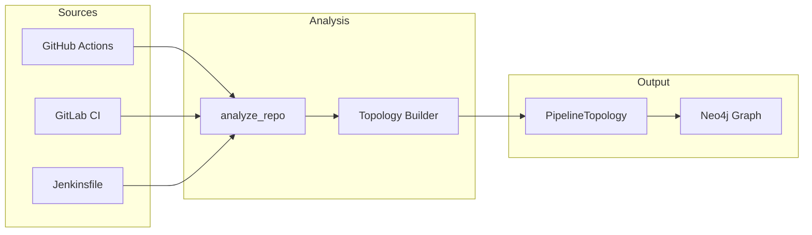
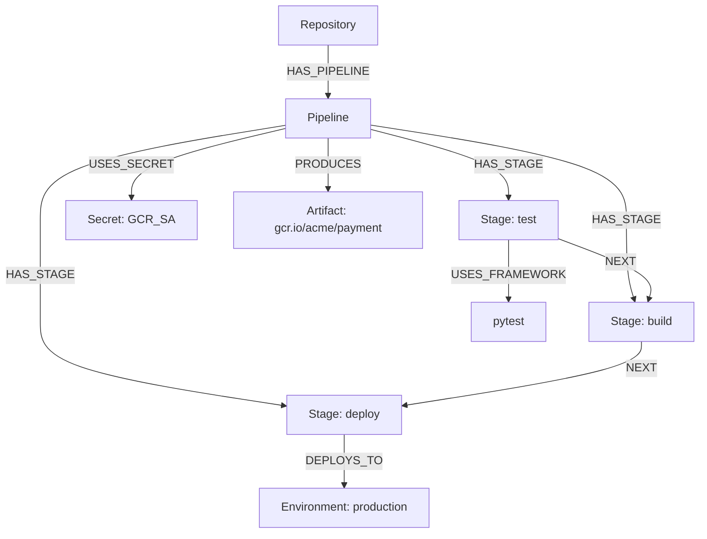

# CI/CD Analysis

CI/CD Analysis automatically parses pipeline configurations from repositories — GitHub Actions, GitLab CI, and Jenkinsfiles — into a structured `PipelineTopology` model. This gives agents a comprehensive understanding of how code flows from commit to production.

## Overview



## The analyze_repo Function

```python
from conductor.src.cicd import analyze_repo

topology = analyze_repo(
    repo_url="https://github.com/acme/payment-service",
    branch="main",
    include_secrets=True  # referenced secret names only, not values
)
```

### PipelineTopology Model

```python
@dataclass
class PipelineTopology:
    repo_url: str
    branch: str
    pipeline_type: str          # "github_actions" | "gitlab_ci" | "jenkins"
    stages: list[Stage]
    environments: list[Environment]
    deploy_targets: list[DeployTarget]
    secrets_referenced: list[str]
    build_tools: list[str]
    test_frameworks: list[str]
    artifacts: list[Artifact]
    triggers: list[Trigger]

@dataclass
class Stage:
    name: str
    jobs: list[Job]
    depends_on: list[str]
    condition: str | None

@dataclass
class DeployTarget:
    environment: str
    provider: str               # "gke", "ecs", "cloudrun", "vercel"
    region: str | None
    method: str                 # "kubectl apply", "helm upgrade", etc.

@dataclass
class Artifact:
    name: str
    type: str                   # "docker_image", "npm_package", "binary"
    registry: str | None
```

## Pipeline Parsing Examples

### GitHub Actions

```yaml
# .github/workflows/deploy.yml
name: Deploy
on:
  push:
    branches: [main]
jobs:
  test:
    runs-on: ubuntu-latest
    services:
      postgres:
        image: postgres:15
    steps:
      - run: pytest tests/
  build:
    needs: test
    steps:
      - uses: docker/build-push-action@v5
        with:
          tags: gcr.io/acme/payment:${{ github.sha }}
  deploy:
    needs: build
    environment: production
    steps:
      - run: kubectl set image deployment/payment payment=gcr.io/acme/payment:${{ github.sha }}
```

### GitLab CI

```yaml
stages: [test, build, deploy]
test:
  script: pytest tests/ --cov
deploy_production:
  environment: { name: production, url: https://acme.com }
  script: helm upgrade payment ./chart --set image.tag=$CI_COMMIT_SHA
  only: [main]
  when: manual
```

### Jenkinsfile

```groovy
pipeline {
    stages {
        stage('Test') { steps { sh 'gradle test' } }
        stage('Deploy') {
            when { branch 'main' }
            steps { sh 'kubectl apply -f k8s/' }
        }
    }
}
```

## Persisting to Neo4j

```python
from conductor.src.cicd import write_topology_to_neo4j
write_topology_to_neo4j(topology, org_id="org_abc")
```

### Graph Structure



## Detection Tables

### Build Tools

| Detected Tool | Indicators |
|--------------|------------|
| Docker | `docker build`, `Dockerfile`, `build-push-action` |
| Gradle | `gradle`, `./gradlew`, `build.gradle` |
| Maven | `mvn`, `pom.xml` |
| npm | `npm run`, `package.json` scripts |
| Helm | `helm upgrade`, `helm install` |

### Test Frameworks

| Framework | Indicators |
|-----------|------------|
| pytest | `pytest`, `python -m pytest` |
| Jest | `jest`, `npx jest` |
| JUnit | `gradle test`, `mvn test` |
| Cypress | `cypress run` |
| Go test | `go test ./...` |

### Secret References

| Platform | Pattern |
|----------|---------|
| GitHub Actions | `${{ secrets.NAME }}` |
| GitLab CI | `$VARIABLE_NAME` (CI/CD settings) |
| Jenkins | `credentials('name')`, `withCredentials` |

!!! warning "Secrets are names only"
    The analysis only stores secret **names** (e.g., `GCR_SERVICE_ACCOUNT`), never values. Agents use names to understand dependencies, not to access credentials.

## Use Cases

- **Pre-deployment understanding** — Agents query pipeline topology to follow correct deploy process
- **Security auditing** — CSO reviews for secrets exposure, missing approval gates, unsafe images
- **Dependency mapping** — Understand which services share deployment infrastructure

!!! tip "Automatic re-analysis"
    Pipelines are re-analyzed during [knowledge base refresh cycles](./knowledge-base.md#refresh-cycles), keeping topology current as pipelines evolve.

## Related Documentation

- [Knowledge Base](./knowledge-base.md) — Where pipeline data is stored
- [Cloud Discovery](./cloud-discovery.md) — Infrastructure that pipelines deploy to
- [Security Reviews](./security-reviews.md) — Pipeline security auditing
- [Skill Generation](./skill-generation.md) — Deploy skills use pipeline data
