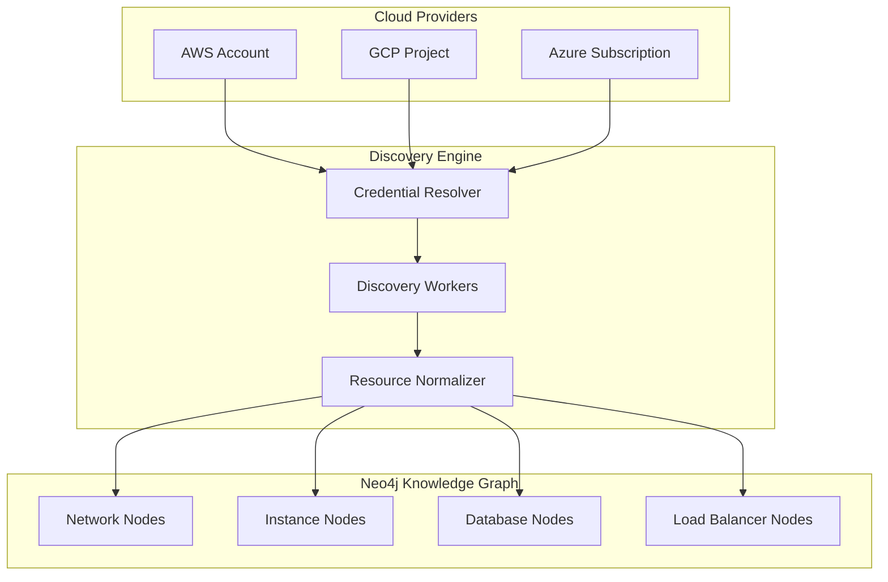
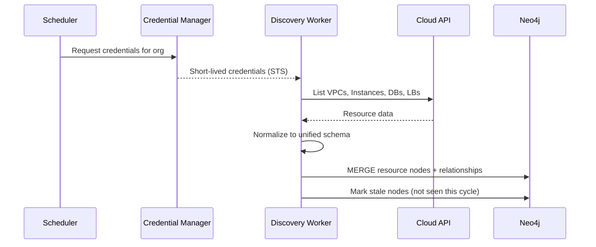
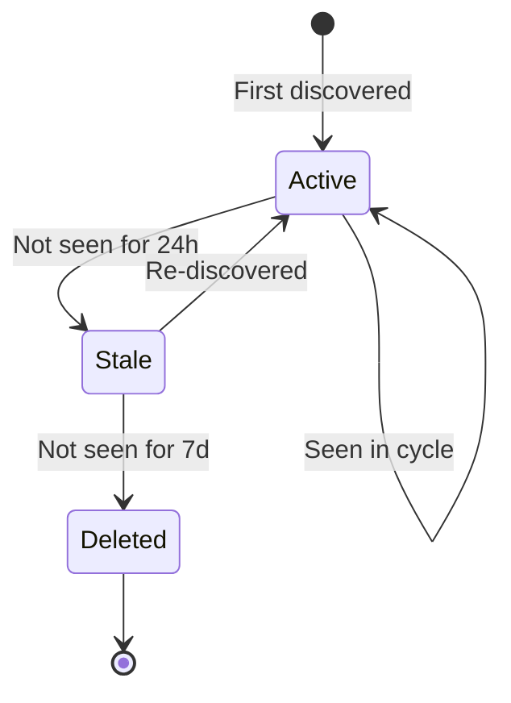

# Cloud Discovery

Cloud Discovery enables agents to automatically map an organization's cloud infrastructure — VPCs, compute instances, databases, load balancers, and their relationships — into the Neo4j knowledge graph. This gives agents a live understanding of the production environment without manual documentation.

## Overview



## Supported Providers

| Provider | Tool | Resources Discovered |
|----------|------|---------------------|
| AWS | `aws_discover` | VPCs, EC2, RDS, ALB/NLB, S3, Lambda, ECS, EKS |
| GCP | `gcp_discover` | VPCs, GCE, Cloud SQL, GKE, Cloud Run, LBs |
| Azure | `azure_discover` | VNets, VMs, Azure SQL, AKS, App Service, LBs |

!!! note "Internal-only tools"
    The discovery tools (`aws_discover`, `gcp_discover`, `azure_discover`) are internal platform operations not exposed to end users. They run within the agent infrastructure with elevated read-only permissions.

## Discovery Process



## Resource Graph Model

Resources are stored with a unified schema regardless of provider:

```cypher
(:CloudResource:Instance {
  id: "i-0def456",
  provider: "aws",
  region: "us-east-1",
  name: "api-server-1",
  instance_type: "m5.xlarge",
  state: "running",
  private_ip: "10.0.1.42",
  org_id: "org_abc",
  discovered_at: datetime(),
  last_seen: datetime()
})
```

### Relationships

```cypher
(:Instance)-[:IN_NETWORK]->(:Network)
(:Instance)-[:CONNECTS_TO]->(:Database)
(:LoadBalancer)-[:ROUTES_TO]->(:Instance)
(:Network)-[:PEERS_WITH]->(:Network)
(:Instance)-[:MEMBER_OF]->(:Cluster)
```

## Credential Management

Cloud credentials are managed through Kubernetes secrets, never stored in agent memory.

### Required Permissions

| Provider | Required Permissions |
|----------|---------------------|
| AWS | `ec2:Describe*`, `rds:Describe*`, `elasticloadbalancing:Describe*`, `s3:ListAllMyBuckets` |
| GCP | `compute.viewer`, `cloudsql.viewer`, `container.viewer` |
| Azure | `Reader` role on subscription |

### Credential Resolution Priority

1. **K8s Secret** — mounted at `/var/run/secrets/cloud/`
2. **Workload Identity** (GCP) — automatic via GKE metadata
3. **IAM Role** (AWS) — via IRSA annotations on the service account
4. **Managed Identity** (Azure) — via pod identity webhook

!!! warning "Least privilege"
    Discovery credentials must be **read-only**. The platform validates IAM policies before accepting credentials. Any write permissions trigger a security alert.

## Configuration

```yaml
# cloud-discovery-config.yaml
discovery:
  enabled: true
  schedule: "0 */4 * * *"  # Every 4 hours
  accounts:
    - provider: aws
      account_id: "123456789012"
      regions: ["us-east-1", "us-west-2"]
      role_arn: "arn:aws:iam::123456789012:role/agent-ceo-discovery"
      credential_secret: "aws-discovery-creds"
    - provider: gcp
      project_id: "acme-production"
      regions: ["us-central1", "us-east4"]
      credential_secret: "gcp-discovery-sa"
  staleness:
    mark_stale_after: "24h"
    delete_stale_after: "7d"
```

## Staleness Lifecycle



## Resource Normalization

| Field | Description | Example |
|-------|-------------|---------|
| `id` | Provider-specific unique ID | `i-0abc123`, `gce-vm-456` |
| `provider` | Cloud provider | `aws`, `gcp`, `azure` |
| `resource_type` | Normalized type | `instance`, `database`, `network` |
| `region` | Deployment region | `us-east-1`, `us-central1` |
| `name` | Human-readable name | `api-server-prod` |
| `state` | Current state | `running`, `stopped`, `available` |
| `tags` | Key-value metadata | `{"env": "production"}` |

## Use Cases

- **Architecture understanding** — Agents query infrastructure before making recommendations
- **Incident response** — Quickly identify affected resources and their dependencies
- **Cost analysis** — Discovered instance types enable optimization suggestions

!!! danger "Credential isolation"
    Cloud credentials are stored in org-scoped K8s secrets and never cross organization boundaries.

!!! warning "No write operations"
    Discovery is strictly read-only. The tools cannot modify, create, or delete cloud resources. This is enforced at the IAM level.

## Related Documentation

- [Knowledge Base](./knowledge-base.md) — How discovered resources integrate with the wiki
- [Security Reviews](./security-reviews.md) — Security auditing of discovery configuration
- [System Architecture](../platform/architecture.md) — Overall platform architecture
