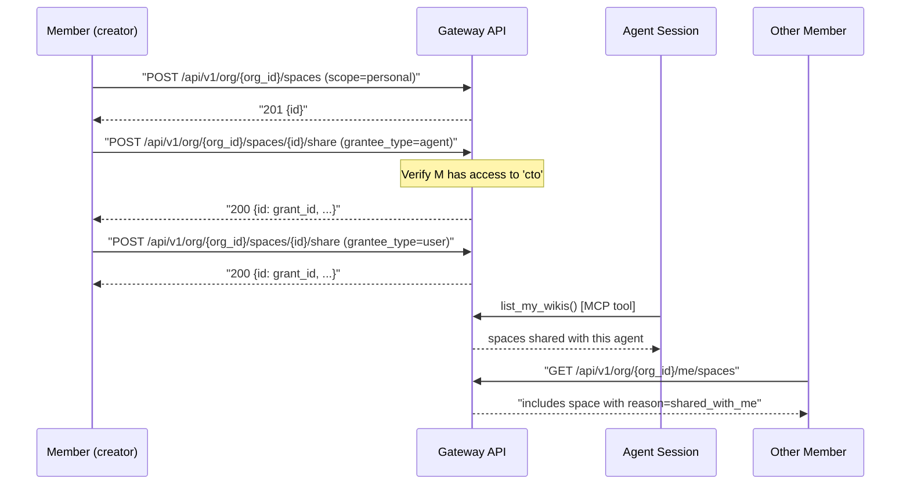
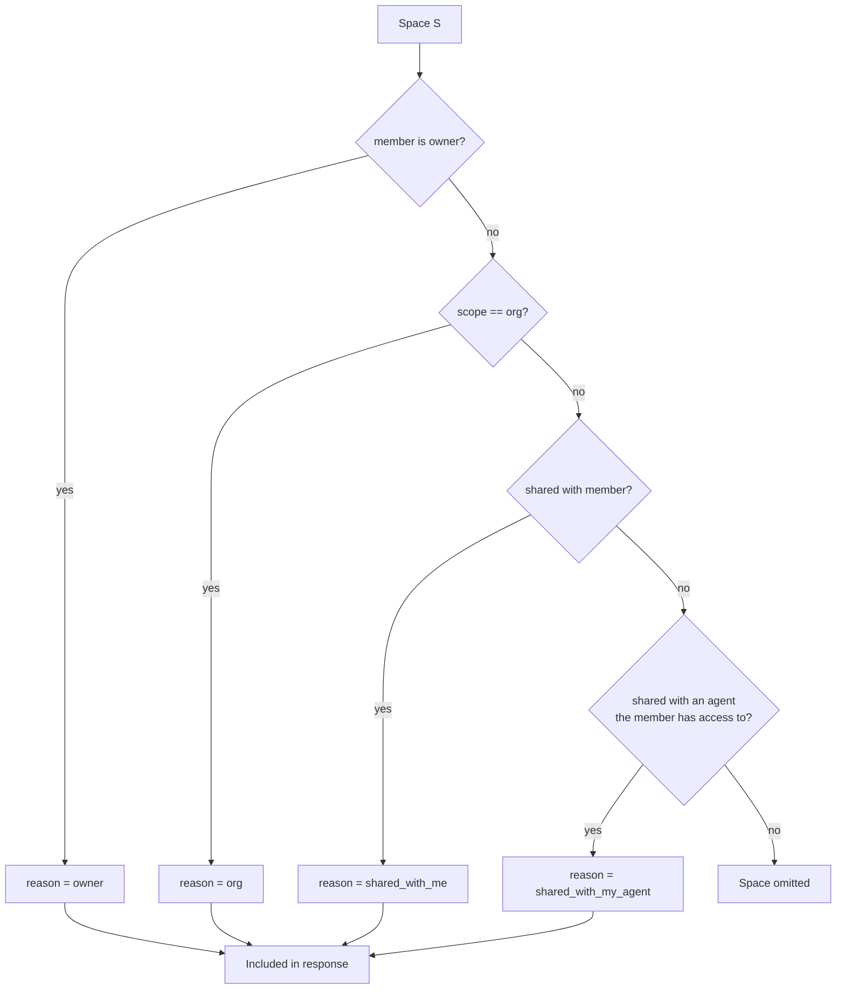

# Knowledge Bases per Member

The [knowledge base](./knowledge-base.md) is the org's long-term memory — a Neo4j wiki with vector search. Until now it was implicitly org-wide. The **per-member sharing** layer adds personal scope, explicit sharing with agents and with other members, and a clear audience model so a member always knows *why* a given space is visible to them.

For the underlying graph model and ingestion pipeline, see [Knowledge Graph (concept)](../concepts/knowledge-base.md) and the [Knowledge Base feature page](./knowledge-base.md). This page only covers ownership, sharing, and audience resolution.

## Scopes

Every knowledge base (called a **space** in the underlying model) has one of two scopes:

| Scope | Default audience | Who can read | Who can write | Typical use |
|-------|------------------|--------------|---------------|-------------|
| `personal` | Only the creator | Creator + members the creator shared with + agents the creator shared with | Creator (and members the creator gave `read_write`) | "My research notes", "My private playbook" |
| `org` | Every member of the org | All members of the org | Creator + admins/owners + members with `read_write` | "Engineering wiki", "Customer-facing FAQ" |

A `personal` space can be **shared upward** with specific agents and specific other members. An `org` space starts wide and cannot be narrowed.

## Audience Reason

When a member asks for the spaces they can see (`GET /api/v1/org/{org_id}/me/spaces`), every result carries a single `reason` string explaining the visibility:

| `reason` | Meaning |
|----------|---------|
| `owner` | The member created the space |
| `org` | The space has scope `org` and the member belongs to the org |
| `shared_with_me` | The owner explicitly shared the space with this member |
| `shared_with_my_agent` | The space is shared with an agent the member has access to — they see it because they operate the agent |

The field is **a single string**, not an array. When more than one reason could apply, the rollup picks the strongest one in the order shown above (`owner` outranks `org`, which outranks `shared_with_me`, which outranks `shared_with_my_agent`).

## Sharing Flow



## Create a Space

```bash
curl -X POST https://api.agent.ceo/api/v1/org/$ORG_ID/spaces \
  -H "Authorization: Bearer $TOKEN" \
  -H "Content-Type: application/json" \
  -d '{
    "name": "Ada research notes",
    "scope": "personal",
    "slug": "ada-research"
  }'
```

Response:

```json
{
  "id": "sp_01HX7T...",
  "name": "Ada research notes",
  "slug": "ada-research",
  "scope": "personal",
  "ownerUid": "fb_uid_ada",
  "createdAt": "2026-05-13T14:40:00Z"
}
```

To create an org-wide space the member must be an owner or admin:

```bash
curl -X POST https://api.agent.ceo/api/v1/org/$ORG_ID/spaces \
  -H "Authorization: Bearer $TOKEN" \
  -d '{ "name": "Engineering wiki", "scope": "org" }'
```

## Sharing — One Endpoint, Three Grantee Types

All sharing — whether the grantee is another member, an agent, or even another org — flows through a single endpoint with a `grantee_type` discriminator. There is **no** `/spaces/{id}/agents` or `/spaces/{id}/members` route.

| `grantee_type` | `grantee_id` is | Notes |
|----------------|-----------------|-------|
| `user` | another member's `uid` | Member must be in the same org |
| `agent` | an agent id (e.g. `cto`) | Caller must have access to that agent (unless owner/admin) |
| `org` | an org id | Cross-org share — recipient org sees the space |

| `permission` | Grantee can |
|--------------|-------------|
| `read` | Vector-search, list, fetch pages |
| `write` | Read + create / update pages |
| `admin` | Read/write + delete pages, manage grants |

### Share with an agent

```bash
curl -X POST https://api.agent.ceo/api/v1/org/$ORG_ID/spaces/$SPACE_ID/share \
  -H "Authorization: Bearer $TOKEN" \
  -H "Content-Type: application/json" \
  -d '{
    "grantee_type": "agent",
    "grantee_id": "cto",
    "permission": "read"
  }'
```

Response — **save the `id` field, it is the `grant_id` you will need to revoke later**:

```json
{
  "id": "gr_01HX7V...",
  "permission": "read",
  "grantee_type": "agent",
  "grantee_id": "cto",
  "spaceId": "sp_01HX7T...",
  "createdAt": "2026-05-13T14:42:00Z"
}
```

!!! info "Membership gating"
    A non-admin member can only share with agents they themselves have access to. Owners and admins can share any space with any agent in the org, including agents the original creator cannot see.

### Share with another member

```bash
curl -X POST https://api.agent.ceo/api/v1/org/$ORG_ID/spaces/$SPACE_ID/share \
  -H "Authorization: Bearer $TOKEN" \
  -H "Content-Type: application/json" \
  -d '{
    "grantee_type": "user",
    "grantee_id": "fb_uid_leo",
    "permission": "read"
  }'
```

The recipient now sees this space in `GET /api/v1/org/{org_id}/me/spaces` with `reason: "shared_with_me"`.

## Revoke a Share

Revocation is **by `grant_id`** — the `id` you got back from the original share response — not by grantee. You must keep that `id` around if you want to revoke later.

```bash
# Capture the grant id from the share response, then DELETE it
GRANT_ID=$(curl -sX POST https://api.agent.ceo/api/v1/org/$ORG_ID/spaces/$SPACE_ID/share \
  -H "Authorization: Bearer $TOKEN" \
  -H "Content-Type: application/json" \
  -d '{"grantee_type":"agent","grantee_id":"cto","permission":"read"}' \
  | jq -r '.id')

curl -X DELETE https://api.agent.ceo/api/v1/org/$ORG_ID/spaces/$SPACE_ID/share/$GRANT_ID \
  -H "Authorization: Bearer $TOKEN"
```

The same `DELETE .../share/{grant_id}` shape works for `user`, `agent`, and `org` grants — the grantee type is encoded in the grant record itself, not in the URL.

Revocation is effective immediately — in-flight agent reads complete, the next read fails closed.

## List Spaces the Member Can See

```bash
curl https://api.agent.ceo/api/v1/org/$ORG_ID/me/spaces \
  -H "Authorization: Bearer $TOKEN"
```

Response — note that `reason` is a single string, not an array:

```json
{
  "spaces": [
    {
      "id": "sp_01...",
      "name": "Ada research notes",
      "scope": "personal",
      "reason": "owner"
    },
    {
      "id": "sp_02...",
      "name": "Engineering wiki",
      "scope": "org",
      "reason": "org"
    },
    {
      "id": "sp_03...",
      "name": "Leo's playbook",
      "scope": "personal",
      "reason": "shared_with_me"
    },
    {
      "id": "sp_04...",
      "name": "DevOps runbook",
      "scope": "personal",
      "reason": "shared_with_my_agent"
    }
  ]
}
```

## Inside an Agent Session: `list_my_wikis`

From a ttyd terminal the agent can call:

```
list_my_wikis()
```

This MCP tool returns every space attached to **this agent**, regardless of which member attached it. It is the agent's view of "what wikis am I supposed to consult for this work?" — and it composes with the normal wiki tools:

```
list_my_wikis()
  -> sp_01 (Ada research notes), sp_07 (Engineering wiki)

wiki_graph_vector_search(space="sp_01", query="HNSW ef_search tuning")
wiki_get_page(space="sp_07", title="Deployment Guide")
```

## Audience Resolution Rules

When `GET /api/v1/org/{org_id}/me/spaces` is computed, each space the member can see is tagged with the **single strongest** reason. The checks fire in priority order and the first match wins:



If none of the four reasons apply, the space is omitted from the response entirely.

## Integration with the Existing Wiki

This sharing layer is a thin grant-management overlay on the Neo4j wiki described in:

- [Knowledge Base (feature)](./knowledge-base.md) — ingestion, vector search, page types
- [Knowledge Graph (concept)](../concepts/knowledge-base.md) — node model, traversal, spaces

In particular:

- Spaces created via `POST /api/v1/org/{org_id}/spaces` become normal `Space` nodes in Neo4j
- Agent grants from this page (`grantee_type=agent`) become `(:Agent)-[:HAS_ACCESS]->(:Space)` edges
- Member grants (`grantee_type=user`) become `(:Member)-[:HAS_ACCESS]->(:Space)` edges
- Org grants (`grantee_type=org`) become `(:Org)-[:HAS_ACCESS]->(:Space)` edges
- All existing wiki tools (`wiki_ingest_text`, `wiki_get_page`, `wiki_graph_vector_search`, `wiki_list`) honour these grants without code changes

## Related Documentation

- [Members & Invitations](./members.md) — membership is the gate for agent sharing
- [Bring Your Own Provider Keys (BYOK)](./api-keys.md) — the parallel per-member feature for spend
- [Knowledge Base (feature)](./knowledge-base.md) — the wiki itself
- [Knowledge Graph (concept)](../concepts/knowledge-base.md) — graph model + relationships
