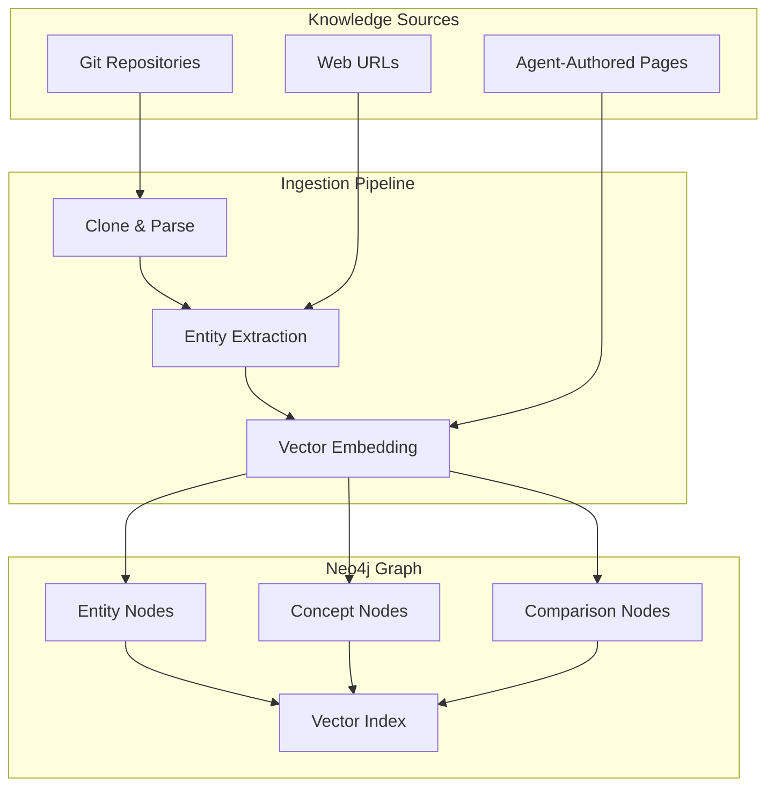
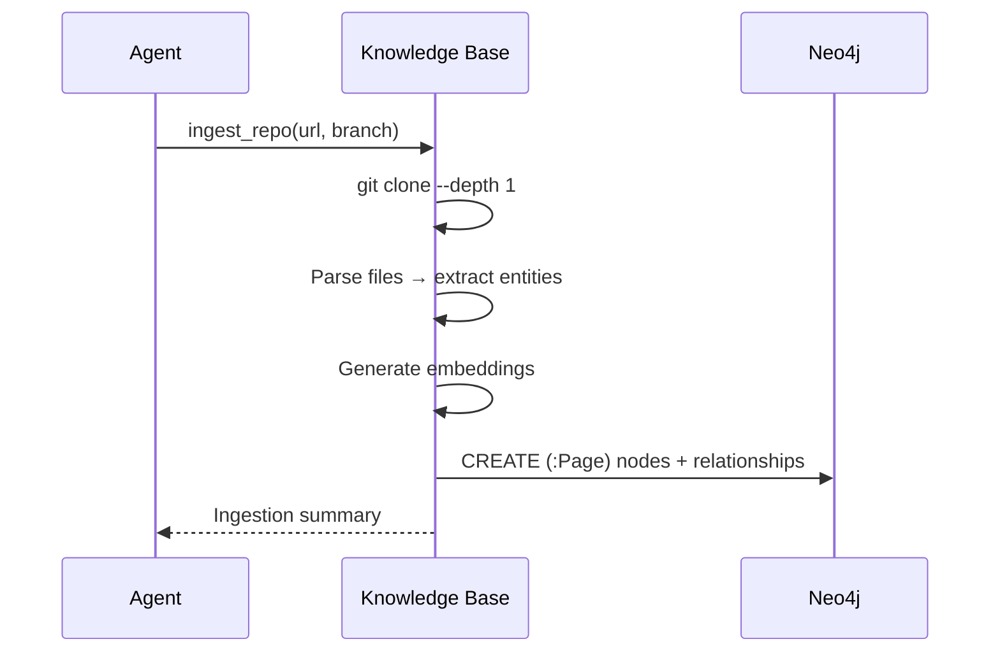
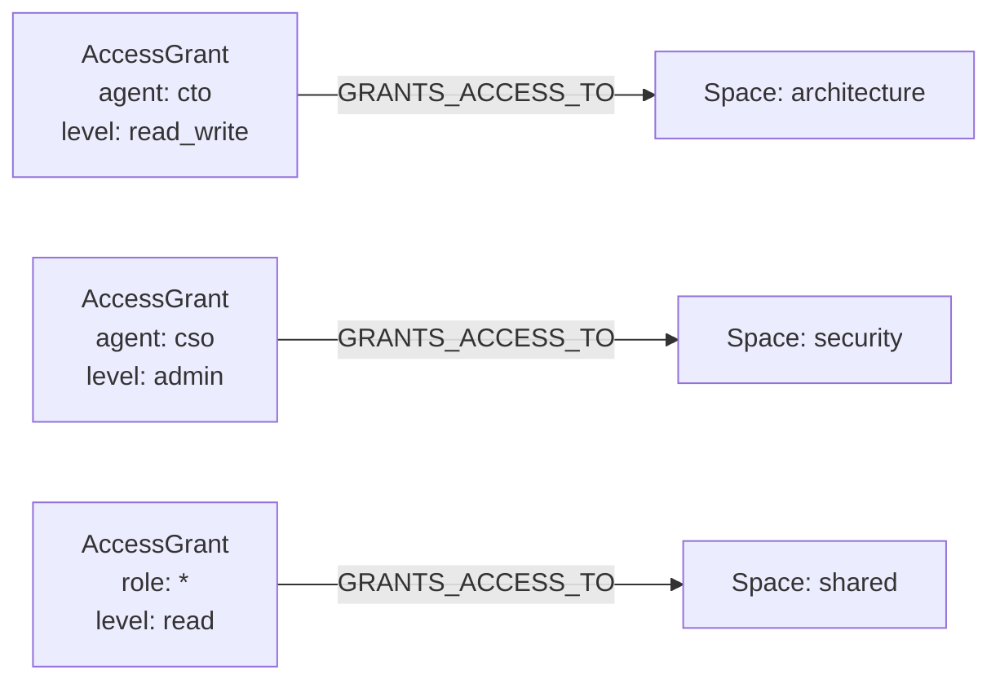

# Knowledge Base

The Knowledge Base is agent.ceo's organizational memory — a Neo4j-backed graph database that stores entities, concepts, and their relationships. Agents use it to share architectural decisions, ingest documentation, and retrieve context via vector similarity search.

## Architecture Overview



## Page Types

| Page Type | Purpose | Example |
|-----------|---------|---------|
| **entity** | A specific thing — service, tool, person, repo | "Gateway Service", "NATS JetStream" |
| **concept** | An abstract idea, pattern, or principle | "Event Sourcing", "mTLS Authentication" |
| **comparison** | Side-by-side analysis of alternatives | "PostgreSQL vs Firestore", "REST vs gRPC" |

Each page is stored as a Neo4j node:

```cypher
(:Page {
  id: "gateway-service",
  title: "Gateway Service",
  page_type: "entity",
  content: "The Gateway is a FastAPI application that...",
  space: "architecture",
  embedding: [0.012, -0.034, ...],  // 1536-dim vector
  created_at: datetime(),
  updated_at: datetime()
})
```

## Tools

### wiki_ingest_text

Create or update a wiki page from text content.

```json
{
  "tool": "wiki_ingest_text",
  "params": {
    "title": "NATS JetStream Configuration",
    "page_type": "entity",
    "content": "NATS JetStream is configured with...",
    "space": "infrastructure",
    "tags": ["nats", "messaging", "config"]
  }
}
```

### wiki_ingest_url

Fetch and ingest content from a URL — extracts text, generates embeddings, and creates page nodes.

```json
{
  "tool": "wiki_ingest_url",
  "params": {
    "url": "https://docs.nats.io/nats-concepts/jetstream",
    "page_type": "concept",
    "space": "references"
  }
}
```

### wiki_graph_vector_search

Semantic search across all pages using vector similarity.

```json
{
  "tool": "wiki_graph_vector_search",
  "params": { "query": "how do agents communicate", "limit": 5 }
}
```

### wiki_get_page

Retrieve a specific page by ID or title.

```json
{ "tool": "wiki_get_page", "params": { "title": "Gateway Service" } }
```

### wiki_list

List pages filtered by space or page type.

```json
{ "tool": "wiki_list", "params": { "space": "architecture", "page_type": "entity" } }
```

## Git Repository Ingestion

The knowledge base ingests entire git repositories, parsing source files into graph entities.



### Parsing Strategy

| File Pattern | Extracted Entities |
|-------------|-------------------|
| `*.py` (FastAPI) | API routes, models, dependencies |
| `Dockerfile` | Base image, ports, build stages |
| `*.yaml` (K8s) | Services, deployments, configmaps |
| `*.md` | Documentation pages as-is |
| `.github/workflows/` | CI/CD stages and targets |
| `package.json` / `requirements.txt` | Dependencies and versions |

## Wiki Spaces and Access Control

Pages are organized into **spaces** with access control via `AccessGrant` nodes:



### Access Levels

| Level | Permissions |
|-------|------------|
| `read` | Query pages, vector search within space |
| `read_write` | Read + create/update pages |
| `admin` | Read/write + manage grants, delete pages |

## Refresh Cycles

Knowledge base content is kept current through scheduled cron jobs:

| Schedule | Action |
|----------|--------|
| Every 6 hours | Re-embed pages with stale vectors |
| Daily (02:00 UTC) | Re-ingest git repos with `auto_refresh: true` |
| Weekly (Sunday 04:00 UTC) | Prune orphaned nodes |

```yaml
# knowledge-base-cron.yaml
refresh:
  embeddings:
    schedule: "0 */6 * * *"
    staleness_threshold: "7d"
  repositories:
    schedule: "0 2 * * *"
  pruning:
    schedule: "0 4 * * 0"
```

## Graph Relationships

Pages are connected through typed relationships enabling traversal:

```cypher
(:Page {title: "Gateway"})-[:DEPENDS_ON]->(:Page {title: "Firestore"})
(:Page {title: "Gateway"})-[:EXPOSES]->(:Page {title: "Auth API"})
(:Page {title: "CTO Agent"})-[:OWNS]->(:Page {title: "Gateway"})
```

!!! tip "Write to the KB after architectural decisions"
    Whenever an agent makes a significant decision, it should ingest that decision as a concept page. This creates institutional memory that other agents can reference.

!!! warning "Embedding model consistency"
    All pages use `text-embedding-3-small` (1536 dimensions). Changing the model requires a full re-embedding cycle.

!!! info "Size limits"
    Individual page content is limited to 50,000 characters. For larger documents, split into multiple linked pages.

## Related Documentation

- [System Architecture](../platform/architecture.md) — Neo4j's role in the platform
- [AI Agents](../concepts/agents.md) — How agents access the knowledge base
- [Security Reviews](./security-reviews.md) — KB security auditing
- [CI/CD Analysis](./cicd-analysis.md) — Pipeline topology stored in the KB
