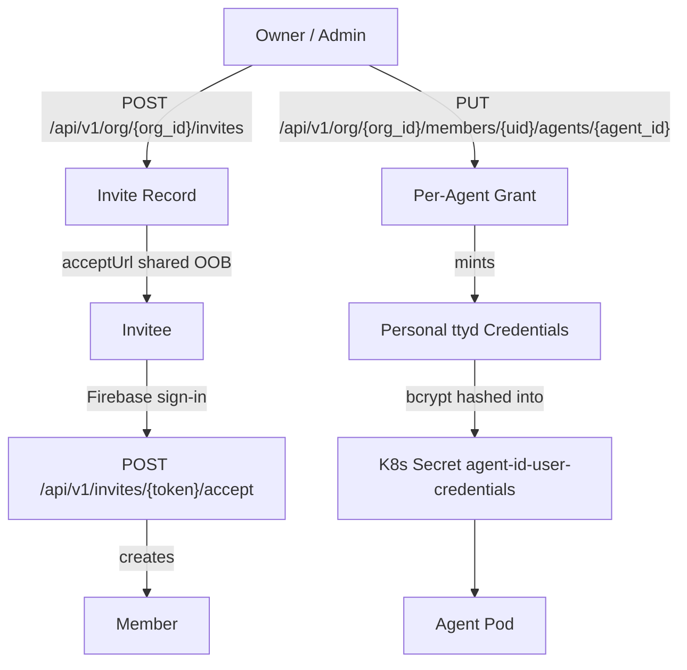
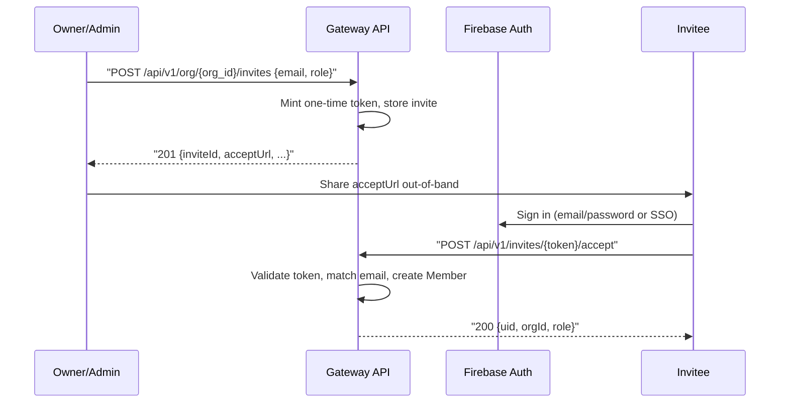
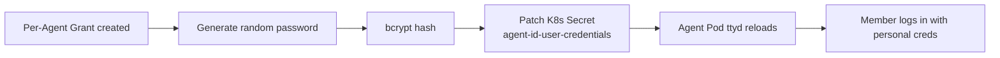
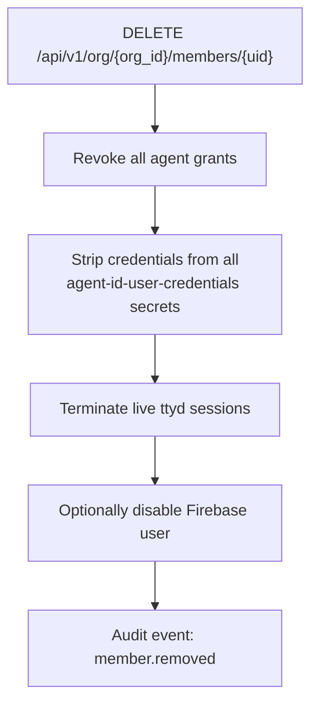

# Members & Invitations

An [organization](../concepts/organizations.md) is more than its agents — it is also the humans who run, supervise, and answer to those agents. The **members** subsystem lets an owner or admin invite teammates, place them at a specific platform role, grant them access to individual agents, and mint them personal credentials for the agent's [ttyd terminal](../ui/terminal.md).

## Overview



## Roles

Every member has exactly one platform role. The role controls what they can do across the org; agent-level access is granted separately (see [Per-Agent Access](#per-agent-access)).

| Role | Manage org | Invite & remove members | Create / delete agents | Operate agents (terminal, tasks) | View org tree & roster |
|------|------------|-------------------------|------------------------|----------------------------------|------------------------|
| `owner` | Yes | Yes | Yes | Yes | Yes |
| `admin` | No (settings only) | Yes | Yes | Yes | Yes |
| `developer` | No | No | No | Only on granted agents | Yes |
| `viewer` | No | No | No | No — read-only | Yes |

!!! info "Owners are special"
    There is always at least one owner. The last owner cannot be demoted or removed until another member is promoted to `owner`.

## Invitation Flow

Invitations are **out-of-band**: the platform mints a one-time `acceptUrl` and returns it to the inviter, who shares it via their own channel (email, Slack, SMS). The platform itself does not send the invitation message.



### Create an invite

```bash
curl -X POST https://api.agent.ceo/api/v1/org/$ORG_ID/invites \
  -H "Authorization: Bearer $TOKEN" \
  -H "Content-Type: application/json" \
  -d '{
    "email": "ada@example.com",
    "role": "developer",
    "ttlDays": 7
  }'
```

Response:

```json
{
  "inviteId": "inv_01HX7Q...",
  "email": "ada@example.com",
  "role": "developer",
  "acceptUrl": "https://app.agent.ceo/invites/eyJhbGciOi...",
  "expiresAt": "2026-05-20T12:00:00Z",
  "status": "pending"
}
```

You may also pre-stage per-agent permissions via the optional `initialAgentPermissions` field so the new member lands with grants already applied at acceptance time.

### Public invite preview

Anyone holding the invite link can preview it without a Firebase JWT — the token is in the URL:

```bash
curl https://api.agent.ceo/api/v1/invites/eyJhbGciOi...
```

### Accept an invite

The invitee must first sign into Firebase Auth with the **same email address** the invite was sent to. The token travels in the **URL**, not the body:

```bash
curl -X POST https://api.agent.ceo/api/v1/invites/eyJhbGciOi.../accept \
  -H "Authorization: Bearer $TOKEN"
```

Response:

```json
{
  "uid": "fb_uid_abcd1234",
  "orgId": "acme-corp",
  "role": "developer",
  "joinedAt": "2026-05-13T14:21:08Z"
}
```

!!! warning "One-time tokens"
    The `acceptUrl` token is single-use and expires after `ttlDays` (default 7). If the invitee misses the window, the inviter must issue a new invite. Tokens cannot be reused or transferred to a different email.

### List members

```bash
curl https://api.agent.ceo/api/v1/org/$ORG_ID/members \
  -H "Authorization: Bearer $TOKEN"
```

Pending invites are listed separately:

```bash
curl https://api.agent.ceo/api/v1/org/$ORG_ID/invites \
  -H "Authorization: Bearer $TOKEN"
```

A single member can be fetched directly:

```bash
curl https://api.agent.ceo/api/v1/org/$ORG_ID/members/$UID \
  -H "Authorization: Bearer $TOKEN"
```

Response (abbreviated):

```json
{
  "members": [
    { "uid": "fb_uid_ada", "email": "ada@example.com", "role": "developer", "agents": ["cto", "fullstack"] },
    { "uid": "fb_uid_leo", "email": "leo@example.com", "role": "admin",     "agents": [] }
  ]
}
```

### Change a member's role

```bash
curl -X PATCH https://api.agent.ceo/api/v1/org/$ORG_ID/members/$UID \
  -H "Authorization: Bearer $TOKEN" \
  -H "Content-Type: application/json" \
  -d '{ "role": "admin" }'
```

### Cancel a pending invite

```bash
curl -X DELETE https://api.agent.ceo/api/v1/org/$ORG_ID/invites/$INVITE_ID \
  -H "Authorization: Bearer $TOKEN"
```

## Per-Agent Access

A member's platform role decides what they can do **org-wide**. To let a `developer` actually open an agent's terminal or assign it tasks, the owner/admin must grant access to that specific agent.

Each grant carries two flags:

| Flag | Allows |
|------|--------|
| `canManage` | Edit agent config, change model, restart pod, edit CLAUDE.md, manage knowledge access |
| `canOperate` | Open the ttyd terminal, send messages, assign tasks, view live logs |

A member may have `canOperate=true, canManage=false` (run the agent day-to-day without changing its setup) or both, or neither (no access at all).

### Grant a member access to an agent

Per-agent access uses `PUT` against the explicit `{agent_id}` — the grant is keyed on the (uid, agent_id) pair:

```bash
curl -X PUT https://api.agent.ceo/api/v1/org/$ORG_ID/members/$UID/agents/$AGENT_ID \
  -H "Authorization: Bearer $TOKEN" \
  -H "Content-Type: application/json" \
  -d '{
    "canManage": false,
    "canOperate": true
  }'
```

Response — note the **one-time** plaintext password:

```json
{
  "agentId": "cto",
  "canManage": false,
  "canOperate": true,
  "username": "ada-cto",
  "password": "x4Tn-9Ks2-Pq7B-rVu1-...",
  "warning": "This password is shown once and never returned again. Store it now."
}
```

To list the agents already granted to a member:

```bash
curl https://api.agent.ceo/api/v1/org/$ORG_ID/members/$UID/agents \
  -H "Authorization: Bearer $TOKEN"
```

### Rotate credentials

```bash
curl -X POST "https://api.agent.ceo/api/v1/org/$ORG_ID/members/$UID/agents/$AGENT_ID/credentials:rotate" \
  -H "Authorization: Bearer $TOKEN"
```

The response again contains a one-time `username` / `password` pair; the previous password is immediately invalidated.

### Revoke access

```bash
curl -X DELETE https://api.agent.ceo/api/v1/org/$ORG_ID/members/$UID/agents/$AGENT_ID \
  -H "Authorization: Bearer $TOKEN"
```

Revocation removes the grant **and** deletes the member's ttyd credential entry from the agent's K8s secret. Any open terminal sessions for that member are terminated on the next reconcile.

## Personal ttyd Credentials

The agent's terminal pop-up is served by **ttyd** inside the agent pod. Historically, every member with access used the same shared username/password — a security and audit hazard. The platform now mints **personal credentials per (member, agent)** pair.



| Property | Value |
|----------|-------|
| Username format | `{member-slug}-{agent-id}` (e.g. `ada-cto`) |
| Password | 32-char random, shown **once** to the member |
| Storage | bcrypt-hashed inside the K8s secret `agent-<agentId>-user-credentials` |
| Concurrent logins | Supported — multiple members can be in the same ttyd session at once, each with their own login |
| Rotation | Owner/admin can rotate via `POST /api/v1/org/{org_id}/members/{uid}/agents/{agent_id}/credentials:rotate` |

!!! danger "Plaintext password is shown once"
    The plaintext password is returned exactly once in the grant response (or the rotate response). It is **never** retrievable afterwards. If lost, rotate the credential.

### Audit trail

Every ttyd login produces an audit event with the resolved `memberId`, `agentId`, and `sourceIp`. This is how multi-user terminal access becomes auditable — you can answer "who typed that command at 02:43?" because each typist had their own login.

## Org Visibility

Regardless of agent grants, **every member can see the org roster and tree** in the dashboard:

- Member list (email, role, agents granted) — `GET /api/v1/org/{org_id}/members`
- Agent tree (which agent reports to whom, status, role) — `GET /api/v1/org/{org_id}/tree`
- Pending invites — `GET /api/v1/org/{org_id}/invites`

What changes by role is what they can *do* — viewers can only look; developers can only act on their granted agents; admins/owners can act on everything.

```bash
curl https://api.agent.ceo/api/v1/org/$ORG_ID/tree \
  -H "Authorization: Bearer $TOKEN"
```

## Removal & Credential Cascade

Removing a member triggers a clean cascade:



```bash
curl -X DELETE https://api.agent.ceo/api/v1/org/$ORG_ID/members/$UID \
  -H "Authorization: Bearer $TOKEN"
```

!!! tip "Demote before delete"
    If you only need to pause access — for example during a leave — switch the member to `viewer` rather than deleting them. Their grant history is preserved and can be restored.

## Related Documentation

- [Organizations](../concepts/organizations.md) — the multi-tenant container that owns members
- [Bring Your Own Provider Keys (BYOK)](./api-keys.md) — per-member spend attribution
- [Knowledge Bases per Member](./knowledge-base-sharing.md) — what each member can read
- [Terminal](../ui/terminal.md) — how the ttyd terminal pop-up works
- [Roles (concept)](../concepts/roles.md) — agent-side roles, distinct from human platform roles
