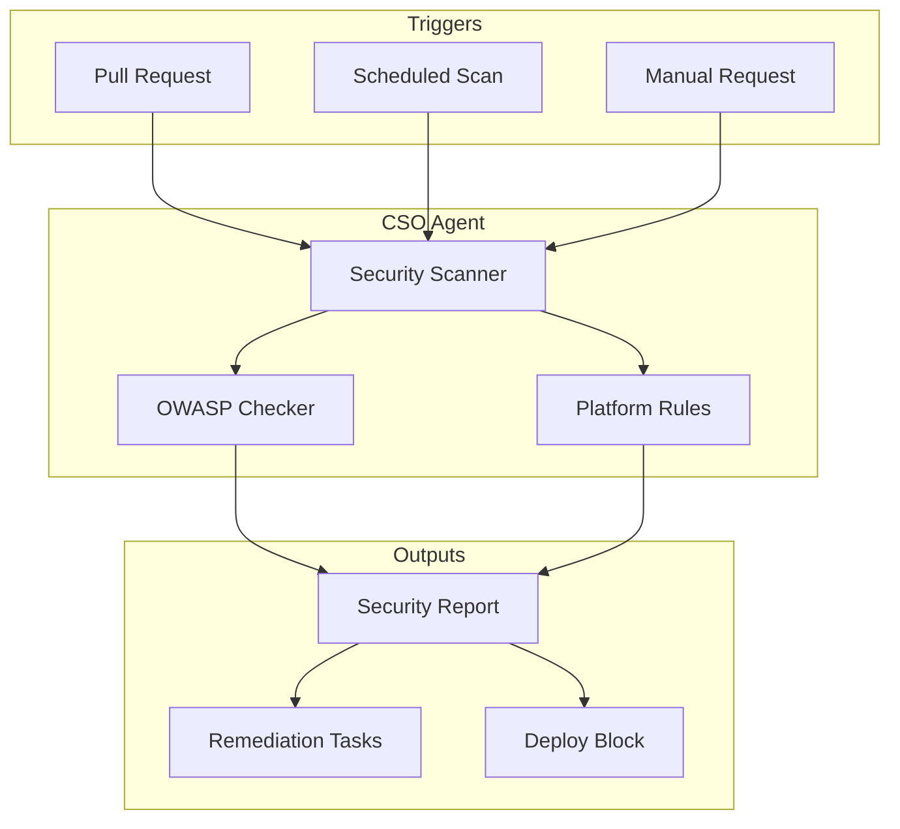
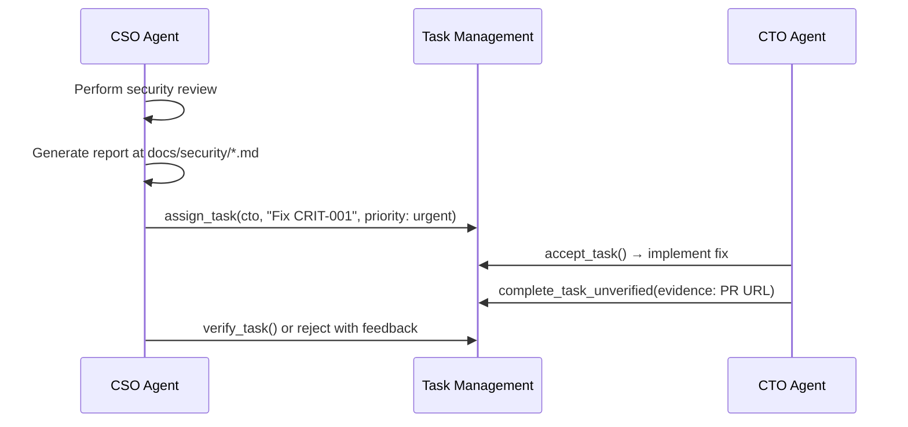

# Security Reviews

The agent.ceo platform includes automated security auditing performed by the Chief Security Officer (CSO) agent. Security reviews identify vulnerabilities across code, configuration, and infrastructure — generating actionable reports and driving remediation through the task management system.

## Overview



## Review Types

### NATS Security

| Check | What It Looks For |
|-------|-------------------|
| Subject injection | Unvalidated agent IDs in subject construction |
| Message forgery | Missing sender verification on inbox messages |
| Credential exposure | NATS credentials in logs or error messages |
| Access control bypass | Cross-org subject access without authorization |

### API Security

| Check | What It Looks For |
|-------|-------------------|
| Unauthenticated mutations | POST/PUT/DELETE without auth middleware |
| Broken access control | Missing org_id scoping on queries |
| Injection | Unsanitized input in database queries |
| Rate limit gaps | Endpoints without rate limiting |
| CORS misconfiguration | Overly permissive cross-origin settings |

### Knowledge Base Security

| Check | What It Looks For |
|-------|-------------------|
| Access control bypass | Pages accessible outside granted spaces |
| Cypher injection | User input interpolated into Cypher queries |
| Credential leakage | Secrets stored in page content |
| Cross-org data access | Queries returning another org's data |

### Cloud Discovery Security

| Check | What It Looks For |
|-------|-------------------|
| Overprivileged credentials | IAM roles with write permissions |
| Credential rotation | Stale credentials past rotation deadline |
| Network exposure | Wide-open security groups (0.0.0.0/0) |

### Skill Generation Security

| Check | What It Looks For |
|-------|-------------------|
| Code injection | Unsanitized Neo4j data in generated code |
| Command injection | User-controlled input in shell commands |
| Privilege escalation | Skills requesting elevated permissions |

## Remediation Workflow



### Severity-to-Priority Mapping

| Severity | TMS Priority | SLA | Action |
|----------|-------------|-----|--------|
| Critical | `urgent` | 4 hours | Block deploys, immediate task |
| High | `high` | 24 hours | Task assigned, tracked |
| Medium | `normal` | 1 week | Scheduled in next sprint |
| Low | `low` | 1 month | Backlog item |

## Report Format

Reports are generated as markdown in `docs/security/`:

```markdown
# Security Review: API Gateway
**Date**: 2024-01-15 | **Reviewer**: CSO Agent | **Risk Level**: HIGH

## Critical Findings

### [CRIT-001] Unauthenticated Mutation: POST /api/v1/orgs/{id}/agents
- **OWASP**: A01 Broken Access Control
- **Location**: `gateway/src/routes/agents.py:142`
- **Impact**: Unauthenticated requests can provision agents
- **Remediation**: Add `current_user = Depends(require_auth)`

### [CRIT-002] Cypher Injection in Wiki Search
- **OWASP**: A03 Injection
- **Location**: `conductor/src/wiki/search.py:87`
- **Impact**: Attacker could extract any Neo4j data
- **Remediation**: Use parameterized queries
```

## Scheduled Reviews

| Review Type | Schedule | Scope |
|-------------|----------|-------|
| API Security | Daily | Changed files since last review |
| NATS Security | Weekly (Monday) | All messaging code |
| KB Security | Weekly (Wednesday) | Wiki tools and queries |
| Cloud Discovery | Weekly (Friday) | Discovery configs |
| Skill Generation | On each generation | Newly generated skills |
| Full Platform | Monthly (1st) | Entire codebase |

## Triggering Reviews

### Automatic (sensitive file changes)

```python
SECURITY_PATHS = [
    "*/routes/*.py",       # API endpoints
    "*/auth/*.py",         # Authentication logic
    "**/nats/**",          # Messaging layer
    "**/neo4j/**",         # Database queries
]
```

### Manual via messaging

```json
{
  "tool": "send_to_agent",
  "params": {
    "agent_id": "cso",
    "message": "Please review gateway/src/routes/webhooks.py for security issues."
  }
}
```

!!! danger "Critical findings block deploys"
    Any critical finding automatically blocks deployment pipelines until remediated and verified.

!!! tip "Shift left with pre-commit"
    The CSO agent recommends pre-commit hooks that catch common issues before code reaches review.

!!! info "Security reviews are non-negotiable"
    All agents are configured to request security review for auth, authorization, and data access changes.

## Related Documentation

- [Task Management](./task-management.md) — How remediation tasks are tracked
- [Knowledge Base](./knowledge-base.md) — KB security model details
- [Cloud Discovery](./cloud-discovery.md) — Cloud credential security
- [2FA/MFA](./2fa-mfa.md) — Authentication security
