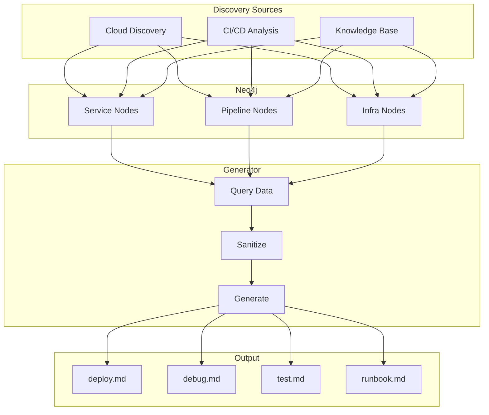

# Skill Generation

Skill Generation automatically creates actionable agent skills from services discovered in the Neo4j knowledge graph. When a new service is mapped — through [cloud discovery](./cloud-discovery.md), [CI/CD analysis](./cicd-analysis.md), or [knowledge base ingestion](./knowledge-base.md) — the platform generates deploy, debug, test, and runbook skills tailored to that service.

## Overview



## Skill Types

| SkillType | Purpose | Key Content |
|-----------|---------|-------------|
| `deploy` | Deploy or redeploy the service | Commands, env configs, rollback steps |
| `debug` | Troubleshoot issues | Log locations, common errors, health checks |
| `test` | Run service tests | Test commands, fixtures, coverage expectations |
| `runbook` | Operational procedures | Startup/shutdown, scaling, backup/restore |

```python
from enum import Enum

class SkillType(str, Enum):
    DEPLOY = "deploy"
    DEBUG = "debug"
    TEST = "test"
    RUNBOOK = "runbook"
```

## Generator Functions

### _generate_deploy_skill

Uses pipeline topology and infrastructure data:

```python
def _generate_deploy_skill(service: ServiceData) -> str:
    """Generate deploy skill from service metadata."""
    template = DEPLOY_TEMPLATE.format(
        service_name=service.name,
        registry=service.artifacts[0].registry,
        cluster=service.deploy_target.cluster,
        namespace=service.deploy_target.namespace,
        deploy_method=service.deploy_target.method,
        rollback_command=_infer_rollback(service),
        health_check=service.health_endpoint,
    )
    return template
```

### _generate_debug_skill

Uses service endpoints, log config, and known error patterns:

```python
def _generate_debug_skill(service: ServiceData) -> str:
    """Generate debug skill — logs, health checks, dependency graph."""
    template = DEBUG_TEMPLATE.format(
        service_name=service.name,
        log_command=_infer_log_command(service),
        health_endpoint=service.health_endpoint,
        dependencies=service.dependencies,
        common_errors=service.known_errors,
    )
    return template
```

### _generate_test_skill

Uses test frameworks and commands from CI/CD analysis:

```python
def _generate_test_skill(service: ServiceData) -> str:
    """Generate test skill — frameworks, commands, coverage."""
    template = TEST_TEMPLATE.format(
        test_framework=service.test_framework,
        test_command=service.test_command,
        coverage_threshold=service.coverage_threshold or "80%",
    )
    return template
```

### _generate_runbook_skill

Uses deployment and infrastructure configuration:

```python
def _generate_runbook_skill(service: ServiceData) -> str:
    """Generate runbook — startup, shutdown, scaling, backup."""
    template = RUNBOOK_TEMPLATE.format(
        replicas=service.replicas,
        cpu_limit=service.cpu_limit,
        memory_limit=service.memory_limit,
        scaling_config=service.hpa_config,
        database=service.database,
    )
    return template
```

## Directory Structure

```
skills/
├── payment-service/
│   ├── deploy.md
│   ├── debug.md
│   ├── test.md
│   └── runbook.md
├── gateway/
│   ├── deploy.md
│   ├── debug.md
│   ├── test.md
│   └── runbook.md
└── _templates/
    ├── deploy.md.j2
    ├── debug.md.j2
    ├── test.md.j2
    └── runbook.md.j2
```

## Data Sanitization

All Neo4j data is sanitized before use in skill generation to prevent code injection:

```python
def sanitize_neo4j_data(data: dict) -> dict:
    """Sanitize data before code generation.
    
    Rules:
    1. Strip shell metacharacters from command templates
    2. Escape backticks and template literals
    3. Remove embedded script tags
    4. Validate URLs against allowlist patterns
    5. Truncate fields to maximum safe lengths
    6. Reject data containing known injection patterns
    """
    sanitized = {}
    for key, value in data.items():
        if isinstance(value, str):
            value = _strip_shell_metacharacters(value)
            value = _escape_template_literals(value)
            value = _validate_url_if_url_field(key, value)
            value = _truncate(value, MAX_FIELD_LENGTH)
            _reject_injection_patterns(value)
        sanitized[key] = value
    return sanitized
```

| Check | Prevents |
|-------|----------|
| Shell metacharacter stripping | Command injection via `; && \|` |
| Template literal escaping | Template injection in markdown |
| URL validation | SSRF via malicious URLs |
| Length truncation | Buffer overflow in consumers |
| Injection pattern rejection | Known SQL/Cypher/shell payloads |

## Trigger Conditions

| Trigger | Action |
|---------|--------|
| New service discovered | Generate all 4 skills |
| Pipeline topology updated | Regenerate deploy + test |
| Infrastructure changed | Regenerate deploy + runbook |
| Manual request | Regenerate specified types |
| Known error pattern added | Regenerate debug skill |

## Quality Validation

Generated skills are validated before being written:

- Has valid YAML frontmatter (title, description)
- Contains required sections for skill type
- No placeholder values remain (`${UNKNOWN}`, `TODO`)
- Commands are syntactically valid
- Referenced resources exist in Neo4j

!!! danger "Never skip sanitization"
    Generated skills are executable by agents. Unsanitized Neo4j data could result in agents executing injected commands.

!!! tip "Keep service metadata current"
    Skills are only as good as the underlying data. Ensure discovery and CI/CD analysis run on schedule.

!!! info "Custom templates"
    Organizations can override templates in `_templates/` to match their conventions. Custom templates inherit sanitization.

## Related Documentation

- [Knowledge Base](./knowledge-base.md) — Source data for skill generation
- [Cloud Discovery](./cloud-discovery.md) — Infrastructure data feeding skills
- [CI/CD Analysis](./cicd-analysis.md) — Pipeline data for deploy/test skills
- [Security Reviews](./security-reviews.md) — Security auditing of generated skills
