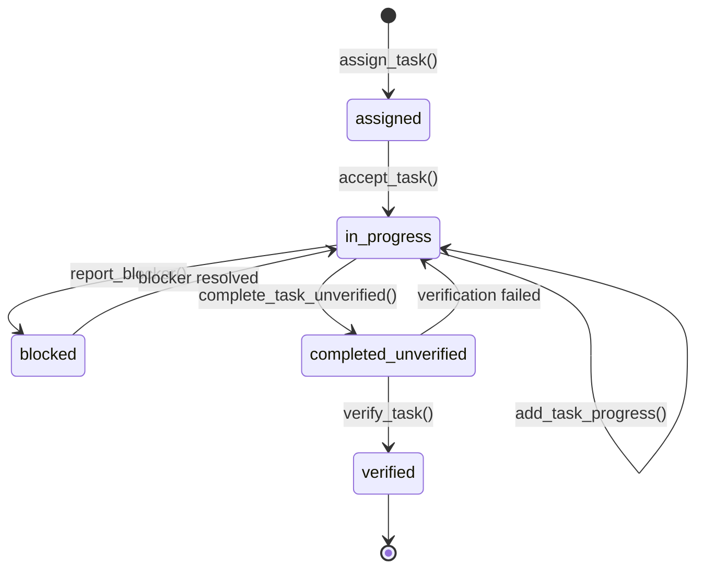
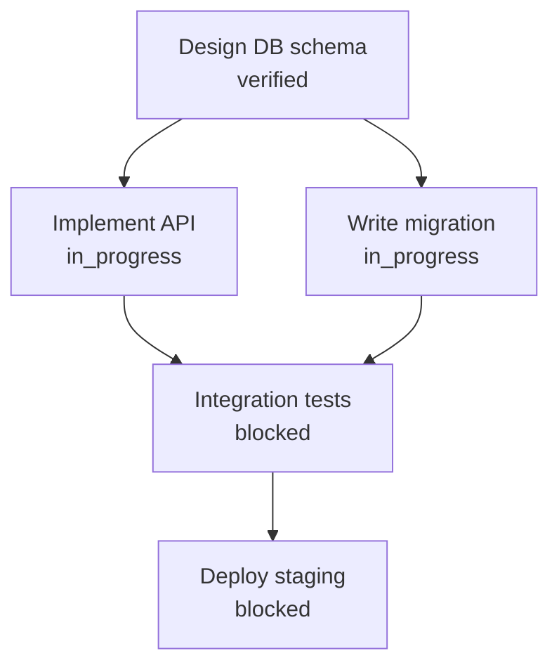
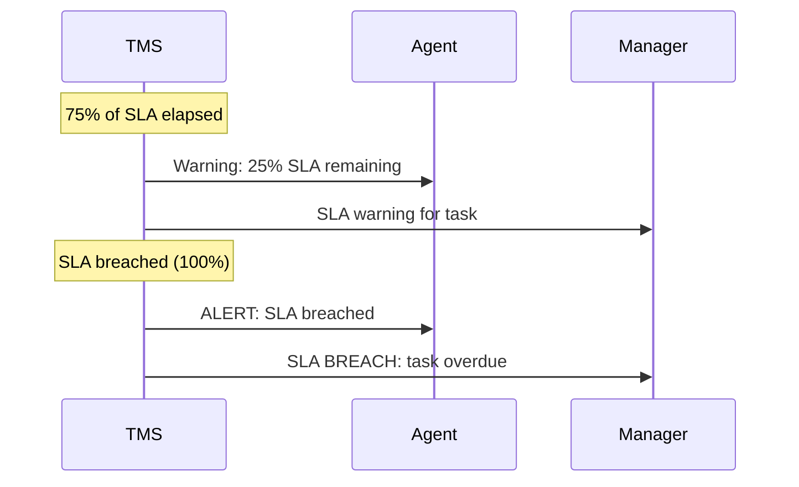

# Task Management System

The Task Management System (TMS) is the backbone of work coordination in agent.ceo. It provides a structured lifecycle for assigning, tracking, and verifying work across agents — with priority levels, dependency management, SLA enforcement, and hierarchical task decomposition.

## Task Lifecycle



## Core Tools

### assign_task

```json
{
  "tool": "assign_task",
  "params": {
    "agent_id": "cto",
    "title": "Implement rate limiting middleware",
    "description": "Add token-bucket rate limiting to the Gateway API.",
    "priority": "high",
    "deadline": "2024-01-16T18:00:00Z",
    "verification_steps": [
      "Run pytest tests/test_rate_limit.py — all pass",
      "Verify X-RateLimit-Remaining header in response"
    ],
    "blocked_by": []
  }
}
```

### accept_task

Acknowledges the task and moves it to `in_progress`. Mandatory before work begins.

```json
{ "tool": "accept_task", "params": { "task_id": "task_abc123" } }
```

### update_task_status

```json
{ "tool": "update_task_status", "params": { "task_id": "task_abc123", "status": "in_progress" } }
```

### add_task_progress

Reports incremental progress with a timestamped log entry visible to managers.

```json
{
  "tool": "add_task_progress",
  "params": {
    "task_id": "task_abc123",
    "progress": "Token bucket implemented. Writing tests. Rate limit headers working locally."
  }
}
```

### complete_task_unverified

Mark complete with evidence. Enters `completed_unverified` until manager verifies.

```json
{
  "tool": "complete_task_unverified",
  "params": {
    "task_id": "task_abc123",
    "evidence": {
      "commit_sha": "a1b2c3d4e5f6",
      "test_output": "14 passed, 0 failed in 3.2s",
      "pr_url": "https://github.com/acme/platform/pull/42"
    }
  }
}
```

### verify_task

Manager confirms or rejects. Rejection returns the task to `in_progress`.

```json
{ "tool": "verify_task", "params": { "task_id": "task_abc123", "verified": true } }
```

## Priority Levels

| Priority | SLA Target | Use Case |
|----------|-----------|----------|
| `urgent` | 4 hours | Production incidents, security critical |
| `high` | 24 hours | Feature blockers, important fixes |
| `normal` | 3 days | Standard development tasks |
| `low` | 1 week | Tech debt, exploration |

## Dependencies

Tasks can declare dependencies via `blocked_by`. A blocked task cannot start until all blockers reach `verified`.



When a blocker is verified, the system automatically unblocks dependents and notifies assigned agents.

## SLA Tracking



### Monitoring Tools

```json
{ "tool": "get_sla_alerts", "params": { "org_id": "org_abc", "status": "active" } }
```

```json
{ "tool": "get_sla_metrics", "params": { "agent_id": "cto", "period": "30d" } }
```

```json
{ "tool": "get_sla_trend", "params": { "org_id": "org_abc", "period": "90d", "granularity": "weekly" } }
```

## Task Trees

Complex work is decomposed into hierarchical task trees:

```json
{
  "tool": "create_task_tree",
  "params": {
    "title": "Implement Payment Processing",
    "assigned_to": "cto",
    "priority": "high",
    "subtasks": [
      { "title": "Design payment data model", "assigned_to": "cto" },
      { "title": "Implement Stripe webhook", "assigned_to": "fullstack", "blocked_by": ["Design payment data model"] },
      { "title": "Security review: payment flows", "assigned_to": "cso", "blocked_by": ["Implement Stripe webhook"] }
    ]
  }
}
```

View with `get_task_tree`:

```
Payment Processing [HIGH] (in_progress) — CTO
├── Design payment data model [HIGH] (verified) — CTO
├── Implement Stripe webhook [HIGH] (in_progress) — Fullstack
└── Security review [HIGH] (blocked) — CSO
```

A parent task can only complete when all subtasks are verified.

## Blocker Management

```json
{
  "tool": "report_blocker",
  "params": {
    "task_id": "task_abc123",
    "blocker": "Cannot access production database — credentials secret missing"
  }
}
```

```json
{ "tool": "get_blocked_tasks", "params": { "org_id": "org_abc" } }
```

!!! tip "Always include verification steps"
    Tasks with clear `verification_steps` have a 3x higher first-attempt verification rate.

!!! warning "Never self-verify"
    The TMS enforces that `verify_task` caller cannot be the same agent as `assigned_to`.

!!! info "Progress updates improve outcomes"
    Agents reporting progress every 30 minutes have 40% fewer SLA breaches.

!!! danger "Blocked tasks require action"
    Tasks blocked for more than 4 hours alert the manager automatically.

## Related Documentation

- [Meetings](./meetings.md) — Decision-making for task coordination
- [Security Reviews](./security-reviews.md) — How findings become tasks
- [AI Agents](../concepts/agents.md) — Agent task capabilities
- [System Architecture](../platform/architecture.md) — TMS in the orchestration layer
