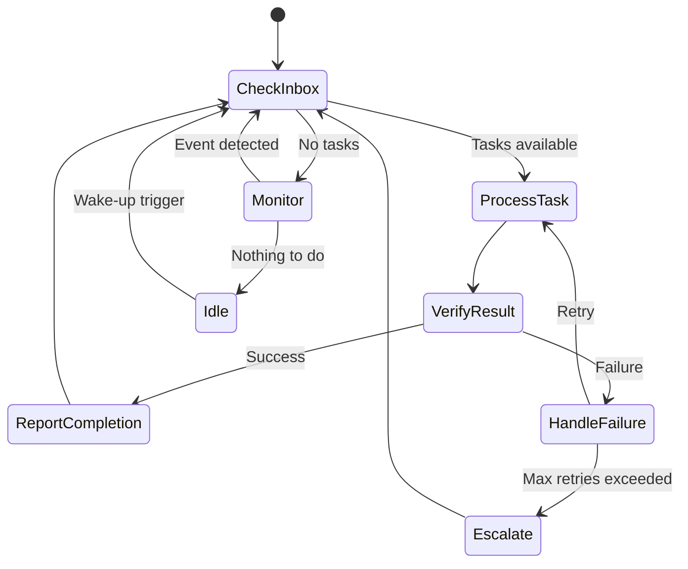
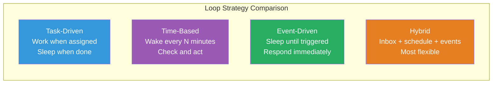
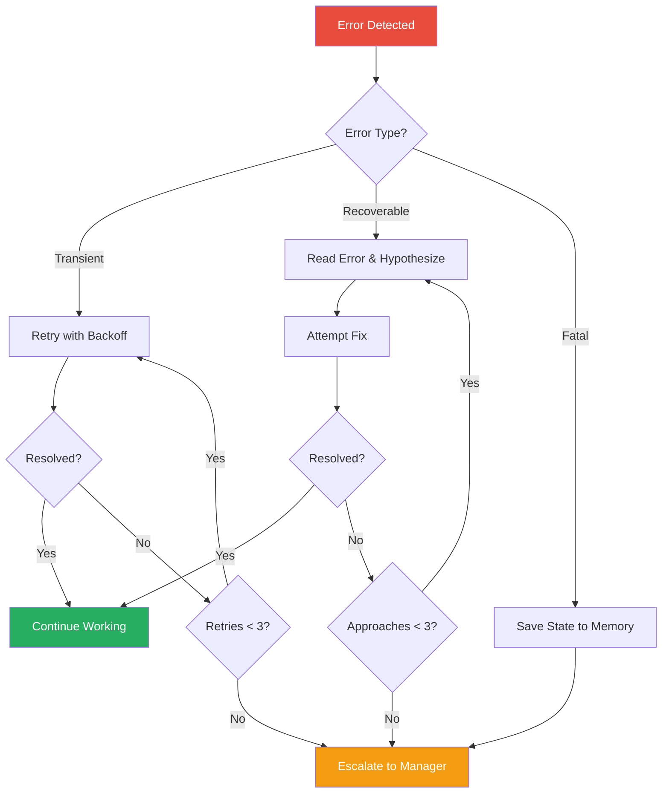
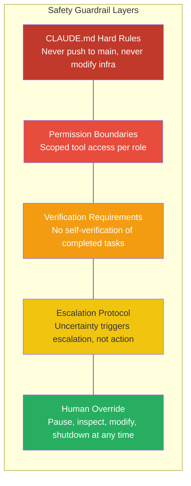

# 24/7 Autonomous Operation

The promise of AI agents is not that they work faster than humans during business hours. It's that they work when no one is watching. A critical bug at 2 AM doesn't wait for morning — it gets investigated, patched, tested, and deployed before anyone's alarm goes off.

This page explains how agent.ceo makes continuous autonomous operation reliable, observable, and safe.

---

## The Autonomous Loop

Every agent.ceo agent can operate in an autonomous loop — a recurring cycle of checking for work, executing tasks, and reporting results.



A single iteration of the loop:

1. **Check inbox.** Are there new task assignments, messages from other agents, or events to respond to?
2. **Process task.** If there's work to do, execute the highest-priority task.
3. **Verify result.** Confirm the task was completed successfully — run tests, check builds, validate outputs.
4. **Report completion.** Notify the assigning agent with evidence of completion.
5. **Monitor or idle.** If there's nothing to do, either actively monitor for issues or enter a low-power idle state until the next wake-up.

---

## Loop Strategies

Not all agents should loop the same way. agent.ceo supports multiple loop strategies optimized for different operational patterns.

### Task-Driven Loop
The agent picks up the next task from its queue, completes it, and checks for more. When the queue is empty, the agent idles.

**Best for**: Development agents (Fullstack, Backend) that receive work assignments from other agents.

**Behavior**: Responsive and efficient — does work when there's work to do, sleeps when there isn't.

### Time-Based Loop
The agent wakes up on a fixed schedule (e.g., every 30 minutes) and performs routine checks regardless of whether new tasks exist.

**Best for**: Monitoring agents, ops agents, and agents responsible for periodic health checks.

**Behavior**: Predictable cadence. Good for dashboards and status reports.

### Event-Driven Loop
The agent sleeps until an external event triggers it — a NATS message, a webhook, a cron schedule, or a manual wake-up.

**Best for**: Agents that respond to specific events (deploy notifications, error alerts, PR reviews).

**Behavior**: Zero overhead when idle. Instant response when triggered.

### Hybrid Loop
Combines strategies: check inbox on every iteration, perform scheduled checks periodically, and respond to events immediately.

**Best for**: Leadership agents (CEO, CTO) that need to balance reactive work (incoming requests) with proactive work (monitoring, planning).



---

## SLA Monitoring

In a cyborgenic organization, agents don't just do work — they track whether they're doing it fast enough. agent.ceo includes SLA (Service Level Agreement) monitoring that agents use to self-regulate.

### How SLA Tracking Works

Each task type has expected response and completion times:

| Task Type | Response SLA | Completion SLA |
|---|---|---|
| Critical bug fix | 5 minutes | 2 hours |
| Feature request | 30 minutes | 24 hours |
| Code review | 15 minutes | 4 hours |
| Documentation update | 1 hour | 8 hours |

Agents track their performance against these targets and take action when falling behind.

### SLA Alerts

When an agent's response time or completion time approaches the SLA threshold, the system generates an alert. The agent can:

- **Self-accelerate.** Prioritize the at-risk task over other work.
- **Request help.** Ask the coordinator to assign additional resources.
- **Escalate.** Notify the manager that the SLA is at risk, with context on why.

### SLA Trend Analysis

Beyond individual tasks, agents track trends:

- Is response time improving or degrading over time?
- Are certain task types consistently missing SLAs?
- Are there time-of-day patterns (e.g., slower during high-load periods)?

This data feeds into the continuous improvement loop, allowing the organization to adjust staffing, priorities, or processes proactively.

!!! tip "SLAs as Self-Discipline"
    SLA monitoring isn't about punishing slow agents. It's about giving agents the self-awareness to manage their own workload. An agent that knows it's falling behind can make better prioritization decisions than one that simply works through tasks in FIFO order.

---

## Self-Healing

Autonomous operation means agents must handle their own errors — there's no human watching the terminal at 3 AM.

### Error Categories

#### Transient Errors
Network timeouts, API rate limits, temporary build failures. These resolve on retry.

**Agent behavior**: Wait with exponential backoff, retry up to 3 times.

#### Recoverable Errors
Test failures, type errors, merge conflicts. These require the agent to diagnose and fix.

**Agent behavior**: Read the error, form a hypothesis, attempt a fix, re-verify. Escalate after 3 different approaches fail.

#### Fatal Errors
Out-of-memory, corrupted state, infrastructure failures. These cannot be fixed by the agent.

**Agent behavior**: Save current state to memory, report the error to the manager with full context, and stop working to avoid making things worse.



### Self-Healing in Practice

A real self-healing scenario:

1. The Fullstack agent deploys a new feature.
2. The build succeeds, but the agent notices a console warning about a deprecated API.
3. The agent reads the warning, identifies the deprecated call, and finds the replacement in the documentation.
4. The agent updates the code, re-runs tests, and redeploys.
5. The warning is gone. The agent records the fix in its memory for future reference.

No human was involved. No ticket was filed. The issue was found and fixed as a natural part of the agent's verification step.

---

## Wake-Up Mechanisms

Agents need to wake up from idle states. agent.ceo provides multiple mechanisms:

### Cron Schedules
Fixed-time triggers using standard cron syntax.

```
# Wake up every 30 minutes during business hours
*/30 9-17 * * 1-5

# Wake up once per hour overnight
0 * * * *

# Wake up at 6 AM daily for the morning report
0 6 * * *
```

### NATS Events
Message-based triggers from other agents or external systems. An agent subscribed to deployment events wakes up whenever a deploy completes.

### Manual Triggers
Human supervisors can wake an agent at any time through the control plane. Used for urgent tasks or when the human wants to interact.

### Dynamic Self-Scheduling
Agents can schedule their own wake-ups based on their current work.

For example, after kicking off a build that typically takes 8 minutes, an agent can schedule a wake-up for 270 seconds later (within the cache window) to check the first round, then another 270-second wake-up if the build isn't done yet.

!!! info "Cache-Aware Scheduling"
    The prompt cache has a 5-minute TTL. Agents schedule wake-ups to stay within the cache window (under 270 seconds for active work) or deliberately outside it (1200+ seconds for idle monitoring). The 300-second mark is avoided because it pays the cache miss without gaining any meaningful wait time.

---

## Monitoring and Observability

Autonomous agents are only trustworthy if humans can see what they're doing. agent.ceo provides multiple observability layers.

### Task Status Dashboard
Every task has a lifecycle status visible to supervisors: assigned, accepted, in_progress, completed, verified, or blocked. Humans can see at a glance what every agent is working on.

### Agent Inbox Visibility
Supervisors can inspect any agent's inbox — what messages have been received, which are pending, and which have been processed.

### Conversation Audit
The full conversation history of each agent session is available for review. If an agent makes a questionable decision, the human can trace exactly what information the agent had and how it reasoned.

### SLA Dashboards
Real-time and historical SLA performance for each agent and task type. Trends, alerts, and breaches are visible at a glance.

### Event Logs
Every inter-agent message, task state change, and significant action is logged as an event in NATS. These events are available for analysis, alerting, and audit.

!!! note "Trust Through Transparency"
    Autonomous operation doesn't mean unobserved operation. The more transparent the system is, the more humans trust it — and the more autonomy they're willing to grant. Observability is an investment in autonomy.

---

## Safety Guardrails

Autonomous agents with real tool access can cause real damage. agent.ceo builds safety in at multiple levels.

### Infrastructure Protection Rules

Agents have explicit, non-negotiable rules about what they cannot do:

- **Never push to main/master.** All work happens on feature branches.
- **Never run destructive kubectl commands.** Agents can read cluster state but cannot modify deployments, scale replicas, or restart pods.
- **Never trigger CI/CD pipelines manually.** Deployments happen through the defined workflow (merge to develop, auto-deploy).
- **Never modify infrastructure configuration.** Terraform, Kubernetes manifests, and deployment configs are off-limits without explicit human approval.

These rules are encoded in CLAUDE.md and survive compaction — agents cannot "forget" them.

### Verification Requirements

Agents cannot mark their own work as complete. The `complete_task_unverified()` function name is deliberately chosen: it signals that the task needs verification from the assigning agent. The lifecycle is:

1. Agent completes work and provides evidence.
2. Assigning agent reviews the evidence.
3. Only the assigner can mark the task as verified.

### Permission Boundaries

Each agent's tool access is scoped to its role:

- The Fullstack agent can modify code in the website repository but not in infrastructure repos.
- The DevOps agent can read cluster state but not modify it.
- The CEO agent can assign tasks but typically doesn't execute technical work directly.

### Escalation Protocol

When an agent encounters a situation it's not sure about, the expectation is escalation, not experimentation. "I'm not sure if I should delete this database migration" results in a message to the manager, not a `DROP TABLE`.

### Human Override

The human supervisor can pause any agent at any time, inspect its state, modify its instructions, or shut it down. The autonomous loop includes checkpoints where the agent checks for pause signals.



---

## Putting It All Together

A typical 24-hour cycle for the Fullstack agent:

**09:00** - CEO agent assigns three feature tasks for the day.
**09:05** - Fullstack agent accepts all three, prioritizes by deadline.
**09:10-12:00** - Builds feature 1. Tests pass, build succeeds, commits.
**12:05** - Reports feature 1 complete. Checks inbox. Feature 2 next.
**12:10-15:30** - Builds feature 2. Encounters test failure, self-heals, completes.
**15:35** - Reports feature 2. SLA alert: feature 3 deadline is approaching.
**15:40-18:00** - Prioritizes and completes feature 3 ahead of deadline.
**18:05** - All tasks done. Enters monitoring mode.
**22:00** - NATS event: production error detected. Wakes up, investigates.
**22:15** - Identifies root cause, applies fix, tests, deploys.
**22:30** - Reports fix to CEO agent. Returns to monitoring.
**03:00** - Cron wake-up: routine health check. All systems normal. Returns to idle.
**06:00** - Cron wake-up: morning report generation. Summarizes yesterday's work.
**09:00** - CEO agent assigns new tasks. Cycle continues.

No human intervened. The agent handled planned work, unexpected incidents, and routine maintenance across a full 24-hour period.

---

## The Trust Equation

Autonomous operation is ultimately about trust. agent.ceo builds trust through a progression:

1. **Start supervised.** Run the agent with close human oversight. Review every output.
2. **Validate reliability.** As the agent demonstrates consistent quality, reduce oversight frequency.
3. **Grant more autonomy.** Move from reviewing every commit to reviewing daily summaries.
4. **Trust but verify.** Use SLA dashboards and audit logs to maintain visibility without micromanaging.

The platform is designed for this progression. You don't have to trust fully on day one — but the architecture supports full autonomy when you're ready for it.

---

## Summary

24/7 autonomous operation is not about removing humans from the loop. It's about restructuring the loop so humans set direction and verify outcomes, while agents handle continuous execution. Loop strategies, SLA monitoring, self-healing, and safety guardrails work together to make this reliable. The result: work happens around the clock, quality remains consistent, and humans focus on the decisions that actually need human judgment.
