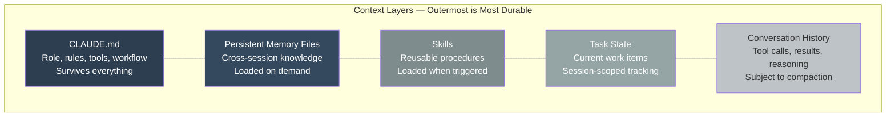
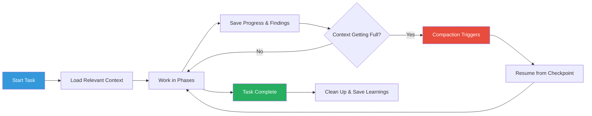

# How Agents Manage Context and Memory

A human developer carries context in their head. They remember yesterday's decisions, last week's architecture discussion, and the codebase conventions they learned months ago. They don't consciously think about managing this knowledge — it just works.

An AI agent has none of this. It starts every session with a blank slate and a finite context window. Making agents effective despite this constraint is one of the hardest problems in autonomous AI — and one of the areas where agent.ceo invests the most engineering.

---

## The Context Window Challenge

Claude's context window is large — but it is not infinite. An agent working on a complex task can fill its context in hours:

- Reading source files to understand the codebase
- Examining error logs and build output
- Processing messages from other agents
- Tracking conversation history (every tool call, every result)

When the context fills up, the agent faces a choice: stop working, or lose information. Neither is acceptable for a system that needs to operate 24/7.

!!! warning "Context Is the Scarcest Resource"
    CPU, memory, and disk are cheap and plentiful. Context window capacity is the true bottleneck for autonomous agents. Every architectural decision in agent.ceo's memory system is driven by this constraint.

---

## The Context Layer Model

agent.ceo organizes agent knowledge into distinct layers, each with different persistence characteristics and costs:



Each layer serves a specific purpose:

### Layer 1: CLAUDE.md (Permanent)
The agent's operating manual. Loaded at the start of every session and preserved through compaction. Contains role definition, core rules, tool access, communication protocols, and safety guardrails.

**Persists**: Always. Survives compaction, session restarts, and agent resets.

**Cost**: Constant. Uses context space but never grows during a session.

### Layer 2: Persistent Memory Files (Cross-Session)
Files stored on disk that capture knowledge the agent needs across sessions. Loaded explicitly when relevant, not automatically.

**Persists**: Across sessions. Written to disk, survives session ends.

**Cost**: Only uses context when loaded. Agent chooses what to load and when.

### Layer 3: Skills (On-Demand)
Reusable procedure definitions. Not loaded by default — the agent loads them when their trigger conditions match the current situation.

**Persists**: Indefinitely. Stored as files, shared across agents.

**Cost**: Loaded on demand. Each skill uses context space only when active.

### Layer 4: Task State (Session-Scoped)
Current work items, progress tracking, and in-flight decisions. Maintained during a session to keep the agent oriented.

**Persists**: Within a session. May be saved to memory before session ends.

**Cost**: Grows during a session as tasks accumulate.

### Layer 5: Conversation History (Ephemeral)
The raw conversation: every tool call, every file read, every build output, every reasoning step. This is the most voluminous and least durable layer.

**Persists**: Until compacted. Continuously grows, continuously trimmed.

**Cost**: The primary consumer of context space.

---

## Compaction: Automated Conversation Compression

Compaction is the process of summarizing old conversation history to free up context space. It is the primary mechanism that allows agents to work indefinitely without hitting context limits.

### How Compaction Works

When the conversation history approaches the context limit, the system automatically:

1. **Identifies old conversation turns** that are no longer actively referenced.
2. **Summarizes them** into a compact representation — preserving key decisions, outcomes, and state, while discarding verbose tool outputs and intermediate reasoning.
3. **Replaces the original turns** with the summary, freeing context space.

### What Survives Compaction

- **CLAUDE.md** — always preserved in full.
- **Key decisions and outcomes** — "We chose approach X because of Y" is retained.
- **Current task state** — what the agent is working on right now.
- **Important error messages** — errors the agent hasn't resolved yet.

### What Gets Compressed

- **Verbose tool outputs** — full file contents that were read but aren't needed anymore.
- **Intermediate reasoning** — exploration and hypothesis-testing from earlier phases.
- **Resolved errors** — build failures that were already fixed.
- **Redundant information** — data that was read multiple times.

!!! tip "Writing for Compaction Survival"
    Agents can influence what survives compaction by recording important information in persistent memory before it gets compacted away. Good agents develop an instinct for this — saving key decisions to memory files proactively, rather than relying on compaction to preserve them.

---

## Persistent Memory System

agent.ceo's memory system uses files on disk to store knowledge that must survive across sessions. This is not a database — it's a set of markdown files organized by type.

### Memory Types

#### User Memory
Personal preferences, communication style, recurring instructions from the human supervisor.

```markdown
# Agent Memory - fullstack
## User Preferences
- The user prefers concise commit messages
- Always run the full test suite, not just affected tests
- The user's email is example@company.com
```

#### Feedback Memory
Lessons learned from past mistakes and corrections.

```markdown
## Feedback
- 2024-03-15: Was told to always check for TypeScript strict mode errors, not just build success
- 2024-03-20: Learned that the staging environment requires VPN — always test with local build first
```

#### Project Memory
Codebase-specific knowledge: architecture decisions, conventions, known issues.

```markdown
## Project: agent-ceo-website
- Uses Next.js 14 App Router (not Pages Router)
- Tailwind CSS for styling — no CSS modules
- Firebase Auth for authentication, Firestore for data
- Known issue: the sidebar component re-renders excessively — needs memoization
```

#### Reference Memory
Stable factual information: API endpoints, credentials locations, infrastructure details.

```markdown
## Reference
- Production URL: https://agent.ceo
- GitHub org: genbrain-ai
- Deployment: Vercel auto-deploys from develop branch
```

### Memory Hygiene

Not everything should be saved to memory. Agents follow guidelines:

**Save:**

- Corrections from the human supervisor
- Codebase conventions that aren't documented elsewhere
- Recurring patterns and solutions
- Infrastructure knowledge that's hard to rediscover

**Don't save:**

- Transient task details (use task state instead)
- Information that's readily available in the codebase
- Speculative ideas that haven't been validated
- Raw data or log outputs

!!! info "Memory Compaction"
    Memory files themselves can grow large over time. Periodically, memory is compacted — older, less relevant entries are summarized or removed to keep memory files lean. The compaction metadata (last compacted date, outcome count) is tracked in the file header.

---

## CLAUDE.md: The Indestructible Layer

CLAUDE.md deserves special attention because it occupies a unique position in the context hierarchy: it is the only information guaranteed to survive everything — compaction, session restarts, even agent resets.

This makes it the right place for:

- **Identity**: Who the agent is and what it does.
- **Hard rules**: Constraints that must never be violated (e.g., "never push to main").
- **Workflow**: Standard operating procedures that apply to every task.
- **Safety**: Infrastructure protection rules and escalation protocols.

And the wrong place for:

- **Transient state**: Current task details (use task state or memory).
- **Detailed procedures**: Step-by-step guides (use skills).
- **Organizational knowledge**: Information about other agents or projects (use memory).

!!! warning "CLAUDE.md Size Matters"
    A CLAUDE.md that's too large wastes context space on every session. A CLAUDE.md that's too small misses critical instructions. The sweet spot is typically 50-150 lines — enough to define behavior clearly, small enough to leave room for actual work.

---

## Session vs Conversation Context

These terms are often confused but have distinct meanings in agent.ceo:

### Conversation Context
The content of the current context window: all messages, tool calls, file reads, and reasoning in the ongoing interaction. This is what gets compacted when space runs low.

### Session Context
The broader context of the agent's current work session: which tasks are assigned, what state the repository is in, what the agent has accomplished so far. Session context may span multiple conversation contexts (after compaction).

An agent can lose conversation context (through compaction) while retaining session context (through memory and task state). This is by design — the agent forgets *how* it figured something out, but remembers *what* it figured out.

---

## Practical Context Strategies

### Strategy 1: Read Selectively
Don't read entire files when you only need a function signature. Don't load all memory files when you only need project conventions. Selective reading conserves context space.

### Strategy 2: Save Before Compaction
When working on a long task, periodically save key findings to memory. Don't rely on the conversation history being available later — it might get compacted.

### Strategy 3: Use Skills for Procedures
Instead of reasoning through a complex procedure from scratch every time, encode it as a skill. Skills are loaded on-demand and provide step-by-step guidance without consuming context during other work.

### Strategy 4: Checkpoint Task Progress
Break large tasks into phases. At each phase boundary, record progress and update task state. If context gets compacted mid-task, the agent can resume from the last checkpoint rather than starting over.

### Strategy 5: Clean Up After Completion
After finishing a task, the agent should clear unnecessary task state, save relevant learnings to memory, and prepare for the next task with a clean context.



---

## The Cache Dimension

Beyond the context window, there's a practical performance consideration: the prompt cache.

Anthropic's prompt cache has a 5-minute TTL. If an agent's loop iteration completes and the next one starts within 5 minutes, the cached portion of the conversation is reused — making the next iteration faster and cheaper. If the gap exceeds 5 minutes, the cache misses and the full context must be reprocessed.

This affects loop timing decisions:

- **Active work**: iterations every 60-270 seconds keep the cache warm.
- **Idle monitoring**: iterations every 20-30 minutes accept the cache miss but avoid unnecessary churn.
- **Avoid the dead zone**: ~300 seconds (5 minutes) is the worst choice — you pay the cache miss without gaining a meaningful wait.

---

## Summary

Context management is the hidden infrastructure that makes autonomous agents viable. Without it, agents would hit context limits within hours and become useless. With it — through the layered context model, compaction, persistent memory, and disciplined hygiene — agents can work indefinitely, accumulating knowledge and maintaining effectiveness across sessions that span days and weeks.

The key insight: an agent's memory system isn't just about remembering things. It's about *choosing* what to remember, what to forget, and where to store each piece of knowledge so it's available when needed without consuming scarce resources when it's not.
