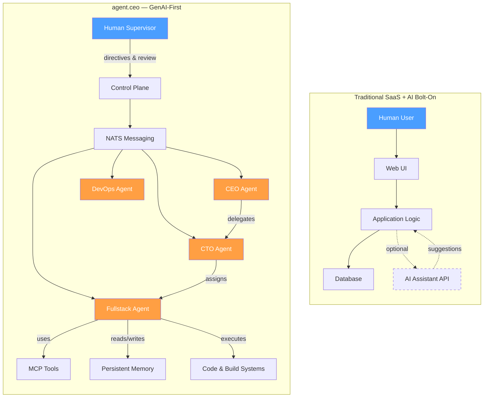

# Why agent.ceo is GenAI-First

Most platforms that claim to use AI have done something simple: they took an existing SaaS product — a project manager, a CRM, a helpdesk — and added a chatbot. The AI is a feature. A convenience layer. Remove it, and the product still works.

agent.ceo is the opposite. Remove the AI agents, and there is no product. The agents **are** the workforce. The platform exists to support them — not the other way around.

This is what "GenAI-first" means, and the distinction has profound architectural consequences.

---

## The Problem with AI-Bolted-On

Consider a typical "AI-powered" project management tool. A human creates a ticket. A human assigns it. Maybe an AI suggests a priority or drafts a description. The human reviews, edits, approves. The AI is an assistant — a faster autocomplete.

This approach has hard limits:

- **The human is still the bottleneck.** Every decision flows through a person.
- **The AI has no continuity.** Each interaction is stateless — the chatbot doesn't remember yesterday's conversation.
- **The AI has no agency.** It responds to prompts. It doesn't initiate work, monitor outcomes, or adapt strategy.
- **The tooling isn't designed for AI.** APIs expect human-speed interaction, not continuous autonomous operation.

!!! warning "The 'Copilot Trap'"
    Many organizations adopt AI copilots and see 10-20% productivity gains. Then they plateau. The architecture doesn't allow AI to do more because it was never designed to let AI **own** work — only to assist humans who own it.

---

## GenAI-First Principles

agent.ceo was designed from a single premise: **AI agents are the primary workers; humans are supervisors and strategic directors.**

This premise drives every architectural decision:

### 1. Agents Run Continuously, Not On-Demand

Traditional AI integrations activate when a user clicks a button or types a prompt. agent.ceo agents run in persistent loops — observing, planning, acting, and verifying — 24 hours a day.

### 2. Agents Have Roles, Not Just Capabilities

Each agent has a defined role (CEO, CTO, Fullstack Developer, etc.) with specific responsibilities, skills, and authority levels. They aren't generic assistants — they're specialists.

### 3. Agents Communicate With Each Other

Agents don't just serve humans. They delegate tasks to each other, review each other's work, and coordinate through structured messaging (NATS). The human doesn't need to be in the loop for routine operations.

### 4. The Platform Serves Agent Needs

Every platform component — memory persistence, context management, tool access, task lifecycle — is designed for what agents need, not for human UX convenience.

### 5. Humans Supervise, Not Operate

The human's role shifts from "doing the work" to "setting direction and verifying outcomes." This is a fundamentally different interaction model.

---

## Architecture Comparison

The structural difference is clear. In the traditional model, AI is a leaf node — an optional service call. In agent.ceo, agents form the operational core, with humans providing oversight at the edges.

---

## Key Architecture Decisions

### Claude Code as the Agent Runtime

agent.ceo uses [Claude Code](https://docs.anthropic.com/en/docs/claude-code) (Anthropic) as its agent runtime. This was a deliberate choice:

- **Native tool use.** Claude Code can execute bash commands, read/write files, make API calls, and use MCP tools — all within a single continuous session.
- **Extended thinking.** For complex decisions, agents can reason through multi-step problems before acting.
- **Code execution.** Agents don't just generate code — they run it, test it, and fix it in tight feedback loops.
- **Context persistence.** A Claude Code session maintains state across hundreds of turns, allowing agents to work on multi-hour tasks without losing track.

!!! info "Why Not a Custom Agent Framework?"
    Many platforms build custom agent frameworks from scratch. agent.ceo chose Claude Code because it provides a battle-tested runtime with native tool integration, eliminating an entire class of reliability problems. The platform focuses on orchestration, memory, and multi-agent coordination — the hard problems that Claude Code doesn't solve alone.

### CLAUDE.md as the Operating Manual

Each agent's behavior is defined by a `CLAUDE.md` file — a markdown document that specifies:

- The agent's role and responsibilities
- Rules and constraints (what the agent must and must not do)
- Available tools and how to use them
- Git workflow and deployment procedures
- Communication protocols with other agents

This is loaded at the start of every session and survives context compaction, ensuring the agent never "forgets" its core instructions.

### MCP (Model Context Protocol) for Tool Access

Rather than hard-coding integrations, agent.ceo uses MCP to give agents access to tools dynamically. An agent can:

- Browse the web with Playwright
- Execute shell commands
- Query databases
- Send messages to other agents
- Interact with external APIs (GitHub, Gmail, Google Calendar, etc.)

The MCP architecture means new capabilities can be added without changing the agent runtime.

### NATS for Inter-Agent Communication

Agents communicate through NATS, a high-performance messaging system. This enables:

- **Asynchronous task delegation.** The CEO agent can assign work and move on without waiting.
- **Event-driven reactions.** Agents can subscribe to events and respond automatically.
- **Reliable delivery.** Messages persist until acknowledged, preventing lost tasks.

---

## The Cyborgenic Organization

agent.ceo introduces the concept of a "cyborgenic organization" — an org chart where AI agents fill defined roles alongside (and often instead of) human employees.

This isn't a metaphor. In an agent.ceo deployment:

- The **CEO agent** sets priorities, reviews work, and makes strategic decisions.
- The **CTO agent** handles technical architecture and code review.
- The **Fullstack agent** builds features, writes tests, and deploys code.
- The **DevOps agent** manages infrastructure and monitoring.

Each agent has a manager, peers, and direct reports — just like a human org. They attend meetings (structured message exchanges), escalate blockers, and track SLAs.

!!! tip "The Human's New Role"
    In a cyborgenic organization, the human founder or executive shifts from managing tasks to managing strategy. Instead of writing tickets and reviewing PRs, they set direction — "We need to ship feature X by Friday" — and the agent hierarchy handles execution autonomously.

---

## What GenAI-First Enables

Building for agents first unlocks capabilities that bolted-on AI cannot achieve:

### 24/7 Continuous Operation
Agents don't sleep. They don't take breaks. A bug reported at 3 AM gets investigated, fixed, tested, and deployed before the human wakes up.

### Parallel Execution at Scale
A single human can manage one task at a time. An agent coordinator can spawn five sub-agents to work on five subtasks simultaneously, then merge the results.

### Institutional Memory
Every decision, every failure, every learned pattern is captured in persistent memory. Agents don't lose knowledge when a session ends or when a "new hire" agent spins up — they inherit the organization's accumulated experience.

### Consistent Quality
Agents follow their CLAUDE.md instructions every time. They run tests before every commit. They follow the git workflow. They don't cut corners on Friday afternoon.

---

## When GenAI-First is the Right Choice

GenAI-first architecture is not appropriate for every problem. It excels when:

- **Work is ongoing and repetitive.** Software development, monitoring, content creation, operations management.
- **Speed and availability matter.** Tasks that can't wait for business hours or human availability.
- **Coordination is complex.** Multi-step workflows involving multiple specialists.
- **Consistency is critical.** Processes that must follow defined standards every time.

It is less appropriate when:

- Work requires physical-world interaction.
- Problems are entirely novel with no established patterns.
- Regulatory requirements mandate human decision-makers.

!!! note "The Hybrid Model"
    Most agent.ceo deployments are hybrid: agents handle execution while humans handle strategy, creative direction, and edge cases that require judgment. The platform is designed for this collaboration — not to replace humans entirely, but to let them focus on what they do best.

---

## Summary

agent.ceo is GenAI-first because its architecture starts from the question: "What does an AI agent need to do great work?" Every component — the runtime, the memory system, the communication layer, the tool access, the task lifecycle — exists to answer that question.

The result is a platform where AI agents don't assist. They deliver.
