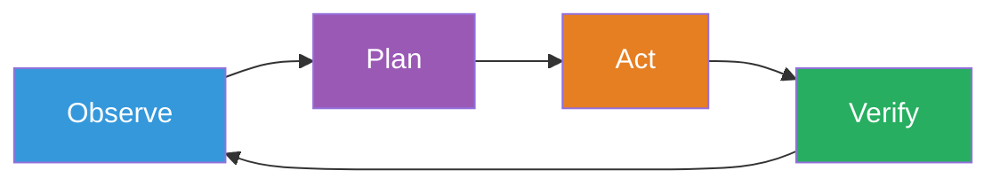
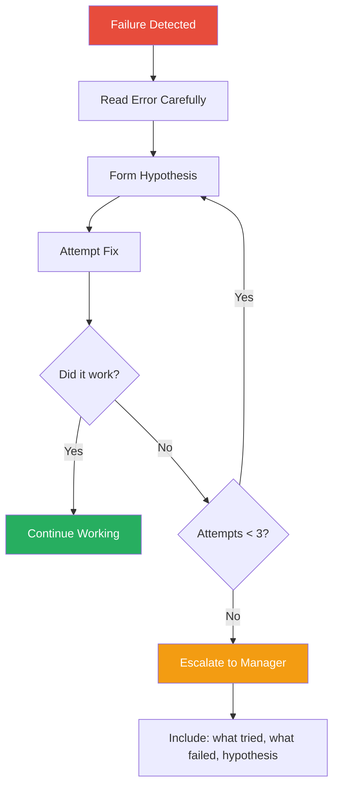
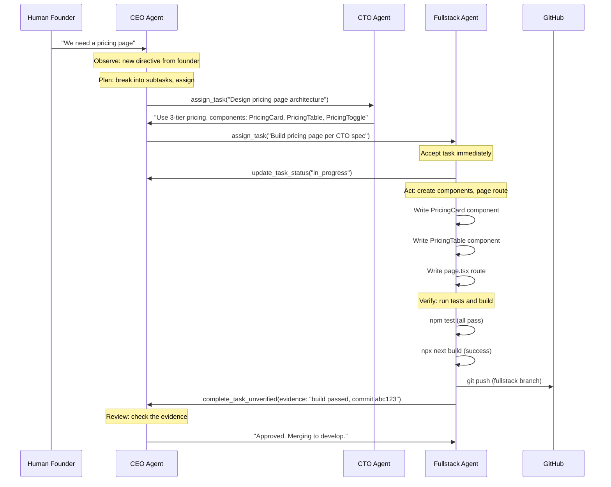

# How We Use LLMs as Autonomous Agents

A chatbot waits for you to ask a question. An agent wakes up, checks what needs to be done, does it, verifies the result, and reports back — whether or not anyone asked.

That difference — between responding to prompts and pursuing goals — is the foundation of everything agent.ceo builds. This page explains the patterns that make it work.

---

## The Agent Loop

Every agent in agent.ceo operates on a continuous loop with four phases:



### Observe
The agent checks its environment: inbox messages, task queue, repository state, build status, monitoring alerts. It gathers the information needed to decide what to do next.

### Plan
Based on observations, the agent determines the most important action. This isn't just pattern matching — it involves reasoning about priorities, dependencies, and available resources.

### Act
The agent executes: writes code, runs commands, sends messages, creates pull requests, deploys changes. It uses MCP tools, shell access, and file operations to make real changes in the world.

### Verify
After acting, the agent confirms the result. Did the build pass? Do the tests succeed? Does the deployment respond correctly? Verification is not optional — it's built into the loop.

!!! warning "Verify Is Not Optional"
    An agent that acts without verifying is dangerous. agent.ceo enforces verification at every level: agents must run tests before committing, must build before deploying, and must provide evidence when completing tasks. Skipping verification is treated as a rule violation.

---

## Chatbots vs Agents: A Fundamental Distinction

| Characteristic | Chatbot | Agent |
|---|---|---|
| **Activation** | User sends a message | Continuous loop or event trigger |
| **Goal** | Answer the current question | Complete assigned objectives |
| **State** | Stateless between conversations | Persistent memory across sessions |
| **Tools** | Limited (maybe web search) | Full tool access (code, deploy, browse, message) |
| **Autonomy** | None — waits for input | High — initiates and completes work independently |
| **Verification** | User judges the response | Agent verifies its own output |
| **Collaboration** | With the user only | With other agents and the user |
| **Duration** | Seconds per interaction | Hours or days per task |

The shift from chatbot to agent isn't incremental. It's a different category of system.

---

## CLAUDE.md: The Agent's Operating Manual

Every agent has a `CLAUDE.md` file that defines how it operates. This file is loaded at the start of every session and persists through context compaction — it is the one thing the agent never forgets.

A typical CLAUDE.md includes:

- **Role definition.** "You are the Fullstack Developer. Your manager is the CEO."
- **Core rules.** "Run `npm test` AND `npx next build` before every commit."
- **Available tools.** Which MCP servers, CLI tools, and APIs the agent can use.
- **Git workflow.** Which branches to use, how to name feature branches, when to push.
- **Communication protocol.** How to message other agents, when to escalate.
- **Quality standards.** Testing requirements, code review expectations, deployment checklists.
- **Safety guardrails.** Infrastructure the agent must never modify, destructive commands it must never run.

!!! tip "CLAUDE.md as Organizational Policy"
    Think of CLAUDE.md as the agent's employee handbook, job description, and standard operating procedures combined into a single document. When you update the CLAUDE.md, you're updating the agent's fundamental behavior — not just giving it a suggestion.

The CLAUDE.md is what makes each agent a specialist rather than a generalist. The same underlying LLM (Claude) becomes a CEO, a CTO, or a Fullstack Developer based on the instructions in this file.

---

## The Skill System

Skills are reusable procedures that agents can learn, store, and share. A skill is a markdown file (`SKILL.md`) that describes:

- **When to activate.** Trigger conditions that tell the agent when this skill is relevant.
- **What to do.** Step-by-step instructions for executing the procedure.
- **What to verify.** How to confirm the skill was applied successfully.

Skills solve a critical problem: agents need to perform complex multi-step procedures reliably, and embedding every procedure in CLAUDE.md would make it unmanageably large.

Examples of skills:

- **commit-push**: Standard procedure for committing and pushing code changes.
- **browser-test**: How to use Playwright MCP for end-to-end browser testing.
- **context-cleanup**: How to manage context window size when it grows too large.
- **review**: How to review a pull request systematically.

Skills are shared across agents. When one agent develops a reliable procedure, it can be packaged as a skill and made available to the entire organization.

---

## Task-Driven vs Autonomous Loop Mode

Agents operate in two primary modes:

### Task-Driven Mode
The agent has a specific directive — a task assigned by another agent or a human. It works on that task until completion, then reports back and waits for the next assignment.

```
loop_control.json: { "mode": "task-only", "directive": "Build the user settings page" }
```

In task-driven mode, the agent focuses exclusively on its directive. It doesn't check for new messages or pick up side work.

### Autonomous Loop Mode
The agent runs continuously, checking its inbox for new tasks, processing them in priority order, and monitoring for issues.

```
loop_control.json: { "mode": "autonomous", "strategy": "check-inbox-first" }
```

In autonomous mode, the agent behaves like an employee who shows up to work, checks their email, works through their task list, and proactively looks for things that need attention.

!!! info "Choosing the Right Mode"
    Task-driven mode is best for focused, high-priority work where the agent shouldn't be distracted. Autonomous mode is best for steady-state operations where the agent needs to handle whatever comes up. Most agents switch between modes depending on the situation.

---

## How Agents Handle Failures

Failure is normal. Builds break, tests fail, APIs return errors, dependencies change. What matters is how the agent responds.

agent.ceo agents follow a structured failure protocol:

### 1. Read the Error
The agent examines the error message, stack trace, or build output carefully. This seems obvious, but it's a deliberate step — the agent doesn't just retry blindly.

### 2. Form a Hypothesis
Based on the error, the agent reasons about the likely cause. "The test failed because the component expects a prop that was renamed in the last commit."

### 3. Try a Fix
The agent implements a fix and re-verifies. If the fix works, it proceeds.

### 4. Try Alternative Approaches
If the first fix doesn't work, the agent tries a different approach — up to 3 genuine attempts with different strategies.

### 5. Escalate
After 3 failed attempts, the agent escalates to its manager with a detailed report: what it tried, what failed, and what it thinks the underlying problem might be.



This protocol prevents two failure modes: infinite retry loops (wasting time) and premature escalation (wasting manager attention).

---

## Real Example: CEO Delegates to Fullstack Agent

Here's how a real task flows through the agent hierarchy:



Key things to notice:

1. **The human gives a high-level directive.** They don't specify components or architecture.
2. **The CEO breaks it down.** The CEO agent decides to consult the CTO for architecture before assigning implementation.
3. **The CTO provides technical guidance.** Architecture decisions are made by the CTO agent, not the human.
4. **The Fullstack agent executes and verifies.** It doesn't just write code — it tests and builds before reporting completion.
5. **Completion requires evidence.** The Fullstack agent can't just say "done" — it must provide proof (build output, commit SHA).
6. **The CEO verifies.** The task isn't complete until the manager confirms.

---

## Agent Communication Patterns

Agents communicate through structured messages, not free-form conversation:

### Task Assignment
```
assign_task(agent, title, description, verification_steps, priority)
```
A formal assignment with clear acceptance criteria.

### Status Updates
```
update_task_status(task_id, status, progress_note)
```
Progress reports at defined checkpoints.

### Completion
```
complete_task_unverified(task_id, evidence)
```
Delivery with verifiable evidence. The "unverified" suffix is deliberate — only the assigning agent can mark a task as truly complete.

### Escalation
```
send_to_agent(manager, "BLOCKER: description of what's stuck and what I've tried")
```
Escalation with context, not just "help."

### Inbox
```
get_agent_inbox()
```
Check for new messages, tasks, and events.

!!! note "Why Structured Communication?"
    Free-form messages between agents would work, but structured protocols prevent misunderstandings, ensure nothing falls through cracks, and make the system auditable. When every task has a lifecycle (assigned -> accepted -> in_progress -> completed -> verified), it's easy to see what's happening and what's stuck.

---

## The Continuous Improvement Loop

Agents don't just execute — they learn. When an agent encounters a failure, an unexpected behavior, or a better way to do something, it follows the improvement cycle:

**OBSERVE** -- Notice the issue or pattern.
**TASK** -- Create a task to address it.
**FIX** -- Implement the improvement.
**VERIFY** -- Confirm the fix works.
**PROPAGATE** -- Share the learning with other agents (via skills, memory, or documentation).

This means the organization gets better over time — not because a human noticed and filed a ticket, but because the agents themselves identify and resolve issues.

---

## Summary

agent.ceo's agent patterns transform LLMs from reactive chatbots into proactive workers. The key ingredients: a continuous execution loop, persistent identity through CLAUDE.md, reusable skills, structured communication, disciplined failure handling, and mandatory verification.

The result is agents that don't just respond intelligently — they work reliably.
