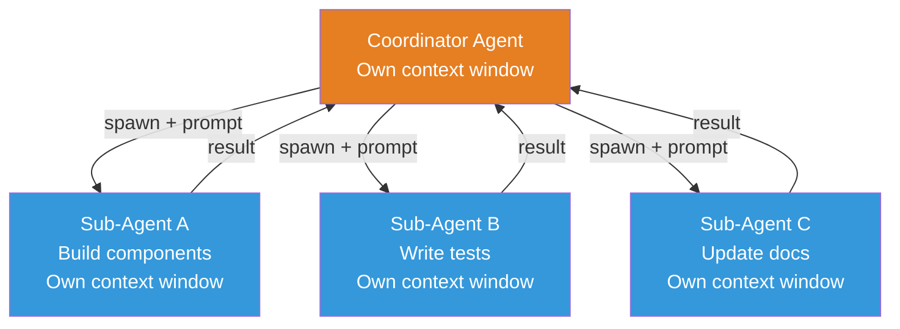
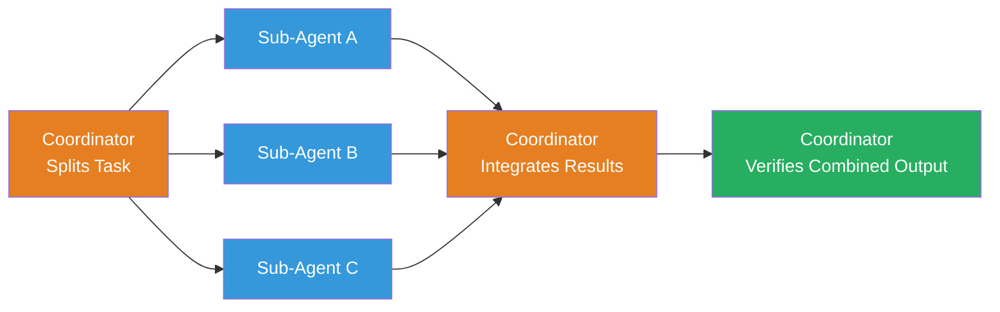
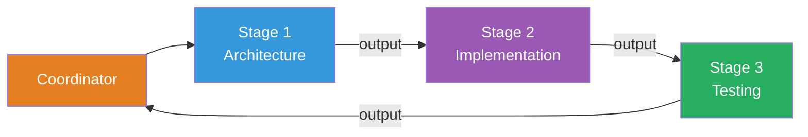
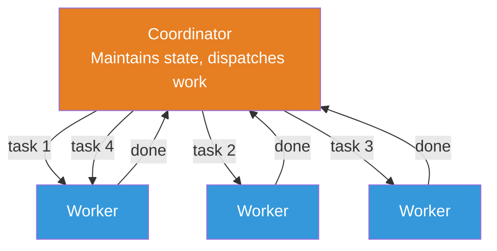
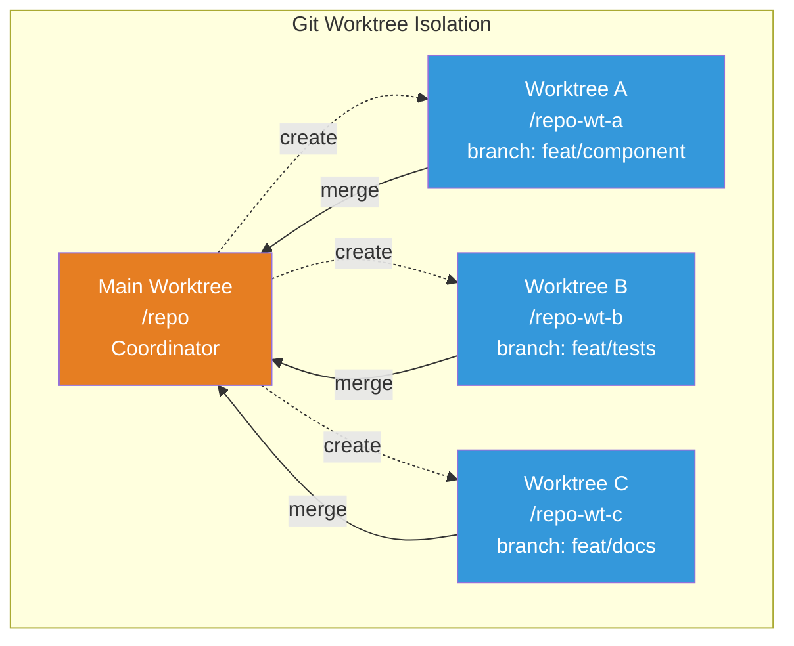

# Multi-Agent Parallelization

A single agent working sequentially is powerful. But some tasks have natural parallelism — building a feature while writing tests while updating documentation. Doing these sequentially wastes time. Doing them in parallel requires coordination.

agent.ceo solves this with sub-agents: isolated agent instances that a coordinator spawns, directs, and collects results from. This page explains when to use them, how they work, and what patterns produce the best results.

---

## Why Sub-Agents?

Consider a task: "Build a user settings page with tests and documentation."

A single agent would:

1. Design the component architecture (10 min)
2. Build the components (30 min)
3. Write unit tests (20 min)
4. Write integration tests (15 min)
5. Update documentation (10 min)

Total: ~85 minutes sequential.

With sub-agents:

1. Coordinator designs the architecture (10 min)
2. In parallel:
   - Sub-agent A builds the components (30 min)
   - Sub-agent B writes unit tests (20 min)
   - Sub-agent C updates documentation (10 min)
3. Coordinator integrates and verifies (10 min)

Total: ~50 minutes. A 40% speedup — and the gains increase with more parallelizable subtasks.

!!! info "The 3-Subtask Threshold"
    agent.ceo recommends sub-agents when a task has 3 or more independent subtasks. For fewer subtasks, the coordination overhead often exceeds the parallelism benefit. A single agent handling 1-2 subtasks sequentially is usually faster and simpler.

---

## How Sub-Agents Work

### The Agent Tool

The coordinator agent uses the `Agent` tool to spawn a sub-agent. Each invocation creates a fresh Claude Code instance with its own context window.

The coordinator provides:

- **A prompt** describing exactly what the sub-agent should do
- **Relevant context** (file paths, architecture decisions, conventions)
- **Success criteria** so the sub-agent knows when it's done

The sub-agent:

- Receives the prompt and starts working
- Has access to the same filesystem and tools as the coordinator
- Operates in its own context window (isolated from the coordinator's conversation)
- Returns its result to the coordinator when complete

### Isolation Is the Key

Each sub-agent has an **independent context window**. This means:

- Sub-agents don't see each other's work in progress
- Sub-agents don't consume the coordinator's context space
- A sub-agent's failure doesn't corrupt the coordinator or other sub-agents
- The coordinator's context stays lean — it sends instructions and receives results



---

## Parallelization Patterns

### Pattern 1: Fan-Out / Fan-In

The most common pattern. The coordinator splits a task into independent subtasks, spawns a sub-agent for each, collects all results, and integrates them.



**Best for**: Tasks with clearly independent subtasks (components + tests + docs).

**Watch out for**: Merge conflicts when sub-agents modify the same files.

### Pattern 2: Pipeline

Sub-agents execute in sequence, each building on the previous one's output. Not truly parallel, but useful when each stage benefits from a fresh context window.



**Best for**: Tasks where each stage is complex enough to benefit from a dedicated context window, even though stages are sequential.

**Watch out for**: Total time increases due to sub-agent startup overhead at each stage.

### Pattern 3: Coordinator-Worker

The coordinator maintains overall state and dispatches work items to a pool of workers. Workers are simpler — they do one thing and report back. The coordinator handles all coordination logic.



**Best for**: Many small, similar tasks (e.g., "update 10 components to use the new design system").

**Watch out for**: Coordinator context can grow if there are many work items to track.

---

## When to Use Sub-Agents vs Sequential Execution

Sub-agents are not always the right choice. They add complexity and consume resources.

### Use sub-agents when:

- **3+ independent subtasks** can run in parallel
- **Each subtask is substantial** (15+ minutes of work)
- **Subtasks don't share state** (different files, different concerns)
- **Time matters** — the task has a deadline or is blocking other work
- **Context is tight** — the combined work wouldn't fit in a single context window

### Use sequential execution when:

- **Tasks are interdependent** — each step needs the output of the previous one
- **The work is small** — sub-agent startup overhead would dominate
- **Fewer than 3 subtasks** — coordination overhead exceeds parallelism benefit
- **Subtasks share many files** — merge conflicts would cause more rework than time saved
- **Simplicity matters** — a single agent is easier to debug and reason about

!!! warning "The Merge Problem"
    When multiple sub-agents modify the same file simultaneously, git conflicts are inevitable. The coordinator must handle these conflicts during integration. Good task decomposition minimizes this risk by assigning sub-agents to distinct files or directories.

---

## Isolation Modes

### Same Repository (Default)

Sub-agents work in the same repository clone as the coordinator. They share the filesystem, which means:

- They can read each other's files
- They can also overwrite each other's files (risk!)
- No git branch isolation

This is the simplest mode and works well when sub-agents modify different files.

### Worktree Isolation

For tasks where sub-agents might conflict, agent.ceo supports git worktrees. Each sub-agent gets a separate working directory backed by its own git branch.

```
/repo              (coordinator — main worktree)
/repo-worktree-a   (sub-agent A — separate branch)
/repo-worktree-b   (sub-agent B — separate branch)
/repo-worktree-c   (sub-agent C — separate branch)
```

Benefits:

- **No file conflicts.** Each sub-agent has its own copy of the repository.
- **Independent commits.** Each sub-agent can commit without affecting others.
- **Clean integration.** The coordinator merges worktree branches in sequence.

Trade-offs:

- **Disk space.** Each worktree is a (shallow) copy of the repository.
- **Merge complexity.** The coordinator must resolve cross-branch conflicts.
- **Setup overhead.** Creating and cleaning up worktrees takes time.



---

## Resource Considerations

Sub-agents are not free. Each one consumes resources:

### Context Windows
Each sub-agent uses its own context window. Spawning 5 sub-agents means paying for 5 parallel context windows. This is the primary cost.

### Time Overhead
Each sub-agent has startup time: loading CLAUDE.md, understanding the prompt, reading relevant files. For small tasks, this overhead can exceed the task itself.

### Coordination Effort
The coordinator must write clear prompts, handle sub-agent results, resolve conflicts, and verify the integrated output. More sub-agents means more coordination work.

### Diminishing Returns
Adding more sub-agents doesn't always help. If a task has 3 parallelizable subtasks, 3 sub-agents is optimal. Adding a 4th doesn't make anything faster.

!!! tip "The Sweet Spot"
    Most tasks in agent.ceo use 2-4 sub-agents. Beyond 4, coordination overhead grows faster than parallelism benefits. The coordinator also needs context space to manage results — spawning too many sub-agents can starve the coordinator.

---

## Real Example: Building a Feature with 3 Sub-Agents

The Fullstack agent receives a task: "Build the team management page with tests and responsive design."

### Step 1: Coordinator Plans

The coordinator reads the requirements, examines the existing codebase, and identifies three independent workstreams:

1. **Component implementation** — Build the TeamList, TeamMember, and InviteModal components
2. **Test suite** — Write unit tests for all three components plus integration tests
3. **Documentation** — Update the component catalog and add Storybook entries

### Step 2: Coordinator Spawns Sub-Agents

```
Sub-Agent A (Implementation):
"Build the following React components in /app/components/team/:
- TeamList: displays team members in a grid, responsive breakpoints at md and lg
- TeamMember: card showing avatar, name, role, and status
- InviteModal: form with email input, role selector, and invite button
Use the existing DesignSystem components. Follow the patterns in /app/components/settings/ for reference."

Sub-Agent B (Tests):
"Write tests for the team management components in /tests/components/team/:
- TeamList.test.tsx: rendering, empty state, loading state, responsive behavior
- TeamMember.test.tsx: all role variants, status indicators, click handlers
- InviteModal.test.tsx: form validation, submission, error handling
Follow the test patterns in /tests/components/settings/ for reference."

Sub-Agent C (Documentation):
"Update the component documentation:
- Add entries for TeamList, TeamMember, and InviteModal to /docs/components.md
- Include prop tables, usage examples, and responsive behavior notes
Follow the format of existing component entries."
```

### Step 3: Sub-Agents Execute (in Parallel)

Each sub-agent works independently in its own context window. They read relevant existing code, implement their portion, and verify their work.

### Step 4: Coordinator Integrates

When all three sub-agents complete, the coordinator:

1. Reviews each sub-agent's output for quality
2. Checks for file conflicts (unlikely given clean decomposition)
3. Runs the full test suite (`npm test`)
4. Runs the build (`npx next build`)
5. Verifies responsive behavior (browser testing)
6. Commits and reports completion with evidence

### Result

Three parallel workstreams complete in roughly the time of the longest one, rather than the sum of all three. The coordinator's context stays clean because the heavy work happened in sub-agent contexts.

---

## Anti-Patterns to Avoid

### Over-Decomposition
Splitting a 20-minute task into 5 sub-agent chunks of 4 minutes each. The startup and coordination overhead will exceed the parallelism benefit.

### Shared-File Parallelism
Assigning two sub-agents to modify the same component file simultaneously. One will overwrite the other's changes.

### Missing Context in Prompts
Spawning a sub-agent with "write tests for the team page" without specifying file locations, testing patterns, or existing conventions. The sub-agent wastes time rediscovering what the coordinator already knows.

### No Verification After Integration
Merging sub-agent outputs without running the full test suite and build. Individual sub-agent work may pass in isolation but fail when combined.

### Sub-Agent Chains
Having sub-agents spawn their own sub-agents. This creates deep nesting, makes debugging difficult, and multiplies resource consumption. Keep the hierarchy flat: one coordinator, multiple workers.

---

## Summary

Sub-agent parallelization is one of agent.ceo's most powerful capabilities — it lets complex tasks complete in a fraction of the sequential time. But it's a tool, not a default. The best results come from thoughtful decomposition: identify genuinely independent subtasks, give each sub-agent clear instructions with full context, use isolation when files might conflict, and always verify the integrated result.

The coordinator pattern — one agent plans and integrates, multiple agents execute — mirrors how effective human teams work. The difference is that an AI coordinator can spawn workers instantly, run them in parallel, and merge results without the communication overhead of human team coordination.
