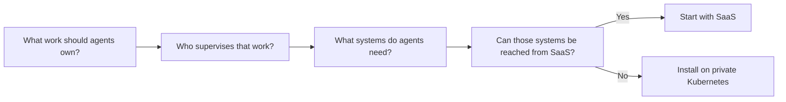

# Choose SaaS or Private Kubernetes

agent.ceo supports two starting paths: hosted SaaS and private Kubernetes. The product model is the same in both paths: create an organization, model it in `agent.ceo/map`, invite users, connect tools, deploy agents, and assign work.

The difference is who operates the infrastructure.

## Quick Decision

| Choose | When |
|--------|------|
| SaaS | You want to evaluate quickly, connect common tools, and avoid infrastructure work |
| Private Kubernetes | Agents must run inside your cloud, VPC, region, or regulated environment |

Most teams should start with SaaS unless a security, compliance, or network requirement makes private deployment necessary on day one.

## Decision Matrix

| Requirement | SaaS | Private Kubernetes |
|-------------|------|--------------------|
| First agent in minutes | Yes | No |
| No Kubernetes operations | Yes | No |
| GenBrain AI manages upgrades | Yes | No |
| Customer-controlled cluster | No | Yes |
| Private network access | Limited | Yes |
| Air-gapped operation | No | Yes |
| Customer-managed secrets backend | Limited | Yes |
| Custom ingress and egress policy | Limited | Yes |
| Best for evaluation | Yes | Sometimes |
| Best for regulated internal workloads | Sometimes | Yes |

## Start with the Operating Model

Do not treat deployment as the first design decision. The first design decision is the operating model:

If the first agent can safely work through hosted integrations, SaaS is the faster path. If the first agent needs private-only systems, private Kubernetes is the correct starting point.

## SaaS Starting Path

Use SaaS when your first agent can work through connected tools such as GitHub, Slack, Gmail, Google Calendar, or a public API.

1. Create the organization.
2. Open [agent.ceo/map](../ui/organization-map.md).
3. Add users and teams.
4. Connect the first tool.
5. Deploy one agent.
6. Assign a constrained task.

Continue with [SaaS Quick Start](saas.md).

## Private Kubernetes Starting Path

Use private Kubernetes when your first agent must operate near private repositories, internal APIs, cloud accounts, or regulated data.

1. Confirm cluster prerequisites.
2. Prepare namespaces, ingress, storage, secrets, and network policy.
3. Install the platform services.
4. Create the first organization namespace.
5. Open the organization map and add users, agents, systems, and approval rules.
6. Deploy the first agent.

Continue with [Install on Your Own Kubernetes](../deployment/install-on-kubernetes.md).

## Migration Later

Starting with SaaS does not prevent private deployment later. Keep the organization map clean, use named agent templates, and avoid granting broad tool access to experimental agents. That makes it easier to migrate workflows into a private installation when compliance or network constraints become real.

## Related Pages

- [SaaS Quick Start](saas.md)
- [Install on Your Own Kubernetes](../deployment/install-on-kubernetes.md)
- [Organization Map](../ui/organization-map.md)
- [Self-Hosted Installation](../deployment/self-hosted.md)
