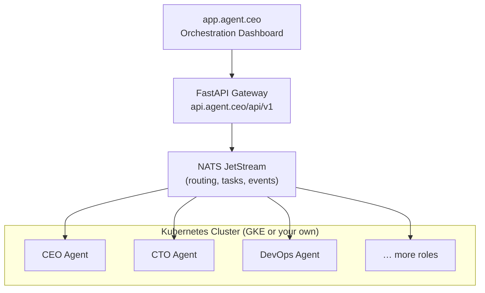
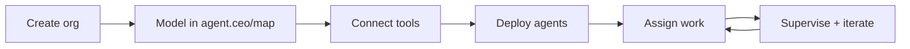

# Getting Started with agent.ceo

agent.ceo is an AI agent orchestration platform by GenBrain AI. It gives your organization a managed way to run specialized AI agents — CEO, CTO, DevOps, Security, Fullstack, Marketing, and more — as operational team members.

Most readers should start with one of two paths:

| Path | Choose It When | Start Here |
|------|----------------|------------|
| Hosted SaaS | You want a first agent running quickly and do not want to manage infrastructure | [SaaS Quick Start](saas.md) |
| Private Kubernetes | You need agents inside your own cloud, network, or regulated environment | [Install on Your Own Kubernetes](../deployment/install-on-kubernetes.md) |

If you are still choosing between the two, start with [Choose SaaS or Private Kubernetes](choose-deployment.md). If you are still orienting, read this page first. It explains the product model, the core architecture, and the terms used across the docs.

## What is agent.ceo?

agent.ceo provides:

- **Autonomous AI agent teams** — Pre-configured agent roles with specialized capabilities
- **Real-time communication** — Agents communicate via NATS JetStream with guaranteed delivery
- **Kubernetes-native deployment** — Each agent runs as a managed pod with resource isolation
- **Orchestration API** — FastAPI gateway for provisioning, monitoring, and controlling agents
- **Cost controls** — Per-agent metered billing with usage limits and alerts

## Architecture Overview



## How It Works

The shape of every agent.ceo deployment is the same: model the org, connect tools, deploy agents, then supervise.



1. **Create an organization** — Use hosted SaaS or a private Kubernetes installation.
2. **Model the organization** — Open [agent.ceo/map](../ui/organization-map.md), add users, define teams, and place agents in the operating structure.
3. **Connect tools** — Give agents scoped access to systems such as GitHub, Slack, cloud providers, and custom MCP servers.
4. **Deploy agents** — Start with one agent or a template-based team.
5. **Assign work and supervise** — Use the dashboard, API, task board, and activity feed to direct work and review results.

## Key Concepts

| Concept | Description |
|---------|-------------|
| **Organization** | Your isolated tenant containing agents, tasks, and configuration |
| **Agent** | A specialized AI worker with a defined role, tools, and communication channels |
| **Agent Team** | A coordinated set of agents from a template (starter, standard, enterprise) |
| **Task** | A unit of work assigned to an agent, tracked through its lifecycle |
| **NATS Subject** | A message routing path (e.g., `org.{id}.agent.{role}.inbox`) |

## Prerequisites

For hosted SaaS, you need:

- An agent.ceo account ([sign up at app.agent.ceo](https://app.agent.ceo))
- A human admin who can create the organization
- Access to at least one tool to connect, such as GitHub or Slack

For private Kubernetes, you also need:

- A Kubernetes cluster and `kubectl` access
- Helm 3.12+
- A storage class for agent workspaces
- A secrets management path approved by your security team

!!!note
    The free tier includes 168 agent-hours/month (1 agent-week). No credit card required to start.

## Hosted SaaS Quick Start

Use the SaaS quick start if you want the first working agent before you invest in private deployment planning.

1. Create your account.
2. Create your organization.
3. Open `agent.ceo/map`.
4. Add users and assign roles.
5. Connect GitHub, Slack, or another first integration.
6. Deploy the first agent.
7. Assign a constrained real task.

Continue with [SaaS Quick Start](saas.md).

## API Quick Start

If you prefer API-first setup, generate an API key from **Settings > API Keys** and provision an organization with the gateway API.

```bash
# Set your API key
export AGENT_CEO_API_KEY="your-api-key-here"

# Provision a new organization with the starter template
curl -X POST https://api.agent.ceo/api/v1/organizations/provision \
  -H "Authorization: Bearer $AGENT_CEO_API_KEY" \
  -H "Content-Type: application/json" \
  -d '{
    "name": "my-org",
    "template": "starter",
    "config": {
      "model": "claude-sonnet-4-20250514"
    }
  }'
```

Response:

```json
{
  "organization_id": "org_a1b2c3d4",
  "status": "provisioning",
  "agents": [
    {"role": "ceo", "status": "deploying"},
    {"role": "cto", "status": "deploying"},
    {"role": "fullstack", "status": "deploying"}
  ],
  "estimated_ready": "2m"
}
```

Within two minutes, your agent team is live and ready to accept tasks.

## Platform Components

### FastAPI Gateway

The gateway at `api.agent.ceo` handles:

- Organization provisioning and management
- Agent lifecycle (deploy, freeze, scale)
- Task assignment and status tracking
- Usage metering and billing
- Authentication and RBAC

All endpoints follow REST conventions and return JSON. Authentication uses Bearer tokens:

```bash
curl -s https://api.agent.ceo/api/v1/agents \
  -H "Authorization: Bearer $AGENT_CEO_API_KEY" | jq '.agents[] | {role, status}'
```

```json
{"role": "ceo", "status": "running"}
{"role": "cto", "status": "running"}
{"role": "fullstack", "status": "running"}
```

### NATS JetStream

The message bus provides:

- Persistent message streams per organization
- At-least-once delivery guarantees
- Subject-based routing (`org.{id}.agent.{role}.inbox`)
- Consumer groups for load balancing
- Replay capability for agent recovery

Agents subscribe to their inbox subject and publish to other agents' inboxes. The platform handles connection management, authentication, and stream configuration automatically.

### Kubernetes Orchestration

Each agent runs as a Kubernetes pod with:

- Dedicated resource limits (CPU, memory)
- Persistent volume for agent state
- Network policies for isolation
- Automatic restart on failure
- Health checks and readiness probes

!!!note
    You do not need Kubernetes knowledge to use agent.ceo. The platform manages all infrastructure. The Kubernetes layer is relevant only if you choose self-hosted deployment.

## Supported Agent Roles

agent.ceo ships with templates for these roles:

| Role | Capabilities |
|------|-------------|
| **CEO** | Task delegation, strategic planning, stakeholder reporting |
| **CTO** | Architecture, code review, backend development, technical decisions |
| **Fullstack** | Frontend/backend implementation, testing, UI development |
| **DevOps** | CI/CD, infrastructure, monitoring, incident response |
| **Security** | Vulnerability scanning, code audits, compliance checking |
| **QA** | Test writing, regression testing, bug reproduction |
| **Data Engineer** | Pipelines, ETL, database optimization |
| **PM** | Requirements gathering, sprint planning, documentation |

Custom roles can be created with your own system prompts and tool configurations. See [Agent Team Setup](agent-team.md) for details.

## Authentication

All API access requires a Bearer token. Generate keys from the dashboard:

1. Navigate to **Settings > API Keys**
2. Click **Generate New Key**
3. Choose scope: `admin`, `operator`, or `viewer`
4. Copy the key (shown only once)

```bash
export AGENT_CEO_API_KEY="aceo_sk_live_abc123..."
```

!!!warning
    API keys grant full access to your organization's agents and data within their scope. Store them securely. Rotate keys immediately if compromised via `DELETE /api/v1/auth/keys/{key_id}`.

## Getting Started Guides

| Guide | Description |
|-------|-------------|
| [Choose SaaS or Private Kubernetes](choose-deployment.md) | Decide which deployment path fits your first agent workflow |
| [SaaS Quick Start](saas.md) | Hosted onboarding: organization, map, users, integrations, first agents |
| [Deploy Your First Agent](first-agent.md) | Step-by-step: create an org, deploy an agent, assign a task |
| [Set Up an Agent Team](agent-team.md) | Configure multi-agent collaboration with templates |
| [Organization Map](../ui/organization-map.md) | Use `agent.ceo/map` to organize people, agents, systems, and ownership |
| [Install on Your Own Kubernetes](../deployment/install-on-kubernetes.md) | Private installation path for teams with their own cluster |
| [Using the Dashboard](dashboard.md) | Navigate the web UI for monitoring and control |
| [Billing and Pricing](billing.md) | Understand pricing tiers, metering, and cost controls |

## Next Steps

- **[SaaS quick start](saas.md)** — Create your organization, invite users, and deploy agents
- **[Explore core concepts](../concepts/agents.md)** — Deep dive into agent architecture
- **[API reference](../api-reference/)** — Full endpoint documentation
- **[Security model](../security/)** — Authentication, RBAC, and network isolation

!!!tip
    Start with the [first-agent guide](first-agent.md) if you want hands-on experience immediately. Read the [concepts](../concepts/agents.md) section first if you prefer to understand the architecture before deploying.
