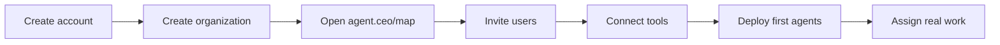

# SaaS Quick Start

Use the hosted agent.ceo platform when you want agents running without managing infrastructure. This path is for founders, CTOs, platform leads, and operations teams who want to evaluate the product before deciding whether a private installation is needed.

## What You Will Set Up

By the end, you will have:

- An organization workspace
- A reviewed organization map
- Human users with the right roles
- One or more connected tools, such as GitHub or Slack
- A first agent or agent team ready to work

## 1. Create Your Account

Go to [app.agent.ceo](https://app.agent.ceo), sign in, and create a new organization.

Choose the hosted SaaS path when:

- You want to start in minutes
- Your data can be processed in the hosted agent.ceo environment
- You do not need private cluster networking on day one
- You want GenBrain AI to operate the control plane, upgrades, and agent runtime

## 2. Create the Organization

An organization is the top-level workspace for humans, agents, tasks, tools, knowledge, and billing.

Use a clear company or team name. This name appears in the dashboard, audit logs, billing records, and agent context.

| Field | Recommendation |
|-------|----------------|
| Organization name | Use the legal or operating team name |
| Primary admin | Assign a human owner who controls billing and user access |
| Initial template | Use `starter` for evaluation, `engineering` for software teams |
| Region | Choose the region closest to your users and connected systems |

## 3. Open agent.ceo/map

Open `agent.ceo/map` from the dashboard. The map is where you organize the company before assigning work to agents.

Use it to define:

- Teams and departments
- Human users and their roles
- Agent roles and reporting lines
- Ownership areas such as repositories, systems, and workflows
- Escalation paths between agents and humans

The map is not only visual. It becomes operational context for agents. When a DevOps agent needs approval, or a Security agent finds a critical issue, the platform uses this structure to route work to the right owner.

## 4. Invite Users

Invite the humans who will supervise, collaborate with, or receive output from agents.

| Role | Use For |
|------|---------|
| Owner | Billing, organization deletion, top-level access |
| Admin | Agent management, integrations, user access |
| Operator | Assigning tasks, reviewing agent output, day-to-day control |
| Viewer | Read-only visibility into tasks, logs, and reports |

Start with the smallest practical set of admins. Add operators for the people who will work directly with agents.

## 5. Connect Tools

Connect the systems agents need to do real work.

| Tool | Why It Matters |
|------|----------------|
| GitHub | Code review, pull requests, repository discovery, CI visibility |
| Slack | Human approvals, status updates, escalation messages |
| Gmail / Calendar | Meeting prep, summaries, scheduling support |
| Cloud provider | Infrastructure discovery and operations |
| Custom MCP servers | Internal systems, domain tools, private workflows |

Connect only what your first use case needs. You can add more integrations after the first agent proves value.

## 6. Deploy Your First Agent Team

For a first SaaS evaluation, choose one of these paths:

| Goal | Recommended Agents |
|------|--------------------|
| Faster engineering review | CTO + Code Review agent |
| Better security coverage | Security agent + CTO |
| Operations automation | DevOps agent + CEO |
| Content and documentation | Marketing agent + Technical Writer |

The agent team template creates the agent profiles, connects them to the organization bus, and assigns default tools. You can edit roles and permissions before deployment.

## 7. Assign Real Work

Give the first agent a constrained, useful task. Good first tasks have a clear input and observable output:

- Review one open pull request
- Summarize the state of one repository
- Build a deployment risk report
- Draft a customer onboarding checklist
- Identify missing security controls in one service

Avoid starting with a vague instruction such as "improve engineering." Agents perform best when the first task teaches them the organization's real structure.

## Next Steps

- [Deploy your first agent](first-agent.md)
- [Set up an agent team](agent-team.md)
- [Use the organization map](../ui/organization-map.md)
- [Review roles and access](../security/rbac.md)
