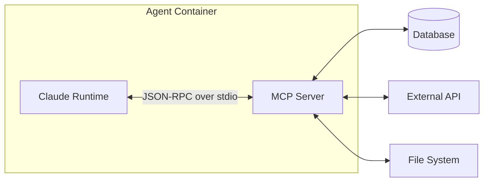

# Custom MCP Servers

The Model Context Protocol (MCP) is the extension mechanism for agent.ceo agents. Custom MCP servers let you give agents access to internal databases, proprietary APIs, legacy systems, or any capability not covered by built-in integrations.

## Setup

### MCP Protocol Overview

MCP servers communicate with agents over stdio (standard input/output) using JSON-RPC 2.0. Each server exposes three capability types:

| Capability | Purpose | Example |
|-----------|---------|---------|
| **Tools** | Actions the agent can invoke | `query_database`, `send_notification` |
| **Resources** | Data the agent can read | Configuration files, API schemas |
| **Prompts** | Pre-built prompt templates | Report formats, analysis frameworks |



### Server Structure

A minimal MCP server in Python:

```python
#!/usr/bin/env python3
"""Custom MCP server for database queries."""

import asyncio
import json
from mcp.server import Server
from mcp.server.stdio import stdio_server
from mcp.types import Tool, TextContent

# Initialize server
server = Server("custom-db-query")


@server.list_tools()
async def list_tools() -> list[Tool]:
    """Declare available tools."""
    return [
        Tool(
            name="query_products",
            description="Query the product database with filters",
            inputSchema={
                "type": "object",
                "properties": {
                    "category": {
                        "type": "string",
                        "description": "Product category to filter by"
                    },
                    "min_price": {
                        "type": "number",
                        "description": "Minimum price filter"
                    },
                    "limit": {
                        "type": "integer",
                        "description": "Maximum results to return",
                        "default": 10
                    }
                },
                "required": ["category"]
            }
        ),
        Tool(
            name="get_product_stats",
            description="Get aggregate statistics for a product category",
            inputSchema={
                "type": "object",
                "properties": {
                    "category": {"type": "string"}
                },
                "required": ["category"]
            }
        )
    ]


@server.call_tool()
async def call_tool(name: str, arguments: dict) -> list[TextContent]:
    """Handle tool invocations."""
    if name == "query_products":
        results = await query_products_db(
            category=arguments["category"],
            min_price=arguments.get("min_price", 0),
            limit=arguments.get("limit", 10)
        )
        return [TextContent(type="text", text=json.dumps(results, indent=2))]

    elif name == "get_product_stats":
        stats = await get_category_stats(arguments["category"])
        return [TextContent(type="text", text=json.dumps(stats, indent=2))]

    raise ValueError(f"Unknown tool: {name}")


async def main():
    """Run the MCP server."""
    async with stdio_server() as (read_stream, write_stream):
        await server.run(read_stream, write_stream)


if __name__ == "__main__":
    asyncio.run(main())
```

### Registration in Agent Config

Register the MCP server in the agent's deployment configuration:

```json
{
  "agent": {
    "id": "data-analyst",
    "mcp_servers": {
      "custom-db-query": {
        "command": "python",
        "args": ["/app/mcp-servers/db_query_server.py"],
        "env": {
          "DB_HOST": "${DB_HOST}",
          "DB_NAME": "${DB_NAME}",
          "DB_PASSWORD": "${DB_PASSWORD}"
        }
      },
      "internal-api": {
        "command": "node",
        "args": ["/app/mcp-servers/internal-api/index.js"],
        "env": {
          "API_BASE_URL": "${INTERNAL_API_URL}",
          "API_KEY": "${INTERNAL_API_KEY}"
        }
      }
    }
  }
}
```

In the Kubernetes deployment manifest:

```yaml
apiVersion: apps/v1
kind: Deployment
metadata:
  name: agent-data-analyst
spec:
  template:
    spec:
      containers:
        - name: agent
          image: gcr.io/agent-ceo/agent-runtime:latest
          volumeMounts:
            - name: mcp-servers
              mountPath: /app/mcp-servers
      volumes:
        - name: mcp-servers
          configMap:
            name: custom-mcp-servers
```

## Building a Custom Database Query Tool

### Complete Example

This example builds a production-ready MCP server that queries a PostgreSQL database with proper security controls:

```python
#!/usr/bin/env python3
"""Secure database query MCP server with parameterized queries."""

import asyncio
import json
import os
import re
from typing import Any

import asyncpg
from mcp.server import Server
from mcp.server.stdio import stdio_server
from mcp.types import Tool, TextContent, Resource

server = Server("secure-db-query")

# Connection pool (initialized on first use)
_pool: asyncpg.Pool | None = None


async def get_pool() -> asyncpg.Pool:
    """Get or create the connection pool."""
    global _pool
    if _pool is None:
        _pool = await asyncpg.create_pool(
            host=os.environ["DB_HOST"],
            port=int(os.environ.get("DB_PORT", "5432")),
            database=os.environ["DB_NAME"],
            user=os.environ["DB_USER"],
            password=os.environ["DB_PASSWORD"],
            min_size=2,
            max_size=10,
            command_timeout=30  # 30-second query timeout
        )
    return _pool


# --- Input Validation ---

ALLOWED_TABLES = {"products", "orders", "customers", "categories"}
ALLOWED_COLUMNS = {
    "products": {"id", "name", "category", "price", "created_at", "stock"},
    "orders": {"id", "customer_id", "total", "status", "created_at"},
    "customers": {"id", "name", "email", "tier", "created_at"},
    "categories": {"id", "name", "parent_id"}
}


def validate_table(table: str) -> str:
    """Validate table name against allowlist."""
    if table not in ALLOWED_TABLES:
        raise ValueError(f"Table '{table}' not allowed. Valid: {ALLOWED_TABLES}")
    return table


def validate_columns(table: str, columns: list[str]) -> list[str]:
    """Validate column names against allowlist."""
    allowed = ALLOWED_COLUMNS.get(table, set())
    for col in columns:
        if col not in allowed:
            raise ValueError(f"Column '{col}' not allowed for table '{table}'")
    return columns


def sanitize_limit(limit: int) -> int:
    """Enforce maximum result limit."""
    return min(max(1, limit), 100)


# --- Tools ---

@server.list_tools()
async def list_tools() -> list[Tool]:
    return [
        Tool(
            name="query_table",
            description="Query a database table with filters. Returns up to 100 rows.",
            inputSchema={
                "type": "object",
                "properties": {
                    "table": {
                        "type": "string",
                        "enum": list(ALLOWED_TABLES),
                        "description": "Table to query"
                    },
                    "columns": {
                        "type": "array",
                        "items": {"type": "string"},
                        "description": "Columns to select (default: all allowed)"
                    },
                    "filters": {
                        "type": "object",
                        "description": "Column=value equality filters",
                        "additionalProperties": {"type": "string"}
                    },
                    "order_by": {
                        "type": "string",
                        "description": "Column to sort by"
                    },
                    "limit": {
                        "type": "integer",
                        "description": "Max rows (1-100, default 20)",
                        "default": 20
                    }
                },
                "required": ["table"]
            }
        ),
        Tool(
            name="aggregate",
            description="Run aggregate queries (COUNT, SUM, AVG) on a table.",
            inputSchema={
                "type": "object",
                "properties": {
                    "table": {
                        "type": "string",
                        "enum": list(ALLOWED_TABLES)
                    },
                    "function": {
                        "type": "string",
                        "enum": ["count", "sum", "avg", "min", "max"]
                    },
                    "column": {
                        "type": "string",
                        "description": "Column to aggregate"
                    },
                    "group_by": {
                        "type": "string",
                        "description": "Column to group by"
                    },
                    "filters": {
                        "type": "object",
                        "additionalProperties": {"type": "string"}
                    }
                },
                "required": ["table", "function", "column"]
            }
        )
    ]


@server.call_tool()
async def call_tool(name: str, arguments: dict) -> list[TextContent]:
    if name == "query_table":
        return await handle_query_table(arguments)
    elif name == "aggregate":
        return await handle_aggregate(arguments)
    raise ValueError(f"Unknown tool: {name}")


async def handle_query_table(args: dict) -> list[TextContent]:
    """Execute a validated SELECT query."""
    table = validate_table(args["table"])
    columns = args.get("columns") or list(ALLOWED_COLUMNS[table])
    validate_columns(table, columns)
    limit = sanitize_limit(args.get("limit", 20))
    filters = args.get("filters", {})

    # Build parameterized query
    col_str = ", ".join(columns)
    query = f"SELECT {col_str} FROM {table}"
    params = []

    if filters:
        validate_columns(table, list(filters.keys()))
        conditions = []
        for i, (col, val) in enumerate(filters.items(), 1):
            conditions.append(f"{col} = ${i}")
            params.append(val)
        query += " WHERE " + " AND ".join(conditions)

    if order_by := args.get("order_by"):
        validate_columns(table, [order_by])
        query += f" ORDER BY {order_by} DESC"

    query += f" LIMIT {limit}"

    pool = await get_pool()
    async with pool.acquire() as conn:
        rows = await conn.fetch(query, *params)

    results = [dict(row) for row in rows]
    return [TextContent(type="text", text=json.dumps(results, indent=2, default=str))]


async def handle_aggregate(args: dict) -> list[TextContent]:
    """Execute a validated aggregate query."""
    table = validate_table(args["table"])
    func = args["function"].upper()
    column = args["column"]
    validate_columns(table, [column])

    query = f"SELECT {func}({column}) as result FROM {table}"
    params = []

    if group_by := args.get("group_by"):
        validate_columns(table, [group_by])
        query = f"SELECT {group_by}, {func}({column}) as result FROM {table}"
        if filters := args.get("filters"):
            validate_columns(table, list(filters.keys()))
            conditions = []
            for i, (col, val) in enumerate(filters.items(), 1):
                conditions.append(f"{col} = ${i}")
                params.append(val)
            query += " WHERE " + " AND ".join(conditions)
        query += f" GROUP BY {group_by} ORDER BY result DESC LIMIT 20"
    else:
        if filters := args.get("filters"):
            validate_columns(table, list(filters.keys()))
            conditions = []
            for i, (col, val) in enumerate(filters.items(), 1):
                conditions.append(f"{col} = ${i}")
                params.append(val)
            query += " WHERE " + " AND ".join(conditions)

    pool = await get_pool()
    async with pool.acquire() as conn:
        rows = await conn.fetch(query, *params)

    results = [dict(row) for row in rows]
    return [TextContent(type="text", text=json.dumps(results, indent=2, default=str))]


# --- Resources ---

@server.list_resources()
async def list_resources() -> list[Resource]:
    return [
        Resource(
            uri="db://schema",
            name="Database Schema",
            description="Available tables and columns",
            mimeType="application/json"
        )
    ]


@server.read_resource()
async def read_resource(uri: str) -> str:
    if uri == "db://schema":
        return json.dumps({
            "tables": {
                table: list(cols) for table, cols in ALLOWED_COLUMNS.items()
            }
        }, indent=2)
    raise ValueError(f"Unknown resource: {uri}")


async def main():
    async with stdio_server() as (read_stream, write_stream):
        await server.run(read_stream, write_stream)


if __name__ == "__main__":
    asyncio.run(main())
```

## Security Best Practices

### Tool Validation

!!!warning "Critical: Never Trust Agent Input"
    MCP tools receive input from the AI agent, which processes user requests. Always validate and sanitize all inputs.

**Validation checklist:**

- [ ] Allowlist valid values (tables, columns, operations)
- [ ] Parameterize all queries (never string-interpolate)
- [ ] Enforce result limits (prevent memory exhaustion)
- [ ] Set query timeouts (prevent runaway queries)
- [ ] Use read-only database credentials where possible
- [ ] Log all tool invocations for audit

### Input Sanitization Patterns

```python
def validate_input(value: str, pattern: str, max_length: int = 255) -> str:
    """Validate input against a regex pattern and length limit."""
    if len(value) > max_length:
        raise ValueError(f"Input exceeds max length of {max_length}")
    if not re.match(pattern, value):
        raise ValueError(f"Input does not match expected pattern")
    return value

# Usage
table = validate_input(args["table"], r"^[a-z_]+$", max_length=64)
```

### Credential Management

Never hardcode credentials. Use environment variables injected from Kubernetes secrets:

```yaml
# K8s secret for MCP server credentials
apiVersion: v1
kind: Secret
metadata:
  name: mcp-db-credentials
  namespace: agents
type: Opaque
data:
  DB_PASSWORD: <base64-encoded>
  DB_USER: <base64-encoded>
```

```yaml
# Referenced in agent deployment
env:
  - name: DB_PASSWORD
    valueFrom:
      secretKeyRef:
        name: mcp-db-credentials
        key: DB_PASSWORD
```

## Deployment Alongside Agents

### Option 1: Bundled in Agent Image

For simple MCP servers, bundle directly in the agent container:

```dockerfile
FROM gcr.io/agent-ceo/agent-runtime:latest

# Add custom MCP server
COPY mcp-servers/ /app/mcp-servers/
RUN pip install asyncpg  # Install dependencies
```

### Option 2: Sidecar Container

For complex MCP servers with their own dependencies:

```yaml
apiVersion: apps/v1
kind: Deployment
metadata:
  name: agent-analyst
spec:
  template:
    spec:
      containers:
        - name: agent
          image: gcr.io/agent-ceo/agent-runtime:latest
        - name: mcp-db
          image: gcr.io/agent-ceo/mcp-db-query:1.0.0
          ports:
            - containerPort: 8080
          env:
            - name: DB_HOST
              value: "postgres.databases.svc"
```

### Option 3: Remote MCP Server (SSE Transport)

For shared MCP servers used by multiple agents:

```json
{
  "mcp_servers": {
    "shared-analytics": {
      "transport": "sse",
      "url": "https://mcp-analytics.internal.agent.ceo/sse",
      "headers": {
        "Authorization": "Bearer ${MCP_ANALYTICS_TOKEN}"
      }
    }
  }
}
```

## Testing MCP Servers

### Unit Testing Tools

```python
import pytest
from unittest.mock import AsyncMock, patch
from db_query_server import handle_query_table, validate_table

def test_validate_table_rejects_unknown():
    with pytest.raises(ValueError, match="not allowed"):
        validate_table("users_sensitive")

def test_validate_table_accepts_known():
    assert validate_table("products") == "products"

@pytest.mark.asyncio
async def test_query_table_with_filters():
    with patch("db_query_server.get_pool") as mock_pool:
        mock_conn = AsyncMock()
        mock_conn.fetch.return_value = [
            {"id": 1, "name": "Widget", "price": 9.99}
        ]
        mock_pool.return_value.acquire.return_value.__aenter__.return_value = mock_conn

        result = await handle_query_table({
            "table": "products",
            "filters": {"category": "widgets"},
            "limit": 5
        })

        assert "Widget" in result[0].text
        mock_conn.fetch.assert_called_once()
```

### Integration Testing

```bash
# Run MCP server in test mode and send JSON-RPC requests
echo '{"jsonrpc":"2.0","method":"tools/list","id":1}' | python db_query_server.py
```

## Troubleshooting

| Issue | Resolution |
|-------|-----------|
| Server fails to start | Check dependencies installed, env vars set |
| Tool not appearing in agent | Verify MCP server registered in agent config |
| Timeout on tool call | Increase `command_timeout` or optimize query |
| Permission denied | Check database credentials and network policies |
| JSON parse error | Ensure tool returns valid `TextContent` objects |

## Related

- [GitHub Integration](./github.md) — Example of a platform-managed MCP server
- [Neo4j Knowledge Graph](./neo4j.md) — Built-in MCP tools for graph operations
- [Agent Architecture](/concepts/agents.md) — How MCP servers fit into agent containers
- [Security Model](/security/overview.md) — Network policies and credential isolation
