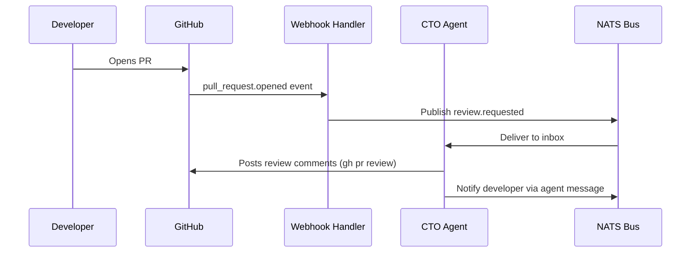

# GitHub Integration

agent.ceo integrates with GitHub to give agents full access to repositories — cloning codebases for knowledge ingestion, creating pull requests, performing code reviews, and reacting to CI/CD events via webhooks.

## Setup

### 1. Generate an SSH Key

Each agent can generate its own SSH key pair using the `generate_ssh_key` MCP tool. This creates a deploy key scoped to the agent's identity.

```python
# MCP tool call from agent context
result = await mcp.call("generate_ssh_key", {
    "agent_id": "cto",
    "key_type": "ed25519",
    "comment": "agent.ceo/acme-corp/cto"
})
# Returns: { "public_key": "ssh-ed25519 AAAA...", "key_path": "/agent-data/ssh/id_ed25519" }
```

### 2. Register the Key with GitHub

Use the `setup_github_repo_access` MCP tool to add the public key as a deploy key on the target repository:

```python
result = await mcp.call("setup_github_repo_access", {
    "org": "acme-corp",
    "repo": "backend-api",
    "public_key": result["public_key"],
    "read_only": False  # Set True for read-only agents
})
```

This tool uses the organization's GitHub App installation token to register the deploy key via the GitHub API.

### 3. Configure Git Identity

The agent's Git identity is set in its CLAUDE.md configuration:

```markdown
## Git Workflow
Branch: `cto` | Features: `cto/feat/name` | CI auto-merges to `develop`.
```

The SSH config is written to `/agent-data/ssh/config`:

```
Host github.com
  IdentityFile /agent-data/ssh/id_ed25519
  StrictHostKeyChecking accept-new
```

## Repository Cloning

Agents clone repositories for two primary purposes: active development and knowledge base ingestion.

### Development Workflow

```bash
# Agent clones into its workspace
git clone git@github.com:acme-corp/backend-api.git /home/appuser/workspace/backend-api
cd /home/appuser/workspace/backend-api
git checkout -b cto/feat/add-rate-limiting
```

### Knowledge Base Ingestion

Repositories can be ingested into the organization's Neo4j knowledge graph:

```python
# Ingest repo structure into wiki
await mcp.call("wiki_ingest_text", {
    "title": "Backend API Architecture",
    "content": repo_summary,
    "page_type": "entity",
    "space": "codebase"
})
```

## Pull Request Workflows

Agents create and manage PRs using the `gh` CLI, which is pre-installed in every agent container.

### Creating a Pull Request

```bash
# After committing changes on a feature branch
gh pr create \
  --title "Add rate limiting to API gateway" \
  --body "## Summary
- Implements token bucket rate limiting
- Configurable per-org limits via Firestore
- Returns 429 with Retry-After header

## Test Plan
- [x] Unit tests for token bucket algorithm
- [x] Integration test with mock Redis
- [ ] Load test in staging" \
  --base develop \
  --head cto/feat/add-rate-limiting
```

### Code Review Workflow



### Automated PR Review

```bash
# Agent reviews a PR
gh pr diff 42 | head -500  # Read the diff
gh pr review 42 --comment --body "## Code Review

**Security**: Auth middleware present on all mutation endpoints.
**Performance**: N+1 query detected in line 87 — consider batch fetch.
**Style**: Function exceeds 100-line limit at lines 45-180.

Requesting changes for the N+1 issue."

# Request changes if critical issues found
gh pr review 42 --request-changes --body "Blocking: N+1 query will cause timeout at scale."
```

## Webhook Integration

GitHub webhooks deliver CI/CD events to the agent.ceo gateway, which routes them to the appropriate agent via NATS.

### Supported Events

| Event | Action | Agent Response |
|-------|--------|----------------|
| `pull_request.opened` | PR created | Trigger code review |
| `pull_request.merged` | PR merged | Update knowledge graph |
| `check_suite.completed` | CI finished | Report results to task |
| `push` | Code pushed | Trigger deploy pipeline |
| `issue_comment.created` | Comment on issue | Parse for agent commands |

### Webhook Configuration

Configure the webhook URL in your GitHub repository settings:

```
URL: https://api.agent.ceo/api/v1/webhooks/github
Content-Type: application/json
Secret: <org_webhook_secret>
```

The gateway validates the webhook signature using HMAC-SHA256:

```python
import hmac
import hashlib

def verify_github_webhook(payload: bytes, signature: str, secret: str) -> bool:
    expected = hmac.new(
        secret.encode(),
        payload,
        hashlib.sha256
    ).hexdigest()
    return hmac.compare_digest(f"sha256={expected}", signature)
```

### Event Routing

Events are published to NATS subjects based on the repository and event type:

```
org.{org_id}.github.{repo}.pull_request.opened
org.{org_id}.github.{repo}.check_suite.completed
org.{org_id}.github.{repo}.push
```

## Security Considerations

!!!warning
    Never store GitHub tokens in agent memory or CLAUDE.md. Use the platform's credential store via the `store_credential` / `get_credential` MCP tools.

- SSH keys are scoped per-agent, per-repository
- Deploy keys can be read-only for agents that only need to clone
- Webhook secrets are stored encrypted in the organization's credential vault
- The GitHub App installation token is managed by the platform and rotated automatically

## Troubleshooting

| Issue | Resolution |
|-------|-----------|
| `Permission denied (publickey)` | Re-run `generate_ssh_key` and `setup_github_repo_access` |
| PR creation fails | Verify branch is pushed: `git push -u origin <branch>` |
| Webhook not received | Check webhook delivery log in GitHub repo settings |
| Clone timeout | Verify network policy allows egress to `github.com:22` |

## Related

- [Custom MCP Servers](./custom-mcp.md) — Build tools that wrap GitHub's GraphQL API
- [Neo4j Knowledge Graph](./neo4j.md) — Ingest repository data into the wiki
- [Security Model](/security/overview.md) — Credential management and isolation
