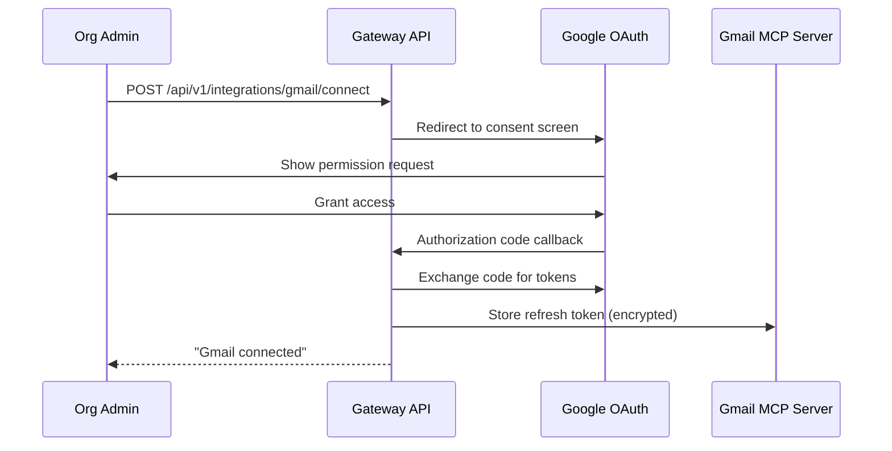
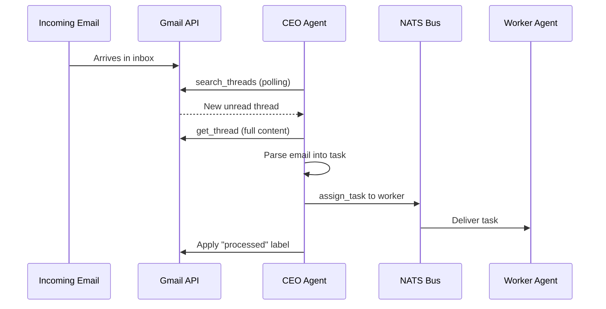

# Gmail Integration

agent.ceo connects to Gmail through Google's MCP server, enabling agents to read email threads, create drafts, manage labels, and trigger workflows based on incoming messages.

## Setup

### 1. OAuth2 Authentication

Gmail access requires OAuth2 consent from a Google Workspace or personal Gmail account. The authentication flow is initiated via the platform:



### 2. Required OAuth Scopes

| Scope | Purpose |
|-------|---------|
| `gmail.readonly` | Read threads, messages, labels |
| `gmail.compose` | Create and send drafts |
| `gmail.labels` | Create and manage labels |
| `gmail.modify` | Mark messages, apply labels |

### 3. Configure in Organization Settings

```bash
curl -X POST https://api.agent.ceo/api/v1/integrations/gmail/connect \
  -H "Authorization: Bearer $TOKEN" \
  -H "Content-Type: application/json" \
  -d '{
    "redirect_uri": "https://app.agent.ceo/integrations/gmail/callback",
    "scopes": ["gmail.readonly", "gmail.compose", "gmail.labels"]
  }'
```

The response includes an authorization URL to complete OAuth consent in the browser.

## Available MCP Tools

### search_threads

Search Gmail threads using Gmail's query syntax:

```python
results = await mcp.call("claude_ai_Gmail__search_threads", {
    "query": "from:client@example.com subject:urgent after:2026/05/01",
    "max_results": 10
})
```

Gmail search operators:

| Operator | Example | Description |
|----------|---------|-------------|
| `from:` | `from:ceo@company.com` | Sender filter |
| `to:` | `to:support@company.com` | Recipient filter |
| `subject:` | `subject:deployment` | Subject line match |
| `after:` | `after:2026/05/01` | Date filter |
| `has:attachment` | — | Has attachments |
| `label:` | `label:agent-tasks` | Label filter |
| `is:unread` | — | Unread messages |

### get_thread

Retrieve a full email thread with all messages:

```python
thread = await mcp.call("claude_ai_Gmail__get_thread", {
    "thread_id": "18f4a2b3c4d5e6f7"
})

# Returns structured thread data
# {
#   "id": "18f4a2b3c4d5e6f7",
#   "subject": "Q2 Sprint Planning",
#   "messages": [
#     { "from": "ceo@company.com", "date": "2026-05-10T09:00:00Z", "body": "..." },
#     { "from": "cto@company.com", "date": "2026-05-10T09:15:00Z", "body": "..." }
#   ]
# }
```

### create_draft

Create an email draft (does not send automatically):

```python
draft = await mcp.call("claude_ai_Gmail__create_draft", {
    "to": ["client@example.com"],
    "subject": "Weekly Status Report — Week 19",
    "body": """Hi Team,

Here's this week's agent activity summary:

- Tasks completed: 14
- PRs merged: 7
- Deployments: 3

Full report attached.

Best,
Agent Team""",
    "cc": ["manager@company.com"]
})
```

!!!warning
    Drafts are created but NOT sent automatically. This is a safety measure — a human must review and send the draft, or the org admin must explicitly enable auto-send in the integration settings.

### list_labels

List all Gmail labels for organization and filtering:

```python
labels = await mcp.call("claude_ai_Gmail__list_labels", {})
# Returns: [{"id": "Label_1", "name": "agent-tasks"}, ...]
```

### create_label

Create custom labels for agent workflow organization:

```python
label = await mcp.call("claude_ai_Gmail__create_label", {
    "name": "agent-ceo/processed",
    "label_list_visibility": "labelShow",
    "message_list_visibility": "show"
})
```

## Use Cases

### Email-Triggered Task Creation

Monitor an inbox for emails that should become agent tasks:

```python
async def check_inbox_for_tasks():
    """Poll inbox for unprocessed task emails."""
    threads = await mcp.call("claude_ai_Gmail__search_threads", {
        "query": "label:agent-tasks -label:agent-ceo/processed is:unread"
    })

    for thread in threads["threads"]:
        full_thread = await mcp.call("claude_ai_Gmail__get_thread", {
            "thread_id": thread["id"]
        })

        # Parse email content into a task
        task = parse_email_to_task(full_thread)

        # Create task in the agent system
        await mcp.call("assign_task", {
            "agent": task["assignee"],
            "title": task["title"],
            "description": task["description"],
            "priority": task["priority"]
        })

        # Mark as processed
        await apply_label(thread["id"], "agent-ceo/processed")
```



### Report Distribution

Send periodic reports to stakeholders via email drafts:

```python
async def distribute_weekly_report(report: dict):
    """Create draft email with weekly agent activity report."""
    body = format_report_as_email(report)

    await mcp.call("claude_ai_Gmail__create_draft", {
        "to": report["recipients"],
        "subject": f"Agent Activity Report — {report['week']}",
        "body": body
    })
```

### Customer Communication Tracking

Track customer threads and surface relevant context to agents:

```python
async def get_customer_context(customer_email: str) -> dict:
    """Retrieve recent communication with a customer."""
    threads = await mcp.call("claude_ai_Gmail__search_threads", {
        "query": f"from:{customer_email} OR to:{customer_email}",
        "max_results": 5
    })

    context = []
    for thread in threads["threads"]:
        full = await mcp.call("claude_ai_Gmail__get_thread", {
            "thread_id": thread["id"]
        })
        context.append({
            "subject": full["subject"],
            "last_message": full["messages"][-1]["body"][:500],
            "date": full["messages"][-1]["date"]
        })

    return {"customer": customer_email, "recent_threads": context}
```

## Security Considerations

!!!warning
    Email access is powerful. Follow these security practices:

- **Principle of least privilege**: Only request scopes the agent actually needs
- **Draft-only by default**: Auto-send must be explicitly enabled by org admin
- **Token rotation**: OAuth refresh tokens are encrypted and rotated every 90 days
- **Audit logging**: All email operations are logged in the platform audit trail
- **Label isolation**: Use dedicated labels (prefix `agent-ceo/`) to avoid interfering with human workflows

## Token Refresh

The MCP server handles token refresh automatically. If a token expires:

```python
# Automatic retry with refresh — handled by MCP server internally
# If refresh fails, the integration shows "disconnected" in the admin panel
# Admin must re-authorize via the OAuth flow
```

## Troubleshooting

| Issue | Resolution |
|-------|-----------|
| `401 Unauthorized` | Token expired — re-authorize in admin panel |
| `403 Insufficient scopes` | Disconnect and reconnect with required scopes |
| Search returns empty | Verify query syntax matches Gmail operators |
| Draft not appearing | Check "Drafts" folder; may take 1-2 seconds to sync |
| Rate limit (429) | Gmail API allows 250 quota units/second — reduce polling frequency |

## Related

- [Slack Integration](./slack.md) — Real-time notifications as complement to email
- [Google Calendar](./google-calendar.md) — Schedule meetings referenced in emails
- [Security Overview](/security/overview.md) — OAuth token management and audit logging
