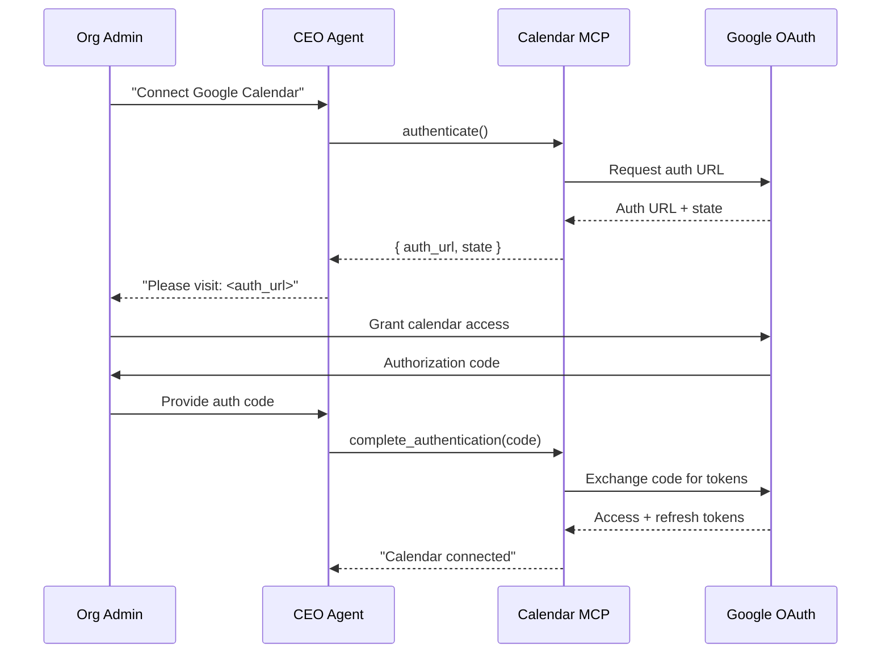
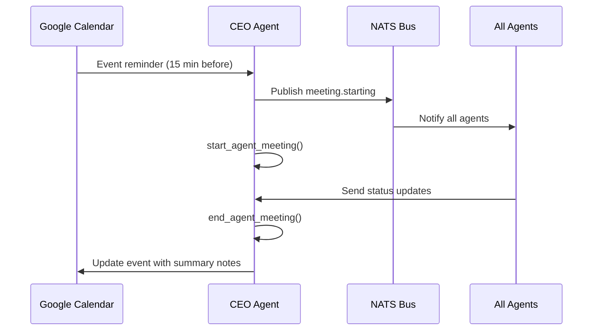

# Google Calendar Integration

agent.ceo connects to Google Calendar via Google's MCP server to enable automated meeting scheduling, availability management, and time-based coordination between agents and human stakeholders.

## Setup

### 1. Initiate Authentication

Start the OAuth2 flow using the Google Calendar MCP tool:

```python
auth_result = await mcp.call("claude_ai_Google_Calendar__authenticate", {})
# Returns: { "auth_url": "https://accounts.google.com/o/oauth2/...", "state": "abc123" }
```

### 2. Complete OAuth Consent

Direct the org admin to the authorization URL. After granting access, complete the flow:

```python
await mcp.call("claude_ai_Google_Calendar__complete_authentication", {
    "authorization_code": "4/0AX4XfWh..."
})
```

### 3. Required Scopes

| Scope | Purpose |
|-------|---------|
| `calendar.readonly` | Read events and free/busy info |
| `calendar.events` | Create, modify, delete events |
| `calendar.settings.readonly` | Read user timezone and preferences |

### 4. Platform Configuration

Configure calendar integration in the organization settings:

```json
{
  "google_calendar": {
    "enabled": true,
    "default_calendar_id": "primary",
    "agent_calendar_id": "agent-meetings@group.calendar.google.com",
    "timezone": "America/New_York",
    "working_hours": {
      "start": "09:00",
      "end": "18:00",
      "days": ["monday", "tuesday", "wednesday", "thursday", "friday"]
    }
  }
}
```

## Authentication Flow



## Core Operations

### Schedule a Meeting

Create calendar events for agent coordination meetings:

```python
event = await create_calendar_event({
    "summary": "Agent Standup — Daily Sync",
    "description": "Automated daily standup for all active agents.\n\nAgenda:\n- Blockers\n- Progress updates\n- Priority alignment",
    "start": {
        "dateTime": "2026-05-11T09:00:00",
        "timeZone": "America/New_York"
    },
    "end": {
        "dateTime": "2026-05-11T09:15:00",
        "timeZone": "America/New_York"
    },
    "attendees": [
        {"email": "ceo@company.com"},
        {"email": "engineering@company.com"}
    ],
    "recurrence": ["RRULE:FREQ=DAILY;BYDAY=MO,TU,WE,TH,FR"]
})
```

### Check Availability

Query free/busy information before scheduling:

```python
async def find_available_slot(
    attendees: list[str],
    duration_minutes: int,
    search_start: str,
    search_end: str
) -> dict:
    """Find the next available time slot for all attendees."""
    freebusy = await get_freebusy({
        "timeMin": search_start,
        "timeMax": search_end,
        "items": [{"id": email} for email in attendees]
    })

    # Find gaps in combined busy periods
    busy_periods = merge_busy_periods(freebusy)
    available_slot = find_first_gap(busy_periods, duration_minutes)

    return available_slot
```

### List Upcoming Events

```python
events = await list_events({
    "calendarId": "agent-meetings@group.calendar.google.com",
    "timeMin": "2026-05-10T00:00:00Z",
    "timeMax": "2026-05-17T00:00:00Z",
    "singleEvents": True,
    "orderBy": "startTime"
})
```

## Use Cases

### Automated Standup Scheduling

The CEO agent schedules recurring standups and triggers meeting workflows:



```python
async def handle_standup_trigger():
    """Called when standup calendar event is approaching."""
    # Start the agent meeting
    meeting = await mcp.call("start_agent_meeting", {
        "title": "Daily Standup",
        "participants": ["cto", "fullstack", "devops"],
        "agenda": ["blockers", "progress", "priorities"]
    })

    # Wait for agent responses (via NATS)
    await asyncio.sleep(120)  # 2 minutes for responses

    # End meeting and generate summary
    summary = await mcp.call("end_agent_meeting", {
        "meeting_id": meeting["id"]
    })

    # Update calendar event with meeting notes
    await update_calendar_event(meeting["calendar_event_id"], {
        "description": f"Meeting Summary:\n{summary['report']}"
    })
```

### Deadline Tracking

Create calendar events for task deadlines and sprint milestones:

```python
async def create_deadline_event(task: dict):
    """Create a calendar event for a task deadline."""
    await create_calendar_event({
        "summary": f"DEADLINE: {task['title']}",
        "description": f"Task: {task['id']}\nAssigned to: {task['agent']}\nPriority: {task['priority']}",
        "start": {
            "date": task["due_date"]  # All-day event
        },
        "end": {
            "date": task["due_date"]
        },
        "reminders": {
            "useDefault": False,
            "overrides": [
                {"method": "popup", "minutes": 1440},  # 1 day before
                {"method": "popup", "minutes": 60}     # 1 hour before
            ]
        },
        "colorId": "11"  # Red for deadlines
    })
```

### Sprint Planning Calendar

Automatically create sprint events based on organization cadence:

```python
async def setup_sprint_calendar(sprint: dict):
    """Create calendar events for a new sprint."""
    events = [
        {
            "summary": f"Sprint {sprint['number']} — Planning",
            "start": sprint["start_date"],
            "duration_minutes": 60
        },
        {
            "summary": f"Sprint {sprint['number']} — Review",
            "start": sprint["end_date"],
            "duration_minutes": 45
        },
        {
            "summary": f"Sprint {sprint['number']} — Retrospective",
            "start": add_hours(sprint["end_date"], 2),
            "duration_minutes": 30
        }
    ]

    for event_data in events:
        await create_calendar_event(event_data)
```

## Integration with Agent Meetings

Calendar events are linked to the agent meeting system:

```json
{
  "meeting": {
    "id": "mtg_abc123",
    "calendar_event_id": "google_event_xyz",
    "title": "Architecture Review",
    "scheduled_at": "2026-05-11T14:00:00Z",
    "participants": ["ceo", "cto", "fullstack"],
    "status": "scheduled",
    "auto_start": true
  }
}
```

When `auto_start` is enabled, the platform watches for calendar event start times and automatically initiates the agent meeting.

## Timezone Handling

!!!note
    All times stored internally in UTC. The platform converts to the organization's configured timezone for calendar operations and display.

```python
from datetime import datetime, timezone
import pytz

def to_org_timezone(utc_time: datetime, org_tz: str) -> str:
    """Convert UTC datetime to org's timezone for calendar display."""
    tz = pytz.timezone(org_tz)
    local_time = utc_time.astimezone(tz)
    return local_time.isoformat()
```

## Troubleshooting

| Issue | Resolution |
|-------|-----------|
| `403 Calendar access denied` | Re-authorize with `calendar.events` scope |
| Event created in wrong timezone | Verify `timeZone` field in event and org config |
| Recurring event not showing | Check `recurrence` RRULE syntax |
| Attendees not receiving invites | Verify email addresses; check Google Workspace sharing settings |
| Token refresh failure | Disconnect and re-authenticate via admin panel |

## Related

- [Gmail Integration](./gmail.md) — Email notifications for calendar events
- [Slack Integration](./slack.md) — Meeting reports posted to Slack channels
- [Agent Meetings](/features/meetings.md) — How agent meetings work internally
